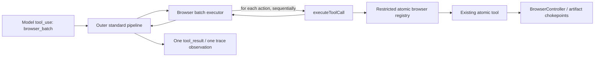

# Spec: `browser_batch` composite tool

**Date:** 2026-08-11

**Status:** proposed; not implemented

**Scope:** one composite browser tool, an explicit atomic-versus-batch tool profile, and an easy-suite A/B experiment

## Outcome

Add a model-facing `browser_batch` tool that executes a bounded, ordered list of existing browser tools inside one model-visible tool call. Keep every atomic tool available in the batch-enabled profile. The implementation must reuse the existing tool definitions and pipeline, require no `BrowserController` or agent-loop changes, preserve deterministic tool schemas and prompt caching within each tool profile, and retain one-call/one-result transcript and tracing semantics.

The initial rollout is experimental. The current atomic surface remains the default until a fresh A/B run shows whether Claude adopts batching and whether any turn, token, latency, or quality benefit offsets the larger cached tool prefix.

## Current behavior and hypothesis

The agent loop already accepts multiple `tool_use` blocks in one model response. The scheduler runs state-changing calls sequentially and keeps request order, so Claude can already request `type`, `click`, and `inspect_page` together without another model turn. `browser_batch` does not add a new execution capability.

It adds a clearer planning affordance: a single schema explicitly represents an ordered browser sequence. This may encourage Claude to collapse sequences it currently spreads across turns, especially:

- `navigate` then `inspect_page`;
- `click` then `inspect_page`;
- `scroll` then `inspect_page` or `screenshot`;
- `type` then `click` then `inspect_page`, when the refs are all known and remain valid;
- multiple evidence captures whose inputs are already known.

The most recent easy-suite re-baseline is motivational evidence, not the control arm: it predates the current cache and context-guard changes. Its nine transcripts already contain multi-tool turns, but also contain twelve adjacent cross-turn browser-action/inspection pairs that were theoretically batchable. Both experiment conditions therefore need fresh runs from the same commit.

## Requirements

### Functional

1. Register `browser_batch` only in a `batch-enabled` tool profile. That profile contains all atomic tools plus `browser_batch`; there is no batch-only profile.
2. Accept between 1 and 10 browser actions.
3. Support exactly the seven current browser tools: `navigate`, `inspect_page`, `click`, `type`, `scroll`, `screenshot`, and `download`.
4. Execute actions sequentially in array order.
5. Run each action through the same atomic `ToolDef` and `executeToolCall` pipeline used by a direct atomic call.
6. Stop at the first failed action. Do not execute later actions and do not roll back earlier browser state or artifacts.
7. On success, return each atomic action's normalized model-visible result in input order.
8. On failure, make the outer `browser_batch` result an `execution_error` that names the failed action, preserves its model-readable error, states how many earlier actions completed, and warns that their effects were not rolled back.

### Compatibility and invariants

- Keep all atomic tool names, schemas, descriptions, and behavior unchanged.
- Do not add methods to `BrowserController` or Playwright-specific code.
- Do not change the loop, completion rule, or scheduler.
- Mark `browser_batch` as `readOnly: false`; a composite that may mutate is always a scheduler barrier.
- Keep `SYSTEM_PROMPT` byte-stable for the first experiment. Discovery should come from the new tool's description and schema, not a second simultaneous prompt intervention.
- Keep the current atomic tool registration order byte-for-byte. In the batch-enabled profile, append `browser_batch` after the existing tools.
- Generate the batch schema deterministically and retain a top-level JSON Schema `type: "object"`.
- Preserve all write and path chokepoints. `screenshot` and `download` still use their atomic implementations, `writeArtifact`, `assertEvidencePath`, and manifest provenance.
- Preserve result caps. Each nested action passes through the per-tool cap; the aggregate batch result passes through the outer tool cap and the loop's per-message cap.
- Preserve transcript semantics: one `tool_call` event and one `tool_result` event for the model-visible `browser_batch` call. Do not add synthetic sub-call transcript events.
- Preserve tracing semantics: one `execute-browser_batch` observation whose input lists the actions and whose output lists their results. Do not emit synthetic model tool calls or sibling atomic spans in v1.

### Non-goals

- No parallel execution inside a batch.
- No file tools inside a batch.
- No recursive `browser_batch` action.
- No variables, ref binding, selectors, JavaScript, conditional branches, retries, loops, or rollback language.
- No way for a later action to consume a ref discovered by an earlier `inspect_page` in the same batch; the model cannot see intermediate output until the call returns.
- No replacement or removal of atomic tools before experiment results.

## Model-facing contract

### Input

```json
{
  "actions": [
    {
      "tool": "type",
      "input": { "ref": "e12", "text": "Apple" }
    },
    {
      "tool": "click",
      "input": { "ref": "e15" }
    },
    {
      "tool": "inspect_page",
      "input": {}
    }
  ]
}
```

`actions` is a bounded array of a nested discriminated union. Each variant uses the corresponding atomic tool's existing `inputSchema` under `input`; the batch does not maintain duplicate parameter schemas.

Proposed description:

> Execute 1–10 known browser operations sequentially in one call. Each action uses an existing browser tool and its normal input. Use this when all inputs are already known, often ending with inspect_page to observe the final state. Refs must come from a prior model-visible inspect_page and remain valid until used. Stops on the first error without rolling back completed actions.

### Successful output

```json
{
  "status": "completed",
  "results": [
    {
      "index": 0,
      "tool": "type",
      "content": "Typed into ref=e12 (textbox \"Search\")."
    },
    {
      "index": 1,
      "tool": "click",
      "content": "Clicked ref=e15 (button \"Search\")."
    },
    {
      "index": 2,
      "tool": "inspect_page",
      "content": "URL: https://example.test/results\nTitle: Results\n\n..."
    }
  ]
}
```

`content` is the exact normalized content produced by the nested atomic pipeline. It remains a string even when an atomic tool originally returned structured data. This avoids inventing a second normalization contract.

### Failed output

If nested action 1 of 3 fails, the outer pipeline returns `isError: true`, `errorKind: "execution_error"`, and content equivalent to:

```text
Tool "browser_batch" failed: Batch stopped at action 2/3 (click) after 1 completed action: <atomic error>. Completed actions were not rolled back.
```

Completed actions' full outputs are not repeated in the error. This keeps the failure bounded without changing the global pipeline. The model should recover with an atomic call or a new batch, usually after `inspect_page`.

## Execution architecture



`src/tools/browserBatch/browserBatch.ts` owns:

- the bounded batch schema;
- a restricted registry containing only the seven batchable atomic definitions;
- the sequential executor;
- success aggregation and fail-fast error formatting.

The restricted registry deliberately excludes `browser_batch` and all file tools. Calling `executeToolCall` for each nested action gives every step the existing validation, exception normalization, and per-result offloading behavior. The outer call then receives the normal aggregate normalization and cap.

## Tool profiles and composition

Introduce a shared profile and registry builder used by every production model/runner composition point:

```ts
type ToolProfile = 'atomic' | 'batch-enabled';

createProductionRegistry(profile: ToolProfile): ToolRegistry
```

- `atomic`: the current ten tools in their current order.
- `batch-enabled`: the same ten tools in the same order, followed by `browser_batch`.

`RunTaskConfig.toolProfile` defaults to `atomic` during the experiment. The REPL/TUI and eval CLI must use the same builder for API tool definitions and runtime execution; this removes the current duplicated registry construction in `runTask` and the TUI bridge. A mismatch test must prove the model cannot be shown a tool that its runtime registry lacks.

The eval CLI exposes `--tool-profile atomic|batch-enabled` and records the selected value in its result JSON. A later rollout decision may change the product default in a separate, explicit commit; it is not bundled into the A/B implementation.

## Ref and page-state rules

All existing stale-ref behavior remains authoritative.

- A batch may use refs returned by the latest `inspect_page` that the model saw before constructing the batch.
- `inspect_page` inside a batch is useful as a terminal observation, but its new refs are unavailable to later actions in that batch.
- Ref-addressed actions may be grouped only when earlier steps are not expected to invalidate the remaining refs. If they do, the atomic tool produces the existing stale-ref error and the batch stops.
- `navigate`, direct-URL `download`, `scroll`, `screenshot`, and `inspect_page` need no refs and can safely follow an action when their other inputs are known.

## Transcript, tracing, and UI

No transcript event type changes. A batch is represented exactly as the model experienced it:

- `tool_call.call.name` is `browser_batch` and `call.input.actions` is the full requested sequence;
- `tool_result.result` is the outer success or error after normal capping;
- nested steps do not appear as independent calls because the model did not make them independently.

Langfuse similarly records one `execute-browser_batch` observation. Its existing input/output capture contains the detailed action list and successful per-action results. Root `toolsUsed` includes `browser_batch`, which is the correct model-visible adoption signal.

The TUI semantic renderer adds a compact line such as `Running 3 browser steps`. It marks the line as evidence-producing when any nested action is `screenshot` or `download`; it does not render one synthetic line per nested action.

## Testing requirements

1. **Schema:** top-level object; 1–10 actions; unsupported/file/recursive tools rejected; each nested input enforces the atomic schema; independently built profiles serialize byte-identically.
2. **Profile stability:** `atomic` names and order exactly match the current production registry; `batch-enabled` differs only by the final tool.
3. **Execution:** actions run strictly in order; successful outputs retain order; direct browser atomics remain unchanged.
4. **Failure:** first nested error stops later work; outer result is an execution error; completed count and no-rollback warning are present; stale-ref guidance survives.
5. **Browser integration:** one real fixture call performs `type → click → inspect_page` and the final inspection observes both effects.
6. **Artifacts and caps:** batched screenshot/download artifacts retain manifest hashes and source URLs; oversized inspection output is offloaded through existing mechanisms.
7. **Composition:** `runTask`, TUI model definitions, and runtime registry use the same selected profile; default atomic behavior remains unchanged.
8. **Transcript/tracing/UI:** exactly one outer call/result and one outer tool observation; semantic line summarizes the batch and classifies evidence correctly.

## Experiment contract

The first experiment compares only:

- **Control:** `toolProfile=atomic`.
- **Treatment:** `toolProfile=batch-enabled` (all atomics plus batch).

Everything else stays fixed: commit, model, task text, start URLs, system prompt, browser profile, guard defaults, and grader/oracle implementations. The easy suite is `hacker_news,edgar,openclaw_pr`, with three trials per task per condition. Existing graders remain unchanged and never receive a transcript.

The experiment analyzer may read each completed run's `metrics.json` and `transcript.jsonl` after grading. This is observability, not grading. It reports:

- grader accuracy, completion, and task pass;
- batch adoption by trial and task;
- direct atomic browser calls, batch calls, nested browser operations, and operations per model-visible browser call;
- batch error rate;
- model turns, wall-clock time, token fields, peak context, and approximate weighted token cost (`input + 1.25 × cache creation + 0.1 × cache read + 5 × output`, reported as normalized units rather than currency);
- the added tool-prefix token overhead visible on the first request.

Because k=3 is small and the easy suite is already saturated on quality, results are descriptive. Quality is a non-regression gate; adoption and efficiency determine whether the tool earns a default rollout. A zero-adoption result tests discoverability under the tool description, not the theoretical value of batching. A prompt-guided follow-up, if desired, is a separate intervention.

## Decisions captured

1. Composite over existing atomic tools; no browser-controller primitive.
2. All seven browser tools are batchable; file tools are not.
3. Ordered, sequential, fail-fast, maximum ten actions, no rollback.
4. Nested steps reuse the existing pipeline and schemas.
5. One outer transcript event pair and one outer trace observation.
6. Atomic tools remain available in treatment and remain the default until results are reviewed.
7. No system-prompt change in the first A/B.
8. Fresh control runs are mandatory because current harness semantics differ from the historical re-baseline.
