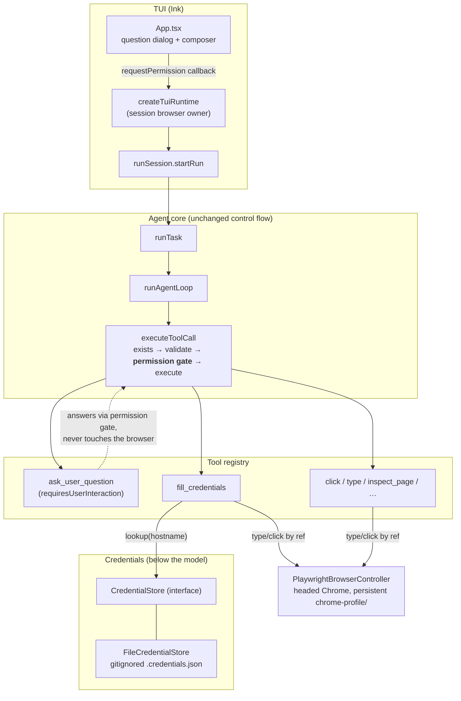
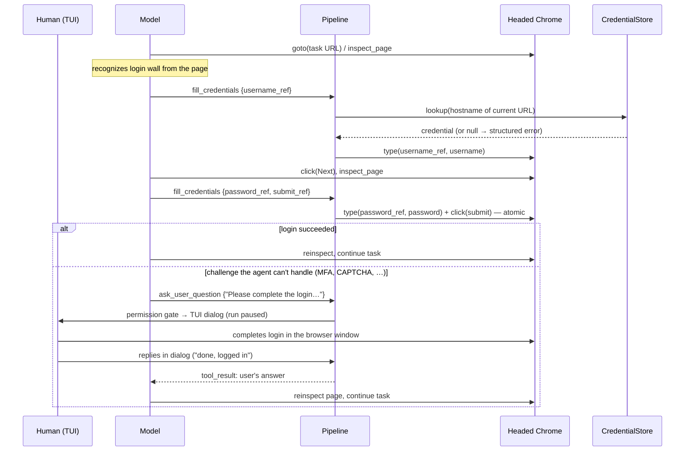

# Browser Auth with Human Handoff — Detailed Design

## Overview

The evidence-collection agent ("Sherlock") drives a real browser to gather
evidence for tasks. Some tasks sit behind authentication. This design adds
**minimal authentication with human handoff**:

- The agent can complete a **plain username/password login** by itself, using
  credentials it can *use* but never *see*.
- Anything it cannot automate (MFA, SSO, CAPTCHAs, unknown flows) falls back
  to **human handoff**: the agent pauses mid-run, asks the human to complete
  the step in the headed browser window, and — once the human replies —
  reinspects the page and continues.
- The authenticated browser identity **persists across tasks**, so login is a
  one-time cost per site.

The immediate goal is to unblock the one eval task that requires
authentication (the Elon Musk / X task) using a dedicated test X account,
while building the three seams — a credential store interface, a tool
permission gate, and a user-interaction channel — so a more complete auth
system can grow in place later.

Three high-level decisions shape everything below:

1. **Runtime: the current local Playwright setup.** The agent already
   launches headed, persistent-profile Chrome behind a one-method
   `BrowserSessionProvider` seam. Cloud runtimes (Browserbase) remain a
   future second implementation of that seam; nothing in this design assumes
   local execution except the handoff UX, which is isolated behind the
   permission gate. (See Appendix A for the runtime evaluation.)
2. **Credentials: a gitignored JSON file behind a `CredentialStore`
   interface.** Raw credentials never enter the model's context window, tool
   inputs, tool results, or traces. The model addresses credentials by
   *element ref*; a fill mechanism below the model fetches and types them.
3. **Handoff: a Claude Code–style permission seam in the tool pipeline.**
   A general "this tool needs the user" gate between input validation and
   execution, wired to a TUI dialog. Only one tool uses it for now
   (`ask_user_question`), and headless environments fail closed.

## Detailed Requirements

Consolidated from the requirements-clarification process:

**Scope and goal**

- R1. The agent may complete plain username/password logins itself. SSO and
  MFA automation are explicitly out of scope for this phase.
- R2. Human handoff is the catch-all: for anything the agent cannot automate,
  the human completes login manually in the headed browser, signals resume in
  the conversation, and the agent reinspects the page and continues.
- R3. The authenticated browser identity persists across tasks (and across
  agent restarts).
- R4. Immediate target: unblock the single auth-requiring eval task
  (X/Twitter) with a dedicated test account. Test accounts only — never the
  user's real accounts.
- R5. The design phase optimizes for pushing the browser agent's capabilities
  and discovering real failure modes locally. Do not build for a hosted
  browser fleet, but do not couple the core agent architecture to local-only
  assumptions either.

**Credentials**

- R6. The model must never process raw credentials: not in its context
  window, not in tool inputs or results, not in transcripts, traces, or TUI
  events.
- R7. Credential automation is "simple" for now — a gitignored JSON file —
  but must sit behind a general interface (`CredentialStore`) so a more
  complete backend (1Password CLI, broker service) can replace it without
  touching call sites.

**Handoff interaction**

- R8. The experience is chat-like: the agent pauses and asks; the human
  replies in natural language (no hardcoded "done" keyword); the agent
  interprets the reply.
- R9. Two ways to hand back to the human, and **the model chooses** (no
  classifier routing): (1) free text for open-ended/narrative asks, (2) a
  structured `ask_user_question` tool that works like any other tool.
- R10. A general permission seam in the tool pipeline, Claude Code–style:
  after zod validation and before execute, a tool that opts in (e.g.
  `requiresUserInteraction`) triggers `ToolCtx.requestPermission(request)` →
  `allow(updatedInput) | deny(feedback)`, blocking until resolved. The TUI
  wires the callback; headless/eval environments omit it and interactive
  tools **fail closed**. Only `ask_user_question` is marked interactive for
  now.
- R11. The system prompt barely pushes the tool — mainly "if authentication
  is unsuccessful or something is ambiguous."

## Architecture Overview



The flow for an auth-requiring task:



Key properties:

- **No new control flow in the loop.** The agent loop already awaits each
  tool's `execute`; a pending permission request simply makes that await take
  as long as the human does. Pause/resume falls out of the existing
  architecture.
- **Secrets flow along one short path** — file → store → fill executor →
  Playwright `type()` — entirely below the model, the tracing layer, and the
  TUI event stream.
- **The gate is general; the wiring is environment-specific.** The TUI
  provides `requestPermission`; the eval harness and headless CLI do not, so
  interactive tools return a structured error there (fail closed) and the
  model routes around it.

### The two handoff paths and what they cost

Each run is a fresh conversation (`runTask` builds messages from the task
text; a text-only model turn ends the loop). The two paths therefore differ
in what survives:

| | `ask_user_question` (mid-run) | Free text (ends the run) |
|---|---|---|
| Conversation state | preserved — loop resumes with full history | lost — user's reply starts a new run |
| Browser session | same tab, same page | session survives (session-long browser), tab is closed at run end |
| Login state | preserved | preserved (persistent profile) |
| Best for | auth handoff, disambiguation mid-task | narrative asks, final clarifications |

Both unblock auth: even in the free-text case, the human can log in after the
run ends and resubmit the task — the persistent profile means the next run
starts authenticated. The system prompt does not encode this tradeoff as a
rule; the model chooses (R9).

## Components and Interfaces

### 1. `CredentialStore` (new: `src/auth/credentialStore.ts`)

```ts
/** One site's login credential. Only the fill executor may consume this. */
export interface Credential {
  username: string;
  password: string;
}

/**
 * Read-only access to stored credentials, keyed by hostname.
 * Implementations must never log, cache into env, or otherwise emit
 * secret material.
 */
export interface CredentialStore {
  /** Hostnames with stored credentials. Safe to surface to the model. */
  listHosts(): Promise<string[]>;
  /** The secret material for a hostname, or null when absent. */
  lookup(hostname: string): Promise<Credential | null>;
}
```

`FileCredentialStore` (same module) implements it over a JSON file:

- Default path: `.credentials.json` at the repo root, added to `.gitignore`
  in the same change that introduces the store. Overridable via constructor
  argument (tests) and the `CREDENTIALS_FILE` environment variable
  (production entry points).
- **Read at lookup time, into locals only** — never `process.env`, never
  module-level caching of secret values. (Env leaks to child processes, and
  a fresh read per lookup means the user can edit the file mid-session.)
- Hostname matching: exact match first, then suffix match (`mobile.x.com`
  matches a `x.com` entry). Longest matching key wins.
- A missing file behaves as an empty store (every lookup returns null) —
  not an error, so environments without credentials degrade to handoff.
- A malformed file throws a model-readable error naming the path but never
  file contents.

The interface is deliberately read-only and minimal (R7): a 1Password-backed
implementation is `op read` inside `lookup()`; a broker-backed one is an IPC
call. Nothing else changes.

### 2. `fill_credentials` tool (new: `src/tools/fillCredentials/`)

The bridge between "the model found the login form" and "the secret gets
typed" — designed so the model handles *where* and the executor handles
*what*.

Model-facing schema:

```ts
{
  fields: Array<{
    ref: string;                       // element ref from the latest page inspection
    value: 'username' | 'password';    // WHICH stored value — never the value itself
  }>,                                  // 1–2 entries, distinct values
  submit_ref?: string                  // clicked after filling, same call
}
```

Schema refinement: **any call filling `password` must include `submit_ref`.**
Fill-and-submit is atomic for passwords — no page inspection can occur
between the password landing in the DOM and the form submitting, so no
outline or screenshot ever captures it (username-only fills may omit
`submit_ref`; usernames are visible on-page after login anyway and the test
account keeps stakes low). Multi-step forms like X's (username → Next →
password → Log in) decompose naturally: a username-only call, the model's own
`click` on Next, then a password+submit call.

Executor behavior:

1. Derive the hostname from `browser.currentUrl()` — **never from model
   input** — so credentials can only be filled into the site the browser is
   actually on.
2. `store.lookup(hostname)`; on null, throw
   `No credentials stored for "<hostname>". Ask the user to complete login manually.`
   (the pipeline turns throws into structured tool errors — this doubles as
   the model's discovery mechanism; no separate "list credentials" tool).
3. For each field, `controller.type(ref, secretValue)` — reusing the existing
   ref-based typing path (stale refs already produce
   `BrowserRefNotFoundError` with retry guidance).
4. If `submit_ref` is present, `controller.click(submit_ref)`.
5. Return `{ filled: ['username'], submitted: true, url: <current URL> }` —
   metadata only, never values.

`readOnly: false`, so the existing scheduler serializes it against other
state-changing tools. `ToolCtx` grows an optional `credentials?:
CredentialStore` field (its doc comment already declares grow-in-place as the
intended pattern); `runTask` constructs the production `FileCredentialStore`
by default with a `RunTaskConfig.credentials` override for tests.

Why the model never sees secrets, mechanically: the tool *input* contains
refs and the literal strings `'username'`/`'password'`; the tool *result*
contains booleans and a URL. Tracing (transcript.jsonl, Langfuse, TUI events)
records tool inputs and results — both are clean by construction, with no
redaction layer needed. The secret's entire life is executor-local.

The existing `type` tool remains for ordinary text; the system prompt
explicitly forbids using it for credentials (R6 belt-and-suspenders — the
model shouldn't have credentials to type anyway).

### 3. Permission seam (modified: `src/tools/registry.ts`, `src/tools/pipeline.ts`)

Types (in `registry.ts`):

```ts
/** A tool call awaiting the user's decision. */
export interface PermissionRequest {
  toolName: string;
  /** The validated tool input (safe: validated before the gate). */
  input: unknown;
}

export type PermissionDecision =
  | { behavior: 'allow'; updatedInput: unknown }
  | { behavior: 'deny'; feedback: string };

// ToolDef gains:
/** True iff this tool must not run without an interactive user decision.
 *  When the environment provides no requestPermission, calls fail closed. */
requiresUserInteraction?: boolean;

// ToolCtx gains:
/** Interactive environments resolve tool permission requests (TUI dialog).
 *  Headless environments omit this; interactive tools then fail closed. */
requestPermission?: (request: PermissionRequest) => Promise<PermissionDecision>;
```

Pipeline change (`executeToolCall`), between the existing zod-validation
stage and the execute stage:

```ts
let input = parsed.data;
if (tool.requiresUserInteraction === true) {
  if (ctx.requestPermission === undefined) {
    return { toolCallId: call.id, isError: true, errorKind: 'permission_denied',
      content: `Tool "${call.name}" requires user interaction, which this ` +
               `environment does not support. Proceed without it.` };
  }
  const decision = await ctx.requestPermission({ toolName: call.name, input });
  if (decision.behavior === 'deny') {
    return { toolCallId: call.id, isError: true, errorKind: 'permission_denied',
      content: decision.feedback };
  }
  input = decision.updatedInput as typeof input;
}
// … existing execute/normalize/cap stages, using `input`
```

Decisions embedded here:

- **New `ToolErrorKind: 'permission_denied'`** distinguishes "the human said
  no / nobody's there" from execution failures in transcripts and metrics.
- **`updatedInput` is trusted, not re-validated.** It comes from our own UI
  code, not the model, and the Claude Code pattern this follows (answers
  merged into the tool input by the `allow` path) would otherwise force
  answer fields into the model-facing schema. Documented at the type.
- **The gate is per-call and general.** Any future tool (e.g. a "send email"
  tool) opts in by setting one flag; the pipeline, TUI, and fail-closed
  semantics are already there (R10). Only `ask_user_question` sets it now.
- Denial does not abort the run — the model receives the feedback and adapts
  (retries differently, proceeds without, or ends the run explaining why).

### 4. `ask_user_question` tool (new: `src/tools/askUserQuestion/`)

Modeled on Claude Code's AskUserQuestion, simplified to one question per call:

```ts
{
  question: string,          // complete question, ends with "?" where sensible
  header?: string,           // ≤12-char chip for the dialog, e.g. "Login"
  options?: Array<{          // 0–4 predefined choices; free text always allowed
    label: string,
    description?: string
  }>,
  multi_select?: boolean     // allow choosing several options
}
```

- `requiresUserInteraction: true`, `readOnly: false` (serialized — the
  scheduler never runs it concurrently with other state-changing tools, so
  the browser is quiescent while the human holds it).
- **The permission gate doubles as the answer channel** (the Claude Code
  pattern): the TUI dialog renders the question and options, the user picks
  an option and/or types free text, and the dialog resolves
  `allow({ ...input, answers: { chosen: string[], freeText?: string } })`.
- `execute` does no I/O: it reads `answers` off the (trusted) updated input
  and returns natural language for the tool result, e.g.
  `User answered: "ok I logged in, there was an email code but I handled it"`.
  Plain prose, because the model resumes mid-conversation and should treat it
  exactly like a user turn (R8 — the model interprets the reply; nothing
  pattern-matches for "done").
- Fail-closed (headless/evals) and deny (user dismissed) both arrive as
  `permission_denied` tool errors with instructive content, so eval runs on
  auth-walled tasks degrade to "the agent explains what it couldn't do"
  rather than hanging.

### 5. TUI wiring (modified: `src/tui/bridge/runtime.ts`, `runSession.ts`, `App.tsx`; new dialog component)

The plumbing follows the existing dependency-injection direction (App →
runtime → runSession → runTask → loop → ToolCtx), adding one optional field
at each layer:

- `TuiRuntimeDeps`/`RunSessionDeps`/`RunTaskConfig` gain
  `requestPermission?: (request: PermissionRequest) => Promise<PermissionDecision>`;
  `runTask` forwards it into the loop deps, and the loop places it on the
  `ToolCtx` it already constructs (one line at the existing construction
  site).
- The App supplies the implementation: on request, it stores
  `{ request, resolve }` in React state (the Claude Code `ToolUseConfirm`
  shape), renders a **question dialog** above the composer, and switches the
  input mode so the composer feeds the dialog instead of being disabled.
  Option selection via arrow keys/number; free text via the composer; submit
  resolves `allow`; **Esc resolves `deny`** with fixed feedback ("The user
  dismissed the question. Continue without this information or finish the
  task."). This is the TUI's first UI→run data path; it reuses the existing
  event stream (a new `permission_request` UiEvent) in the other direction.
- **Cancellation during a pause:** Esc dismisses the dialog (deny) and the
  run continues; the existing cancel gesture still works because the bridge
  races the pending permission promise against the run's abort signal — on
  abort it resolves `deny`, the tool errors, and the loop observes the abort
  at the next model call, ending in `run_cancelled` exactly as today.
- While the dialog is open the run is inside an awaited tool call: no model
  request is in flight, so a long human absence costs nothing (there are no
  tool timeouts — for this tool, deliberately so).
- `evalSession.ts` and the headless CLI simply don't pass
  `requestPermission` — fail-closed with zero changes there. Wiring the REPL
  (readline prompt) is a possible later addition; out of scope.

### 6. System prompt addition (modified: `src/cli/systemPrompt.ts`)

One short section, deliberately light (R11):

> **Authentication.** If a login wall blocks the task, try logging in:
> inspect the page, then use `fill_credentials` to fill the form (it knows
> which sites have stored credentials; it will tell you if none exist).
> Never type usernames or passwords with the `type` tool. If login fails, or
> requires something you cannot do (a code, a CAPTCHA, "sign in with…"), or
> if something important is ambiguous, ask the user — `ask_user_question`
> pauses the task so they can act in the browser window and tell you when
> they're done; afterwards, reinspect the page before continuing.

No login-detection heuristics, no site playbooks, no push toward the tool in
ordinary flows: recognizing walls and choosing between free text and the
structured tool stays with the model (R9), which is also what this phase is
meant to stress-test (R5).

Note: adding tools and prompt text changes the stable prompt prefix — a
one-time prompt-cache invalidation on deploy, and the registry must keep
being built through the single shared `createProductionRegistry` so the
API tool definitions stay byte-identical between the core and the TUI bridge.

## Data Models

**`.credentials.json`** (gitignored; keys are hostnames):

```json
{
  "x.com": {
    "username": "sherlock_test_acct",
    "password": "<secret>",
    "notes": "dedicated test account, created 2026-08"
  }
}
```

`notes` is optional and ignored by the store. File permissions are the
user's responsibility; the store warns (once, to stderr — never into the
run transcript) when the file is group/world-readable.

**Wire shapes** (already shown above): `PermissionRequest`,
`PermissionDecision`, the `fill_credentials` input/result, the
`ask_user_question` input and its `answers` extension, and one new UiEvent:

```ts
{ type: 'permission_request'; toolName: string; input: unknown }
// resolution travels through the requestPermission promise, not the event stream
```

**Trace/transcript invariant:** every recorded artifact of a run —
transcript.jsonl entries, Langfuse spans, UiEvents, run manifests — contains
tool inputs and results as defined above, all of which are secret-free by
construction. Tests assert this (see Testing Strategy).

## Error Handling

| Failure | Where | Model-visible behavior |
|---|---|---|
| No credentials for hostname | `fill_credentials` executor | Structured error naming the hostname, suggesting manual login → model falls back to handoff |
| Stale/invalid ref | existing `BrowserRefNotFoundError` path | Error tells the model to reinspect the page — same contract as `click`/`type` |
| Password fill without `submit_ref` | zod refinement | `invalid_input` with the constraint spelled out |
| Login submitted but failed (wrong password, extra challenge) | nobody detects it *for* the model | The model reinspects the page — outline shows the error/challenge — and decides: retry, or hand off |
| Interactive tool, headless env | permission gate | `permission_denied`: "this environment does not support user interaction; proceed without it" |
| User dismisses the dialog (Esc) | TUI → deny | `permission_denied` with fixed feedback; run continues |
| Run cancelled during a pause | bridge races abort vs. dialog | deny resolves the tool, loop observes abort at next model call → `run_cancelled`, manifest finalized as today |
| Malformed credentials file | store | Execution error naming the path, never contents |
| Missing credentials file | store | Empty store — lookups return null; behaves like "no credentials for any site" |
| Browser dies while human holds it | existing browser-death detection in the TUI runtime | run fails with the classified message; next submit relaunches Chrome (persistent profile keeps auth) |

Design stance: login *success* is never verified by plumbing. The agent
verifies by reinspecting the page (R2) — the same observation loop it uses
for everything else, and the thing this phase is meant to exercise.

## Testing Strategy

**Unit (vitest, alongside each module):**

- `FileCredentialStore`: missing file → empty; malformed → path-only error;
  exact/suffix/longest hostname matching; fresh read per lookup (edit file
  between lookups); no secret in any thrown message.
- Pipeline permission gate: interactive tool + no callback → `permission_denied`,
  execute never called; deny → feedback as error content, execute never
  called; allow → execute receives `updatedInput`; non-interactive tools
  bypass the gate entirely (regression: all existing pipeline tests pass
  unchanged).
- `fill_credentials`: fake controller + fake store — types the right values
  into the right refs, clicks submit, result contains no secret material;
  hostname derived from controller URL, not input; null lookup → the
  documented error text.
- `ask_user_question`: execute returns answers as natural language; schema
  bounds (options ≤ 4, header length).

**Integration:**

- A local login-form fixture page (two-step, mimicking X's
  username → Next → password shape) served in-test: run
  `fill_credentials` against real Playwright, assert post-submit navigation
  and that the fixture recorded the correct submitted values.
- **Secret-leak sweep:** run a scripted loop (fake model) that performs a
  fill against the fixture, then grep the entire run directory — transcript,
  manifest, offloaded results — and the captured UiEvent stream for the
  password string. Must be absent. This test is the enforcement of R6.
- Bridge pause/resume: fake `runTaskFn` issuing an interactive call; assert
  the `permission_request` UiEvent, dialog resolution → tool result, and the
  abort-during-pause path ends in `run_cancelled`.

**TUI (ink-testing-library + PTY):**

- Dialog render/selection/free-text/Esc flows in ink-testing-library
  (30s timeouts per the repo's convention for interaction-heavy tests).
- One PTY-driven session against the fixture page: agent pauses, a scripted
  "human" answers in the dialog, agent resumes — frames captured and checked.

**Manual acceptance (the point of the phase):**

- With the test X account in `.credentials.json`: run the Elon Musk task
  end-to-end. Expected: agent hits the wall, two-step fill; if X raises a
  challenge, the agent asks, the human completes it in the window, replies,
  and the agent resumes. Second run of the same task starts authenticated
  (persistent profile) and never touches auth.

## Appendices

### Appendix A: Technology choices

**Browser runtime — chosen: current local Playwright (headed, persistent profile).**

| | Local Playwright (chosen) | Browserbase | EGO Lite |
|---|---|---|---|
| Identity persistence | `chrome-profile/` user-data-dir; survives restarts | Contexts persist full user-data-dir cloud-side | imports the user's own Chrome state |
| Human handoff | human uses the same headed window — zero plumbing | Live View URL; CDP stays live during takeover | local window (it *is* a desktop browser) |
| Resume after handoff | trivial (same process, same page) | trivial (connection persists) | n/a for our stack |
| Scale | one browser per profile dir (Chromium ProcessSingleton) — concurrency needs profile copies or storageState cloning | 3–100+ concurrent by plan ($0/$20/$99/mo, ~$0.10/hr overage, 6h session cap) | none (single desktop browser) |
| Credential features | none built-in (this design adds them) | 1Password-SDK integration pattern + Live View credential delegation | inherits your logins instead |
| Fit with `BrowserSessionProvider` | already the production implementation | excellent — `connectOverCDP` behind the same seam; `download()`/`fetch()` need spikes | poor — drives via its own JS runtime, no documented external CDP endpoint |

Rationale: R4/R5 want failure-mode discovery on the current setup, and local
Playwright already delivers persistence + handoff with zero new
infrastructure. Browserbase is the credible scale path and slots behind the
existing seam when scale is *observed* to matter, which is exactly the
posture R5 asks for. EGO Lite (a very new, MIT-licensed macOS Chromium
browser driven through its own agent runtime) is architecturally
incompatible with our controller and too immature to bet on.

**Credential storage — chosen: gitignored JSON file behind `CredentialStore`.**

| | JSON file (chosen) | 1Password CLI | macOS Keychain | age/sops file |
|---|---|---|---|---|
| Unattended fetch | yes | yes (service account) | **no** (`errSecInteractionNotAllowed` headless) | only with a disk-resident key |
| Hosted-future portability | swap the impl | best (same call site, service token) | dead end | via cloud KMS |
| Friction today | zero | install + $4.99/mo | zero | key management |
| Fit for one test account | exactly right | overkill | risky (interactive ACL prompts mid-run) | overkill |

Rationale: R7 explicitly trades vault strength for simplicity *behind an
interface*. The two findings that survive any backend swap: never load
secrets into `process.env` (child-process and tooling leakage), and the leak
channels that matter are *post-fill* (page snapshots), addressed by atomic
password-fill-and-submit rather than by the vault.

**Interaction pattern — chosen: permission-gate-as-answer-channel (Claude Code's).**
Claude Code parks its query loop on a plain promise held in UI state and
returns the user's answers by merging them into the allowed tool input; the
tool's execute merely echoes them as a natural-language result. This design
copies that shape with one simplification (no separate permission system —
the gate exists *for* interaction) — chosen over (a) a bespoke pause/resume
state machine in the loop (more moving parts for the same behavior) and (b)
auto-detecting login completion by watching the page (rejected in
requirements: less predictable than an explicit human signal).

### Appendix B: Key research findings

- **No runtime automates MFA.** Local Playwright, Browserbase, and EGO Lite
  all converge on "a human completes the login once; persistence carries it."
  They differ in handoff mechanism (local window vs. Live View URL) and
  scale. This validated making handoff a first-class design element rather
  than an edge case.
- **Persistent-profile login is the documented workaround** for Google-class
  "this browser may not be secure" walls: log in once in the headed
  automated browser, rely on the profile thereafter. Success from
  cloud-hosted browsers (Browserbase) against Google specifically is
  unverified.
- **The loop needs no suspension mechanism.** Tool executes are awaited;
  state-changing tools are serialized by the existing scheduler; a promise
  that resolves when the human answers is a sufficient pause.
- **Every tool input/result is recorded** (transcript.jsonl, Langfuse, TUI
  events) — so keeping secrets out of tool I/O entirely (refs in, metadata
  out) is the only redaction-free way to satisfy R6.
- **Post-fill leak channels:** page outlines can capture input values and
  screenshots capture what's on screen — the atomic password-fill-and-submit
  rule exists because of this, independent of vault choice.
- **Market validation:** 1Password × Browserbase "Secure Agentic Autofill"
  and Steel's credentials API are productized versions of the same shape —
  model orchestrates, secrets injected below it — confirming the
  `fillCredentials(refs)` design is the industry pattern, not an invention.

### Appendix C: Alternatives considered and rejected

- **Browserbase now** — solves scale we haven't observed needing (R5), adds
  cost/latency/two unresolved controller spikes, and weakens the local
  headed-handoff UX the immediate task needs.
- **EGO Lite** — no external CDP endpoint (can't sit behind
  `BrowserSessionProvider`), days-old docs, and "inherit the user's real
  Chrome logins" directly contradicts the test-accounts decision (R4).
- **A dedicated login orchestrator** (site configs, success detectors,
  login-flow state machine) — contradicts the browser-first philosophy and
  R5's goal of discovering what the *agent* can do; every heuristic added is
  a failure mode hidden.
- **Classifier routing free-text vs. structured questions** — explicitly
  rejected in requirements; the model chooses (R9).
- **A `list_credentials` tool** — subsumed by `fill_credentials`' structured
  "no credentials for host" error; one less tool in the prompt prefix.
- **Re-validating `updatedInput` through the zod schema** — would force
  answer fields into the model-facing schema; trusted-UI input documented
  instead.
- **Secrets via `process.env` / dotenv** — leaks to child processes and
  developer tooling; the store reads the file at lookup time instead.
