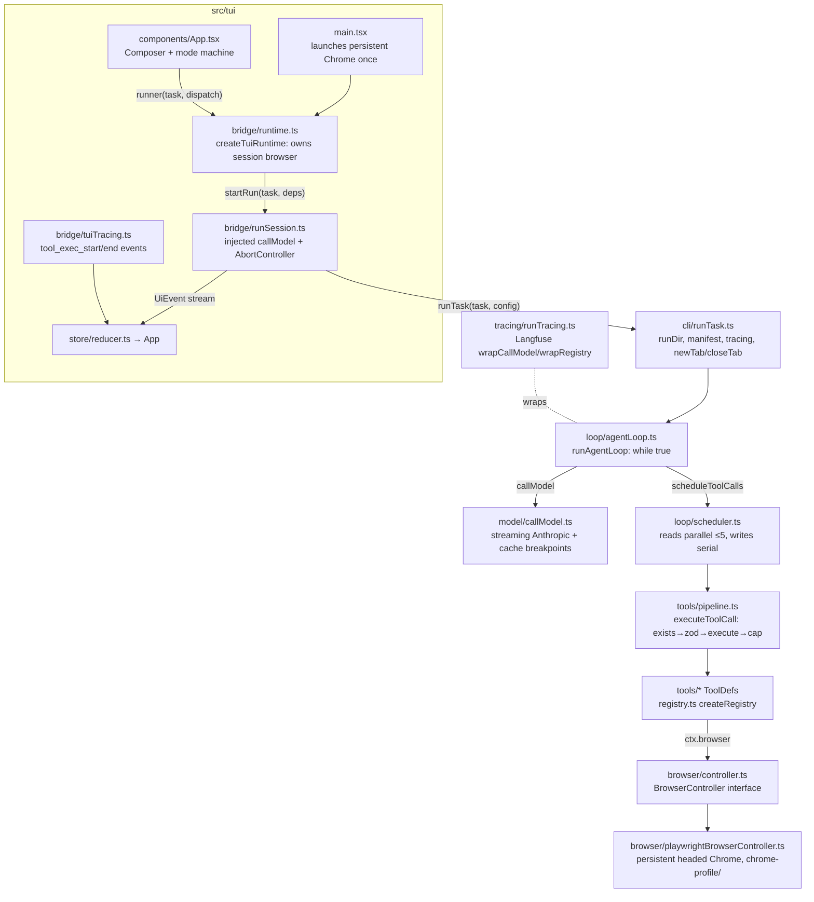
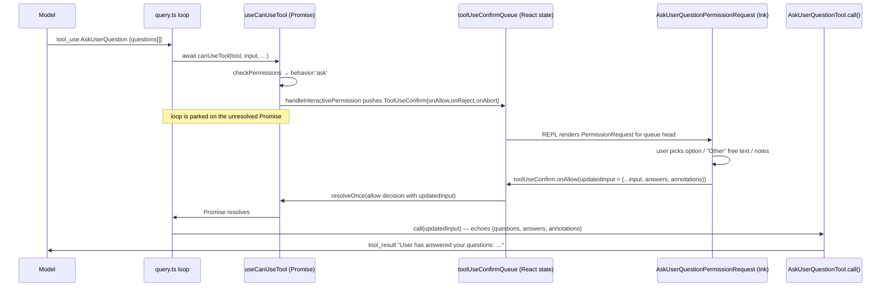

# Research: existing code — browser auth + human handoff

Design-input research for (a) an auth/login phase before task execution and (b) a
mid-run pause-for-human mechanism. Two codebases: this repo, and the Claude Code
source archive at `/Users/briosolivares/Desktop/Code/claude-code`.

---

## Part 1 — The evidence-collection agent

### Component map

### Browser layer

- **Provider seam**: `BrowserSessionProvider` is one method, `createSession(): Promise<BrowserController>`
  (`src/browser/sessionProvider.ts:10-12`). Explicitly designed so local Chrome and remote
  services (Browserbase) can implement it independently. An auth-capable session
  (e.g. "session that guarantees logged-in state") slots naturally behind this seam.
- **Launch**: `LocalChromeBrowserSessionProvider` uses `chromium.launchPersistentContext(profileDir,
  { channel: 'chrome', headless: options.headless ?? false })`
  (`src/browser/playwrightBrowserController.ts:44-47`). **Headed by default, persistent
  profile** — cookies/localStorage/logins survive across sessions. The profile dir is
  `chrome-profile/` at the repo root, wired in both entry points:
  `src/tui/main.tsx:91-94` and `src/cli/repl.ts:22` (`resolve('chrome-profile')`).
  So "auth" already partially exists implicitly: a human who once logged in via the
  headed window stays logged in. There is no explicit auth phase, detection, or UX.
- **Session/tab lifecycle**: a session owns **at most one task tab**. `newTab()` rejects if a
  tab is already active (`playwrightBrowserController.ts:71-73`); `closeTab()` is a no-op
  when none is active. `runTask` opens the tab, optionally `goto(startUrl)`, and closes it
  in `finally` (`src/cli/runTask.ts:136-158`). Watch out: `prepareSessionPage` closes
  every page except one blank session page at session start
  (`playwrightBrowserController.ts:320-331`) — human-opened tabs get culled.
- **Controller surface** (`src/browser/controller.ts:53-177`): `newTab/closeTab`, `goto`,
  `outline` (aria snapshot with refs), `click(ref)`, `type(ref, text)`, `scroll`,
  `screenshot`, `resolveHref`, `fetch`, `download`, `currentUrl()`, `title()`, `close`.
  Nothing for *waiting* on human-driven navigation — detecting "user finished logging in"
  would today mean polling `currentUrl()`/`outline()` or adding a controller method.
- **Death/relaunch**: the TUI runtime classifies browser-death errors and relaunches a fresh
  session on the next submit (`src/tui/bridge/runtime.ts:51-55`, `:65-84`). An auth phase
  tied to session start must survive/replay across this relaunch path.

### Agent loop, run lifecycle, tool dispatch

- **Loop**: `runAgentLoop` (`src/loop/agentLoop.ts:194`) is a single `while (true)` in one
  async function: `callModel` → append assistant msg → if no `tool_use` blocks, **completed**
  → else `scheduleToolCalls` → append results as one user message → guards → repeat.
  State is only `{ messages, turnCount }` (`agentLoop.ts:31-36`).
- **There is no suspension mechanism.** The loop cannot be paused/resumed from outside. The
  only external control is cancellation: the TUI bridge's `AbortController` rejects the
  in-flight model call, and the loop's `AbortError` carve-out rethrows with no bookkeeping
  (`agentLoop.ts:334`). The closest thing to "pause" the architecture already supports:
  **any awaited promise inside a tool executor blocks the whole run** — the pipeline just
  `await tool.execute(...)` (`src/tools/pipeline.ts:88`) and the scheduler serializes
  state-changing tools (`src/loop/scheduler.ts:58-62`). A tool that awaits a human answer
  is therefore a legal, zero-loop-change pause point.
- **Tool registration/dispatch**: `ToolDef` = name/description/zod `inputSchema`/`readOnly`/
  `execute(input, ctx)` (`src/tools/registry.ts:27-51`). `createRegistry` builds a Map
  (`registry.ts:66`); `createProductionRegistry` fixes the deterministic tool list
  (`src/tools/index.ts:84-94`) — **order and content are part of the cached prompt prefix**,
  so adding a tool changes the prefix (fine) but must stay deterministic.
  Dispatch: `executeToolCall` (`src/tools/pipeline.ts:47`) — exists-check → zod → execute →
  normalize → size-cap; never throws, errors become structured `is_error` results.
- **Tool context**: `ToolCtx` is `{ runDir, browser? }` (`registry.ts:10-17`), passed from
  `LoopDeps` (`agentLoop.ts:225`). Its doc comment explicitly anticipates growth: *"Later
  tasks grow this interface in place… so tools gain capabilities without signature churn."*
  This is the sanctioned place to hand an ask-human channel to a tool.
- **runTask** (`src/cli/runTask.ts:97`): registry → callModel → runDir + manifest → tracing
  wrap → `newTab()` → optional `goto(startUrl)` → `runAgentLoop` → `finally` closeTab /
  finalizeManifest / tracing.close. A pre-task auth phase fits either here (between
  `newTab()` at `runTask.ts:137` and the loop at `:144`) or a level up at session start
  (`runtime.start()`, `src/tui/bridge/runtime.ts:87-93`).

### TUI ↔ runtime, and mid-run input today

- **Wiring**: `main.tsx` builds `LocalChromeBrowserSessionProvider` + `createTuiRuntime`,
  calls `runtime.start()` (launches the browser) before rendering, and passes
  `runner = runtime.startRun` into `<App/>` (`src/tui/main.tsx:88-110`).
- **Run bridge**: `startRun` (`src/tui/bridge/runSession.ts:104`) injects its own `callModel`
  (streams via SDK, re-emits progress as UiEvents, honors an `AbortController`) and calls
  `runTask`. Tool execution events reach the UI via the tracing seam:
  `createTuiTracing.wrapRegistry` emits `tool_exec_start` (with **full validated input**)
  and `tool_exec_end` (with result/error) (`src/tui/bridge/tuiTracing.ts:82-113`).
- **The only backchannel into a live run is `RunHandle.cancel()`**
  (`runSession.ts:53-59`). There is no way to feed data into a running task.
- **Mid-run user input does not exist.** The Composer is disabled whenever
  `mode !== 'idle'` (`src/tui/components/App.tsx:178`, rendering a hint instead of the
  TextInput — `src/tui/components/Composer.tsx:112-113`). The only key the App handles
  mid-run is Esc → cancel (`App.tsx:81-92`). The mode machine
  (`src/tui/store/state.ts:6-13`: `idle | running | cancelling | runsList | evalsMenu |
  evalsRunning`) embodies "exactly one surface owns input" — a question/answer surface
  means a new mode (e.g. `awaitingHuman`), new `UiEvent` variants
  (`state.ts:134-161`), reducer cases, enabling the Composer in that mode, and routing
  its submit to the pending question instead of `submit_task` (`App.tsx:94-131`).
- **Display**: a question can render as a transcript item + live-region prompt; the
  `TranscriptItemBody` union (`state.ts:66-89`) would gain a `question`/`answer` kind.

### Model layer

- `makeCallModel` (`src/model/callModel.ts:175`) streams every call, retries via
  `callWithRetry`, and maintains two cache breakpoints (stable prefix + moving
  conversation marker, `callModel.ts:95-156`). Thinking is disabled because the loop's
  message types can't replay thinking blocks (`callModel.ts:88-93`).
- Message types (`src/loop/messages.ts`): `UserContentBlock = TextBlock | ToolResultBlock`
  (`messages.ts:45`). A human answer fits cleanly as a **tool_result to an ask-human tool**
  with no type changes. (A free-standing mid-run user TextBlock message would also
  type-check, but nothing constructs one after turn 1 and the loop has no injection point.)
- **No ask-user tool exists anywhere**; the model's only way to "ask" today is to end the
  run with question text as its final message — which terminates the run (`completed` iff
  no tool_use blocks, `agentLoop.ts:288`).

### Tracing and credential exposure (critical for auth)

Every tool call is recorded in **three places**, all with full inputs:

1. **transcript.jsonl** — `tool_call` events log the full input before execution
   (`src/loop/agentLoop.ts:303-305`), `tool_result` the full content (`:314`), and
   `model_request` logs the entire message array every turn (`:256`).
2. **Langfuse** — `wrapCallModel` records full messages as generation input
   (`src/tracing/runTracing.ts:115-127`); `wrapRegistry` records each tool's input and
   output (`runTracing.ts:163-181`).
3. **TUI events** — `tool_exec_start` carries validated input; verbose mode renders it
   (`src/tui/bridge/tuiTracing.ts:89`).

Consequence: if a credential ever passes through the `type` tool (`input.text`,
`src/tools/type/type.ts:6-9`), it lands in the run directory, in Langfuse, on screen, and
— worst — **in the conversation itself** (the model composed it or read it). The only
clean design is that credentials never enter the tool-call path: the human types them
into the headed Chrome window directly, and the agent only observes the *outcome*
(logged-in page state). Any design where the agent types secrets requires redaction at
all three seams plus the message history, which is fighting the architecture.

### Integration points and obstacles — frank list

**(a) Auth/login phase before task execution**

- Natural seams, in order of preference:
  1. Session level: after `runtime.start()` / before the first `startRun`
     (`src/tui/bridge/runtime.ts:87-93`) — matches the "one persistent logged-in Chrome"
     ownership model already documented in `runtime.ts:1-6` and `repl.ts:4-7`.
  2. Run level: inside `runTask` between `newTab()` and the loop
     (`src/cli/runTask.ts:137-144`), where `startUrl` navigation already happens.
  3. Behind the `BrowserSessionProvider` seam: an auth-aware provider/decorator.
- Working in our favor: headed + persistent profile is already the default; logins stick.
- Obstacles:
  - **No wait-for-human primitive on `BrowserController`** — no navigation/URL-change
    event, only `currentUrl()`/`outline()` polling; detecting "login complete" needs a
    new controller capability or a polling loop with a heuristic (URL match, element
    presence).
  - **One-task-tab invariant**: `newTab()` throws if a tab is active
    (`playwrightBrowserController.ts:71-73`). An auth flow either reuses the task tab
    before the loop starts or needs its own page (the `download` path shows the
    temporary-page pattern, `:228-269`).
  - `prepareSessionPage` closes extra pages at session creation (`:320-331`) — an auth
    tab opened before/while the session initializes would be culled.
  - The TUI mode machine has no pre-run phase: submit goes straight to `running`
    (`reducer.ts` `submit_task`). An interactive auth phase needs its own mode + status
    display.
  - Browser death → relaunch (`runtime.ts:65-84`) creates a *new* context from the same
    profile dir; profile-persisted logins survive, but any in-memory auth state or
    "auth verified" flag must be re-checked.

**(b) Mid-run pause-for-human**

- **The loop has no suspension mechanism — but doesn't need one.** The pipeline awaits
  `execute()` (`pipeline.ts:88`) and the scheduler serializes state-changing tools
  (`scheduler.ts:58-62`), so an `ask_human` ToolDef whose `execute` awaits a deferred
  promise pauses the run at exactly the right point, with the transcript, tracing, and
  result-to-model paths all working unchanged. This mirrors Claude Code's parked-promise
  pattern (Part 2).
- Obstacles:
  - **Channel plumbing**: the answer-delivery channel must reach the executor. Options:
    grow `ToolCtx` (the documented path, `registry.ts:10-17` — flows from `LoopDeps`
    through `runTask`'s config), or build the tool as a closure. Beware:
    `createProductionRegistry` is called in **two places** — `runTask.ts:108` and the TUI
    bridge's `buildApiToolDefs` (`runSession.ts:90-92`), which rebuilds the registry just
    to serialize identical API tool defs. Whatever is added must keep those two
    serializations byte-identical (prompt-cache invariant, `registry.ts:88-94`).
  - **Cancellation**: the abort signal currently reaches only the model call
    (`runSession.ts:135-137`); tool executors never see it. A pending `ask_human` must
    observe Esc/cancel or the run hangs inside the scheduler forever (tools have no
    timeouts). The `RunHandle`/bridge needs to resolve-or-reject the pending question on
    `cancel()`.
  - **TUI input routing**: Composer is hard-disabled while running (`App.tsx:178`); needs
    an `awaitingHuman` mode where the Composer is enabled and `handleSubmit` routes to the
    pending question, not `routeInput` → new task (`App.tsx:94-131`,
    `reducer.ts:87` `routeInput`).
  - **Event plumbing**: a `question_asked` UiEvent can ride the existing tracing seam
    (`tuiTracing.ts` emits per-execution events already), but the *answer* flows the
    opposite direction — the first UI→run data path in the system; `RunHandle` must grow
    beyond `{cancel, done}`.
  - **Recording**: the question and the free-text answer will be recorded in all three
    channels (fine — by design), so guidance must steer humans away from putting secrets
    in answers ("log in in the browser window, then reply done" — never "paste your
    password here").
  - Guards: a long human pause inflates `wallClockMs` but not tokens; no guard fires —
    acceptable, but worth noting for eval timing.

---

## Part 2 — Claude Code's AskUserQuestion pattern

### The mechanism, end to end

Claude Code has no special "suspend the loop" machinery either. It reuses the
**permission-request flow** as a general pause-and-collect-input mechanism: the loop
parks on an ordinary awaited Promise whose `resolve` is captured in React state, and the
UI resolves it with *modified tool input* carrying the user's answers.

Key seams:

- **Tool definition** (`src/tools/AskUserQuestionTool/AskUserQuestionTool.tsx:109`):
  input = 1-4 questions, each with 2-4 options `{label, description, preview?}` +
  `multiSelect` (`:14-24`, `:62-67`). Two crucial schema details: the input schema
  includes an `answers` field documented as *"User answers collected by the permission
  component"* (`:56`) — the input is the round-trip envelope; and the options
  description says *"There should be no 'Other' option, that will be provided
  automatically"* (`:22`) — free text is a UI guarantee, not a model choice.
- **Forcing the pause**: `checkPermissions` unconditionally returns
  `{ behavior: 'ask', message: 'Answer questions?', updatedInput: input }`
  (`AskUserQuestionTool.tsx:182-188`). 'ask' is the hook that routes any tool through
  interactive UI.
- **Parking the loop**: `useCanUseTool` returns
  `(tool, input, …) => new Promise(resolve => { … })` (`src/hooks/useCanUseTool.tsx:32`);
  for `behavior:'ask'` it calls `handleInteractivePermission`
  (`useCanUseTool.tsx:160`), which is explicitly documented as *"does NOT return a
  Promise — it sets up callbacks that eventually call resolve()"*
  (`src/hooks/toolPermission/handlers/interactiveHandler.ts:55-58`). It pushes a
  `ToolUseConfirm` object — input, description, and `onAllow/onReject/onAbort/
  onUserInteraction` callbacks — onto a React state queue (`interactiveHandler.ts:96`).
- **`ToolUseConfirm` shape** (`src/components/permissions/PermissionRequest.tsx:103-128`):
  the contract between loop and UI. `onAllow(updatedInput, permissionUpdates, feedback?,
  contentBlocks?)` / `onReject(feedback?, contentBlocks?)` / `onAbort()`.
- **Rendering + input ownership**: the REPL renders `PermissionRequest` for the queue
  head (`src/screens/REPL.tsx:4519`), keyed by `toolUseID`, with `onDone` popping the
  queue. `PermissionRequest` dispatches per-tool — `case AskUserQuestionTool:` →
  `AskUserQuestionPermissionRequest` (`PermissionRequest.tsx:69-70`). While the queue is
  non-empty the prompt input is considered busy (`REPL.tsx:1136`
  `isWaitingForApproval`), and the status line shows what it's waiting for
  (`REPL.tsx:1156`). Esc/interrupt maps to `toolUseConfirmQueue[0]?.onAbort()`
  (`REPL.tsx:2139`).
- **Collecting the answer** (`src/components/permissions/AskUserQuestionPermissionRequest/`):
  - `QuestionView.tsx` appends a synthetic option `{ value: '__other__', label: 'Other' }`
    (`QuestionView.tsx:208-209`). Selecting it switches focus to a text input
    (`:85-87`); on submit the typed free text *becomes the answer string*
    (`:303-311` — multiSelect concatenates it into the values, single-select passes it
    as `textInput`).
  - `AskUserQuestionPermissionRequest.tsx` maps selection → answer string
    (`handleQuestionAnswer`, `:434-445` in compiled form): free text wins over the
    `__other__` label; multi-select answers join with `", "`. A single single-select
    question auto-submits on selection.
  - `submitAnswers` builds `updatedInput = { ...toolUseConfirm.input, answers,
    annotations }` and calls `toolUseConfirm.onAllow(updatedInput, [], undefined,
    contentBlocks)` (`AskUserQuestionPermissionRequest.tsx:398-407`). Notes typed
    alongside a selection and pasted images travel as `annotations`/content blocks.
- **Resuming**: `onAllow` resolves the parked Promise with an allow decision carrying
  `updatedInput` (`interactiveHandler.ts:154-182`); the query loop proceeds to execute
  the tool **with the updated input**. The tool's `call()` is a trivial echo — it returns
  `{ questions, answers, annotations }` (`AskUserQuestionTool.tsx:209-222`); the real
  work already happened in the UI.
- **Result to the model**: `mapToolResultToToolResultBlockParam`
  (`AskUserQuestionTool.tsx:224-243`) renders a plain-NL tool_result:
  `User has answered your questions: "<question>"="<answer>" (user notes: …). You can now
  continue with the user's answers in mind.` Free-text answers need no parsing — the
  model reads them as prose. Rejection: `onReject(feedback?)` resolves a deny decision
  (`interactiveHandler.ts:183-203`); the model receives a rejection tool_result and the
  UI shows "User declined to answer questions" (`AskUserQuestionTool.tsx:200-204`).
- Misc: the tool is `isReadOnly: true` + `requiresUserInteraction(): true`
  (`AskUserQuestionTool.tsx:149-157`), and it self-disables when the session is driven
  from remote channels with nobody at the TUI (`isEnabled`, `:135-145`) — a hanging
  dialog with no human present is the failure mode they guard against.

### What's conceptually reusable for Sherlock's browser handoff

1. **Pause = a tool call parked on a promise the UI resolves.** No loop suspension
   machinery; the "pause" is an `await` the loop was already doing. Sherlock's pipeline
   (`pipeline.ts:88`) awaits executors the same way, so an `ask_human` /
   `request_login` tool whose `execute` awaits a deferred is the direct translation —
   with one simplification available: Claude Code intercepts *before* `call()` via the
   permission layer and smuggles answers in through `updatedInput`; Sherlock has no
   permission layer, so letting `execute()` itself wait is equivalent and needs less
   machinery.
2. **A callback-carrying request object in UI state** (`ToolUseConfirm` →
   Sherlock: a `PendingQuestion { question, resolve, reject }` surfaced via a UiEvent),
   with the queue-head owning input — matching Sherlock's existing "overlays are modes so
   exactly one surface owns input" philosophy (`src/tui/store/state.ts:6`).
3. **Free text as a first-class answer**: the always-present "Other" → text input →
   answer-as-typed. For a browser handoff the options degenerate nicely to
   `["Done — I've logged in", "Skip / can't log in"]` plus free text for anything else.
4. **NL tool_result, no parsing**: phrase the result as prose (`"User has answered: …
   continue with the user's answers in mind"`) and let the model interpret the reply.
   For login handoff: the model should re-`inspect_page` after resume rather than trust
   the reply — the *page* is ground truth, the reply is just a signal to resume.
5. **Abort integration**: Esc resolves the parked promise as a rejection
   (`onAbort` → deny, `interactiveHandler.ts:137-153`; REPL wires interrupt to the queue
   head, `REPL.tsx:2139`). Sherlock's Esc-cancel must do the same for a pending question
   or the run hangs.
6. **Not covered by the pattern** (Sherlock-specific work): verifying the human actually
   completed the browser step (poll `currentUrl()`/`outline()` after resume), the
   one-task-tab invariant during handoff, and keeping credentials out of the three
   recording channels — Claude Code's answers are *meant* to be recorded; login secrets
   are not, which is exactly why the handoff should be "act in the browser, reply done"
   rather than "tell me your password."
