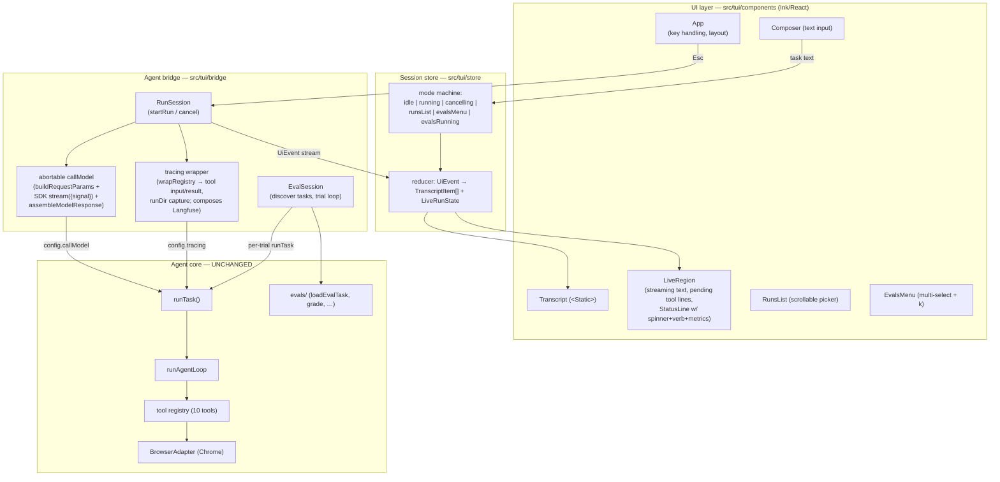

# Sherlock — Evidence Agent TUI: Detailed Design

## Overview

Sherlock is a terminal UI for the evidence collection agent — a browser agent that takes a natural-language task, drives a real Chrome window, and leaves behind a tamper-evident run directory (deliverables, `manifest.json` with SHA-256 provenance, `transcript.jsonl`, `metrics.json`).

The experience is modeled on Claude Code's TUI: a single vertically growing transcript that reads like watching a capable agent actively investigate something in real time — not a dashboard, not a pane-based layout. The user types a task into a persistent composer at the bottom; agent activity streams into the transcript as compact semantic blocks; an animated status line with whimsical investigator verbs ("✻ Foraging…") and subtle instrumentation (`↳ 12.4k tokens · 18s`) shows liveness; evidence findings get visual emphasis; and a persistent completion line ("✓ Brewed in 42s · 18.7k tokens") marks the end of each investigation.

Sherlock is a **pure layer on top of the existing agent**: zero changes to the agent core (`src/loop`, `src/model`, `src/tools`, `src/run`, `src/browser`, `src/tracing`). It attaches through existing injection seams (`runTask` config) and exported primitives. It is launched with the `sherlock` command and styled with the Andera purple palette.

Scope covers three capabilities, in build order: **live runs** (the core experience), **past-run browsing** (scrollable run list), and **evals** (task multi-select + trial count, live trial progress).

## Detailed Requirements

Consolidated from requirements clarification:

**R1 — Cockpit scope.** The TUI supports running tasks live, browsing past run directories, and kicking off/watching evals — with the live run experience built first and given the most polish.

**R2 — Single-transcript interaction model.** One vertically growing transcript containing, in chronological order: the user's request, agent status/activity, browser actions, pages visited, evidence discovered, intermediate reasoning summaries, errors/retries, and the final synthesized result. No permanent panels; actions appear inline as compact blocks and scroll upward naturally. A persistent input/composer sits at the bottom. Overall feel: ask → agent investigates → activity streams → evidence accumulates → readable investigation transcript remains.

**R3 — Active-agent status line.** While working, show a compact animated status line: an animated glyph plus a whimsical working word ("✻ Foraging…"), with live metadata alongside/below (`↳ 12.4k tokens · 18s`). Elapsed time updates continuously; the token count grows as the investigation progresses, formatted compactly (`847 tokens`, `3.2k tokens`, `18.7k tokens`). Metrics are subtle instrumentation, never visually dominant.

**R4 — Whimsical working words.** Cycle through playful investigator-themed verbs (Foraging…, Sifting…, Rummaging…, Ferreting…, Digging…, Scouring…, Tracing…, Poking around…, Connecting dots…, Following leads…, Chasing citations…, Dusting for clues…, Reading the fine print…, Peeking under rocks…, Untangling threads…, Consulting the archives…, Cross-examining the web…, Separating signal from noise…, Brewing…). Words are ambient personality, not precise state; cycle periodically (a 30-second run should show several) but not so fast it distracts. Working phrases are ephemeral — they do not persist in the transcript.

**R5 — Semantic browser/tool activity.** Render tool activity inline, compact and semantic (`● Opening techcrunch.com/…`, `● Reading the page`), never raw JSON. Evidence findings get stronger treatment (`◆` + claim/source), so a completed transcript is skimmable: navigation → investigation → evidence → conclusion. Full debugging detail lives behind a verbose/debug mode.

**R6 — Completion line.** On finish, replace the animated working state with a persistent completion line representing the entire investigation: `✓ Brewed in 42s · 18.7k tokens` (natural formatting for longer durations: `1m 24s`). The completion verb ("Brewed") is configurable, not hard-coded.

**R7 — Restrained motion.** Subtle glyph animation, incrementing elapsed time, occasional phrase changes, smooth appends, in-place status updates. No flashing, progress bars, fake percentages, layout shifts, or animation competing with content.

**R8 — Glanceability.** At any moment a user can tell: is it working, what is it doing, how long, roughly how much model work, what sources were investigated, what evidence was found, when it finished.

**R9 — Input discipline.** The composer accepts input only between runs. **Esc cancels an in-flight run** cleanly — transcript preserved, a cancelled line appended, user returned to the composer — without exiting the TUI.

**R10 — Slash commands.** `/help` (list commands + keys, rendered as a transcript block), `/runs` (scrollable, selectable list of past run directories), `/evals` (task multi-select + prompt for trial count k — menu only, no args), `/exit` (quit; Ctrl+C remains a conventional fallback).

**R11 — Zero agent changes.** No modifications to the agent core. The TUI attaches only via existing config seams and exported functions.

**R12 — Technology.** Ink (React for terminals). Andera's purple-based color theme. Launched via a `sherlock` bin command.

## Architecture Overview

Three layers, strictly separated: Ink components (render state), a session store (state machine + transcript), and an agent bridge (adapts the agent's callback/injection seams into a single ordered event stream). The agent core is untouched.



### The zero-change attachment (load-bearing design decision)

The agent core already exposes everything needed, through two injection seams on `runTask(taskText, config)`:

1. **`config.callModel`** — Sherlock supplies its own model-calling closure assembled from the core's exported primitives: `buildRequestParams(config, messages)` → Anthropic SDK `client.messages.stream(params, { signal })` → `assembleModelResponse(stream, onProgress)`. This is what makes **Esc cancellation** possible with zero core changes: aborting the `AbortSignal` rejects the in-flight model call; the error propagates out of the agent loop (which has no interior catch), through `runTask`'s `finally` (browser tab closed, manifest finalized), and rejects the `runTask` promise.
   **Critical seam interaction:** passing `config.callModel` silently bypasses `config.onProgress` — the core only wires `onProgress` into its *default* client. Sherlock's client therefore re-emits all progress events itself (`turn_start`, `text_delta`, `tool_use_start`, `turn_end` — the latter carrying per-turn token usage).
2. **`config.tracing`** — the core wraps every tool's `execute` through `tracing.wrapRegistry`, giving Sherlock each tool call's **validated input** and **result/error**, plus `ctx.runDir` (otherwise unknown until the run ends). Sherlock's wrapper *composes* the existing Langfuse tracing (delegates to `createRunTracing()`) so observability is preserved.

Cancellation granularity (accepted trade-off): Esc aborts the in-flight model call immediately; a tool batch already executing settles first (bounded by Playwright's default timeouts, typically seconds). Mid-browser-op abort is impossible without core changes — out of scope by R11.

### Event flow for one run

```mermaid
sequenceDiagram
    participant U as User
    participant App as App/Store
    participant B as RunSession (bridge)
    participant C as runTask (core)

    U->>App: types task, Enter
    App->>B: startRun(task)
    B->>C: runTask(task, {browser, callModel, tracing})
    C-->>B: tracing: run_dir(runDir) on first tool exec
    loop each turn
        C-->>B: turn_start / text_delta* / tool_use_start*
        B-->>App: agent text streams into LiveRegion
        C-->>B: tracing: tool exec start(name, input) / end(result)
        B-->>App: activity line ● / evidence line ◆ (pending → ✓/✗)
        C-->>B: turn_end(usage)
        B-->>App: token total updates
    end
    alt completes
        C-->>B: resolves {runDir, status, finalText}
        B-->>App: completion → "✓ Brewed in 42s · 18.7k tokens"
    else Esc pressed
        U->>App: Esc
        App->>B: cancel() → signal.abort()
        C-->>B: rejects (AbortError; manifest finalized)
        B-->>App: "✗ Interrupted after 18s · 9.3k tokens"
    end
```

## Components and Interfaces

File layout (all new files; the only touches outside `src/tui/` are `package.json` (deps, `bin`, script) and one tsconfig flag):

```
src/tui/
  main.tsx            # entry: env load, preflight, browser launch, render(<App/>)
  theme.ts            # Andera palette tokens + glyphs
  config.ts           # SherlockConfig (completionVerb, workingWords, verbose)
  format.ts           # tokens (18.7k), durations (1m 24s), URL shortening
  store/
    state.ts          # SessionState, TranscriptItem, UiEvent types
    reducer.ts        # (state, UiEvent) → state   [pure]
    semantic.ts       # tool call → semantic line derivation   [pure]
  bridge/
    runSession.ts     # startRun/cancel; abortable callModel; progress re-emission
    tuiTracing.ts     # RunTracing impl: tool events + runDir capture + Langfuse delegate
    evalSession.ts    # task discovery (readdir evals/*/task.json) + trial loop
  components/
    App.tsx           # layout, useInput (Esc, Ctrl+C), mode switching
    Transcript.tsx    # <Static> over finalized TranscriptItems
    TranscriptItem.tsx# renderer per item kind
    LiveRegion.tsx    # streaming text + pending tool lines + StatusLine
    StatusLine.tsx    # spinner glyph + working word + ↳ metrics
    Composer.tsx      # ink-text-input; disabled while running
    RunsList.tsx      # scrollable run picker
    EvalsMenu.tsx     # task multi-select + k prompt
bin/sherlock.mjs      # #!/usr/bin/env node — tsx loader shim → src/tui/main.tsx
```

### Entry point (`bin/sherlock.mjs` → `main.tsx`)

- Loads `.env` via Node's built-in `process.loadEnvFile()` (Node ≥20.12; try/catch — absent file is fine). The repo deliberately has no dotenv; this stays in the TUI layer.
- Preflight: warn (as a styled banner) if `ANTHROPIC_API_KEY` unset; require a TTY (print a plain message and exit otherwise); check Node ≥22 (Ink 7 floor).
- Launches persistent Chrome exactly as the REPL does (same `chrome-profile` dir, resolved from repo root), closes it on exit.
- `render(<App/>, { exitOnCtrlC: true })`; `patchConsole` left on as a safety net (the core is verified console-silent, so this should never fire in practice).
- `bin` entry in `package.json` (`"sherlock": "bin/sherlock.mjs"`), so `npm link` or global install provides the `sherlock` command; an `npm run sherlock` script mirrors it. The shim registers tsx's ESM loader (already a dependency) and imports `main.tsx` — no build step.

### Session store

A `useReducer`-style store owned by `App`. Modes: `idle` (composer active) → `running` → `cancelling` (Esc pressed, waiting for rejection) → back to `idle`; plus `runsList`, `evalsMenu`, `evalsRunning` overlays. The reducer is pure and fully unit-testable: it consumes `UiEvent`s and produces `TranscriptItem`s (finalized, append-only) plus `LiveRunState` (mutable dynamic region).

**Finalization rule** (drives Ink's `<Static>` correctly, since `<Static>` items can never re-render): an item enters the transcript array only when its content is final —
- agent text block: finalized at next `tool_use_start` batch or `turn_end`;
- tool activity line: finalized when its result arrives (✓/✗) — while pending it renders in the LiveRegion;
- dangling pending lines (e.g., a tool the model requested but the registry rejected as `invalid_input` — invisible to the tracing wrapper) are settled as `⚠ retried` at the next `turn_start`.

### StatusLine

- Glyph animation: small frame cycle `✢ ✳ ✻ ✽` at ~4 fps in theme purple — subtle, Claude Code-like.
- Working word: picked at run start from `config.workingWords` (defaults = R4 list), re-picked every ~6 s (no immediate repeat). Rendered as `✻ Foraging…`; metadata beneath: `↳ 12.4k tokens · 18s (esc to interrupt)` in dim indigo-gray.
- Elapsed: 1 s interval from run start. Tokens: sum of `turn_end` usage (`input + output`), plus a light in-turn estimate from streamed text length (≈ chars/4) so the number visibly grows mid-turn; snapped to the true total at each `turn_end`. Compact formatting: `<1000` → `847 tokens`; `≥1000` → `18.7k tokens`.
- Cadences (1 s clock, ~4 fps glyph, 6 s words) are constants injected via config — testable and tunable.

### Semantic line derivation (`semantic.ts`, pure)

| Tool call | Transcript line |
|---|---|
| `navigate {url}` | `● Opening sec.gov/cgi-bin/browse-edgar…` (URL shortened: host + trimmed path) |
| `inspect_page` | `● Reading the page` |
| `click {ref}` | `● Clicking <ref's element description if known, else ref>` |
| `type {ref, text}` | `● Typing "quarterly report 10-Q"` (text truncated) |
| `scroll` | `● Scrolling` |
| `grep {pattern}` | `● Searching files for "pattern"` |
| `read_file {file_path}` | `● Re-reading notes.md` |
| `screenshot {filename}` | `◆ Captured filing-page.png` (evidence) |
| `download {filename?}` | `◆ Downloaded exhibit-99.pdf` (evidence) |
| `write_file {file_path}` | `◆ Evidence saved → top5.csv` (evidence) |

Evidence lines (`◆`, bright purple) also show the source URL when the manifest records one. The model's streamed text between tool calls provides the "Reading SEC filing"-grade semantic narration (R5) for free — rendered as normal agent prose. Verbose mode (`sherlock --verbose`) additionally renders dim, indented input/result JSON under each activity line.

### RunSession (bridge)

```ts
interface RunHandle {
  events: AsyncIterable<UiEvent> | ((e: UiEvent) => void) subscription;
  cancel(): void;                    // aborts the AbortController
  done: Promise<RunOutcome>;         // completed | budget_exceeded | cancelled | failed
}
startRun(task: string, deps: { browser: BrowserAdapter }): RunHandle
```

Internals: one `AbortController` per run; custom `callModel` closure (checks `signal.aborted` at entry, passes `{ signal }` to the SDK stream, re-emits progress via `assembleModelResponse`'s callback + its own turn events); `tuiTracing` (wraps registry for tool events + `runDir` capture, delegates spans to the real `createRunTracing()`). Event ordering is normalized here so the reducer sees one coherent stream.

### RunsList (`/runs`)

Reads `runsBaseDir` (`runs/`), newest first (run IDs sort lexically by time). Each row: task snippet (from `manifest.json.task`), relative date, and status glyph — `✓` (has `metrics.json`), `◐` (no `finishedAt`: in progress/crashed), `✗` (finished but no metrics: cancelled/failed — **deliberately not labeled "crashed"**, per the core's semantics). Scrollable window (`ink-select-input` with `limit`); Enter renders an inline run-summary transcript block (task, when, duration, tokens from metrics, artifact list with sizes + SHA-256 prefixes from the manifest); Esc closes. No pager/editor integration in v1.

### EvalsMenu (`/evals`)

Task discovery = `readdir('evals/')` filtered to dirs containing `task.json` (the registry is a filesystem convention; no core API exists). Step 1: checkbox multi-select (space toggles, enter confirms — small custom component on `useInput`). Step 2: numeric prompt for k (default 3). Then `evalsRunning`: Sherlock drives its own trial loop from the core's exported parts — `loadEvalTask` → `runTask` (same bridge, so trials stream exactly like live runs) → `fetchOracle` → `grade` → `summarizeTask` — emitting a header line per trial (`— edgar · trial 2/3 —`), per-assertion verdicts, and a final report block (`formatReport`), persisted via `writeResults` to `evals/experiments/` as the CLI does. Esc cancels the current trial and skips the remainder. Note: `runEvals()` itself is *not* used — it is fire-and-wait with no per-trial progress; the trial loop is ~15 lines over the same exports.

### Screen states (mockups)

```
While running:                                 After completion:

  ▸ Find Acme Corp's Series B investors          ▸ Find Acme Corp's Series B investors
                                                 I'll start with recent funding coverage…
  I'll start with recent funding coverage…       ● Opening techcrunch.com/2026/…
  ● Opening techcrunch.com/2026/…          ✓     ● Reading the page                    ✓
  ● Reading the page                       ✓     The article names three investors…
                                                 ◆ Evidence saved → investors.csv
  The filing should confirm the amounts…           └ source: sec.gov/Archives/…
                                                 Acme's Series B was led by …
  ✻ Ferreting…                                   ✓ Brewed in 1m 24s · 31.2k tokens
  ↳ 12.4k tokens · 18s (esc to interrupt)
                                                 ┌──────────────────────────────────┐
  ┌──────────────────────────────────┐           │ ›                                │
  │ › (waiting for agent…)           │           └──────────────────────────────────┘
  └──────────────────────────────────┘             /help for commands
```

## Data Models

```ts
// Transcript — append-only, finalized items (drives <Static>)
type TranscriptItem =
  | { kind: 'user_task'; text: string }
  | { kind: 'agent_text'; text: string }                          // model prose
  | { kind: 'activity'; line: string; status: 'ok'|'error'|'retried'; verbose?: {input: string; result: string} }
  | { kind: 'evidence'; line: string; sourceUrl?: string }
  | { kind: 'completion'; verb: string; elapsedMs: number; tokens: number; runDir: string }
  | { kind: 'cancelled'; elapsedMs: number; tokens: number }
  | { kind: 'error'; message: string }                            // run failure, API errors
  | { kind: 'notice'; text: string }                              // /help output, banners
  | { kind: 'run_summary'; manifest: ManifestView; metrics?: MetricsView }
  | { kind: 'eval_trial'; task: string; trial: number; k: number; assertions: {name: string; passed: boolean; detail?: string}[]; elapsedMs: number }
  | { kind: 'eval_report'; text: string };

// Live (dynamic region) state — mutable until finalized
interface LiveRunState {
  streamingText: string;                    // current model prose
  pendingTools: { id: number; line: string; isEvidence: boolean }[];
  workingWord: string;
  startedAt: number;                        // epoch ms
  tokens: { settled: number; estimate: number };
  turn: number;
  runDir?: string;
}

// Bridge events — the single stream the reducer consumes
type UiEvent =
  | { type: 'run_started'; task: string }
  | { type: 'run_dir'; runDir: string }
  | { type: 'turn_start'; turn: number }
  | { type: 'text_delta'; text: string }
  | { type: 'tool_pending'; name: string }                        // from model stream (name only)
  | { type: 'tool_exec_start'; id: number; name: string; input: unknown }
  | { type: 'tool_exec_end'; id: number; ok: boolean; result?: unknown; error?: string }
  | { type: 'turn_end'; usage: { input: number; output: number; cacheRead?: number } }
  | { type: 'run_finished'; outcome: 'completed'|'budget_exceeded'; finalText?: string; runDir: string }
  | { type: 'run_cancelled' } | { type: 'run_failed'; message: string };

// Config
interface SherlockConfig {
  completionVerb: string;        // default 'Brewed' — R6: configurable, not hard-coded
  workingWords: string[];        // default: R4 list
  verbose: boolean;              // --verbose flag
  runsBaseDir: string;           // default 'runs'
  wordCycleMs: number; glyphFps: number;   // motion cadences
}
```

Theme tokens (from Andera's published CSS custom properties — a purple/indigo system whose `--theme` anchor is `#A9A1E6`):

| Role | Color |
|---|---|
| Primary accent — spinner glyph ✻, user prompt marker ▸ | `#A9A1E6` (purple300) |
| Evidence ◆ / emphasis | `#AEA4FF` (purple400) |
| Activity ● lines | `#786ECB` (purple600) |
| Muted metadata (`↳ … tokens · …s`), dim hints | `#7D7993` (indigo-gray w500) |
| Success ✓ | `#00892B` |
| Error ✗ | `#DC2626` |
| Agent prose | terminal default foreground |

Colors are foreground-only (terminal background is the user's); Ink/chalk downsample automatically when truecolor is unavailable.

## Error Handling

- **Run failure** (`runTask` rejects for non-abort reasons — network, API, browser death): append an `error` item with the message, return to `idle`, keep the TUI alive. If the browser connection died, offer relaunch on next submit (detect via the adapter throwing on `newTab`).
- **Cancellation semantics**: Esc → `cancelling` mode (status line shows `✻ Wrapping up…`); the core's `finally` still closes the tab and finalizes the manifest; on rejection append the `cancelled` line. A cancelled run has `manifest.finishedAt` but **no `metrics.json`** — the RunsList status logic treats that as "stopped", never "crashed".
- **Tool errors mid-run**: rendered as `✗`-status activity lines (the loop feeds errors back to the model and continues — errors/retries are part of the story per R2, not fatal).
- **Rejected tool calls** (`unknown_tool` / `invalid_input` — invisible to the tracing seam): pending lines settled as `⚠ retried` at the next turn boundary.
- **Missing API key**: styled warning banner at startup (mirrors the REPL's preflight); the first submit will fail fast with an `error` item.
- **Non-TTY / CI**: print a one-line explanation and exit non-zero; Sherlock is interactive-only.
- **Stray console output**: the core is verified console-silent; Ink's `patchConsole` catches anything unexpected (e.g., a dependency warning) and splices it safely above the live region.
- **Double-Esc / Ctrl+C during `cancelling`**: Ctrl+C exits the app (Ink default), the browser is closed by the entry point's teardown; the run directory remains valid because the manifest is finalized by the core's `finally` where possible.

## Testing Strategy

Vitest (the repo's existing runner), tests under `tests/tui/`. The design isolates nearly all logic in pure modules so most coverage needs no terminal emulation:

1. **Pure units** — `format.ts` (token/duration formatting incl. `1m 24s` boundaries), `semantic.ts` (every tool → line mapping, URL shortening, truncation), `reducer.ts` (event sequences → transcript/live state: finalization rules, dangling-tool settlement, token accumulation with estimate-vs-settled snapping, cancellation paths). Word cycling and glyph animation take an injected clock/RNG.
2. **Bridge tests** — `runSession` with a **fake `callModel` environment**: stub the SDK stream (scripted raw events) and a stub registry to assert (a) progress events are re-emitted faithfully (the `callModel`-bypasses-`onProgress` trap), (b) abort mid-stream rejects and emits `run_cancelled`, (c) `runDir` is captured from the first tool execution, (d) Langfuse delegate methods are called. `evalSession`: task discovery against a fixture `evals/` tree; trial loop ordering and Esc-skip with stubbed `runTask`/oracle/grader.
3. **Component tests** — `ink-testing-library` (renders to strings, drives stdin): StatusLine renders word + metrics and cycles on clock ticks; Composer disabled while running; Esc triggers cancel in `running` mode only; RunsList selection emits a `run_summary`; EvalsMenu multi-select → k → confirms selection set.
4. **Manual demo checkpoints** — each implementation step ends with a runnable `sherlock` increment against the real agent (see implementation plan), since feel (motion cadence, color, flicker) can only be judged by eye.

## Appendices

### A. Technology choices

| Choice | Rationale | Alternatives considered |
|---|---|---|
| **Ink 7.1** (+ `ink-text-input`, `ink-select-input`) | React model fits a growing-transcript UI exactly (`<Static>` = append-only scrollback; dynamic region re-renders in place). First-party `useInput` (Esc), `patchConsole`, hex-color `<Text>`, `maxFps`/`incrementalRendering` for restrained motion. Node ≥22 required — local machine runs 22.17. | Ink 6 (Node ≥20) if the floor matters; hand-rolled ANSI over readline (fiddly in-place updates, no layout engine); blessed (unmaintained); OpenTUI (young). |
| **tsx loader shim for `bin/sherlock.mjs`** | Repo already runs everything through tsx; no build step. | tsc build output (adds a compile step for little gain here). |
| **`process.loadEnvFile()`** for `.env` | Built into Node ≥20.12; keeps the repo's "no dotenv dependency" stance while making `sherlock` work without `--env-file`. | dotenv dep; requiring `--env-file` (hostile for a global bin). |
| **Andera palette** (purple) | User preference; extracted from andera.ai's published CSS tokens (`--theme: #A9A1E6` anchor). | — |

### B. Key research findings (from the code audit)

- The agent core is cleanly headless: `runTask(taskText, config)` is the full programmatic interface; the existing REPL is a thin shell; **zero console writes exist outside CLI entry points** — an Ink screen is safe.
- The only live progress channel is `config.onProgress` (`turn_start` / `text_delta` / `tool_use_start` (name only) / `turn_end` (per-turn usage)). Cumulative tokens are not exposed mid-run — the TUI accumulates.
- Tool inputs/results and the run directory are not in progress events; both are obtainable zero-change via the `config.tracing` seam (`wrapRegistry`), which must delegate to the existing Langfuse tracing to preserve observability.
- **No cancellation exists in the core** (no AbortSignal anywhere). The zero-change route is an injected `callModel` built from exported primitives (`buildRequestParams`, `assembleModelResponse`) plus the SDK's per-request `{signal}`. Injecting `callModel` bypasses `onProgress` — the injected client must re-emit progress itself. Abort granularity: model call = immediate; in-flight tool batch settles first.
- Run artifacts: `manifest.json` (finalized even on failure/cancel), `metrics.json` (written **only** on normal loop completion — its absence ≠ crash), `transcript.jsonl` (full fidelity, logged around tool execution).
- Eval registry is a filesystem convention (`evals/<name>/task.json` + `oracle/oracle.ts` + `grader/grader.ts`); no discovery API; `runEvals()` yields no per-trial progress — the TUI drives its own loop over the exported parts (`loadEvalTask`, graders, `summarizeTask`, `formatReport`, `writeResults`).
- Housekeeping: tsconfig needs `"jsx": "react-jsx"`; `package.json` gains ink/react deps + `bin`; Ink 7 raises the TUI's Node floor to 22.

### C. Alternative approaches considered

- **Multi-pane dashboard layout** — rejected: the product feeling is "watching an investigator work", best served by a single transcript (user vision); panes cost layout maintenance and fight terminal scrollback.
- **Full verbatim event feed** — rejected as the default (noise); preserved as `--verbose`.
- **Agent-side semantic events** (a `note_evidence` tool or narration prompt) — rejected: violates the zero-agent-changes constraint and would perturb an agent under active eval iteration. Semantic lines are derived TUI-side from tool inputs + the model's natural narration.
- **One-line core change for cancellation** (`signal` in `RunTaskConfig`) — noted as the cheapest future simplification, but not taken: zero-change is a hard requirement, and the injected-`callModel` route is contained in one bridge module.
- **`/evals` with CLI-style args** — rejected by user in favor of menu-only (multi-select + k prompt).
- **Borrowing from a locally mirrored Claude Code source snapshot** — rejected: it is a mirror of proprietary, unlicensed source; the UI is an independent implementation of publicly observable behavior on public Ink APIs.
