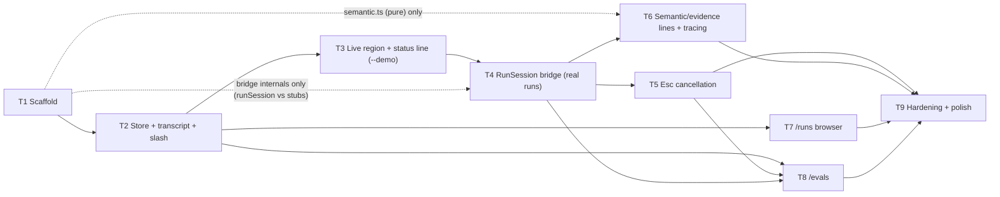

# Sherlock TUI — Implementation Plan

Each step ends with a working, demoable increment. Tests are written with (or before) the code they cover, using vitest under `tests/tui/`. The design document is the reference for all component/data-model details; this plan sequences the work.

## Checklist

- [ ] Step 1: Scaffold `sherlock` — bin, deps, theme, formatting, static shell
- [ ] Step 2: Session store, transcript rendering, slash-command routing (`/help`, `/exit`)
- [ ] Step 3: Live region + status line, driven by a scripted demo run (`--demo`)
- [ ] Step 4: RunSession bridge — real agent runs stream into the TUI
- [ ] Step 5: Esc cancellation
- [ ] Step 6: Semantic activity + evidence lines via tracing seam; verbose mode
- [ ] Step 7: `/runs` — scrollable past-run list + run summary blocks
- [ ] Step 8: `/evals` — task multi-select, k prompt, live trial loop, report
- [ ] Step 9: Hardening + polish pass against the vision checklist

## Task graph — parallelization (T1–T9)

Tasks are the plan's steps: **Tn = Step n**. Arrows are hard dependencies ("must be complete before"); tasks with no path between them can run in parallel.

**Sequential spine:** T1 → T2 → T3 → T4 → T9. Each of these genuinely consumes the previous one's output (scaffold → store → rendering pipeline → real-event integration → acceptance over everything).

**Parallel opportunities:**

- **T7 ∥ T3–T6** — the `/runs` browser only needs T2's transcript/overlay machinery; it reads run directories from disk and never touches the bridge. It can proceed the moment T2 lands.
- **T5 ∥ T6** — after T4, cancellation (abort path) and semantic lines (tracing seam) touch disjoint code and can be built concurrently.
- **Early starts (dashed edges)** — two pieces are pure and only need T1: the bridge internals of T4 (`runSession.ts` developed against a stubbed SDK stream; its TUI integration still waits for T3) and T6's `semantic.ts` derivation table (its tracing integration still waits for T4).
- **T8** needs the menu machinery (T2), the run pipeline (T4), and Esc-skip semantics (T5); T6 improves its output but is not a prerequisite.
- **T9** is the join point: it hardens error paths and runs acceptance across everything, so it goes last.

Minimal-latency schedule for two workers: A does T1 → T2 → T3 → T4-integration → T5; B starts T4-internals + T6's `semantic.ts` after T1, picks up T7 after T2, then T6-integration after T4; either does T8 after T5; both converge on T9.

### Agent execution model

One **main agent** — the most capable/intelligent model available — owns the build. It does the reasoning-heavy work itself and **delegates mechanical code-change work to cheap, fast subagents**, judging their output against the plan's narrow `Verify:` checks rather than re-reading everything.

**Main agent keeps (reasoning-heavy, cross-cutting):**
- Sequencing, integration, and every design-sensitive seam — especially the `callModel`-bypasses-`onProgress` re-emission (T4), abort/cancellation semantics (T5), the tracing delegation to Langfuse (T6), and the `<Static>` finalization rules in the reducer (T2/T3).
- Reviewing every subagent diff before it lands; resolving anything a subagent got wrong rather than re-prompting in circles.
- Judging `Verify:` results, flipping `features.json` statuses (`fail` → `pass` only when the mapped `S*-V*` checks actually pass), and appending `progress.md` entries (including what was delegated and the outcome).

**Delegate to cheap/fast subagents (mechanical, narrowly specified, verifiable):**
- Scaffolding files from the design's file layout; `theme.ts` tokens, `format.ts` helpers, `config.ts` defaults (T1).
- Table-driven work with a spec already written: the `semantic.ts` derivation table and its tests (T6), fixture run-directories and fixture evals trees (T5/T7/T8), table-driven test suites where the cases are enumerated in the plan.
- Running verify commands and reporting results; typecheck/test sweeps; README usage note (T9).

**Delegation contract:** each subagent task must name its target files, the exact `Verify:` IDs that define done, and the constraint that the agent core (`src/loop`, `src/model`, `src/tools`, `src/run`, `src/browser`, `src/tracing`) is untouched. The verification surfaces exist precisely so delegated work is judged by surface evidence against a narrow condition — a subagent's word is never the evidence.

---

## Step 1: Scaffold `sherlock` — bin, deps, theme, formatting, static shell

**Objective:** A launchable `sherlock` command rendering the styled shell: banner, empty transcript, active composer.

**Guidance:** Add `ink`, `react`, `ink-text-input`, `ink-select-input` (+ `@types/react`, `ink-testing-library` as dev deps); add `"jsx": "react-jsx"` to tsconfig; create `bin/sherlock.mjs` (tsx loader shim → `src/tui/main.tsx`), `bin` + `sherlock` script in package.json. Implement `theme.ts` (Andera tokens, glyphs), `format.ts` (compact tokens, durations, URL shortening), `config.ts` (defaults incl. `completionVerb: 'Brewed'`, working-words list). `main.tsx` does env load (`process.loadEnvFile`), TTY/Node/API-key preflight, renders `<App/>` with composer that accepts text but only echoes a "not wired yet" notice. No browser launch yet.

**Tests:** `format.ts` — token formatting (847 / 3.2k / 18.7k boundaries), duration formatting (42s / 1m 24s), URL shortening. Config defaults (verb configurable, word list non-empty).

**Integration:** Foundation; nothing depends on prior steps.

**Demo:** `npm run sherlock` (or linked `sherlock`) opens the purple-themed shell; typing text gets a styled notice; Ctrl+C exits cleanly.

**Verify:**

- `S1-V1` — `node -e "const fs=require('node:fs'); const p=require('./package.json'); const t=JSON.parse(fs.readFileSync('tsconfig.json','utf8')); const required=['ink','react','ink-text-input','ink-select-input']; const dev=['@types/react','ink-testing-library']; if(p.bin?.sherlock!=='bin/sherlock.mjs'||p.scripts?.sherlock!=='node bin/sherlock.mjs'||required.some(x=>!p.dependencies?.[x])||dev.some(x=>!p.devDependencies?.[x])||t.compilerOptions?.jsx!=='react-jsx') process.exit(1)"` exits 0.
- `S1-V2` — `test -x bin/sherlock.mjs && test -f src/tui/main.tsx && test -f src/tui/theme.ts && test -f src/tui/format.ts && test -f src/tui/config.ts && test -f src/tui/components/App.tsx && test -f src/tui/components/Composer.tsx` exits 0.
- `S1-V3` — `npx vitest run tests/tui/format.test.ts tests/tui/config.test.ts tests/tui/shell.test.tsx` exits 0; the shell suite asserts that the banner, composer, and submitted-text notice render.
- `S1-V4` — `npm run typecheck` exits 0.
- `S1-V5` — `npm run sherlock </dev/null > /tmp/sherlock-step1.out 2>&1` exits non-zero, and `grep -Ei 'tty|interactive terminal' /tmp/sherlock-step1.out` exits 0.
- `S1-H1` — Human-judged visual remainder: in a TTY, the shell uses the Andera purple theme, accepts text, shows the styled notice, and Ctrl+C exits without leaving terminal artifacts.

## Step 2: Session store, transcript rendering, slash routing

**Objective:** The append-only transcript works end-to-end with pure state management, and `/help` + `/exit` function.

**Guidance:** Implement `store/state.ts` + `store/reducer.ts` (modes, `TranscriptItem`s, finalization rules) and `Transcript.tsx`/`TranscriptItem.tsx` over Ink's `<Static>`. Composer submit → `user_task` item (▸, purple). Slash router: `/help` renders a `notice` block (commands + keys), `/exit` calls `useApp().exit()`; unknown `/cmd` → gentle notice.

**Tests:** Reducer — submit appends `user_task`; notices append; unknown-command handling; mode stays `idle`. Component — `ink-testing-library`: submitted text appears in output; `/help` block renders.

**Integration:** Replaces Step 1's echo notice with real store dispatch.

**Demo:** Type a task → it appears as a transcript entry; `/help` shows the command list; `/exit` quits; earlier entries persist in scrollback as new ones append.

**Verify:**

- `S2-V1` — `test -f src/tui/store/state.ts && test -f src/tui/store/reducer.ts && test -f src/tui/components/Transcript.tsx && test -f src/tui/components/TranscriptItem.tsx` exits 0.
- `S2-V2` — `npx vitest run tests/tui/reducer.test.ts` exits 0; the suite covers user-task and notice appends, unknown-command handling, and retention of `idle` mode.
- `S2-V3` — `npx vitest run tests/tui/transcript.test.tsx tests/tui/app.test.tsx` exits 0; the suites assert transcript persistence, submitted-text rendering, `/help`, `/exit`, and the gentle unknown-command notice.
- `S2-V4` — `npm run typecheck` exits 0.
- `S2-H1` — Human-judged visual remainder: several submitted entries remain readable in terminal scrollback while the composer stays anchored at the bottom.

## Step 3: Live region + status line on a scripted demo run

**Objective:** The full "agent is working" experience — streaming prose, pending tool lines, animated status line, completion line — rendered from a scripted event source, no API cost.

**Guidance:** Implement `LiveRegion.tsx` and `StatusLine.tsx` (glyph frames ~4 fps, working word re-pick ~6 s no-repeat, 1 s elapsed, token estimate that snaps at `turn_end`) with injectable clock/RNG. Extend the reducer for the full `UiEvent` set: streaming-text finalization, pending→finalized tool lines, `completion`/`cancelled` items. Add `sherlock --demo`: plays a canned `UiEvent` script (a fake investigation) through the real pipeline with realistic pacing.

**Tests:** Reducer — full event-sequence fixtures: text finalizes at tool batch/turn end; pending tools finalize on exec end; dangling pending settles as `retried` at next `turn_start`; token settled/estimate math. StatusLine — word cycles on injected clock, never repeats consecutively; metrics line renders `↳ 12.4k tokens · 18s`. Completion line uses configured verb.

**Integration:** Consumes Step 2's store/transcript; the demo script stands in for the bridge built next.

**Demo:** `sherlock --demo` plays a ~30 s fake investigation: prose streams, `●` lines appear and get ✓, words cycle (several across the run), tokens tick up, and it ends with `✓ Brewed in 42s · 18.7k tokens` persisting in the transcript.

**Verify:**

- `S3-V1` — `test -f src/tui/components/LiveRegion.tsx && test -f src/tui/components/StatusLine.tsx` exits 0.
- `S3-V2` — `npx vitest run tests/tui/reducer.test.ts` exits 0; full event-sequence fixtures assert text finalization, pending-tool completion, dangling-tool `retried` settlement, and settled-versus-estimated token math.
- `S3-V3` — `npx vitest run tests/tui/status-line.test.tsx` exits 0; the suite uses an injected clock/RNG, asserts no consecutive word repeat, matches `↳ 12.4k tokens · 18s`, and matches the configured completion verb.
- `S3-V4` — `npx vitest run tests/tui/demo.test.ts` exits 0; the scripted event source terminates and its final rendered transcript contains `✓ Brewed in 42s · 18.7k tokens`.
- `S3-V5` — `npm run typecheck` exits 0.
- `S3-H1` — Human-judged visual remainder: `npm run sherlock -- --demo` shows in-place streaming and restrained animation, cycles several working words over the run, and finishes without flicker or layout shift.

## Step 4: RunSession bridge — real runs

**Objective:** Typing a task runs the real agent with live streaming in the TUI.

**Guidance:** Implement `bridge/runSession.ts`: per-run `AbortController`; custom `callModel` composed from the core's exported `buildRequestParams` + SDK `client.messages.stream(params, {signal})` + `assembleModelResponse`; **re-emit all four progress events** (the injected `callModel` bypasses `onProgress` — this is the critical seam). Emit `tool_pending` from stream tool-use starts (name only for now). `main.tsx` now launches persistent Chrome at startup (same profile dir semantics as the REPL) and closes it on exit. `run_finished` carries `finalText` + `runDir`; completion line appends with real elapsed/tokens; `runDir` printed dimly under it.

**Tests:** Bridge with a stubbed SDK stream factory and scripted raw events — asserts emitted `UiEvent` order/fidelity (turn boundaries, deltas, usage totals) and that `budget_exceeded` maps to a distinct outcome. No live-API tests.

**Integration:** The store's submit handler dispatches to the bridge instead of the demo script; `--demo` remains for UI iteration.

**Demo:** `sherlock` → type "Create a CSV of the top 5 Hacker News stories…" → Chrome opens, prose streams, tool names appear, completion line shows real time/tokens, and the run directory on disk contains the CSV + manifest.

**Verify:**

- `S4-V1` — `test -f src/tui/bridge/runSession.ts && test -f tests/tui/run-session.test.ts` exits 0.
- `S4-V2` — `npx vitest run tests/tui/run-session.test.ts` exits 0; a stubbed SDK stream asserts ordered re-emission of `turn_start`, `text_delta`, `tool_use_start`, and `turn_end`, faithful usage totals, `run_finished` with `finalText`/`runDir`, and distinct `budget_exceeded` handling.
- `S4-V3` — `npx vitest run tests/tui/app.test.tsx` exits 0; the suite asserts that task submission calls the run-session bridge, disables the composer during a run, preserves `--demo`, and renders the completed run directory.
- `S4-V4` — `npx vitest run tests/tui/browser-lifecycle.test.ts` exits 0; the suite asserts one persistent browser is launched at startup, handed to runs, and closed during TUI teardown.
- `S4-V5` — `npm run typecheck` exits 0.
- `S4-H1` — Human-judged external-integration remainder (requires Chrome and an API key): a real task streams into the TUI and its displayed run directory contains the requested artifact plus `manifest.json`.

## Step 5: Esc cancellation

**Objective:** Esc cleanly interrupts an in-flight run without exiting the TUI.

**Guidance:** `useInput` in `App`: Esc in `running` → `cancelling` mode (status line swaps to a "wrapping up" phrase), calls `RunHandle.cancel()` (aborts the signal; in-flight tool batch settles per design). On rejection with the abort marker: append `cancelled` item (`✗ Interrupted after 18s · 9.3k tokens`), return to `idle`, composer re-enabled. Non-abort rejections → `error` item (groundwork for Step 9).

**Tests:** Bridge — abort mid-stream rejects and yields `run_cancelled`; abort between turns (during tool stub execution) still resolves cleanly after the batch. Reducer — cancelling → cancelled transitions. Component — Esc is a no-op in `idle`, triggers cancel in `running`.

**Integration:** Uses Step 4's AbortController; completes the R9 interaction contract.

**Demo:** Start a run, hit Esc mid-investigation: status flips to wrapping-up, an interrupted line lands in the transcript, and the next task can be typed immediately. The run dir has a finalized `manifest.json` and no `metrics.json`.

**Verify:**

- `S5-V1` — `npx vitest run tests/tui/run-session.test.ts` exits 0; the suite asserts that aborting mid-stream emits `run_cancelled`, and aborting during a stubbed tool batch waits for that batch before cancellation settles.
- `S5-V2` — `npx vitest run tests/tui/reducer.test.ts` exits 0; the suite asserts `running → cancelling → idle`, a persistent `cancelled` item, token/elapsed preservation, and non-abort rejection mapping to an `error` item.
- `S5-V3` — `npx vitest run tests/tui/app.test.tsx` exits 0; the suite asserts Esc is a no-op in `idle`, invokes `RunHandle.cancel()` once in `running`, shows the wrapping-up state, and re-enables the composer after cancellation.
- `S5-V4` — `npx vitest run tests/tui/cancellation-artifacts.test.ts` exits 0; a fixture cancellation leaves a finalized `manifest.json` and no `metrics.json`.
- `S5-V5` — `npm run typecheck` exits 0.
- `S5-H1` — Human-judged interaction remainder: cancelling a real investigation feels responsive, preserves the transcript, and permits immediate submission of the next task without exiting Sherlock.

## Step 6: Semantic activity + evidence lines; verbose mode

**Objective:** Tool activity reads semantically (`● Opening sec.gov/…`, `◆ Evidence saved → top5.csv`) instead of bare tool names.

**Guidance:** Implement `store/semantic.ts` (pure derivation table from the design) and `bridge/tuiTracing.ts`: a `RunTracing` implementation whose `wrapRegistry` emits `tool_exec_start/end` (validated input + ok/error) and captures `runDir` from `ctx`, while **delegating to the core's `createRunTracing()`** so Langfuse still works. Evidence lines get `◆` + source URL when available. `--verbose` renders dim input/result details under each line. Pending name-only lines from Step 4 upgrade in place when exec events arrive.

**Tests:** `semantic.ts` — every tool mapping, truncation, URL shortening edge cases. Tracing wrapper — stub registry: events emitted with validated input, errors marked, `runDir` captured on first call, Langfuse delegate invoked. Reducer — pending line upgraded by exec events; evidence items flagged.

**Integration:** Bridge now passes `tracing` into `runTask`; the runDir is known mid-run (used by Step 7's freshness and the completion line).

**Demo:** A real run now reads like the vision mockup: semantic `●` lines with ✓, `◆` evidence entries with sources, skimmable afterward; `sherlock --verbose` shows the raw detail beneath each action.

**Verify:**

- `S6-V1` — `test -f src/tui/store/semantic.ts && test -f src/tui/bridge/tuiTracing.ts` exits 0.
- `S6-V2` — `npx vitest run tests/tui/semantic.test.ts` exits 0; table-driven cases cover all ten tool mappings, evidence classification, truncation, and URL-shortening edge cases.
- `S6-V3` — `npx vitest run tests/tui/tui-tracing.test.ts` exits 0; a stub registry asserts validated inputs and success/error results are emitted, `runDir` is captured on first execution, and the `createRunTracing()` delegate is invoked.
- `S6-V4` — `npx vitest run tests/tui/reducer.test.ts` exits 0; the suite asserts name-only pending lines upgrade in place on exec events and evidence events finalize as evidence items with source URLs when present.
- `S6-V5` — `npx vitest run tests/tui/transcript.test.tsx` exits 0; default rendering omits raw input/result JSON while verbose rendering includes dim input/result details.
- `S6-V6` — `npm run typecheck` exits 0.
- `S6-H1` — Human-judged visual remainder: a real completed transcript is skimmable as navigation → investigation → evidence → conclusion, with evidence visually stronger than routine activity.

## Step 7: `/runs` — past-run browser

**Objective:** A scrollable, selectable list of past run directories with inline summaries.

**Guidance:** `RunsList.tsx` overlay (mode `runsList`): read `runs/`, newest first; rows = task snippet · relative date · status glyph (✓ metrics present / ◐ unfinished / ✗ stopped — never "crashed"). Enter → `run_summary` transcript block (task, duration, tokens from metrics when present, artifact table with sizes + SHA-256 prefixes from manifest); Esc closes overlay. Windowed scrolling for long lists.

**Tests:** Run-scanning logic (pure, against fixture dirs) — ordering, status classification incl. the cancelled-run case (manifest finalized, no metrics). Component — navigation, selection emits summary, Esc closes.

**Integration:** Slash router gains `/runs`; summary blocks reuse the transcript pipeline.

**Demo:** After a few runs (including the Step 5 cancelled one), `/runs` lists them with correct statuses; selecting one prints its provenance summary inline; Esc returns to the composer.

**Verify:**

- `S7-V1` — `test -f src/tui/components/RunsList.tsx && test -f tests/tui/runs-list.test.tsx && test -f tests/tui/run-scanner.test.ts` exits 0.
- `S7-V2` — `npx vitest run tests/tui/run-scanner.test.ts` exits 0; fixture directories assert newest-first ordering and classification as `✓` with metrics, `◐` without `finishedAt`, and `✗` when finalized without metrics, including a cancelled run never labeled `crashed`.
- `S7-V3` — `npx vitest run tests/tui/runs-list.test.tsx` exits 0; the suite asserts windowed navigation, Enter selection, a summary containing task/duration/tokens plus artifact size and SHA-256 prefix, and Esc close.
- `S7-V4` — `npx vitest run tests/tui/app.test.tsx` exits 0; the suite asserts `/runs` enters `runsList` mode and a selected summary is appended through the transcript pipeline before returning to the composer.
- `S7-V5` — `npm run typecheck` exits 0.
- `S7-H1` — Human-judged visual remainder: a long real run history remains navigable and summaries are legible without permanent panels or terminal layout breakage.

## Step 8: `/evals` — menu, trial loop, live progress

**Objective:** Kick off eval batches from the TUI and watch trials stream live.

**Guidance:** `EvalsMenu.tsx`: checkbox multi-select of tasks (discovered by reading `evals/*/task.json`) → numeric k prompt (default 3) → `evalsRunning`. `bridge/evalSession.ts`: sequential trial loop over the core's exported parts (`loadEvalTask` → bridge `startRun` → `fetchOracle` → `grade` → `summarizeTask`), emitting trial-header items, per-assertion verdicts, and a final `eval_report` block (`formatReport`), persisted with `writeResults`. Esc cancels the current trial and skips the rest.

**Tests:** Task discovery against a fixture evals tree. Trial loop with stubbed runTask/oracle/grader — ordering, verdict items, report assembly, Esc-skip semantics. Menu component — toggle/confirm/k validation (positive integer).

**Integration:** Trials reuse the entire live-run pipeline (Steps 4–6), so eval runs look identical to interactive runs with trial framing around them.

**Demo:** `/evals` → select `stub` (+ another task), k=2 → trials stream with live status; assertions print pass/fail; the report block matches the CLI's format and lands in `evals/experiments/`.

**Verify:**

- `S8-V1` — `test -f src/tui/components/EvalsMenu.tsx && test -f src/tui/bridge/evalSession.ts` exits 0.
- `S8-V2` — `npx vitest run tests/tui/eval-session.test.ts` exits 0; fixture-tree cases discover only `evals/*/task.json`, and stubbed run/oracle/grader cases assert sequential trial ordering, per-assertion verdicts, report assembly through `formatReport`, persistence through `writeResults`, and Esc skipping the remaining trials.
- `S8-V3` — `npx vitest run tests/tui/evals-menu.test.tsx` exits 0; the suite asserts checkbox toggling, multi-select confirmation, default `k=3`, rejection of non-positive/non-integer k, and confirmation of a valid k.
- `S8-V4` — `npx vitest run tests/tui/app.test.tsx` exits 0; the suite asserts `/evals` enters menu mode, accepted selection enters `evalsRunning`, and trial/report items use the same transcript/live-run pipeline as interactive tasks.
- `S8-V5` — `npm run typecheck` exits 0.
- `S8-H1` — Human-judged external-integration remainder (requires Chrome, an API key, and oracle access): a k=2 batch streams live trial progress, prints verdicts, and produces a report in `evals/experiments/` matching the CLI presentation.

## Step 9: Hardening + polish against the vision

**Objective:** The failure paths and the feel are finished.

**Guidance:** Error handling per design: non-abort run failures → `error` item + recovery (browser-death detection and relaunch offer on next submit); missing-API-key banner; non-TTY exit message; double-Esc/Ctrl+C during cancelling. Motion tuning (`maxFps`, `incrementalRendering`, cadence constants) on real runs; verify no flicker/layout shift on narrow terminals and terminal resize. Walk the R1–R12 requirements and the vision's glanceability checklist as a manual acceptance pass; fix gaps.

**Tests:** Reducer/bridge error-path fixtures (failed run mid-stream, browser-death rejection classification). A final smoke test snapshotting a full scripted-run frame sequence via `ink-testing-library` to lock the rendering contract.

**Integration:** Touches all prior steps; ends with README usage note for `sherlock` (kept minimal).

**Demo:** Kill Chrome mid-run → TUI reports the failure and recovers on the next task. Run in a narrow terminal — no layout breakage. The completed transcript of a real investigation reads: navigation → investigation → evidence → conclusion, at a glance.

**Verify:**

- `S9-V1` — `npx vitest run tests/tui/error-paths.test.ts tests/tui/browser-lifecycle.test.ts` exits 0; fixtures assert a mid-stream failure appends an error and returns to `idle`, browser-death errors are classified, and the next submit relaunches the browser.
- `S9-V2` — `npx vitest run tests/tui/preflight.test.ts` exits 0; cases assert the missing-key banner, a one-line non-TTY failure with non-zero exit status, and Ctrl+C/double-Esc behavior while cancelling.
- `S9-V3` — `npx vitest run tests/tui/smoke.test.tsx` exits 0; committed frame snapshots cover a full scripted run at normal and narrow terminal widths and contain user task, agent prose, finalized activity, emphasized evidence, completion, and composer states.
- `S9-V4` — `node -e "const s=require('node:fs').readFileSync('README.md','utf8'); for(const x of ['sherlock','npm run sherlock','--demo','--verbose','/help','/runs','/evals','/exit','Esc']) if(!s.includes(x)) process.exit(1)"` exits 0.
- `S9-V5` — `npm test` exits 0.
- `S9-V6` — `npm run typecheck` exits 0.
- `S9-V7` — `git diff --exit-code main...HEAD -- src/loop src/model src/tools src/run src/browser src/tracing` exits 0, proving committed implementation changes leave the agent core untouched; `git diff --exit-code -- src/loop src/model src/tools src/run src/browser src/tracing` also exits 0 for uncommitted changes.
- `S9-H1` — Human-judged acceptance remainder: on real runs, motion is restrained, terminal resizing introduces no flicker/layout shift, Chrome-death recovery is understandable, and the R1–R12/glanceability pass has no open gaps.
