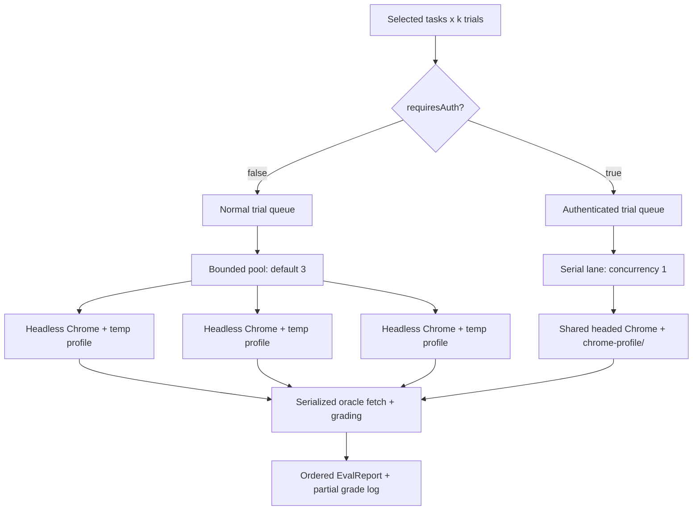

# Parallel Headless Evals — Implementation Plan

**Status:** Planned

**Branch:** `feat/parallel-headless-evals`

**Date:** 2026-08-12

## Decisions

- Apply the behavior to both the standalone eval CLI and Sherlock's `/evals` flow.
- Add optional `requiresAuth: true` metadata to `task.json`; missing means `false`.
- Initially mark only `elon_tweets` as authenticated. Keep `mit_sororities` and
  `airbnb_lake_tahoe` in the normal headless lane.
- Default normal-eval concurrency to 3 and expose it as `--concurrency` in the CLI.
- Normal trials run in separate headless Chrome processes with separate temporary profiles.
- Authenticated trials run sequentially through one headed Chrome session using the existing
  persistent `chrome-profile/` identity. The authenticated lane may run alongside normal trials.
- Keep interactive, non-eval Sherlock runs on the existing persistent headed profile.

## Goals

1. Parallelize independent normal eval trials without sharing pages, contexts, cookies, profiles,
   or browser processes.
2. Keep ordinary eval execution in the background so Chrome does not steal focus or rearrange
   desktop windows.
3. Preserve the logged-in identity and visible human-takeover path for authenticated tasks.
4. Share scheduling and reporting semantics between the CLI and TUI rather than implementing two
   subtly different parallel runners.
5. Preserve deterministic report ordering, run-directory provenance, prompt caching, grader
   isolation, and the current fail-fast contract.

## Non-goals

- Automating login, MFA, credential entry, or explicit pause/resume handoff.
- Cloning authenticated state into parallel headless profiles.
- Running more than one authenticated trial at a time.
- Changing the agent loop, tool schemas, prompt, graders, or run-directory contract.
- Re-baselining eval tasks as part of this change.

## Target execution model



`--concurrency 3` limits only the normal/headless pool. A mixed batch can therefore have three
headless trials plus one authenticated trial active. Jobs may finish in any order, but the final
report remains in requested task order and ascending trial order.

Oracle fetches and grading should use a separate one-slot queue. Browser/model work remains
parallel while live API calls stay serialized, avoiding a new burst of oracle requests and
retaining the rule that each trial fetches fresh ground truth at grading time.

## Step 1 — Add explicit authentication metadata and concurrency configuration

**Files**

- `evals/types.ts`
- `evals/runners/loadTask.ts`
- `evals/runners/loadTask.test.ts`
- `evals/datasets/elon_tweets/task.json`
- `evals/config.ts`
- `evals/runners/cliArgs.ts`
- `evals/runners/cliArgs.test.ts`

**Changes**

- Add a required, normalized `requiresAuth: boolean` property to the loaded `EvalTask` type.
- Accept only a boolean `requiresAuth` field in `task.json`; default it to `false` when absent.
  Reject strings and other truthy values rather than coercing them.
- Set `requiresAuth: true` only on `elon_tweets`. Leave `mit_sororities` and
  `airbnb_lake_tahoe` unmarked so they default to `false`. Do not branch on task names anywhere in
  runtime code.
- Add `DEFAULT_EVAL_CONCURRENCY = 3` to eval config.
- Parse `--concurrency <positive integer>` in both `--flag value` and `--flag=value` forms.
- Include concurrency in `EvalCliArgs`, usage errors, and tests.

**Verification**

- Loader tests cover omitted/false/true metadata and malformed values.
- CLI parser tests cover the default, explicit values, zero, fractions, non-numbers, and missing
  values.
- A repository search confirms the authenticated policy is driven only by metadata.

## Step 2 — Introduce eval-owned browser lifecycle helpers

**Files**

- New `evals/runners/browserRuntime.ts`
- New `evals/runners/browserRuntime.test.ts`
- `evals/config.ts`
- Possibly `src/browser/playwrightBrowserController.ts` only for naming/documentation cleanup;
  no controller behavior change should be needed.

**Changes**

- Add a normal-trial helper that, for every invocation:
  1. creates an absolute temporary directory with `mkdtemp` under `node:os.tmpdir()`;
  2. launches `LocalChromeBrowserSessionProvider` with that directory and `headless: true`;
  3. runs exactly one trial;
  4. closes the browser in `finally`; and
  5. recursively removes the temporary profile only after Chrome has closed.
- Never reuse a normal trial's browser or profile, even when a worker immediately takes another
  job. This is what guarantees separate Chrome instances and clean state.
- Add a lazy authenticated-session owner that launches the existing absolute `chrome-profile/`
  with `headless: false` on the first authenticated job, reuses it for the serial authenticated
  lane, and closes it when the eval batch ends.
- If a batch contains no authenticated tasks, never open the persistent headed browser.
- Make close/cleanup idempotent and cover launch failures as well as trial failures. A failed
  temporary-profile removal should produce a warning with the exact temp path but must not hide
  the original trial error.
- Keep the persistent profile untouched on teardown; only temporary profiles are deleted.

**Verification**

- Inject fake providers/filesystem operations to prove one normal job creates one provider and one
  unique profile, passes `headless: true`, closes before removal, and cleans up after failure.
- Prove authenticated jobs reuse one `headless: false` session and its profile is never removed.
- Add one integration test with local Chrome, if it is reliable in the existing browser-suite
  lifecycle, that runs two simultaneous fixture jobs and observes distinct sessions/profile paths.

## Step 3 — Make the shared eval runner concurrent and deterministic

**Files**

- `evals/runners/runner.ts`
- `evals/runners/runner.test.ts`
- `evals/types.ts`
- `evals/metrics/metrics.ts` if report construction needs a small extraction
- `evals/runners/regrade.ts`

**Changes**

- Represent every trial as an indexed job containing task index, task name, trial index, `k`,
  `startUrl`, and `requiresAuth`.
- Extend the injected eval run function's options with this job context so composition roots can
  choose a browser and label progress without inspecting task text.
- Split jobs into two stable queues:
  - normal jobs execute through a bounded FIFO worker pool of `concurrency`;
  - authenticated jobs execute FIFO through a one-worker lane.
- Start both lanes together. Route completed run directories through a separate one-slot grading
  queue, where each job calls its own `fetchOracle()` and `grade(runDir, oracleData)`.
- Store grades into preallocated task/trial slots. Build `TaskReport[]` only after all work settles,
  preserving input ordering regardless of completion order.
- Add lifecycle hooks with full job identity: trial started, trial run finished, and trial graded.
  Keep partial-grade persistence attached to the graded hook; JSONL completion order is allowed to
  vary, while every record contains task name and trial index.
- Add optional cancellation/stop scheduling support for the TUI. Once cancelled or after the first
  fatal error, do not dequeue new jobs. Await/cancel already-active jobs and browser cleanup before
  returning or rethrowing.
- Retain current behavior for malformed graders: zero assertions is fatal. Retain fail-fast batch
  semantics rather than silently converting infrastructure errors into failed assertions.
- Update `regrade.ts` for indexed/concurrent calls. Prefer an explicit `(task, trial) -> runDir`
  lookup over its current order-dependent `queue.shift()` implementation. Regrade may explicitly
  request concurrency 1 to avoid changing its behavior.
- Record concurrency in `EvalReport` and its human-readable header so experiments remain
  reproducible.

**Verification**

- Use deferred fake trials to assert the normal pool never exceeds 3 active jobs.
- Assert authenticated concurrency never exceeds 1 while a normal job can overlap it.
- Assert four maximum active runs are possible in a mixed default batch: 3 normal + 1 auth.
- Force reverse completion order and verify final task/trial order remains stable.
- Assert grading concurrency is 1 and can overlap ongoing browser work.
- Assert the first fatal failure stops new jobs and waits for active cleanup.
- Assert cancellation stops new jobs and invokes cancellation for every active TUI-backed run.
- Keep the existing grader-isolation test proving only run directory and oracle data reach graders.

## Step 4 — Wire the standalone CLI to the browser policy

**Files**

- `evals/runners/cli.ts`
- `evals/runners/report.ts`
- `evals/runners/report.test.ts`
- A new small progress formatter/test if needed
- `README.md`

**Changes**

- Remove the CLI's eager, session-long browser launch.
- Create the eval browser runtime after task loading, pass the parsed concurrency to `runEvals`, and
  close the runtime in `finally`.
- For normal jobs, run `runTask` inside the per-trial headless helper. For authenticated jobs, run
  it through the lazy shared headed session.
- Replace unlabeled interleaved streaming output with job-labeled progress. Do not write raw
  `text_delta` fragments from several trials into the same terminal stream; show concise lines for
  trial start, turn/tool activity, completion, and grading using `[task trial/k]` prefixes. Full
  detail remains in each run's transcript and tracing.
- Preserve crash-insurance JSONL. Concurrent callbacks must write complete single records and the
  partial file must remain on cancellation/failure, then be removed only after the final results
  JSON is safely written.
- Print the two browser policies and effective concurrency at startup so a headed authenticated
  launch is never surprising.
- When the persistent profile is already locked by another Chrome/TUI process, surface a concise
  authenticated-lane error explaining that `chrome-profile/` can only have one owner. Normal
  headless trials should not use or lock that profile.

**Verification**

- Composition tests prove normal jobs receive unique headless sessions and authenticated jobs
  receive the shared headed controller.
- A CLI smoke run with the hermetic stub/fixture path verifies concurrency without spending model
  tokens.
- Manually run one normal eval and confirm no visible Chrome window appears.
- Do not run a real dataset re-baseline without explicit user direction.

## Step 5 — Give Sherlock `/evals` a parallel, eval-specific runtime

**Files**

- `src/tui/bridge/evalSession.ts`
- New `src/tui/bridge/evalRuntime.ts` (or equivalent focused module)
- `src/tui/bridge/runtime.ts`
- `src/tui/main.tsx`
- `src/tui/components/App.tsx`
- `src/tui/components/EvalsMenu.tsx`
- New `src/tui/components/EvalsLiveRegion.tsx` if the progress display warrants it
- `src/tui/store/state.ts`
- `src/tui/store/reducer.ts`
- `tests/tui/eval-session.test.ts`
- `tests/tui/browser-lifecycle.test.ts`
- Relevant Ink snapshot/component tests

**Changes**

- Replace `evalSession.ts`'s duplicated sequential grading loop with the shared `runEvals`
  scheduler and hooks from Step 3.
- Add an eval-specific runtime:
  - normal trials create their own temporary headless session and call the existing `startRun`
    bridge;
  - authenticated trials call `startRun` with the persistent headed controller owned by the TUI
    runtime;
  - all active `RunHandle`s are tracked so Esc cancels every concurrent trial and prevents new
    jobs from starting.
- Make the TUI's persistent headed browser lazy. Opening Sherlock and running only normal evals
  must not launch a visible Chrome window. The first interactive task or authenticated eval lazily
  opens `chrome-profile/`; later authenticated/interactive work reuses it.
- Do not dispatch concurrent runs' raw `UiEvent` streams into the existing single `live` state.
  Instead, map each stream to keyed eval progress events carrying task/trial identity and compact
  status (running, turn, latest tool/activity, grading, finished).
- Add keyed `evalsLive` state and render a small multi-trial live region. Completed trial assertion
  blocks remain append-only transcript items; streamed prose remains in run transcripts rather
  than being interleaved onscreen.
- Extend the `/evals` menu with a normal-concurrency prompt defaulting to 3 after the existing `k`
  prompt. Display authenticated tasks with a simple marker so users understand which selections
  can open headed Chrome.
- Update the batch notice and cancellation copy to report `concurrency=3`, active trial count, and
  the fact that cancellation applies to all active trials.
- Preserve the rule that the composer is disabled while an eval batch owns the UI.

**Verification**

- TUI bridge tests prove three normal handles can be active, authenticated handles serialize, and
  mixed lanes overlap.
- Reducer tests interleave events from multiple trial IDs and prove their state never overwrites
  another trial.
- Esc tests prove every active handle receives `cancel()` exactly once, no queued jobs start, no
  report is written, and all temporary browsers close.
- Browser lifecycle tests prove a normal-only `/evals` batch never creates the persistent headed
  session, while the first auth trial creates it once and subsequent auth trials reuse it.
- Menu tests cover concurrency editing/default/validation and authenticated markers.

## Step 6 — Documentation, full verification, and scoped commits

**Files**

- `README.md`
- `AGENTS.md`
- Relevant `.agents/summary/` pages if the implementation workflow calls for refreshing generated
  summaries
- This plan's checklist/status

**Changes**

- Document CLI syntax:

  ```sh
  npm run evals -- --tasks hacker_news,edgar --k 3 --concurrency 3
  ```

- Explain task metadata and the two browser policies, including the one-owner limitation of the
  persistent authenticated profile.
- Update stale documentation that says all evals share one visible persistent browser or run
  sequentially.
- Keep interactive agent behavior documented separately from eval behavior.

**Verification sequence**

1. Focused loader/CLI parser/runner/browser-runtime unit tests.
2. Focused TUI bridge, reducer, lifecycle, and component tests.
3. `npm run typecheck`.
4. `npm test` with local Chrome installed.
5. Hermetic or stub parallel smoke test, confirming temporary directories are gone afterward.
6. Manual normal eval observation: no visible browser window or focus movement.
7. Manual authenticated smoke test only when the user is ready: one headed persistent window,
   serial auth trials, and human interaction remains possible.

Create scoped commits after each verified step and include the corresponding plan/checklist update.
Never stage the unrelated untracked `.agents/planning/2026-08-11-browser-runtime-auth/` directory
unless the user separately asks for it.

## Done criteria

- Default CLI and TUI eval concurrency is 3 for normal tasks.
- Three simultaneous normal trials use three headless Chrome processes and three distinct temporary
  profiles, all removed after their trials.
- Authenticated trials use `chrome-profile/`, are headed, and never overlap one another.
- Normal and authenticated lanes can overlap without sharing a controller or profile.
- Normal-only CLI and TUI evals launch no headed browser.
- Reports and partial records identify every trial correctly and final output ordering is stable.
- Cancellation/failure leaves no temporary Chrome process/profile behind.
- All tests and typechecking pass, documentation matches behavior, and no re-baseline was run.
