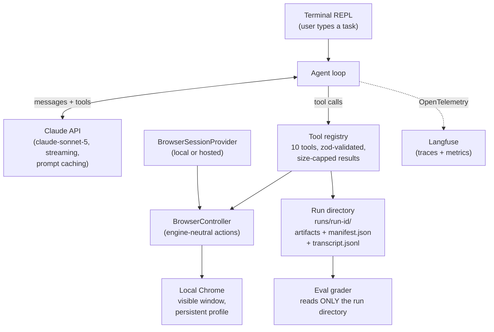
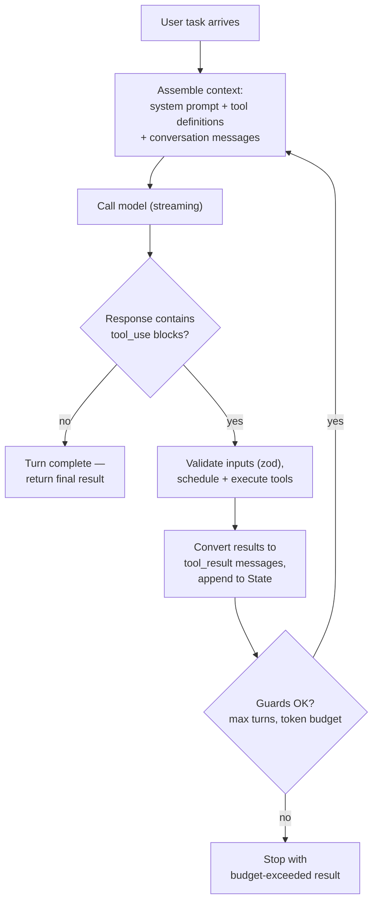
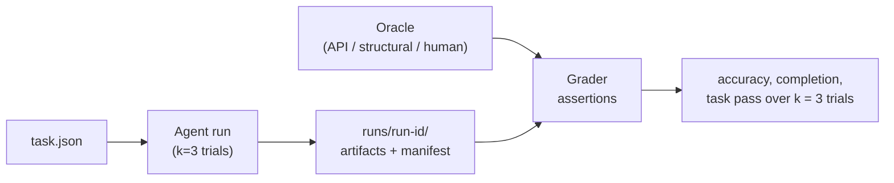

# Evidence Collection Agent — Detailed Design (Checkpoint 1)

This document is self-contained: the problem, the design, and the reasoning behind every non-obvious choice. Someone who has read nothing else about this project should be able to build the system from it — and revise it safely, because the *why* is recorded alongside the *what*.

**Scope: this is the design for checkpoint 1** — the initial, minimal version of the agent. Everything in this document is being built now.

---

## Problem Definition

### Problem

In audit and compliance engagements, auditors often must collect their own evidence directly from a client's systems. They may receive read-only access to tools such as Workday, GitHub, NetSuite, or Jira/Linear.

Evidence collection is frequently manual: auditors open links, take screenshots, record fields into spreadsheets, and download supporting artifacts.

### Need

A way to automate the evidence collection process.

---


## Solution

A **general browser agent**: a program that takes a task written in plain English ("Create a CSV of the top 5 stories on Hacker News"), drives a real web browser to carry it out, and produces evidence artifacts — CSVs, screenshots, downloaded files, and/or a natural-language answer.

"Agent" here means a loop: a large language model (LLM) repeatedly decides the next action, a small set of tools executes each action, and the results feed back to the model until the task is done. The model does the thinking; the surrounding code (the **harness**) supplies its eyes, hands, memory, and guardrails.

### Functional requirements

- Take in a user message stating the task
- Collect evidence from many systems via the browser
- Output a CSV, screenshot, downloaded file, and/or natural language


### Constraints, in priority order

These come from the project brief and are ranked — when two goals conflict, the higher one wins:

1. **Accuracy** — how well the agent does each task
2. **Generability** — how many different tasks it can do well
3. **Scalability** — to thousands of samples
4. **Consistency** — between repeated runs of the same task
5. **Speed** — wall-clock time to complete a task


### The evaluation tasks

The agent is evaluated on eleven visible tasks plus a **hidden eval set** (tasks we never see). The visible tasks:


| #   | Task                                                                                                                 | Start                              | Difficulty |
| --- | -------------------------------------------------------------------------------------------------------------------- | ---------------------------------- | ---------- |
| 1   | CSV of the top 5 Hacker News stories: title, URL, points                                                             | blank tab                          | Easy       |
| 2   | Find and download Apple's Jan 29, 2026 8-K report on EDGAR; screenshot the page                                      | blank tab                          | Easy       |
| 3   | What's the most recent PR on OpenClaw? What does it do?                                                              | blank tab                          | Easy       |
| 4   | Screenshot the Notion, Figma, and 8Sleep websites + their most recent press/blog content                             | blank tab                          | Medium     |
| 5   | Pick 5 AI-focused YC W24 companies; CSV of founders, LinkedIn URLs, cold outreach email                              | ycombinator.com/companies          | Medium     |
| 6   | Last 10 merged OpenClaw PRs: full-page screenshot of each + CSV of PR #, committer, reviewer, merger                 | github.com/openclaw/openclaw       | Medium     |
| 7   | CSV of all of Elon's tweets today: text, likes, time posted                                                          | x.com/home                         | Medium     |
| 8   | Top 30 OpenClaw contributors: CSV of GitHub handle, name, LinkedIn URL                                               | github.com/openclaw/openclaw       | Medium     |
| 9   | Find reference #275 on the Wikipedia WWII page; return the full text of its highlighted source                       | en.wikipedia.org/wiki/World_War_II | Hard       |
| 10  | Airbnb: 30 suggested Lake Tahoe listings for a one-week stay next week; list + summary                               | airbnb.com                         | Hard       |
| 11  | Six MIT sororities: find each website via Google, find the sisters page, extract seniors/juniors into a Google Sheet | google.com                         | Hard       |


The hidden set is a design forcing-function: it rewards **general mechanisms** and punishes per-task tuning. This shapes a standing rule, below.

---


## Design Philosophy


### Minimal first, then harness engineering

The build order is deliberate: get a minimal single-agent loop working end-to-end, baseline it against the easy tasks, and only then invest in harness improvements — driven by observed failures, not anticipated ones.

**Why not architect for the known future needs (parallelism, sub-agents, queues) up front?**

1. A working baseline beats a grander design on paper. Until something runs, every architectural bet is unvalidated.
2. The features most likely to move accuracy (better page representation, better tool results) only reveal themselves through real failures. Speculative infrastructure spends the budget where it earns the least.
3. Deferred features aren't forgotten — each carries a **named revival trigger**: a concrete observation that reactivates it. Deferral with a trigger is a decision, not an omission.


### Why hand-roll the agent loop instead of adopting an existing one

Three ready-made options were seriously considered and rejected:

- **Browser Use** (open-source browser-agent framework). It *is* the agent loop — give it a task and an LLM and it observes, decides, and acts. Adopting it means outsourcing exactly the thing this project is evaluated on. Its prompt assembly is internal, so we'd lose control of prompt caching (a major cost lever, explained later), and guardrails and evidence policy would be bolted on from outside, blind.
- **Stagehand** (Browserbase's AI-action library — `act("click the login button")`). Its action caching is attractive for repeated tasks, but as an orchestrator it has the same loop-ownership problem. And LLM-chosen actions in the main path hurt run-to-run consistency (priority #4).
- **Claude Code's tools / the Claude Agent SDK.** Rather than adopting the SDK wholesale, we borrow five specific *mechanisms* from how Claude Code works (detailed in the loop section) and reimplement its file tools minimally. Borrowing the mechanisms gets the engineering value; owning the code keeps the loop inspectable, testable, and ours to grade.


### The no-overfitting rule

**No task-specific logic anywhere, ever.**

When an eval fails, the fix must be a general mechanism — a better page outline, a better tool result format, a better prompt — never `if (task === "hacker news")`. The visible evals are treated as a *test set* for general capability.

**Why:** the hidden eval set makes per-task tuning worthless, and the product being designed is a general auditor's tool, not eleven scripts.

---


## System Overview




The language is **TypeScript**. Every load-bearing piece already assumes it: Playwright is TypeScript-native, the Claude Code mechanisms being borrowed come from a TypeScript codebase, and the terminal-agent product shape matches the Node ecosystem.

A second reason is **zod**, a TypeScript schema-validation library. Each tool's input schema is written once as a zod schema, which both:

- validates arguments at runtime (a guardrail), and
- converts to the JSON Schema format the Claude API requires in tool definitions.

One definition, two jobs.

---


## Core Agent Loop

The loop is Claude Code–style: assemble context, ask the model, execute any requested tools, feed results back, repeat.




### State and dependency injection

The loop's memory is a single mutable `State` object:

```
State {
  messages: Message[],   // full conversation: user, assistant, tool results
  turnCount: number,
}
```

The loop never calls the Anthropic client or any I/O directly. All external effects go through a `deps` bundle (`deps.callModel`, etc.) passed in at construction.

**Why:** the loop becomes testable with fake dependencies — a scripted `callModel` exercises every branch without spending tokens — and configuration (which model, which browser) lives in one place.

### Five mechanisms borrowed from Claude Code

Extracted from research into how Claude Code's harness actually works. Each is adopted because it solves a problem this agent verifiably has:

**1. Bounded tool results with artifact offloading.**
Every tool declares a maximum result size. If output exceeds it, the full output is written to a file in the run directory and the model receives a short preview plus the file path; it can then read the file selectively.

- **Why:** a single unbounded tool result (a big page, a long file) can flood the context window — the model's finite working memory — destroying both accuracy and cost. Bounding results makes context growth predictable.

**2. Append-only JSONL transcript.**
Every event in a run — each model request/response, each tool call and result — is appended as one JSON object per line to `transcript.jsonl` (JSONL = "JSON Lines," a format that's trivially appendable and streamable).

- **Why:** it's the durable, replayable record of what the agent did — simultaneously the audit-provenance story and the primary debugging tool when a run fails.

**3. Stable prompt prefix.**
The system prompt and tool definitions are byte-identical on every model call, within and across turns; only the conversation messages grow.

- **Why:** the Claude API's prompt caching only pays off when the leading portion of the prompt is unchanged between calls. A prefix that shifts even slightly breaks caching on every call.

**4. Completion as policy, not mechanism.**
The model signals it is done simply by responding without any tool calls — there is no special "finish" tool. Backstops: a maximum turn count and a token budget, both ending the run with an explicit budget-exceeded result rather than an infinite loop.

- **Important detail:** the API returns a `stop_reason` label on every response — the loop deliberately does **not** trust it. Whether the turn continues is decided by inspecting the response *content* for `tool_use` blocks.
- **Why:** the content is the ground truth. Deciding from a metadata label means a mislabeled or truncated response silently ends — or wrongly extends — a run.

**5. Parallel read-only tools, serialized writes.**
When the model requests several tools in one turn, the harness sorts them before executing:

- **Read-only tools** (e.g. `inspect_page`, `read_file`, `grep`) — safe to run **in parallel**, capped at **5 concurrent**.
- **Anything that changes state** (clicks, typing, scrolling, navigation, file writes, downloads) — runs **one at a time, in the order requested**.
- **Why:** parallel reads buy speed (priority #5) with zero correctness risk, while state-changing actions are order-sensitive — `click` then `type` is not the same as the reverse. The cap of 5 keeps a burst of requests from spiking resource use.

---


## Model Strategy

**Default model:** `claude-sonnet-5`**.**

- **Why:** Andera runs a Sonnet-tier model in production, so building and evaluating against Sonnet matches the deployment reality — an agent tuned on a bigger model can silently depend on capabilities the production model lacks.
- Pricing at decision time: $3/M input, $15/M output tokens (introductory $2/$10 through 2026-08-31).
- The model name is a config value in `deps`, so comparing against Opus is a one-line experiment, not a refactor.

**Prompt caching from day one.**

- Prompt caching is an Anthropic API feature: mark a stable portion of the prompt with `cache_control` breakpoints, and repeated calls reuse the cached computation — cached tokens cost ~10% of the normal input price. Docs: [https://docs.claude.com/en/docs/build-with-claude/prompt-caching](https://docs.claude.com/en/docs/build-with-claude/prompt-caching).
- An agent loop is the ideal caching customer: every turn resends the entire growing conversation, so the system prompt + tool definitions (the stable prefix above) are re-read on every single call.
- Verification is explicit: traces must show `cache_read_input_tokens > 0` on loop iterations. If not, the prefix is unstable and it's a bug.

**Streaming always.**

- Responses are consumed as a stream rather than waiting for completion.
- **Why:** long tool-filled turns can run for minutes; streaming avoids API timeouts and lets the terminal interface show live progress.

Thinking and effort settings stay at API defaults. Spend policy: be sensible; no budget-enforcement mechanism.

---


## The Browser Layer

**Decision: Playwright driving normal, local Chrome — visible window, persistent profile — behind an engine-neutral `BrowserController`, with session acquisition behind `BrowserSessionProvider`.**

### Playwright

Playwright ([https://playwright.dev](https://playwright.dev)) is Microsoft's open-source browser-automation library and the de facto standard. Each browser tool becomes roughly one library call (`page.click(...)`, `page.screenshot(...)`).

Crucially, the same Playwright code later points at almost everything else in this space — stealth browser builds expose the same API, and hosted browser clouds (Browserbase, Browserless, Steel) accept a Playwright connection. Nothing is locked in.

### Real Chrome, visible window, persistent profile

A **persistent profile** is a browser profile whose cookies and logins survive restarts. Running real, visible Chrome with one is — counterintuitively — the *best available anti-bot posture*, better than paid stealth products, for free.

- Bot detection scores a combination of four signals: browser fingerprint, IP reputation, behavior, and session history.
- Real Chrome + a real logged-in profile + a residential home IP scores well on all four. A datacenter stealth browser starts from a worse position on at least two.
- The one configuration to avoid is **headless** mode (browser without a visible window) — it is the most detectable configuration of all.
- This matters directly: three eval targets actively resist bots (X, Airbnb, Google Search).


### The controller, session provider, and escalation path

`BrowserController` is the thin interface our tools call instead of calling Playwright directly. `BrowserSessionProvider` creates those controllers without exposing whether the session is local or hosted. **Why:** browser actions remain stable while session hosting can move from local Chrome to Browserbase without touching the loop, tools, or `runTask`.

If a site blocks us, escalation happens one step at a time — *only on an observed block, never preemptively*:

1. **Patchright** — a community-patched Chromium that hides automation markers; drop-in for Playwright.
2. **Camoufox** — a Firefox fork with engine-level fingerprint spoofing, with its randomized fingerprint pinned (randomization would hurt consistency, priority #4).
3. **Paid stealth services** — last resort.

To make those calls with data instead of guesses, a `BrowserbaseBrowserSessionProvider` (hosted browsers; an API key and one connect call) can be added alongside `LocalChromeBrowserSessionProvider`, so block rates can be measured locally vs. hosted while both return the same controller contract.

### Browser state between runs

- Chrome launches **once per session** with the persistent profile, so logins stay warm.
- Each task run opens a **fresh tab** and closes it on completion — page-level state can't leak between trials.
- Known, accepted limitation: tabs share cookies and localStorage through the profile (e.g., Airbnb's "recently viewed" accumulates across runs). Accepted because it mirrors exactly how a real auditor's browser behaves, and session history supports the detection posture.
- Consequence for the eval harness: **assertions must never depend on cookie-derived state.**

---


## What the Model Sees: Page Representation

The model never receives raw HTML. A modern page's HTML is hundreds of kilobytes of framework noise — it would blow out the context window (cost, accuracy) while burying the signal.

### The semantic outline

The `inspect_page` tool returns a **compact semantic outline** distilled from the browser's **accessibility tree** — the simplified structural view browsers already maintain for screen readers: roles ("button", "link", "heading"), names, and text, with styling and script noise already stripped. The v1 implementation is Playwright's built-in ARIA snapshot ([https://playwright.dev/docs/aria-snapshots](https://playwright.dev/docs/aria-snapshots)).

The outline contains:

- Interactive elements (links, buttons, inputs), each tagged with a **stable ref ID**
- Headings and visible text content


### Acting by ref, not coordinates

`click` and `type` take those **element refs — not screen coordinates and not CSS selectors**.

**Why:** refs make actions deterministic and readable in the transcript ("clicked `ref=42`, the 'Download' button"). Coordinate-clicking is brittle to layout shifts; selector-writing demands the raw HTML we've excluded.

### Scrolling and lazy-loaded pages

The outline is built from the whole DOM, including content below the fold — so `scroll` is never needed just to *read* a long, fully-loaded page.

But infinite-scroll pages (the X feed, Airbnb's listing grid) only create their content when scrolling triggers it to load. The working patterns:

- `scroll` → `inspect_page` — a fresh outline (with fresh refs) that now includes the newly loaded content
- `scroll` → `screenshot` — capture a specific region as it appears in the viewport

### Screenshots stay separate

`screenshot` is its own on-demand tool rather than part of every observation:

- The model needs it for **visual verification** — is the right thing on screen?
- Screenshots are themselves the **evidence deliverable** in several tasks.
- But images are token-expensive, so they're taken when needed, not by default.

If page source is ever genuinely needed, it goes to disk via the offloading mechanism and the model reads it selectively with `read_file`/`grep`.

**Known risk, stated up front:** outline quality is the single most likely failure source — if the distilled view omits or mislabels what the model needs, every downstream action fails. Per the no-overfitting rule, outline improvements are the *first* general mechanism to reach for when evals fail.

---


## Tool Registry


### The ten tools


| Tool           | What it does                                         | Notes                          |
| -------------- | ---------------------------------------------------- | ------------------------------ |
| `navigate`     | Go to a URL                                          |                                |
| `inspect_page` | Return the compact semantic outline                  | The default observation        |
| `click`        | Click an element by ref                              | Refs from `inspect_page`       |
| `type`         | Type text into an element by ref                     |                                |
| `scroll`       | Scroll the page (roughly a viewport-height per call) | Triggers lazy-loaded content   |
| `screenshot`   | Capture the page (or full page) as an image artifact | Also an evidence deliverable   |
| `download`     | Download a file the page offers                      | e.g., the EDGAR 8-K            |
| `read_file`    | Read a file from the run directory                   | Claude Code–shaped             |
| `write_file`   | Write a file (CSVs, notes) into the run directory    | Routes through `writeArtifact` |
| `grep`         | Search file contents in the run directory            | Claude Code–shaped             |


Every visible eval task is expressible with these ten.

**Why `scroll` earns a slot:**

- Several eval targets **lazy-load**: the X feed, Airbnb's listing grid, and YC's company list only create content in the DOM when scrolling triggers it. No other tool can cause that content to load — without `scroll`, `inspect_page` can never see it, and those tasks are structurally impossible.
- It is *not* needed for actions: Playwright auto-scrolls an element into view before `click`/`type` on a ref. Scroll exists for loading content and framing viewport screenshots.
- It is **state-changing** (viewport position, network loads), so the scheduler always serializes it — never in the parallel read batch.

The file tools borrow Claude Code's *shapes* — names, schema style, result conventions — but are minimal reimplementations over Node APIs, wrapped in the same size-cap layer as everything else.

**Why borrow the shapes:** the model has seen these exact tool contracts during training; familiar tools get used correctly more often.

### There is deliberately no `bash` tool

The rough design included one; it was removed.

- **Why:** bash would be the only *unbounded* tool — arbitrary shell execution driven by model output, where the model's input includes untrusted web pages. That combination turns **prompt injection** (a malicious page embedding instructions the model might follow) into arbitrary code execution on the host.
- Dropping it also strengthens the audit-security story: "this agent cannot execute arbitrary commands" is a sentence a compliance reviewer wants to hear.


### Per-tool execution pipeline

Every tool call flows through the same checklist:

1. Confirm the tool exists
2. Validate the input against its zod schema (malformed input → structured error back to the model, not a crash)
3. Do the work
4. Normalize the output to a standard model-readable format
5. Enforce the result size limit (oversize → write to disk, return preview + path)
6. Return the tool result

When a single model response requests multiple tools, the read-only/state-changing scheduling from the loop section applies: reads in parallel (max 5), writes serialized in request order.

Additional confinement: all file paths are validated to stay inside the current run directory — tools cannot read or write elsewhere on the machine.

---


## Evidence Outputs and Provenance

Every task run gets its own directory:

```
runs/<run-id>/
  ├── <deliverables>        # CSVs, screenshots, downloads the task asked for
  ├── transcript.jsonl      # append-only record of every loop event
  ├── manifest.json         # auto-generated provenance index (below)
  └── metrics.json          # tokens, turns, latency for the run
```


### The manifest

`manifest.json` is the machine-readable "chain of custody" for the run's evidence. It records:

- The task text and run start/end timestamps
- For every artifact: filename, **SHA-256 hash**, source URL, capture time

A SHA-256 hash is a cryptographic fingerprint: a short string computed from a file's exact bytes, where any change to the file produces a completely different string.

Recording it at capture time makes the evidence **tamper-evident** — anyone can later re-hash the file and confirm it hasn't been altered since collection. For an audit product, that's the difference between "here's a screenshot" and "here's a screenshot, provably unmodified, from this URL, at this time."

### Invisible plumbing

The manifest is written by a `writeArtifact` helper that every file-producing tool (`write_file`, `screenshot`, `download`) routes through. The model never sees or manages the manifest — no prompt burden, no way to forget.

**Why this matters twice:** the manifest is simultaneously

- (a) the provenance story for the audit context, and
- (b) the **assertion surface for the eval harness** — graders check existence, row counts, and hash stability against the manifest rather than groping around the filesystem.

---


## Interface and Authentication


### Interface: an interactive terminal agent

The product interface is a **terminal-based agent in the style of Claude Code**: a persistent shell session where typing a task triggers the agent loop directly, progress streams back live (turns, tool calls, artifacts as they're produced), and the session stays open for follow-up tasks.

Scope guard, explicit: the interface is *not* the most important part of this project.

- The v1 implementation is a thin REPL — read a task, stream loop progress, print the run directory path, prompt again.
- No TUI framework, no slash commands, no fancy rendering.
- The interactive-terminal *product vision* is specified here so the thin implementation is understood as a deliberate slice of it, not the end state.


### Authentication and accounts

Per site that needs (or might need) a session:

- **X (task 7 — Elon's tweets):** a **burner account**, created for this purpose. Automation can get X accounts flagged; the account must be disposable.
- **Google (task 11 — writing the sorority Google Sheet):** a **fresh Google account**, created for this purpose — it owns the output spreadsheet. Setup note: brand-new Google accounts can hit extra verification friction on first scripted use, so the account gets used manually for a bit before the agent touches it.
- **LinkedIn (tasks 5 and 8 — profile URLs):** **stay logged out.** The tasks only require *finding public profile URLs*, so "URL findable without login" becomes the assertion. Logging in would add account risk for no required capability.

Both new accounts are logged into the agent's persistent Chrome profile **once, manually, by the human operator**. The sessions then ride along in the profile.

The agent never sees, stores, or types credentials — **credential entry is a human act; the agent only ever uses already-established sessions.** This is the auth story for the audit context too: an auditor grants the agent a session the same way they'd grant a colleague a logged-in workstation, and revocation is just logging out of the profile.

---


## Tracing

**Decision: Langfuse ([https://langfuse.com](https://langfuse.com)), cloud free tier, from day one.**

Two requirements drove this:

- **Traces, not just metrics.** Improving an agent harness requires seeing full runs — every prompt, response, and tool call laid out — because "which turn went wrong, and what did the model see when it did?" is the core debugging question. Metrics alone can't answer it.
- **From day one**, because the baseline runs are exactly the ones that teach the most.


### Why Langfuse over Braintrust

Braintrust (the rough design's original choice) and Langfuse meter their free tiers on opposite dimensions, and this workload lands on the wrong side of one of them:

- Braintrust's free tier caps at **1 GB of processed bytes**; Langfuse's Hobby tier caps at **50,000 event units per month**.
- Browser-agent traces are *byte-heavy but event-light*: the full conversation — page outlines included — is re-logged on every turn, so one run logs roughly 1–3 MB but only ~25–50 events.
- Over an estimated 300–500 dev and eval runs: plausibly 0.5–1.5 GB — enough to exhaust Braintrust's cap mid-project — but only about half of Langfuse's unit budget.
- The cost of choosing Langfuse: a more involved setup (~1–2 hours: OpenTelemetry-based wiring with `@langfuse/tracing` + `@langfuse/otel` and Anthropic instrumentation at the `deps.callModel` seam, versus Braintrust's one-line client wrap). Accepted as a one-time cost against a mid-project metering wall.


### What's tracked, and the fallback

Tracked per run: input/output tokens (including `cache_read_input_tokens`, to verify caching), tool-result sizes, turn count, tools used, model output, latency.

Fallback position, regardless of platform: the JSONL transcript and `metrics.json` in each run directory are the **durable local record** — tracing going down never loses data. Langfuse is open-source and self-hostable if the cloud tier is ever outgrown.

---


## Evaluation Harness


### How accuracy is quantified

Each task is decomposed into a set of **assertions** — small, individually checkable claims about the output ("a CSV exists", "it has 5 rows", "≥4 of 5 titles match the oracle", "the URL column contains resolvable URLs").

Each task is run **k = 3 trials** (independent full runs). Definitions:


| Metric                     | Definition                                        |
| -------------------------- | ------------------------------------------------- |
| **Accuracy**               | Mean fraction of assertions passed, across trials |
| **Completion** (per trial) | 1 iff *all* assertions pass in that trial         |
| **Task passes**            | All k = 3 trials complete                         |
| **Latency**                | Wall-clock time to complete a trial               |


**Why all 3 trials:** consistency is an explicitly ranked constraint, and an agent that succeeds 1-in-3 times is not a usable audit tool. All trials completing over k = 3 is the *ideal level of consistency being aimed for* — the development done-bar and reporting standard ("11/11 at 3/3"), not a runtime mechanism; the agent itself doesn't run three times per user task.

Fallback if eval runtime becomes a problem on slow tasks: k=2 for expensive tasks, k=3 elsewhere.

**Target: all 11 visible tasks passing** at this bar, achieved only through general mechanisms (the no-overfitting rule).

### Oracles: three tiers

An **oracle** is an independent way of determining the correct answer, against which the agent's output is graded. Not every task admits the same kind, so there are three tiers, assigned per task:

- **Tier A — independent API oracle, queried at grading time.** For targets with public APIs, the grader fetches ground truth *when it grades* — with churn-tolerant assertions (e.g., "≥4 of 5 titles match", because a live leaderboard can shift between run and grade). Applies to: Hacker News (Firebase API), EDGAR (SEC API), GitHub PRs and contributors (REST API), Wikipedia references.
- **Tier B — structural assertions.** Where no ground-truth API exists (X, Airbnb, YC founders, sororities), the grader checks structure and internal consistency: expected columns, plausible row counts, dates inside the required window, URL patterns that actually resolve.
- **Tier C — manual grading.** Screenshot *contents* ("does this show the Figma homepage?") are graded by a human.


### Two standing rules

1. **The grader reads only the run directory** — manifest and artifacts, never the conversation. **Why:** the product's output is the evidence, so the evidence must stand on its own; a grader that reads the transcript can be fooled by an agent that *describes* success without producing it.
2. **A standing human overlay:** independently of automated tiers, runs get watched and manually inspected end-to-end. The automated assertions are the record; human inspection is the sanity check *on the assertions themselves* — it's how we build justified confidence that a passing grade means a genuinely good run.


### Layout

```
evals/
  hacker_news/
    task.json          # { task text, starting url }
    oracle/            # the independent ground-truth source (Tier A/B logic)
    grader/            # assertions comparing run output to oracle
```

### Running evals

The eval runner is one command with two parameters — **which tasks** and **how many trials (k)**. That covers every mode needed:

- **One task, once** (k=1) — the tight inner loop while debugging a failing task.
- **One task, multiple trials** — measuring a single task's consistency (e.g., over k = 3 trials).
- **A subset of tasks over multiple trials** — e.g., the three easy tasks at k=3 for a baseline. The full suite is just the subset containing all eleven.

**Why one parameterized runner instead of separate scripts:** every mode is the same operation at a different scope. A single (tasks, k) pair keeps results comparable — identical run-directory shape, metrics, and grading path no matter how the runner was invoked.

Runs execute **sequentially** in checkpoint 1 — a clean sequential baseline comes first.

### Grading flow




