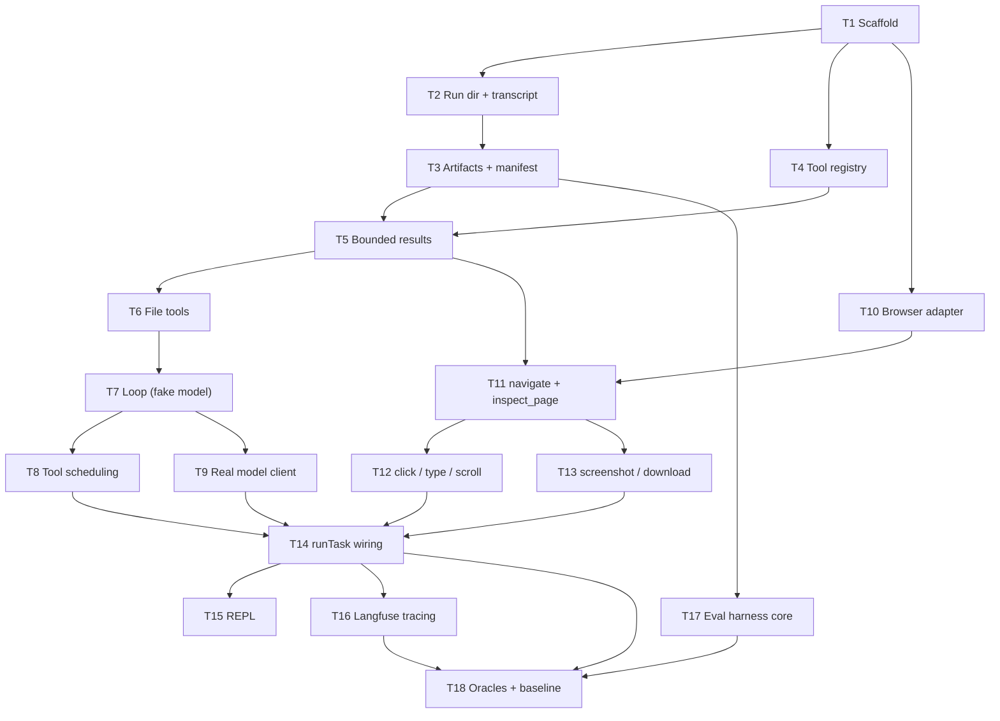

# Implementation Plan

Source design: `../design/detailed-design.md`. Every task below (T1–T18) is test-first, ends with something runnable, and builds on the tasks before it. No task introduces more than one new mechanism.

## Progress checklist

- [x] T1: Project scaffold + spec conventions
- [x] T2: Run directory, path confinement, transcript
- [x] T3: Artifacts and manifest (`writeArtifact`, SHA-256)
- [x] T4: Tool registry + validation pipeline
- [x] T5: Bounded results + artifact offloading
- [x] T6: File tools — `read_file`, `write_file`, `grep`
- [x] T7: Agent loop against a fake model
- [x] T8: Tool scheduling — parallel reads, serialized writes
- [x] T9: Real model client — streaming + prompt caching
- [x] T10: Browser adapter (Playwright, persistent Chrome)
- [x] T11: Observation tools — `navigate`, `inspect_page`
- [x] T12: Action tools — `click`, `type`, `scroll`
- [x] T13: Evidence tools — `screenshot`, `download`
- [x] T14: End-to-end wiring — `runTask` + system prompt
- [x] T15: Terminal REPL
- [x] T16: Langfuse tracing
- [x] T17: Eval harness core (runner, assertions, metrics)
- [x] T18: Easy-task oracles + graders; baseline run (baseline 2026-08-11: 0/3 tasks pass — see baseline-failure-log.md)

## Task graph: parallel vs. sequential

The checklist order T1 → T18 is a valid order for one person working alone (it is a topological sort of this graph). Arrows mean "must be done first":



**Sequential spine (critical path):** T1 → T2 → T3 → T5 → T6 → T7 → T9 → T14 → T16 → T18. Each of these genuinely needs its predecessor; nothing on this path can be reordered.

**Parallel opportunities:**

- **After T1, three tracks open:** the run-dir track (T2 → T3), the registry (T4), and the browser adapter (T10). T10 is deliberately standalone — the whole browser track (T10 → T11 → T12/T13) proceeds independently of the loop/model track (T6 → T7 → T8/T9) until both join at T14. T11 is the browser track's only cross-dependency: it waits on T5 for the size cap.
- **After T7:** T8 (scheduling) ∥ T9 (real model) — neither needs the other.
- **After T11:** T12 (actions) ∥ T13 (evidence) — both consume refs from outlines, neither consumes the other.
- **After T14:** T15 (REPL) ∥ T16 (tracing).
- **T17 can start any time after T3:** the runner takes `runTask` as an injected dependency and its tests and demo use a fake, so it needs only the run-dir/manifest shape and the agreed `runTask` signature — not the real T14.
- **T15 is a leaf:** nothing depends on it; T18 does not need the REPL.

**Join points to plan around:** T5 (registry meets artifacts), T14 (everything wires together), T18 (harness meets the real agent).

## Working references

- **Claude Code source archive:** `~/Desktop/Code/claude-code` (full `src/` tree). The design borrows five harness mechanisms from it — bounded tool results + artifact offloading, append-only JSONL transcript, stable prompt prefix, completion-as-policy, read-only tool parallelism. When an implementation question comes up about how one of these actually behaves (exact size caps, preview formatting, transcript event shapes, tool scheduling), check the source instead of guessing. Reference only — our implementations stay minimal and our own, per the design.

## Conventions (apply to every task)

**Code quality.** All code aims at three properties — easy to understand, safe from bugs, ready for change:

- *Safe from bugs:* fail fast — detect bugs as early as possible (validate at boundaries; throw on a violated assumption rather than limping on with bad state); avoid global variables; avoid magic numbers (name them as constants).
- *Easy to understand:* judicious comments — say what the code can't say for itself; good names; one purpose per variable, never reused for a second job; use whitespace well.
- *Ready for change:* DRY — don't repeat yourself; functions return results instead of printing them, so code adapts to new callers — printing lives only at the edges (CLI, demos), which is also what keeps the loop and tools testable.

**Specs.** Every exported function carries a docstring spec: a short, concise line on what the function does, plus `@param` and `@returns` tags. The pre- and postconditions live *in* those — what a `@param` must be is the precondition, what `@returns` guarantees is the postcondition — not as separate labeled sections. Keep it implementation-agnostic: say what the caller can rely on, never how the function achieves it. The purpose is that a human reading through the code understands each function on sight. Example of the expected shape:

```ts
/**
 * Append one event to the run's transcript.
 *
 * @param runDir - absolute path to an existing, writable run directory
 * @param event  - a JSON-serializable object describing one loop event
 * @returns nothing; the event is appended to <runDir>/transcript.jsonl
 *   as exactly one new line of JSON
 */
```

**Tests.** The test suite is a valid client of the spec: it asserts only what docstrings promise and never reaches into implementation internals — a correct reimplementation of any module must pass the suite unchanged. Keep it small but thorough: each test earns its place by covering something actually likely to break (boundaries, error paths, ordering and concurrency, stability properties). No redundant happy-path variations.

**Test-first.** Per task: write the docstring specs, write the tests as the spec's first client, then implement until green.

**Hermetic suite.** The automated suite never touches the network, the live Claude API, or live websites. Browser tests run against local fixture pages served in-process. Anything requiring a real API key or a live site is a *demo* (a script under `demos/`), not a test.

**Layout.** Colocated `*.test.ts` files with vitest. Proposed source tree, established in T1 and grown in place:

```
src/
  run/       # run directory, transcript, manifest, artifacts
  tools/     # registry, pipeline, file tools, browser tools
  loop/      # agent loop, state, scheduling
  model/     # callModel, prompt assembly
  browser/   # adapter interface, Playwright implementation
  cli/       # runTask entry point, REPL
demos/       # one runnable script per task: NN-name.ts, run with npx tsx
evals/       # eval tasks, oracles, graders, runner (from T17)
tests/fixtures/  # local HTML fixture pages for browser tests
```

---

## T1: Project scaffold + spec conventions

**Objective:** A TypeScript project where `npm test` and `npm run typecheck` pass, containing the first real spec'd function.

**Implementation guidance:**
- `npm init`; TypeScript with `strict: true`; vitest; zod (v4 — its built-in `z.toJSONSchema` is needed in T4); `tsx` for running scripts.
- npm scripts: `test` (vitest run), `typecheck` (tsc --noEmit).
- First real module, `src/run/runId.ts`: `generateRunId()` — returns a lexically sortable, filesystem-safe, unique id (timestamp prefix + random suffix). Write its docstring spec per the conventions; it is the template every later function follows.
- `.gitignore`: `node_modules/`, `runs/`, the Chrome profile dir (T10).

**Test requirements:**
- `generateRunId`: ids are filesystem-safe (no path separators, no spaces), two calls in the same millisecond differ (likely to break: uniqueness under same-timestamp collisions), and ids sort in creation order across distinct timestamps.

**Integration with previous work:** None — first task.

**Demo:** `npm test` and `npm run typecheck` green; `npx tsx demos/01-run-id.ts` prints a few generated ids.

---

## T2: Run directory, path confinement, transcript

**Objective:** The run-directory module: create a run's directory, resolve paths safely inside it, and append events to an append-only JSONL transcript.

**Implementation guidance:** (`src/run/`)
- `createRunDir(baseDir, runId)` → creates `runs/<runId>/`, returns its absolute path.
- `resolveRunPath(runDir, relPath)` → resolves a relative path and **throws (or returns a structured error) if the result escapes the run directory**. This is the single confinement chokepoint the design requires — every later tool that touches a path goes through it.
- `appendTranscriptEvent(runDir, event)` → appends exactly one line of JSON to `transcript.jsonl`. Append-only; no rewrites.
- Check the Claude Code archive for its transcript event shapes before inventing ours; keep ours minimal (a `type` field plus payload is enough at this point).

**Test requirements:**
- Confinement (the security surface, most likely to break): `../escape`, absolute paths, and nested `a/../../b` are all rejected; plain nested paths like `sub/file.csv` are allowed.
- Transcript: after N appends the file has N lines, each parsing back to a deep-equal copy of its event (append-only durability is the property the design leans on).

**Integration with previous work:** Uses `generateRunId` (T1) to name directories.

**Demo:** `npx tsx demos/02-run-dir.ts` creates a run dir, appends three events, prints the transcript with `cat`-style output.

---

## T3: Artifacts and manifest (`writeArtifact`, SHA-256)

**Objective:** The provenance layer: every artifact write records filename, SHA-256, source URL, and capture time in `manifest.json` — invisibly to callers.

**Implementation guidance:** (`src/run/artifacts.ts`)
- `initManifest(runDir, taskText)` → writes a manifest skeleton with task text and start timestamp. `finalizeManifest(runDir)` → stamps the end timestamp.
- `writeArtifact(runDir, relPath, bytes, meta)` where `meta` carries optional `sourceUrl` — writes the file (path via `resolveRunPath`), computes SHA-256 over the exact bytes written, and upserts a manifest entry `{ filename, sha256, sourceUrl, capturedAt }`.
- Upsert, not append: writing the same path twice updates the entry, so the manifest never lists stale hashes.

**Test requirements:**
- Hash correctness against a known vector (e.g., SHA-256 of `"abc"`), and re-hashing the written file matches the recorded hash (tamper-evidence is the whole point — this is what must not break).
- Writing the same path twice yields one manifest entry with the new hash, not two entries.
- Manifest remains valid JSON with all required fields after init → several writes → finalize.

**Integration with previous work:** Built on `resolveRunPath` (T2); lives in the run dir from `createRunDir`.

**Demo:** `npx tsx demos/03-manifest.ts` writes two artifacts, prints the manifest, and verifies a hash matches `shasum -a 256`.

---

## T4: Tool registry + validation pipeline

**Objective:** A tool registry where each tool is defined once (zod schema + executor + read-only flag), plus the execution pipeline stages 1–4 and 6: exists-check → zod validation → execute → normalize → return. Malformed anything comes back as a structured error result, never a crash.

**Implementation guidance:** (`src/tools/`)
- `ToolDef = { name, description, inputSchema (zod), readOnly: boolean, execute(input, ctx) }` where `ctx` carries `runDir` and later the browser adapter. The `readOnly` flag is declared here so T8's scheduler can consume it.
- `executeToolCall(registry, call, ctx)` → the pipeline. Three error shapes, all returned as normal tool results the model can read: unknown tool, invalid input (include zod's issue list — the model needs to know *what* was malformed), execution error.
- `toApiToolDefs(registry)` → the Claude API `tools` array via `z.toJSONSchema`. **Determinism matters:** this array is part of the stable prompt prefix (T9); its serialization must be byte-identical across calls.

**Test requirements:**
- Unknown tool and malformed input each produce a structured error result (not a throw) naming the problem — the model-facing error contract is what breaks first in practice.
- A valid call round-trips input → executor → normalized result.
- `toApiToolDefs` serializes byte-identically on repeated calls (likely to break via nondeterministic key ordering; a broken prefix silently kills caching).

**Integration with previous work:** `ctx.runDir` uses the T2 run directory; nothing else yet.

**Demo:** `npx tsx demos/04-registry.ts` registers a toy `echo` tool and shows the valid, unknown-tool, and malformed-input paths.

---

## T5: Bounded results + artifact offloading

**Objective:** Pipeline stage 5: every tool result is capped; oversize output is written to a file in the run directory and the model receives a short preview plus the path.

**Implementation guidance:**
- `capResult(runDir, toolName, result, maxBytes)` → under the cap: pass through unchanged; over: write full output via `writeArtifact` (e.g., `tool-output/<toolName>-<n>.txt`), return `{ preview, offloadedTo, note }` telling the model it can `read_file`/`grep` the rest.
- Wire it into `executeToolCall` so every tool gets it for free; per-tool `maxBytes` declared on `ToolDef` with a sane default.
- Check the Claude Code archive for its actual cap sizes and preview formatting before choosing ours.

**Test requirements:**
- The boundary: exactly-at-cap passes through, one-byte-over offloads (off-by-one at the cap is the classic break).
- Preview truncation never splits a multi-byte UTF-8 character (corrupted previews confuse the model silently).
- The offload file contains the *complete* original output, lands inside the run dir, and the returned result names its path.

**Integration with previous work:** Offload files route through `writeArtifact` (T3), so even overflow output is hashed in the manifest; wired into the T4 pipeline as stage 5.

**Demo:** `npx tsx demos/05-offload.ts` runs a toy tool that emits 1 MB; shows the preview the model would see and the offloaded file on disk.

---

## T6: File tools — `read_file`, `write_file`, `grep`

**Objective:** The three Claude Code–shaped file tools, registered in the registry, confined to the run directory.

**Implementation guidance:**
- Borrow the *shapes* from the Claude Code archive — names, parameter conventions, result formats (e.g., `read_file` returns line-numbered content, takes optional offset/limit) — but implement minimally over Node APIs.
- `write_file` routes through `writeArtifact` (the design's invisible-plumbing rule: file-producing tools may not bypass the manifest).
- `grep` over run-dir files only; plain string or regex pattern, results as `path:line: match`.
- All three are `readOnly: true` except `write_file`; every path goes through `resolveRunPath`.

**Test requirements:**
- Escape attempts through each tool's path parameter are rejected (confinement through the *tool* interface is what an attacker/injected page would probe — test it here even though `resolveRunPath` has its own tests, because forgetting to route a path through it is the likely break).
- `read_file` on a missing file → structured error, not a throw.
- write → read round-trip preserves content exactly; the write appears in the manifest with a correct hash.
- `grep` returns correct line numbers on a multi-line fixture; no matches → empty result, not an error.

**Integration with previous work:** First real tools in the T4 registry; exercise the T5 cap (a large `read_file` offloads); write path uses T3.

**Demo:** `npx tsx demos/06-file-tools.ts` executes all three tools against a run dir through `executeToolCall` — the full pipeline, end to end, no model yet.

---

## T7: Agent loop against a fake model

**Objective:** The complete Claude Code–style loop — `State`, deps injection, completion-as-policy, guards, transcript logging, metrics — proven against a scripted fake `callModel` without spending a token.

**Implementation guidance:** (`src/loop/`)
- `State = { messages, turnCount }`, mutated only by the loop.
- `runAgentLoop(taskText, deps, config)` where `deps = { callModel, registry, runDir, browser? }` and `config = { maxTurns, maxTokens }`. The loop performs no I/O except through `deps` — that seam is what makes this task testable and T16 wireable.
- Continuation decision: inspect response **content** for `tool_use` blocks; deliberately ignore `stop_reason` (design: content is ground truth).
- No tool calls in the response → run complete, return `{ status: 'completed', finalText }`.
- Guards: `maxTurns` and cumulative token budget (from usage on each response) → `{ status: 'budget_exceeded' }`, never an infinite loop.
- Every model request, response, tool call, and tool result appends to the transcript. On run end, write `metrics.json` (tokens incl. cache reads, turns, wall-clock latency).
- Tool execution: sequential in request order for now — T8 adds scheduling.

**Test requirements (all via scripted fake `callModel`):**
- Response with no `tool_use` ends the run; response with `tool_use` executes the tool and continues.
- A response whose `stop_reason` *lies* (says `end_turn` while content contains `tool_use`, and vice versa) is decided by content — this exact divergence is the failure mode the design calls out.
- `maxTurns` and token budget each terminate with `budget_exceeded` (boundary: a run ending exactly at the limit).
- After a run, the transcript replays the full event sequence and `metrics.json` totals match the fake usage numbers fed in.

**Integration with previous work:** Executes real T6 file tools through the T4/T5 pipeline; logs via T2; run dir + manifest from T2–T3. Everything built so far is now wired into one moving system.

**Demo:** `npx tsx demos/07-loop-fake-model.ts` — a scripted "write a haiku to haiku.txt then finish" run: watch turns execute, then inspect `transcript.jsonl`, `manifest.json`, `metrics.json`.

---

## T8: Tool scheduling — parallel reads, serialized writes

**Objective:** When one model response requests several tools: read-only tools run in parallel (cap 5), state-changing tools run one at a time in request order, and results return in request order.

**Implementation guidance:**
- `scheduleToolCalls(calls, registry, ctx)` in `src/loop/`; replace T7's sequential execution.
- Partition by the `readOnly` flag declared in T4. Concurrency cap of 5 via a simple semaphore — no library needed.
- **Results must be returned in the original request order** regardless of completion order — the API requires `tool_result` blocks to match, and this is the subtle bug of the task.

**Test requirements (instrumented fake tools recording start/finish times):**
- Two state-changing calls never overlap and finish in request order (order-sensitivity is why the design serializes writes — `click` then `type` ≠ the reverse).
- Six read-only calls: at most 5 in flight at once; the 6th starts only after a slot frees.
- A mix returns results in request order even when a slow read finishes last (the likely break).
- One tool failing yields a structured error in its slot without aborting the others.

**Integration with previous work:** Slots into the T7 loop; consumes the T4 `readOnly` declarations.

**Demo:** `npx tsx demos/08-scheduling.ts` — fake model requests 3 reads + 2 writes in one turn; printed timeline shows reads overlapping and writes serialized.

---

## T9: Real model client — streaming + prompt caching

**Objective:** A production `deps.callModel`: Anthropic SDK, streaming, stable prompt prefix with a `cache_control` breakpoint, usage extraction. Ends with the first real agent run (file tools only).

**Implementation guidance:** (`src/model/`)
- Before implementing, load the `claude-api` skill for current SDK/versioning/caching details.
- `makeCallModel(config)` → a `callModel` closure over model name (`claude-sonnet-5`, a config value per the design) and client. Always stream; assemble the full response from the stream; surface usage including `cache_read_input_tokens`.
- Prompt assembly: system prompt + `toApiToolDefs(registry)` (T4, already deterministic) form the prefix; place the `cache_control` breakpoint at the end of the stable prefix. Only `messages` may vary between calls.
- Optionally emit stream progress events through a callback in `deps` — the REPL (T15) will consume them.

**Test requirements:**
- Prefix stability (the property caching depends on): build request params twice with different `State`s; serialized system + tools are byte-identical (likely to break via anything dynamic — timestamps, run ids — leaking into the prefix).
- Stream assembly: from a canned event stream (fixture), the assembled response reproduces content blocks and usage exactly (partial/interleaved `tool_use` JSON deltas are the fiddly part).
- No automated test calls the real API.

**Integration with previous work:** Drops into the T7 loop as `deps.callModel` — the loop itself does not change, which is the payoff of the deps seam.

**Demo (requires `ANTHROPIC_API_KEY`):** `npx tsx demos/09-real-agent.ts "Write a limerick about auditors to limerick.txt"` — a real Sonnet-driven agentic run with file tools only. Verify in `metrics.json` that `cache_read_input_tokens > 0` from turn 2 onward; if not, the prefix is unstable and it's a bug (design's explicit check).

---

## T10: Browser adapter (Playwright, persistent Chrome)

**Objective:** The engine-agnostic `BrowserAdapter` interface and its Playwright implementation: real local Chrome, visible window, persistent profile, session-long browser, fresh tab per run.

**Implementation guidance:** (`src/browser/`)
- Interface shaped by what the ten tools need: `goto`, `outline` (ARIA snapshot with refs), `click(ref)`, `type(ref, text)`, `scroll`, `screenshot`, `resolveHref(ref)`/download support, `newTab`/`closeTab`, `currentUrl`. Tools call only this interface — swapping in Patchright/Camoufox/Browserbase later touches nothing else (the design's escalation path).
- Playwright impl: `launchPersistentContext` with `channel: 'chrome'`, `headless: false`, profile dir from config (project-local, gitignored). Launch once per session; each run gets a fresh tab, closed on completion.
- Headless-ness is config: the *product* runs headed (anti-bot posture); the *test suite* may run headless against local fixtures where detection is irrelevant.
- For the ref mechanism, verify the installed Playwright's API: ARIA snapshots with ref annotations and the `aria-ref=` selector engine (as used by Playwright MCP; possibly via `_snapshotForAI`). Pin down what the installed version provides before writing the adapter spec.

**Test requirements (against local fixture pages via an in-process static server — this harness is a deliverable of the task):**
- Launch → goto fixture → read title/URL → close: the lifecycle works.
- `outline` on a fixture with links/buttons/inputs returns entries with roles, names, and refs, and a returned ref resolves back to the intended element (the ref round-trip is the foundation every action tool stands on — most likely to break across Playwright versions).
- Fresh tab per run: two sequential "runs" get distinct pages (per design, cookies/localStorage *are* shared through the profile — do not test for their isolation).

**Integration with previous work:** None wired yet — deliberately standalone so browser breakage never implicates the loop. `ctx.browser` lands in tools in T11.

**Demo:** `npx tsx demos/10-adapter.ts` — visible Chrome opens with the persistent profile, navigates to example.com, prints the outline, leaves the window open briefly.

---

## T11: Observation tools — `navigate`, `inspect_page`

**Objective:** The model's eyes: `navigate` (state-changing) and `inspect_page` (read-only) as registry tools returning the compact semantic outline.

**Implementation guidance:**
- Thin wrappers over the adapter, in the registry with zod schemas like every other tool. `inspect_page` result: page URL + title header, then the outline with refs.
- The outline flows through the T5 cap: a huge page offloads to disk with a preview — exactly the design's answer to context flooding. No special casing.
- `navigate` returns landed URL + title (redirects happen; the model needs to know where it actually is).

**Test requirements (fixture pages):**
- Outline contains the fixture's interactive elements with correct roles/names/refs, and includes below-the-fold content of a fully-loaded page (design promises: no scrolling needed just to *read*).
- Refs are stable across consecutive `inspect_page` calls on an unchanged page (consistency is ranked priority #4; silent ref churn would break every downstream action).
- An oversized fixture page offloads: preview + path returned, full outline on disk.
- `navigate` to an unreachable URL → structured error result, not a crash.

**Integration with previous work:** First tools consuming `ctx.browser` (T10); size caps from T5; registry from T4.

**Demo:** `npx tsx demos/11-observe.ts` — navigate to a fixture through `executeToolCall`, print the outline the model would see.

---

## T12: Action tools — `click`, `type`, `scroll`

**Objective:** The model's hands: act by ref (never coordinates, never selectors), with the scroll → inspect pattern working on lazy-loading pages.

**Implementation guidance:**
- `click(ref)` and `type(ref, text)` resolve refs via the adapter; Playwright auto-scrolls elements into view, so no pre-scrolling logic.
- Stale ref (page changed since the outline was taken) → structured error telling the model to re-run `inspect_page` — the model can recover only if the error says how.
- `scroll`: about one viewport-height per call; state-changing (viewport position + network loads), so T8 always serializes it — assert the registry flags it correctly.
- Results should be transcript-readable per the design ("clicked ref=42, the 'Download' button"): echo the element's role/name in the result.
- Lazy-load fixture: a page that appends content via IntersectionObserver when the sentinel scrolls into view — a deterministic stand-in for the X feed / Airbnb grid.

**Test requirements (fixture pages):**
- `click` on a button changes observable fixture state; `type` puts text in the input (verified via a fresh outline — through the model's own observation channel, not internal peeking).
- Stale ref after navigation → the structured re-inspect error (the likeliest real-world action failure).
- The design's core pattern: `scroll` → `inspect_page` on the lazy-load fixture shows content that was absent before (without this, three eval tasks are structurally impossible).
- `scroll` is registered state-changing (guards the T8 serialization contract).

**Test requirements note:** action effects are asserted through outlines — the tests stay clients of the tool contract, not of Playwright.

**Integration with previous work:** Refs come from T11 outlines; scheduling contract from T8; adapter from T10.

**Demo:** `npx tsx demos/12-act.ts` — scripted sequence fills a small form on a fixture (inspect → type → click → inspect shows the result), then scrolls a lazy list until 20 items exist.

---

## T13: Evidence tools — `screenshot`, `download`

**Objective:** The evidence-producing browser tools, both routed through `writeArtifact` so provenance is automatic.

**Implementation guidance:**
- `screenshot(filename, fullPage?)` → PNG into the run dir via `writeArtifact` with `sourceUrl` = current page URL. Viewport shot by default; `fullPage: true` for the full-page evidence several tasks require. Result: path + size (not image content — images go to the model only if it chooses to read them; they're token-expensive).
- `download(ref, filename?)` → resolve the element's href via the adapter, fetch through the **browser context's request** (shares cookies/session — a plain `fetch` would lose auth), save via `writeArtifact`. Covers the EDGAR case (document links) without fragile download-event capture; note the event-capture alternative in the docstring for pages that only offer JS-triggered downloads.

**Test requirements (fixtures; the static server serves a small binary file):**
- Screenshot: file exists, starts with PNG magic bytes, manifest entry has correct hash + the page URL as source (the provenance chain is the product — it must not break).
- Full-page vs viewport on a tall fixture: full-page image is taller.
- Download: saved bytes are identical to the served file (hash equality), manifest entry correct; ref without an href → structured error.

**Integration with previous work:** `writeArtifact` (T3), adapter (T10), refs (T11). All ten tools now exist.

**Demo:** `npx tsx demos/13-evidence.ts` — screenshot a fixture, download the sample file, print the manifest showing both entries with hashes; verify one with `shasum -a 256`.

---

## T14: End-to-end wiring — `runTask` + system prompt

**Objective:** One function, `runTask(taskText, config)`, that runs the whole machine: create run dir → init manifest → fresh tab → agent loop with real model + all ten tools → close tab → finalize manifest + metrics. Plus the system prompt that makes the agent an evidence collector.

**Implementation guidance:** (`src/cli/runTask.ts` — the composition root)
- This task writes almost no new mechanism; it assembles T2–T13 and owns the production `deps`/config wiring (model name, browser profile dir, caps, guards) in one place.
- System prompt essentials: the agent's job is producing evidence *artifacts*; **all deliverables — including natural-language answers — must be written into the run directory** (e.g., `answer.md`), because the grader reads only the run dir (design standing rule #1); observe via `inspect_page`, act by ref, re-inspect after page changes; the scroll → inspect pattern for lazy pages. Keep it general — the no-overfitting rule applies to the prompt too: no task-specific instructions, ever.
- The system prompt is part of the stable prefix: byte-identical across all calls (T9's test now covers the real prompt).

**Test requirements:**
- One hermetic full-stack test — fake model, real everything else: a scripted model navigates a fixture, inspects, writes a CSV, finishes. Assert the run dir afterward holds the deliverable, a complete transcript, a finalized manifest whose hashes verify, and metrics. This test is the suite's single "valid client of the whole system" — it catches wiring regressions no unit test can.
- Tab lifecycle: after `runTask` completes (success *or* budget-exceeded), the run's tab is closed and the browser survives for the next run (leaking tabs is the likely break).

**Integration with previous work:** Composes every prior task; nothing new stands alone.

**Demo (requires `ANTHROPIC_API_KEY`):** `npx tsx demos/14-run-task.ts "Create a CSV of the top 5 Hacker News stories with title, URL, and points"` — the design's flagship example, live: watch Chrome work, then open `runs/<id>/` and check CSV, manifest, transcript, metrics.

---

## T15: Terminal REPL

**Objective:** The thin interactive interface: a persistent session where typing a task runs `runTask`, progress streams live, and the session prompts again — browser and logins staying warm between tasks.

**Implementation guidance:** (`src/cli/repl.ts`)
- Deliberately thin per the design's scope guard: Node `readline`, no TUI framework, no slash commands. Read task → stream progress (turn numbers, tool calls, artifact paths as produced — consuming T9's progress events) → print run dir path → prompt again.
- Launch the browser once at session start (session-long, per design); reuse across tasks. Ctrl-C cleanly closes the browser.
- Keep formatting logic (progress event → display line) as pure spec'd functions; the readline glue stays trivially small.

**Test requirements:**
- The formatting functions only: given each progress event type, the rendered line contains the expected fields (turn number, tool name, artifact path). The likely break is formatter drift when event shapes evolve, and pure-function tests catch exactly that. The interactive glue is exercised by the demo, not the suite.

**Integration with previous work:** Wraps `runTask` (T14); consumes streaming progress (T9); session-long browser (T10).

**Demo:** `npm run agent` → type the Hacker News task, watch it complete; then a second task in the same session — no browser relaunch, proving warm state.

---

## T16: Langfuse tracing

**Objective:** OpenTelemetry-based Langfuse tracing wired at the `deps.callModel` seam: full traces (prompts, responses, tool calls) with token counts, including `cache_read_input_tokens`.

**Implementation guidance:**
- `@langfuse/tracing` + `@langfuse/otel` per the design (~1–2 h expected setup); instrument by wrapping `deps.callModel` and tool execution with spans — the loop body doesn't change, which is again the deps-seam payoff.
- Config via env (`LANGFUSE_*` keys). **Unconfigured ⇒ clean no-op** — tracing must never be load-bearing; the JSONL transcript remains the durable local record (design's fallback position).
- Tracked per run: input/output tokens, `cache_read_input_tokens`, tool-result sizes, turn count, tools used, latency.

**Test requirements:**
- With no Langfuse config, `runTask` behaves identically (the no-op path is the one that breaks in practice — an SDK that throws or blocks on missing keys would take down every untraced run).
- Span emission via an in-memory OTel exporter: one run produces spans for each model call and tool call with token attributes attached. Keep this minimal — the vendor SDK is not ours to test.

**Integration with previous work:** Wraps T9's `callModel` inside T14's composition root.

**Demo:** Run the Hacker News task with Langfuse keys set; open the Langfuse UI: full trace, every turn and tool call, and `cache_read_input_tokens > 0` on loop iterations — the design's explicit caching verification, now visible in traces.

---

## T17: Eval harness core (runner, assertions, metrics)

**Objective:** The parameterized eval runner — `(tasks, k)` — with the assertion framework and metric definitions, proven end-to-end on a stub task before any real oracle exists.

**Implementation guidance:** (`evals/`)
- Layout per design: `evals/<task>/task.json` (`{ task, startUrl }`), `oracle/`, `grader/`.
- Assertion = named check returning pass/fail + detail. Grader interface receives **only the run directory path and oracle data** — it cannot see the transcript or conversation; enforce the standing rule by construction (a grader that can't reach the transcript can't be fooled by an agent that merely *describes* success).
- Metrics exactly as the design defines: **accuracy** = mean fraction of assertions passed across trials; **completion** (per trial) = all assertions pass; **task passes** = all k trials complete; plus latency. Report printed and written to a results JSON.
- Runner CLI: `npm run evals -- --tasks hacker_news,edgar --k 3`; trials run sequentially (checkpoint-1 baseline is deliberately sequential); each trial is a plain `runTask` call. Inject `runTask` as a dependency so runner tests use a fake.
- One runner, every mode: k=1 debugging, k=3 consistency, subsets, full suite — same run-dir shape and grading path throughout.

**Test requirements:**
- Metric math on synthetic assertion results — boundaries most likely to break: k=1; all trials fail; partial passes (accuracy strictly between 0 and 1 while completion is 0); one failed trial flipping task-pass to false.
- Runner with fake `runTask` + stub grader: k trials produce k run dirs, per-trial grades, correct aggregation in the report.
- A grader is never handed a transcript path (the standing rule, encoded as an interface-shape test).

**Integration with previous work:** Trials invoke `runTask` (T14); graders consume manifests (T3) as their assertion surface.

**Demo:** `npm run evals -- --tasks stub --k 2` against a stub task + trivial grader over the fake agent — the full run → grade → report pipeline in seconds, no tokens.

---

## T18: Easy-task oracles + graders; baseline run

**Objective:** Tier-A oracles and graders for the three easy tasks, then the checkpoint's first real milestone: baseline the easy suite at k=3.

**Implementation guidance:**
- **Hacker News:** oracle = Firebase API (topstories + items) fetched **at grading time**; assertions: CSV exists with title/URL/points columns; 5 rows; **≥4 of 5 titles match the oracle** (churn tolerance — the leaderboard moves between run and grade); URL column entries are well-formed URLs.
- **EDGAR 8-K:** oracle = SEC submissions API (Apple's filings, the Jan 29, 2026 8-K accession); assertions: a downloaded document whose bytes match the accession's document (hash comparison); a screenshot artifact exists with a manifest entry (its *content* is Tier C — flagged for the human overlay, not auto-graded).
- **OpenClaw PR:** oracle = GitHub REST (most recent PR at grading time); assertions: `answer.md` exists, mentions the PR number and title — churn-tolerant: accept any PR that was most-recent within the run's manifest time window.
- Graders re-verify manifest hashes against artifact bytes as a standing assertion (provenance must hold, not just exist).
- Standing human overlay: watch the baseline runs end-to-end; the automated assertions are the record, the human inspection is the sanity check on the assertions themselves.
- **When tasks fail — and some will — fixes must be general mechanisms** (outline quality first, per the design's stated risk), never task-specific logic. Record each failure → mechanism → result in a log alongside this plan.

**Test requirements:**
- Graders unit-tested hermetically against canned run dirs + canned oracle payloads (fixtures for both): a passing run passes; targeted breakages fail the right assertion — wrong column name, 4 rows instead of 5, exactly-4-of-5 titles matching (the churn-tolerance boundary), a tampered artifact whose hash no longer matches.
- Oracle clients return typed data from canned API responses; live HTTP stays out of the suite (live calls happen in the demo/baseline).

**Integration with previous work:** Fills the T17 harness with real eval tasks — every layer of the system is now exercised by a graded, repeatable measurement.

**Demo (the milestone):** `npm run evals -- --tasks hacker_news,edgar,openclaw_pr --k 3` — nine live agent runs, graded against live oracles; the report shows accuracy, completion, and task-pass per task. This baseline is the input to everything after.

---

## After this plan

Expanding to the medium and hard eval tasks and further harness engineering are deliberately *not* pre-planned: per the design, they are driven by observed failures from the T18 baseline and its traces, not anticipated ones. The loop from here: run evals → read traces/transcripts → improve a general mechanism → re-run. Deferred features revive only on their named triggers.
