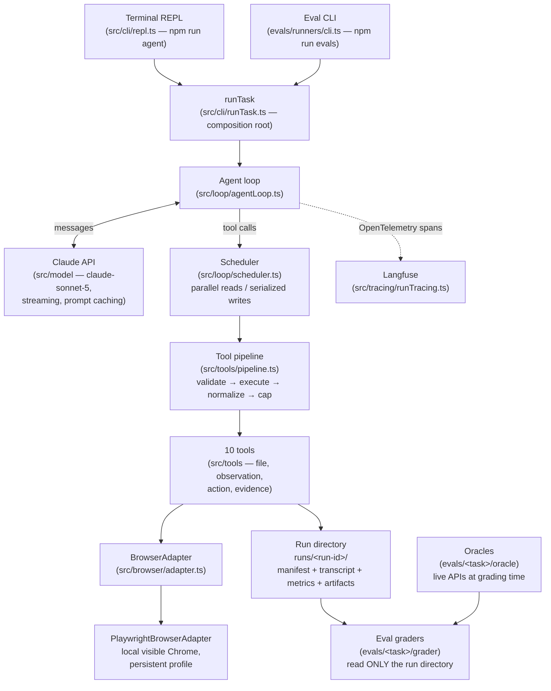
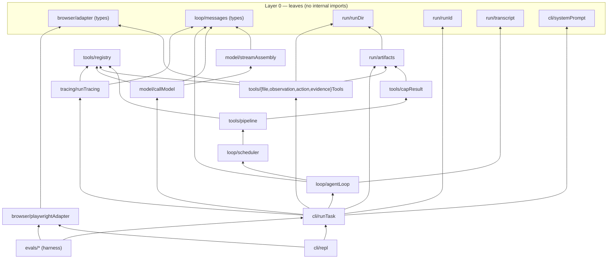

# Architecture

How the evidence-collection agent is structured and why. Source of truth for design rationale: `.agents/planning/evidence-collection-agent-checkpoint-1/design/detailed-design.md`.

## System overview

The agent is a minimal Claude Code–style loop: assemble context → call the model (streaming) → execute requested tools → feed results back → repeat until the model responds with no tool calls. The harness around the loop supplies guardrails (input validation, result capping, path confinement) and provenance (hashed manifest, append-only transcript).

## Layering and internal dependencies

Properties the codebase maintains deliberately:

- **No import cycles.** `run/` is the bottom layer alongside `browser/adapter`; it never imports from `tools/`, `loop/`, or `browser/`.
- **`playwright` appears in exactly one file** (`src/browser/playwrightAdapter.ts`). Everything else programs against the engine-neutral `BrowserAdapter` interface, so the browser is swappable (Patchright/Camoufox/Browserbase are the researched escalation path).
- **`src/cli/runTask.ts` is the single composition root** — the only place registry + model client + run dir + tracing + loop are wired together. Both product (REPL) and eval harness drive the same `runTask`.
- **The Anthropic SDK is imported only in `src/model/`.** `loop/messages.ts` mirrors the API shapes structurally (snake_case preserved) without importing the SDK, so a scripted fake model and the real streaming client satisfy the same `CallModel` contract.

## The five mechanisms borrowed from Claude Code

1. **Bounded tool results with artifact offloading** (`src/tools/capResult.ts`) — results over 50,000 bytes are written in full to `tool-output/<tool>-<n>.txt` (hashed into the manifest) and the model receives a ≤2,000-byte preview plus the path, with a note to use `read_file`/`grep`.
2. **Append-only JSONL transcript** (`src/run/transcript.ts`) — every model request/response and tool call/result is one JSON line in `transcript.jsonl`; the durable, replayable audit record.
3. **Stable prompt prefix** (`src/cli/systemPrompt.ts`, `src/model/callModel.ts`) — the system prompt is static (no task text/timestamps) and tool definitions serialize deterministically; one `cache_control: ephemeral` breakpoint on the system block caches tools + system together. Tests assert byte-identical prefixes across unrelated histories.
4. **Completion as policy, not mechanism** (`src/loop/agentLoop.ts`) — no finish tool; a response with zero `tool_use` blocks completes the run. `stop_reason` is recorded in the transcript but never consulted. Backstops: `maxTurns` (default 12) and a cumulative token budget (default 250,000).
5. **Parallel reads, serialized writes** (`src/loop/scheduler.ts`) — consecutive read-only calls run concurrently (max 5, FIFO semaphore); any state-changing call is a barrier in both directions, so `click` → `inspect_page` cannot be reordered. Unknown tools are conservatively treated as state-changing.

## Security and provenance invariants

- **Path confinement chokepoint:** every model-supplied path is resolved through `resolveRunPath` (`src/run/runDir.ts`), which rejects absolute paths and anything escaping the run directory.
- **Write chokepoint:** every byte a tool writes goes through `writeArtifact` (`src/run/artifacts.ts`), which SHA-256-hashes the exact bytes into `manifest.json` at capture time (tamper-evident evidence). Offloaded tool output is included.
- **No `bash` tool, by design** — the model's input includes untrusted web pages; an unbounded shell tool would turn prompt injection into code execution. The system prompt also instructs that page content is data, not authority.
- **Reserved filenames:** evidence tools refuse to write `manifest.json`, `transcript.jsonl`, or `metrics.json`.
- **Grader isolation (eval side):** graders receive only the run directory path and oracle data — never the transcript — so an agent that merely *describes* success cannot pass.

## Design philosophy (binding project rules)

- **No task-specific logic anywhere, ever.** Eval failures must be fixed with general mechanisms (better outline, better tool results, better prompt), never `if (task === ...)`. A hidden eval set makes per-task tuning worthless.
- **Minimal first, then harness engineering driven by observed failures.** Deferred features carry named revival triggers (e.g. extended thinking is disabled until baseline accuracy disappoints — a trigger the 2026-08-11 baseline formally met).
- **Priority order when goals conflict:** accuracy > generability > scalability > consistency > speed.

## Browser posture

Playwright drives real, local, **visible** Chrome (`channel: 'chrome'`, headed by default) with a persistent profile at `chrome-profile/`. This is deliberately the best available anti-bot posture (real fingerprint + real session history + residential IP); headless is the most detectable configuration. The browser session launches once per REPL/eval session so logins persist; each task run opens a fresh tab and closes it on completion. Credentials are never typed by the agent — a human logs into the profile manually once.

The model never sees raw HTML: `inspect_page` returns Playwright's ARIA snapshot (`page.ariaSnapshot({ mode: 'ai' })`) — a compact accessibility-tree outline with stable element refs. `click`/`type` act by ref, not coordinates or selectors.

## Configuration knobs

| Knob | Default | Location |
| --- | --- | --- |
| Model | `claude-sonnet-5` | `src/model/callModel.ts` (`DEFAULT_MODEL`) |
| Max turns | 12 | `src/cli/runTask.ts` (`DEFAULT_MAX_TURNS`) |
| Cumulative token budget | 250,000 | `src/cli/runTask.ts` (`DEFAULT_MAX_TOKENS`) |
| Max output tokens per call | 8,192 | `src/cli/runTask.ts` (`DEFAULT_MAX_OUTPUT_TOKENS`) |
| Tool result cap | 50,000 bytes | `src/tools/capResult.ts` (`DEFAULT_MAX_RESULT_BYTES`; per-tool override via `ToolDef.maxBytes`) |
| Offload preview size | 2,000 bytes | `src/tools/capResult.ts` (`PREVIEW_MAX_BYTES`) |
| Concurrent read-only tools | 5 | `src/loop/scheduler.ts` (`MAX_CONCURRENT_READS`) |
| Runs base dir | `runs` | `src/cli/runTask.ts` |
| Chrome profile | `./chrome-profile` (absolute path required) | `src/cli/repl.ts`, `evals/runners/cli.ts` |
| Thinking | disabled (`thinking: { type: 'disabled' }`) | `src/model/callModel.ts` — messages types don't carry thinking blocks yet |

All per-run values are overridable through `RunTaskConfig` (see [interfaces.md](interfaces.md)).
