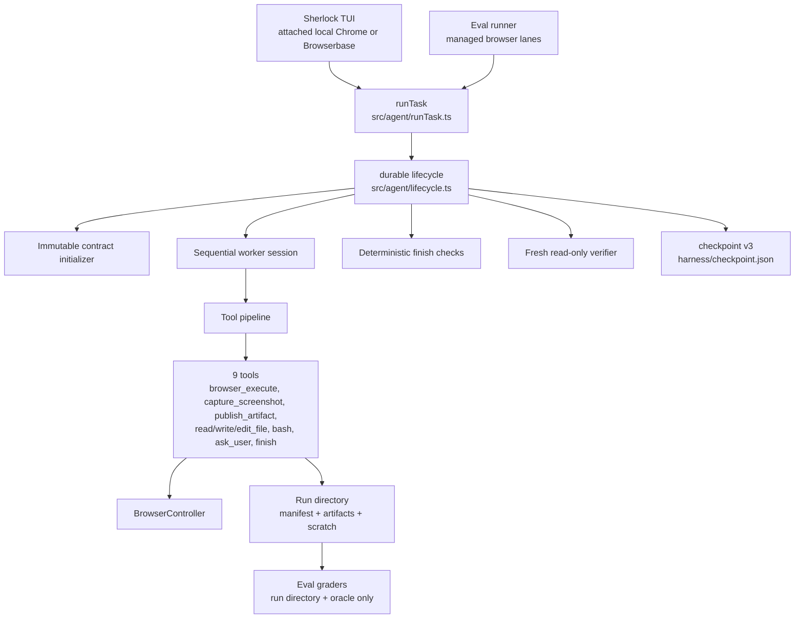
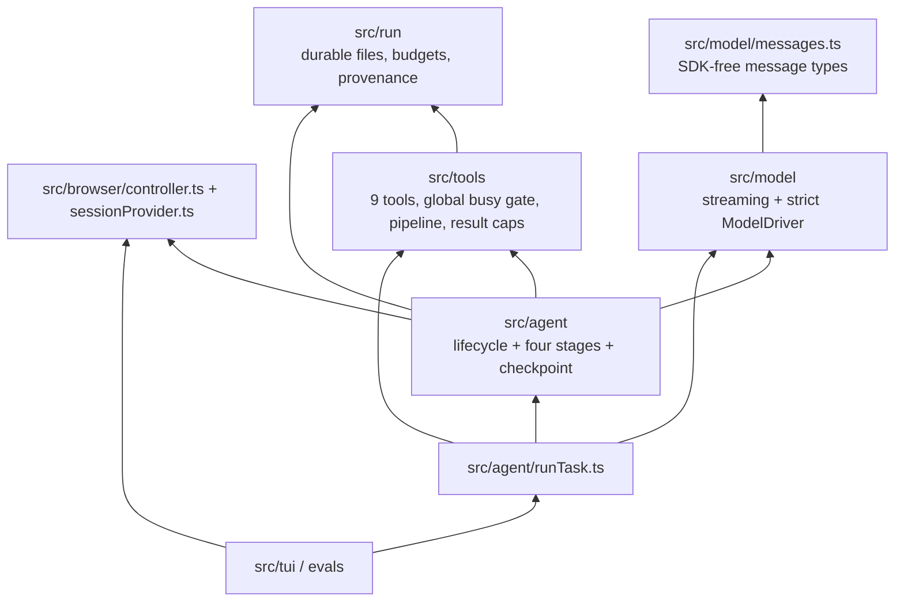

# Architecture

Current architecture as of 2026-08-20. For rationale and migration history, see [the v3 design](../../docs/browser-agent-v3/sherlock-v3-design-doc.md) and [implementation plan](../../docs/browser-agent-v3/implementation-plan.md).

## System overview

`src/agent/runTask.ts` is the public composition root. It creates a fresh run directory, fixes durable configuration, builds three model roles and the nine-tool registry, then delegates lifecycle and recovery to `runAgent`.

## One lifecycle

1. The initializer receives only the task and must return exactly one schema-valid output contract. It gets one initial attempt plus one repair. Once accepted, the contract is immutable and checkpointed; `harness/output-contract.json` is a recoverable convenience projection.
2. The worker receives the task, immutable contract guidance, and durable capability policy. Model responses are fully streamed and validated before content enters history or any tool runs.
3. Ordinary tool calls execute strictly in response order. Each effect boundary is checkpointed conservatively so recovery never blindly replays an uncertain call.
4. A response without tool calls receives a continuation message. It does not complete the run.
5. Completion is requested only by an exclusive `finish` call containing a user-facing summary. Requested-output paths are derived from the manifest rather than claimed by the worker.
6. Read-only deterministic checks validate manifest integrity, exact output shape, counts/rules, roles, media, and evidence requirements. Prose quality is left to the verifier. Defects are returned as the intercepted `finish` call's result and the same worker conversation continues.
7. Passing facts go to a fresh-context verifier with bounded, no-follow access only to `manifest.json` and published `artifacts/`. A correction likewise returns to the worker. Only the verifier can produce `verified`.
8. Every terminal path persists an absorbing checkpoint, closes run-owned pages, writes transcript/metrics projections, and finalizes the manifest. Non-success is explicit `incomplete`, `failed`, or `cancelled` durable state; the public API normalizes successful and incomplete outcomes.

## Layering

The worker executes calls sequentially. A run-owned `BusyResourceRegistry`
globally fences every later call and terminalization while a timed-out effect
may still be running; there is no per-tool access-key representation.

## Binding invariants

- **One immutable contract.** The initializer authors it before browsing. Vacuous wildcard-only filename patterns canonicalize to omission; the worker cannot revise the accepted contract, and lifecycle recovery rejects configuration or contract drift.
- **Explicit completion.** `finish` is intercepted control flow and must be the only call in its response.
- **Ephemeral visual observation.** `capture_screenshot` must also be the only call in its response. Its live viewport pixels enter one model request, then collapse to pixel-free metadata; publication remains explicit.
- **Fail closed.** Partial/truncated/refused/unknown model responses never enter history or execute. Deterministic-check or verifier failure cannot become success.
- **Durability before replay.** Checkpoints are schema-validated, monotonically revised, atomically replaced under an exclusive run lock, and terminal state is absorbing. Recovery marks an effect uncertain before dispatch and never replays that boundary blindly.
- **Manifest is the product boundary.** Published files live under `artifacts/` with `requested_output` and/or `evidence` roles; private work lives under `scratch/`. Graders select requested outputs by manifest role, not filenames or transcript claims.
- **Confinement and provenance.** Model paths go through `resolveRunPath`; normal writes go through `writeArtifact` and its durable journal. The deliberate exception is `scratch/workspace/`, where bounded `bash` writes directly and `syncScratchWorkspace` reconciles surviving regular files into the manifest before the tool returns.
- **No task-specific logic.** Runtime behavior and grading helpers remain general; task names/text choose no hidden code paths.
- **Byte-stable worker prefix.** `workerPrompt` and `WORKER_API_TOOL_DEFS` are static and deterministic. Task, contract, provider, paths, and recovery facts belong in messages/checkpoints.
- **Grader isolation.** A grader receives only the run directory path and freshly fetched oracle data, never conversation state.

## Code-execution posture

The worker has two bounded execution capabilities:

- `browser_execute` runs one finite JavaScript program against one exact run-owned page through a protected helper. A durable `javascriptPolicy` explicitly allows or denies it.
- `bash` runs bounded foreground commands in `scratch/workspace/`. Background work, package installation, and secret environment variables are denied.

Neither is an OS security boundary: both run as the application user. Safety comes from capability scoping, finite time/output limits, explicit permissions, secret denylisting, page ownership, and manifest reconciliation.

## Browser policy

Provider choice is explicit in `src/browser/provider.ts`: only `SHERLOCK_BROWSER_PROVIDER=browserbase` starts a remote billable session; local is the fallback.

- **Interactive Sherlock TUI, local:** attaches over a loopback DevTools endpoint to the user's already-running Chrome. Sherlock owns only its client and pages; it never closes pre-existing tabs or the user-owned browser. First-use remote-debugging permission is a visible human step.
- **Local evals:** never touch the TUI's attached daily browser. Normal trials lease fresh headless Chrome with unique temporary profiles; headed trials serialize through a separately managed persistent profile.
- **Browserbase:** normal eval trials are context-free isolated sessions. Authenticated/headed work serializes against the configured Context; Live View is the human takeover surface. CDP URLs and API keys must never enter diagnostics, transcripts, artifacts, exceptions, or child environments.

The controller owns run pages explicitly through `prepareTaskPage`/`closeTaskPages`. During recovery it first reclaims pages and target sentinels carrying the same durable run marker, while preserving unrelated user tabs, then opens a fresh run-owned page. Ephemeral page references are not checkpoint state.

## Production defaults

| Knob | Default | Source |
| --- | ---: | --- |
| Worker model | `claude-sonnet-5` | `src/model/callModel.ts` |
| Worker output tokens/request | 8,192 | `PRODUCTION_DEFAULTS` |
| Worker turns, whole run | unbounded | `PRODUCTION_DEFAULTS` |
| Request context ceiling | 900,000 tokens | `PRODUCTION_DEFAULTS` |
| Tool calls, whole run | unbounded | `PRODUCTION_DEFAULTS` |
| Model tokens, all roles | unbounded | `PRODUCTION_DEFAULTS` |
| Whole-run wall time | 3,600,000 ms | `PRODUCTION_DEFAULTS` |
| Deterministic-check failures | 5 | `PRODUCTION_DEFAULTS` |
| Initializer attempts | 2 | `INITIALIZER_MAX_ATTEMPTS` |
| Per-result offload threshold | 50,000 bytes | `src/tools/capResult.ts` |
| Eval `k` / normal concurrency | 1 / 3 | `evals/config.ts` |

Finite defaults are durable configuration. `runAgent` validates an existing
checkpoint against that configuration before recovering it.
