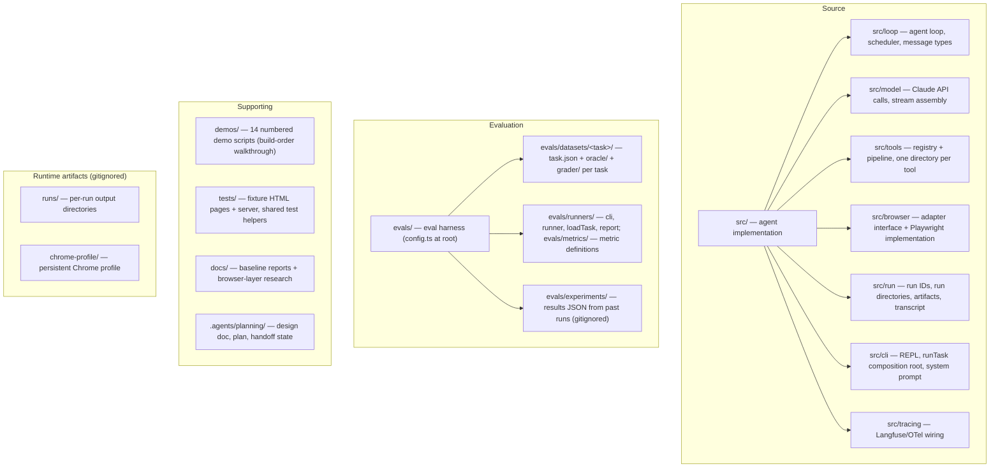

# Codebase Information

Basic facts about the evidence-collection-agent repository. See [index.md](index.md) for how this fits into the full documentation set.

## What this project is

A general browser agent for audit evidence collection. It takes a natural-language task (e.g. "Create a CSV of the top 5 stories on Hacker News"), drives a real local Chrome browser via Playwright to carry it out, and produces evidence artifacts — CSVs, screenshots, downloaded files, and/or a written answer — with tamper-evident provenance (SHA-256 hashes in a per-run manifest).

The core is a minimal Claude Code–style agent loop (context → model → tool calls → repeat) over a small registry of zod-validated browser and file tools, behind an engine-agnostic browser adapter.

## Technology stack

| Layer | Technology |
| --- | --- |
| Language | TypeScript (strict, ES2022, NodeNext modules, `noEmit` — run via `tsx`) |
| Model API | `@anthropic-ai/sdk` (Claude, streaming, prompt caching; default model `claude-sonnet-5`) |
| Browser automation | `playwright` driving local, visible Chrome with a persistent profile (`chrome-profile/`) |
| Schema validation | `zod` (tool input schemas; one definition validates at runtime and converts to JSON Schema for the API) |
| Tracing | Langfuse via OpenTelemetry (`@langfuse/tracing`, `@langfuse/otel`, `@opentelemetry/*`) |
| Tests | Vitest |

There are no other runtime languages; the only non-TypeScript sources are HTML test fixtures under `tests/`.

## Repository layout

## Directory notes

- `src/` — the agent itself; each subdirectory is one subsystem with co-located `*.test.ts` files.
- `evals/` — the eval harness, split by concern: `runners/` (cli, runner, loadTask, report), `metrics/` (metric definitions), `grading/` (run-dir verification toolkit for graders), `datasets/` (one directory per task — `hacker_news`, `edgar`, `openclaw_pr`, `stub` — each holding `task.json`, an `oracle/` for independent ground truth, and a `grader/` asserting against the run directory), `experiments/` (results JSON, gitignored), plus `config.ts` (paths + defaults) and `types.ts` (harness contracts) at the root.
- `demos/` — numbered standalone scripts (`01-run-id.ts` … `14-run-task.ts`) that exercise each subsystem in build order; run with `npx tsx demos/<file>`. Manual walkthroughs, not tests — see `demos/README.md`.
- `tests/fixtures/` — local HTML pages plus `server.ts`, used by browser-tool tests to avoid depending on the live web. `tests/helpers/` — shared test scaffolding (browser-suite lifecycle, outline ref lookup).
- `docs/reports/` — dated baseline/eval reports. `docs/research/browser-layer/` — the research behind the Playwright-on-local-Chrome decision.
- `.agents/planning/` — the checkpoint-1 planning set: `design/detailed-design.md` (authoritative design), `implementation/plan.md` (task checklist), `implementation/handoff-state.md` (session handoff), `implementation/baseline-failure-log.md` (failure→mechanism queue).
- `runs/` (gitignored) — one directory per agent run, named `<date>_<time>_<task-slug>_<suffix>` in local time (e.g. `2026-08-10_08-00-53pm_top-5-hacker-news_9f3a2b`): deliverables, `transcript.jsonl`, `manifest.json`, `metrics.json`. Eval result JSON lands in `evals/experiments/`.
- `chrome-profile/` (gitignored) — the persistent Chrome profile (cookies/logins survive across runs).
- `.env` (gitignored) — `ANTHROPIC_API_KEY` plus `LANGFUSE_PUBLIC_KEY`/`LANGFUSE_SECRET_KEY`/`LANGFUSE_BASE_URL`.

## Entry points and scripts

| Command | What it runs |
| --- | --- |
| `npm run agent` | `src/cli/repl.ts` — interactive terminal agent (type a task, watch the loop stream) |
| `npm run evals -- --tasks <ids> --k <n>` | `evals/runners/cli.ts` — parameterized eval runner |
| `npm test` | Vitest suite |
| `npm run typecheck` | `tsc --noEmit` |

Scripts that call the Claude API or Langfuse need env vars: `npx tsx --env-file=.env <script>`.

## Languages and analysis coverage

TypeScript is fully analyzable and covered by this documentation. The `chrome-profile/` and `runs/` trees are runtime data, not source, and are intentionally undocumented beyond their role.
