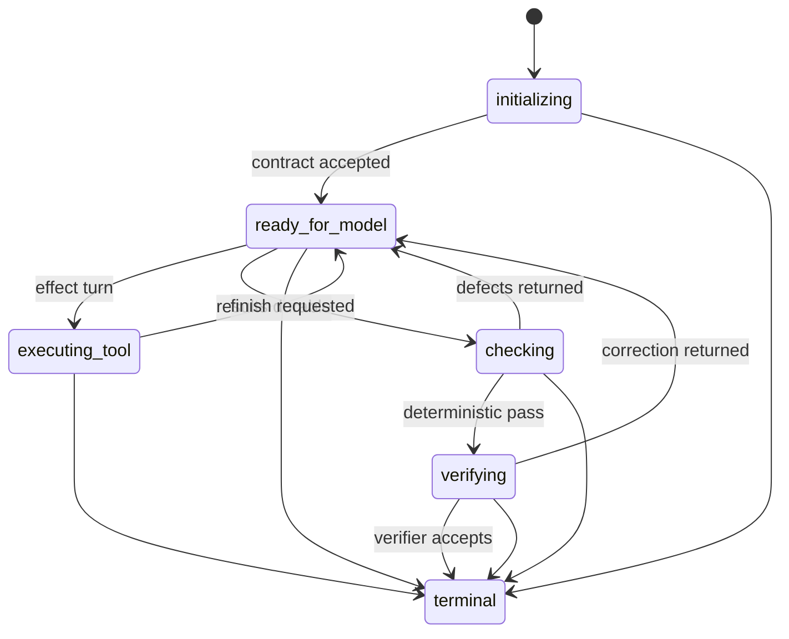
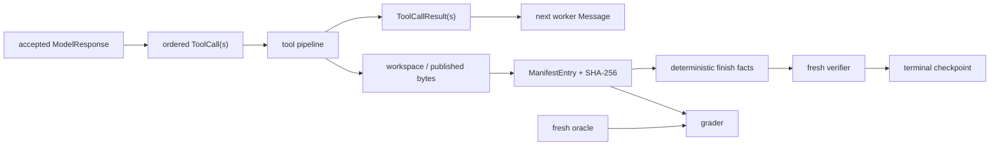

# Data Models

The durable and in-memory structures that define the v3 runtime.

## Run directory: the product boundary

```text
runs/<run-id>/
  manifest.json
  transcript.jsonl
  metrics.json
  artifacts/                         # published outputs/evidence
  scratch/                           # private, still provenance-tracked
    workspace/                       # bounded bash working directory
    tool-output/                     # oversize model-result offloads
  harness/                           # never a model-supplied path
    checkpoint.json
    steering.json                    # durable interactive control journal
    output-contract.json             # recoverable contract projection
    run.lock                         # while the coordinator owns the run
    run.lock.recovery                # transient stale-lock guard
    artifact-write-journal/          # durable write transactions
```

`src/run/runId.ts` creates `<date>_<time>_<task-slug>_<suffix>` names in local time. `manifest.startedAt` retains the exact UTC instant.

### Manifest (`src/run/artifacts.ts`)

```ts
interface Manifest {
  task: string;
  startedAt: string;
  finishedAt?: string;
  browserProvider?: 'local' | 'browserbase';
  artifacts: ManifestEntry[];
}

interface ManifestEntry {
  filename: string;
  sha256: string;
  sourceUrl?: string;
  roles?: ('requested_output' | 'evidence')[];
  capturedAt: string;
  completionStatus?: 'complete' | 'partial';
}
```

Published files live under `artifacts/` and require one or both roles. Private files live under `scratch/` and must not carry roles. A path rewrite upserts its entry and hashes the exact new bytes. `completionStatus` is retained as optional compatibility metadata: `partial` is never accepted as a satisfied requested output, while absence makes no completion claim. The active v3 publisher normally omits it and relies on finish checks plus the terminal checkpoint.

Graders select deliverables through manifest roles. The transcript, filename guesses, scratch content, and evidence-only entries cannot substitute for a requested output.

## Immutable output contract (`src/agent/initializer/outputContract.schema.ts`)

The initializer produces one immutable `OutputContract` before browser work. It records typed outputs (`table`, `document`, `screenshots`, or `download`), exact filenames, kind-specific schema/rules, and content expectations. The checkpoint is authoritative; `harness/output-contract.json` is a readable projection that can be reconstructed but cannot drift.

The worker and verifier consume the contract but cannot mutate it. Deterministic code derives artifact paths from the manifest and compares the published files against the contract.

## Checkpoint (`src/agent/checkpoint.schema.ts`, `src/agent/checkpoint.ts`)

Every v3 checkpoint has strict common fields:

```ts
{
  version: 3;
  revision: number;
  updatedAt: string;
  configuration: DurableRunConfiguration;
  budget: RunBudgetSnapshot;
  progress: CheckpointProgress;
  phase: CheckpointPhase;
  // phase-specific cargo
}
```

`DurableRunConfiguration` binds task text, model/output/context settings, browser provider, explicit authentication, JavaScript policy, optional start URL, initializer/check ceilings, and whole-run budget limits. Numeric infinity is serialized as the explicit `"unbounded"` sentinel. Configuration and accepted contract are immutable across revisions.

`CheckpointProgress.steeringCursor` optionally records the highest
`harness/steering.json` action incorporated into worker history. The journal
contains ordered interrupt/message actions; a missing cursor remains compatible
with older version-3 checkpoints and means zero actions consumed.



Phase-specific cargo prevents ambiguous recovery:

- `initializing`: optional initializer messages/attempts until a contract is accepted.
- `ready_for_model`: immutable contract plus full worker snapshot.
- `executing_tool`: worker snapshot plus assistant call batch, completed results, next index, and effect state `not_started` or `uncertain`.
- `checking`: the exclusive pending finish and deterministic-check attempt.
- `verifying`: pending finish, passed structured facts, and verifier restart marker.
- `terminal`: durable `verified`, `incomplete`, `failed`, or `cancelled` outcome. Terminal state is absorbing.

The public `RunOutcome` deliberately exposes only `verified` and explicit `incomplete`; operational failure and cancellation propagate through the public call after durable terminalization.

## Worker conversation and effects

SDK-free conversation types in `src/model/messages.ts` mirror the Messages API: `TextBlock`, `ToolUseBlock`, `ToolResultBlock`, `Message`, `Usage`, and `ModelResponse`. `stop_reason` is validated by `ModelDriver`; completion itself depends on an exclusive `finish` call, not prose or a no-tool response.

`WorkerSnapshot` stores the full never-collapsed message history, logical turn count, peak context, protocol-correction count, and start time. `src/agent/worker/contextView.ts` may replace old bulky browser results only in the pure request view; checkpoint history remains complete.

Free-form user steering enters that history only at a safe worker model
boundary. A journal action committed after the checkpoint is replayed on
recovery; one at or below the checkpoint cursor is not duplicated.

`ToolCall` and `ToolCallResult` in `src/tools/pipeline.ts` form the execution boundary. Errors are classified as unknown tool, invalid input, permission denied, execution failure, timeout, or busy resource. A timed-out effect remains in the busy ledger until its underlying promise settles.

## Finish and verification data

`finish` input is `{ summary }`. It is control flow, not a generic executor. Concrete unresolved constraints may be stated in that summary, but do not waive objective checks. Requested outputs and evidence are selected from the authoritative manifest; derived requested-output paths are persisted with deterministic facts for verifier and recovery use. `src/agent/completion/finishFacts.schema.ts` defines checkpoint-safe positive facts. The fresh verifier returns `verified`, `needs_correction`, or an unavailable outcome; it does not author facts that code can settle.

## Transcript and metrics

`transcript.jsonl` is append-only. V3 events include model request/accepted response/rejection, cache warnings, continuation messages, ordered tool calls/results, finish requests, deterministic-check failures, terminal outcome, and run errors. Events record what happened; they are not trusted product state.

`WorkerMetrics` in `src/agent/worker/worker.ts` records terminal status (`verified`, `incomplete`, `failed`, or `cancelled`), turns, protocol corrections, input/output/cache tokens, tool calls/result bytes, peak context, wall time, and per-role usage. Metrics and transcript are terminal projections repaired from checkpoint state when necessary.

## Eval report

An `EvalReport` records timestamps, `k`, normal-lane concurrency, model, optional assisted-dialog count, and ordered task reports. Each task report contains accuracy, all-of-k pass, mean run latency, and ordered trial reports. A trial is complete only when every grader assertion passes; an errored run or grader scores zero and remains distinguishable from failed assertions.

Accuracy is the mean per-trial fraction of passed assertions. Task pass is deliberately strict: every one of the `k` trials must be complete.

## End-to-end data flow


