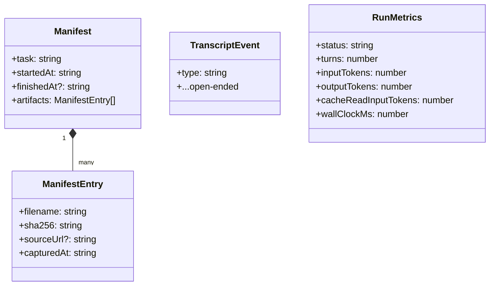
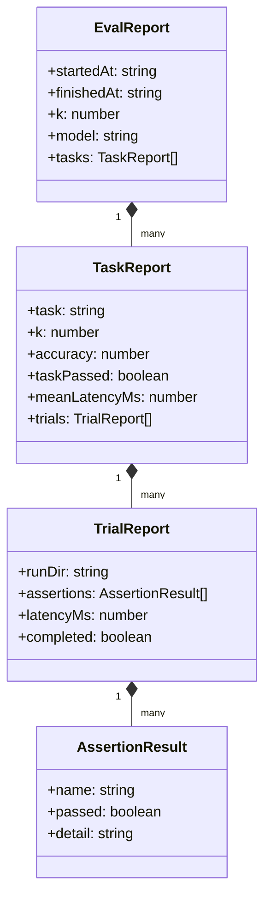
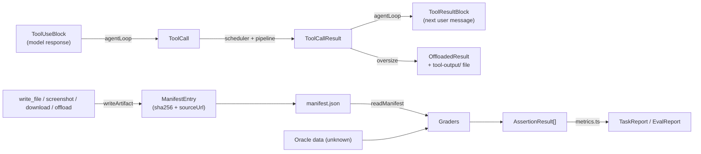

# Data Models

The data structures that flow through the system, and where each is defined.

## The run directory — the product's output contract

Every task run produces one directory. Graders, auditors, and debugging all read this — the run directory is the boundary between the agent and everything downstream.

```
runs/<run-id>/
  manifest.json                 # provenance index (initManifest → writeArtifact upserts → finalizeManifest)
  transcript.jsonl              # append-only event log, one JSON object per line
  metrics.json                  # written once, on every exit path
  <deliverables>                # answer.md, *.csv, *.png, downloads — whatever the task asked for
  tool-output/<tool>-<n>.txt    # offloaded oversize tool results (hashed like any artifact)
```

**Run ID** (`src/run/runId.ts`): `<date>_<time>_<label-slug>_<6-hex>` in **local 12-hour time** — e.g. `2026-08-10_09-48-32pm_top-5-hacker-news_1adfa7` (slug omitted when no label is given; `runTask` passes the task text; the manifest's `startedAt` keeps the exact UTC instant). Ids sort lexically by date; within a day the 12-hour clock means alphabetical order is not strictly clock order. Collisions throw at `mkdir` rather than reusing a directory.

## Provenance types (`src/run/artifacts.ts`)



- `ManifestEntry.sha256` is computed from the exact bytes at capture time — the tamper-evidence mechanism. `filename` is normalized run-dir-relative (so `data.csv` and `./data.csv` collapse); rewriting a path **upserts** the entry.
- `TranscriptEvent` (`src/run/transcript.ts`) is open-ended (`{ type: string, ...}`); the loop writes exactly four shapes: `model_request {turn, messages}`, `model_response {turn, response}`, `tool_call {turn, call}`, `tool_result {turn, result}`. Tool events are bracketed — all `tool_call`s appended in request order before execution, all `tool_result`s after every call settles — so parallel completion order is never observable in the transcript.
- `RunMetrics` (`src/loop/agentLoop.ts`) — `status` is `completed` or `budget_exceeded`.

## Conversation types (`src/loop/messages.ts`)

Structural mirrors of the Anthropic Messages API, snake_case preserved, no SDK import:

| Type | Shape |
| --- | --- |
| `TextBlock` | `{ type: 'text', text }` |
| `ToolUseBlock` | `{ type: 'tool_use', id, name, input: unknown }` |
| `ToolResultBlock` | `{ type: 'tool_result', tool_use_id, content: string, is_error? }` |
| `Message` | `UserMessage \| AssistantMessage` (user content: text/tool_result; assistant content: text/tool_use) |
| `Usage` | `{ input_tokens, output_tokens, cache_read_input_tokens? }` |
| `ModelResponse` | `{ content: AssistantContentBlock[], stop_reason: string \| null, usage }` — `stop_reason` recorded but never consulted |

## Tool-layer types (`src/tools/`)

| Type | Defined in | Shape / meaning |
| --- | --- | --- |
| `ToolCall` | `pipeline.ts` | `{ id, name, input: unknown }` — converted from `ToolUseBlock` in the loop |
| `ToolCallResult` | `pipeline.ts` | Discriminated on `isError`; error variant carries `errorKind: 'unknown_tool' \| 'invalid_input' \| 'execution_error'` — converted to `ToolResultBlock` in the loop |
| `OffloadedResult` | `capResult.ts` | `{ preview, offloadedTo, note }` — what the model sees when a result exceeds the cap |
| `EvidenceResult` | `src/tools/shared/evidence.ts` | `{ path, size }` — screenshot/download return value; bytes never enter the transcript |
| `ToolCtx` | `registry.ts` | `{ runDir, browser? }` — capabilities handed to every tool |

The two conversion points where API-shaped and internal types meet are both in `agentLoop.ts`: `ToolUseBlock → ToolCall` before scheduling, `ToolCallResult → ToolResultBlock` after.

## Loop and task types

| Type | Defined in | Shape |
| --- | --- | --- |
| `State` | `loop/agentLoop.ts` | `{ messages: Message[], turnCount }` — the loop's only memory |
| `LoopResult` | `loop/agentLoop.ts` | `{ status:'completed', finalText } \| { status:'budget_exceeded', reason: 'max_turns' \| 'token_budget' }` |
| `RunTaskResult` | `cli/runTask.ts` | `{ runDir } & LoopResult` |
| `ProgressEvent` | `model/callModel.ts` | `turn_start \| text_delta \| tool_use_start \| turn_end`, each tagged with the turn |

## Eval harness types (`evals/`)



Metric definitions (`evals/metrics/metrics.ts`): `accuracy` = mean over trials of fraction-of-assertions-passed; `completed` = all assertions passed in that trial; `taskPassed` = **every** trial completed (all-of-k — deliberately strict, measuring consistency). Zero assertions or zero trials throw.

The persisted eval result (`evals/experiments/<run-id>.json`) is the `EvalReport` serialized with 2-space indent.

## Data flow between subsystems


