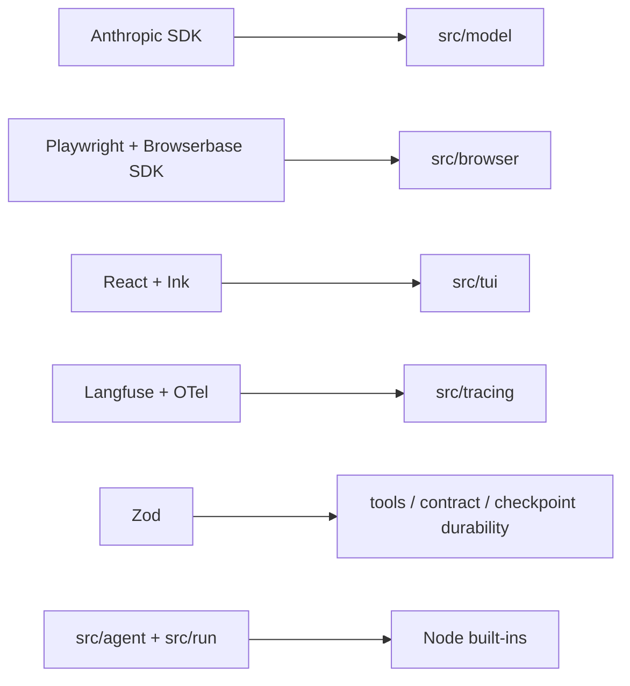

# Dependencies

Runtime and tooling dependencies for the current architecture as of 2026-08-20. Versions below reflect `package.json`; source imports remain authoritative.

## Runtime packages

| Package | Version | Main use |
| --- | --- | --- |
| `@anthropic-ai/sdk` | `^0.116.0` | Streaming Messages API adapter in `src/model/`; SDK types do not cross the model boundary. |
| `playwright` | `^1.62.1` | Local/attached/remote Chrome control, target-pinned CDP commands, page ownership, screenshots/downloads/uploads, and browser-backed tests. |
| `@browserbasehq/sdk` | `2.18.0` | Explicit Browserbase session/Context lifecycle and diagnostics. |
| `zod` | `^4.4.3` | Tool, contract, checkpoint, completion, and verifier schemas plus API JSON Schema generation. |
| `react`, `ink` | `^19.2.8`, `^7.1.1` | Installed terminal UI. |
| `ink-text-input` | `^6.0.0` | Composer and interactive question input. |
| `@langfuse/tracing`, `@langfuse/otel` | `5.10.0` | Optional run/model/tool observations and export. |
| `@opentelemetry/api`, `sdk-trace-node`, `sdk-trace-base` | `1.9.1`, `2.10.0`, `2.10.0` | Isolated tracer provider and injectable test seam. |
| `date-fns` | `4.1.0` | Deterministic table date validation. |
| `tsx` | `^4.23.12` | Direct TypeScript execution for shipped commands and scripts; there is no emitted JS build. |

## Development packages

| Package | Use |
| --- | --- |
| `typescript` `^7.0.2` | `tsc --noEmit` across source, demos, evals, and tests. |
| `vitest` `^4.1.10` | Unit/integration runner. |
| `@types/node`, `@types/react` | Type declarations. |
| `ink-testing-library` | TUI rendering/input tests. |

The package requires Node 22 or newer. Node supplies filesystem durability primitives, hashing, fetch, process groups/signals, streams, and URL handling.

## Deliberate boundaries

- Only the model adapter imports Anthropic SDK shapes; durable conversation types are local structural types.
- Provider choice is centralized. Merely installing or configuring Browserbase does not select it.
- `src/content/contentReader.ts` only performs lightweight byte-format detection; rich document inspection is browser/program work rather than a second parser registry.
- Checkpoint, manifest, budget, and coordinator correctness use Node primitives and local schemas; no database or external queue is involved.
- Eval oracles use Node's global `fetch`; graders read local run bytes and oracle data only.

## External systems

| System | Used by | Authority / constraint |
| --- | --- | --- |
| Anthropic API | All real model roles | Ambient SDK credentials such as `ANTHROPIC_API_KEY`. |
| Local Chrome | Attached TUI, managed login/evals, browser tests | System Chrome; persistent-profile ownership must be singular. |
| Browserbase | Explicit remote provider | `BROWSERBASE_API_KEY`; Context id only for configured authenticated work. Live use is billable. |
| Langfuse | Optional tracing | Both public and secret keys; absent/incomplete config becomes a no-op. |
| GitHub REST | Several eval oracles | Use `GITHUB_TOKEN` for batches; anonymous quota is too small for repeated grading. |
| SEC EDGAR | EDGAR oracle/live task | Plain `Name email` User-Agent behavior is load-bearing. |
| Other task sites/APIs | Agent browser and task-specific oracles | Live, changeable data; graders fetch ground truth at grading time. |

`npm test` is hermetic beyond its loopback fixture server and needs no API keys, but browser-backed suites require a local Chrome install. `npm run smoke:browserbase` is intentionally excluded because it consumes remote minutes and network access.

## Environment loading

Application modules do not import a general dotenv loader. The installed `sherlock` entry, eval command, and login command load supported `.env` files at their entry boundaries. Other direct `tsx` invocations need `--env-file=.env`. Never print credential values, and never forward the Browserbase CDP URL or denylisted secrets to `bash` child processes.
