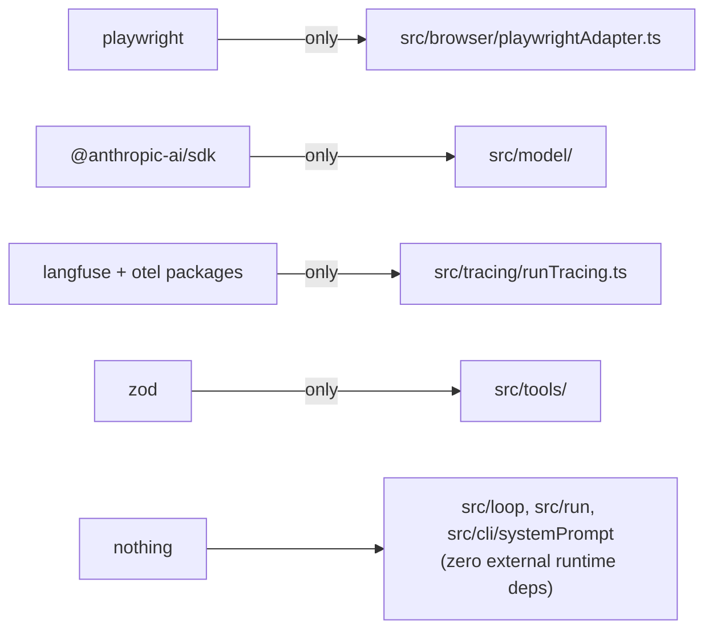

# Dependencies

External dependencies, what each is used for, and where it is imported.

## Runtime dependencies

| Package | Version | Imported in | Used for |
| --- | --- | --- | --- |
| `playwright` | ^1.62 | `src/browser/playwrightAdapter.ts` **only** | `chromium.launchPersistentContext` (`channel: 'chrome'`, headed), `page.ariaSnapshot({ mode: 'ai' })` outlines, `aria-ref=` locators, `context.request.get` for session-shared fetches, screenshots |
| `@anthropic-ai/sdk` | ^0.116 | `src/model/callModel.ts` (runtime), `src/model/streamAssembly.ts` (types only) | `new Anthropic()` (ambient credentials), `client.messages.stream`, raw stream event types |
| `zod` | ^4 | `src/tools/*.ts` | Tool input schemas; runtime `safeParse` validation; `z.toJSONSchema(schema, { io: 'input' })` for API tool definitions |
| `@langfuse/tracing` | 5.10.0 | `src/tracing/runTracing.ts` | `startObservation` (agent/generation/tool spans), `setLangfuseTracerProvider` |
| `@langfuse/otel` | 5.10.0 | `src/tracing/runTracing.ts` | `LangfuseSpanProcessor` — the production exporter, configured from `LANGFUSE_*` env |
| `@opentelemetry/api` | 1.9.1 | `src/tracing/runTracing.ts` | `TraceFlags`, `SpanContext` for manual parent-span construction |
| `@opentelemetry/sdk-trace-node` | 2.10.0 | `src/tracing/runTracing.ts` | The run-isolated `NodeTracerProvider` (global OTel SDK deliberately not used) |
| `@opentelemetry/sdk-trace-base` | 2.10.0 | `src/tracing/runTracing.ts` (type), `runTracing.test.ts` | The injectable `SpanProcessor` seam; `InMemorySpanExporter` + `SimpleSpanProcessor` in tests |
| `@opentelemetry/sdk-node` | 0.221.0 | **nowhere** | Declared in package.json but not imported in `src/`, `evals/`, `demos/`, or `tests/` — candidate for removal |

## Dev dependencies

| Package | Used for |
| --- | --- |
| `tsx` | Runs TypeScript directly — there is no build step (`tsconfig` is `noEmit`) |
| `vitest` | Test runner (`npm test` → `vitest run`); no vitest config file — defaults apply |
| `typescript` (^7) | `npm run typecheck` (`tsc --noEmit` over `src`, `demos`, `evals`, `tests`) |
| `@types/node` | Node built-in types (`node:fs`, `node:path`, `node:crypto`, `node:buffer`, `node:readline/promises` are used) |

## Deliberate dependency boundaries

- The agent loop, run/provenance layer, and message types have **zero external dependencies** — they are pure TypeScript over Node built-ins. This is what makes the loop testable with fakes and the transcript replayable.
- `evals/` adds no dependencies of its own: the CSV parser (`evals/grading/csv.ts`) and hashing (`evals/grading/hash.ts`, matching `writeArtifact`'s encoding) are dependency-free by design.
- Oracle clients use global `fetch` (Node ≥18) — no HTTP library.

## External services (not packages)

| Service | Needed by | Credential |
| --- | --- | --- |
| Anthropic API | REPL, eval CLI, demos 09/14 | `ANTHROPIC_API_KEY` (ambient; entry points warn if unset) |
| Langfuse cloud | Tracing (optional) | `LANGFUSE_PUBLIC_KEY` + `LANGFUSE_SECRET_KEY` (+ optional `LANGFUSE_BASE_URL`) |
| Local Chrome install | Adapter tests, demos 10–14, all real runs | none — `channel: 'chrome'` uses the system Chrome, not bundled Chromium |
| HN Firebase / SEC EDGAR / GitHub REST | Eval oracles at grading time only | none (SEC requires a plain `Name email` User-Agent; GitHub unauthenticated → 60 req/hr) |

`npm test` is hermetic: no network beyond the loopback fixture server, no API keys — but it does require a local Chrome install for the Playwright-backed tests.
