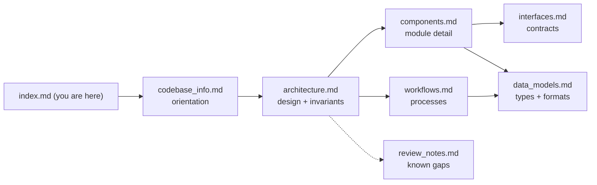

# Knowledge Base Index — evidence-collection-agent

This directory is a generated knowledge base describing the evidence-collection-agent codebase. It was produced by analyzing every source file plus the project's planning and report documents (2026-08-10).

## How to use this documentation (instructions for AI assistants)

1. **Load this index first.** Each entry below says what its file contains and which questions it answers — use that to decide which file(s) to read; you rarely need more than two.
2. **Trust but timestamp.** These docs describe the code as of checkpoint 1 (baseline complete, mechanisms F1–F4 not yet applied). For anything that may have changed since — defaults, tool behavior, task list — verify against the referenced source file. File/line anchors are given throughout.
3. **For design rationale ("why is it built this way?")**, the authoritative document is `.agents/planning/evidence-collection-agent-checkpoint-1/design/detailed-design.md` — the docs here summarize it but the design doc has the full argument.
4. **For current project state ("what's done, what's next?")**, read `.agents/planning/evidence-collection-agent-checkpoint-1/implementation/handoff-state.md` and `docs/reports/2026-08-11-baseline.md`.
5. **Respect the binding rules** documented in [architecture.md](architecture.md): no task-specific logic ever; graders read only the run directory; the prompt prefix must stay byte-stable; every write goes through `writeArtifact`; every path through `resolveRunPath`.

## Table of contents

| File | Contents | Read it when you need… |
| --- | --- | --- |
| [codebase_info.md](codebase_info.md) | What the project is, tech stack, repository layout, entry points, npm scripts, gitignored runtime dirs | Orientation; "where is X?"; how to run anything |
| [architecture.md](architecture.md) | System overview and layering diagrams, the five Claude Code–borrowed mechanisms, security/provenance invariants, binding design rules, browser posture, all config knobs with defaults | Design-level questions; "why no bash tool?"; "what are the defaults?"; before changing loop/prompt/tools |
| [components.md](components.md) | Every module in `src/`, `evals/`, `demos/`, `tests/` — responsibilities, key exports, behavioral notes; the eval task table (oracles + assertions) | "What does file X do?"; "which module owns Y?"; what each grader actually checks |
| [interfaces.md](interfaces.md) | The internal seams (`BrowserAdapter`, `CallModel`, `ToolDef`, `runTask`, `RunTracing`), eval contracts (`Grader`, `EvalTask`, task.json schema, CLI flags), external services, env vars | Adding a tool/task/adapter; wiring questions; API/env details |
| [data_models.md](data_models.md) | Run directory contract, manifest/transcript/metrics shapes, conversation types, tool-layer types, eval report types, run-ID format, data-flow diagram | "What's in manifest.json?"; transcript event shapes; eval result JSON structure |
| [workflows.md](workflows.md) | Sequence/flow diagrams: a task run, one loop turn, the tool pipeline, browser observe/act cycle, eval grading flow, tracing span tree, developer loops | "How does a run/turn/eval actually proceed?"; debugging a run; how to run evals correctly |
| [review_notes.md](review_notes.md) | Consistency/completeness findings: unused dependency, missing eval tasks vs design, oracle shelf-life and rate limits, known tool gaps, recommendations | Before cleanup/refactors; understanding known gaps and their status |

## How the files relate

Typical paths: orientation → `codebase_info` → `architecture`. Implementation task → `components` (find the module) → `interfaces`/`data_models` (get the contract). Debugging a run → `workflows` §1–2 → `data_models` (transcript shapes). Eval work → `components` (task table) → `interfaces` (task.json + CLI) → `workflows` §6.

## Example queries this knowledge base answers

- "How do I add a new eval task?" → interfaces.md (task package convention + task.json schema), components.md (oracle/grader pattern, parse-vs-fetch split).
- "Why did my tool result get truncated?" → architecture.md (offloading mechanism), workflows.md §3.
- "What exactly does the model see after `inspect_page`?" → components.md (src/tools `inspectPage/`), workflows.md §4.
- "Can I raise the turn limit for one run?" → architecture.md (config knobs), interfaces.md (`RunTaskConfig`).
- "What breaks prompt caching?" → architecture.md (mechanism 3), components.md (systemPrompt, callModel).
- "Why is the browser visible instead of headless?" → architecture.md (browser posture).
- "What does 'task pass' mean in the eval report?" → data_models.md (metric definitions), components.md (metrics.ts).

## Related documents outside this directory

- `AGENTS.md` (repo root) — the condensed agent-facing navigation guide consolidated from these files.
- `README.md` (repo root) — human-facing overview, setup, and usage.
- `.agents/planning/evidence-collection-agent-checkpoint-1/` — design doc (authoritative rationale), implementation plan/checklist, baseline failure log (active work queue), handoff state.
- `docs/reports/2026-08-11-baseline.md` — the k=3 baseline results and four candidate mechanisms.
- `docs/research/browser-layer/` — the research behind the browser-layer decision and its escalation path.
