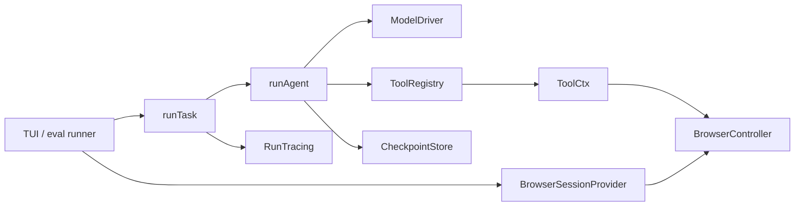

# Interfaces and Integration Points

Current public and internal seams for the production runtime.

## Runtime boundaries



### Browser seam

`BrowserController` in `src/browser/controller.ts` is engine-neutral and deliberately small. It exposes durable task-page preparation/cleanup, stable `{pageId, url, active}` summaries, target-pinned command sessions, native-dialog state, screenshots, downloads, and safe diagnostics. File upload is a protected command-session operation so the provider can encode local bytes without exposing a path or CDP authority to remote Chrome. A controller owns only pages marked for the run; attached local mode must not close the user's existing tabs or browser.

`BrowserSessionProvider` in `src/browser/sessionProvider.ts` has one acquisition method:

```ts
interface BrowserSessionProvider {
  createSession(): Promise<BrowserController>;
}
```

`src/browser/provider.ts` is the only environment-to-provider composition point. Provider choice is explicit (`local` or `browserbase`), and local ownership is also explicit (`attached` or `managed`). `BrowserSessionDiagnostics` deliberately omits the remote CDP URL.

### Model seam

`ModelDriver` in `src/model/modelDriver.ts` is the role-independent strict boundary:

```ts
interface ModelDriver {
  generate(options: {
    messages: readonly Message[];
    signal?: AbortSignal;
    onEvent?: (event: ModelAttemptEvent) => void;
  }): Promise<AcceptedModelResponse>;
}
```

A complete stream must assemble and pass stop-reason/content/tool-call validation before it enters history or executes. The SDK-free `Message`, `ModelResponse`, and `CallModel` types live in `src/model/messages.ts`; only the request/stream implementation knows Anthropic SDK types.

### Tool seam

`ToolDef`, `ToolRegistry`, and `ToolCtx` live in `src/tools/registry.ts`:

```ts
interface ToolDef<Input> {
  name: string;
  description: string;
  inputSchema: ZodType<Input>;
  maxBytes?: number;
  requiresUserInteraction?: boolean;
  timeoutMs?: number;
  execute(input: Input, ctx: ToolCtx): Promise<unknown> | unknown;
}
```

`ToolCtx` carries `runDir`, optional browser and permission/cancellation seams, and the run-owned `BusyResourceRegistry`. The worker dispatches calls sequentially; the global ledger prevents every later call and terminalization from overlapping an abandoned timed-out effect.

`src/tools/index.ts` exports `WORKER_API_TOOL_DEFS` and `createWorkerToolRegistry`. API definitions are static, deeply frozen, and ordered identically to the registry so the cached prompt prefix is byte-stable.

## Public run API (`src/agent/runTask.ts`)

```ts
runTask(taskText: string, config: RunTaskConfig): Promise<RunTaskResult>

type RunTaskResult = { runDir: string } & RunOutcome
type RunOutcome =
  | { status: 'verified'; finalText: string }
  | { status: 'incomplete'; reason: IncompleteRunReason; detail: string; finalText: string }
```

The configuration requires a live `BrowserController` and accepts model/progress/tracing/permission/cancellation seams. Each call creates a fresh run with durable model, start URL, authentication, JavaScript policy, and production ceilings.

On normal resolution the coordinator has persisted terminal state, reconciled run projections, closed run-owned pages, and finalized the manifest. The public composition root closes its tracing lifecycle; the caller still owns the browser session.

## Checkpoint ownership (`src/agent/checkpoint.ts`)

`openCheckpointStore(runDir)` is the durable ownership seam. Its `load`, monotonic `save`, and `close` operations own the run lock, bounded no-follow reads, atomic checkpoint replacement, stale-lock recovery, and terminal-state constraints. `runAgent` revalidates configuration and contract under that lock before continuing a stored phase.

## Tracing and progress

`RunTracing` in `src/tracing/runTracing.ts` can announce a run directory, wrap model drivers and the tool registry, create the run root, and close. Without both Langfuse keys it is an identity no-op; tracing failures are isolated from outcomes.

`ProgressEvent` from `src/model/callModel.ts` and attempt events from `src/model/modelDriver.ts` feed `src/tui/bridge/runSession.ts`. Published-artifact UI events are derived by diffing the manifest after tool execution; they are not a second provenance channel.

## Eval harness contracts

`evals/types.ts` defines:

```ts
type Grader = (
  runDirPath: string,
  oracleData: unknown,
) => AssertionResult[] | Promise<AssertionResult[]>

type RunTaskFn = (
  taskText: string,
  options: EvalRunOptions,
) => Promise<{ runDir: string }>
```

A loaded `EvalTask` carries `name`, `taskText`, optional `startUrl`, `headed`, `requiresLogin`, `fetchOracle`, and `grade`. `task.json` accepts `task`, optional `startUrl`, optional boolean `headed`, and optional service-id array `requiresLogin`. Graders receive only the run directory and freshly fetched oracle data, never the transcript or model conversation.

The CLI surface is `npm run evals -- --tasks <a,b,c> [--k <n>] [--concurrency <n>] [--skip-login-check]`. Normal trials use a bounded managed-browser pool; headed trials use a separate serial managed lane. Results are written under `evals/experiments/`.

## External integration points

| Service/capability | Boundary | Important constraint |
| --- | --- | --- |
| Anthropic Messages API | `src/model/callModel.ts` | Streaming only; cached static prefix; credentials stay ambient. |
| Local Chrome | `src/browser/` | TUI interactive mode attaches; evals and login use managed sessions. |
| Browserbase | `src/browser/browserbase*` | Explicit provider selection only; CDP URL is a secret control capability. |
| Langfuse/OTel | `src/tracing/runTracing.ts` | Optional and failure-isolated. |
| Eval oracles | `evals/datasets/*/oracle/` | Fetched at grading time; GitHub needs a token for sustained runs and SEC needs its plain User-Agent. |

## Environment

| Variable | Meaning |
| --- | --- |
| `ANTHROPIC_API_KEY` / supported SDK auth | Real model access. |
| `SHERLOCK_BROWSER_PROVIDER` | Explicit `local` or `browserbase`; local is the fallback. |
| `BROWSERBASE_API_KEY`, `BROWSERBASE_CONTEXT_ID` | Remote sessions and authenticated Context use. |
| `LANGFUSE_PUBLIC_KEY`, `LANGFUSE_SECRET_KEY`, `LANGFUSE_BASE_URL` | Optional tracing. |
| `GITHUB_TOKEN` | Prevents eval-oracle rate-limit failures. |

There is no general-purpose dotenv import in application modules. The installed TUI, eval CLI, and login command load supported `.env` files at their documented entry boundaries; standalone scripts need `--env-file=.env` explicitly.
