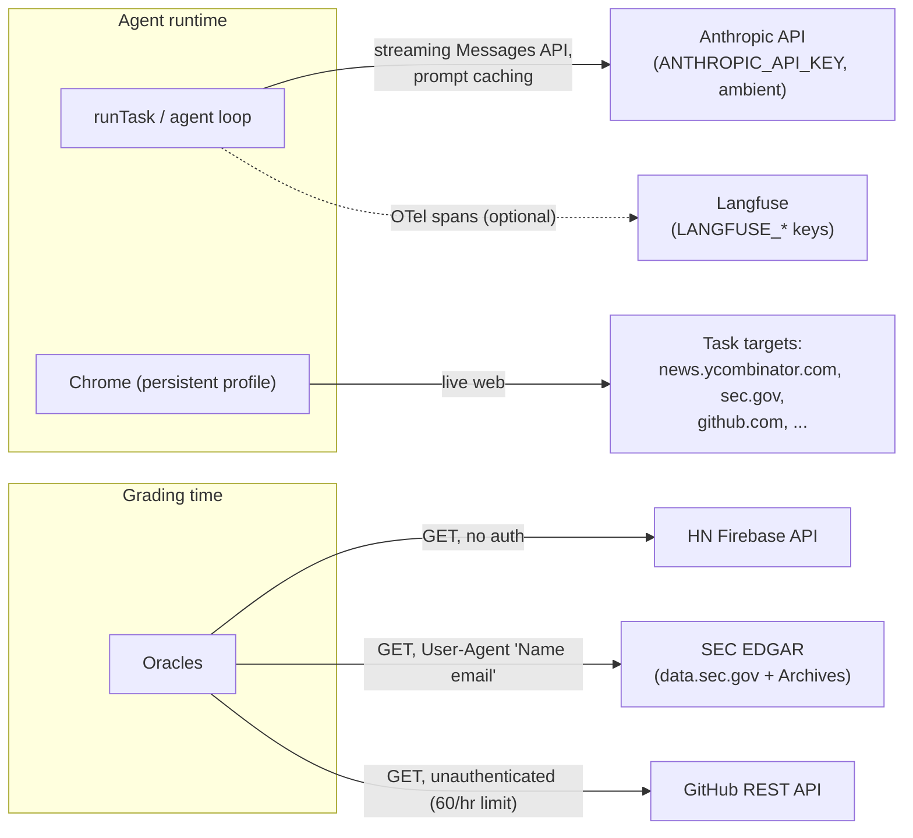

# Interfaces and Integration Points

The contracts that hold the system together, and every external surface it touches.

## Internal seams

```mermaid
classDiagram
    class BrowserController {
        <<interface>>
        +newTab() Promise~void~
        +closeTab() Promise~void~
        +goto(url) Promise~void~
        +outline() Promise~string~
        +click(ref) Promise~void~
        +type(ref, text) Promise~void~
        +scroll() Promise~void~
        +screenshot(options?) Promise~Uint8Array~
        +resolveHref(ref) Promise~string|null~
        +fetch(url) Promise~BrowserFetchResult~
        +currentUrl() string
        +title() Promise~string~
        +close() Promise~void~
    }
    class BrowserSessionProvider {
        <<interface>>
        +createSession() Promise~BrowserController~
    }
    class ToolDef {
        <<interface>>
        +name: string
        +description: string
        +inputSchema: ZodType
        +readOnly: boolean
        +maxBytes?: number
        +execute(input, ctx)
    }
    class RunTracing {
        <<interface>>
        +wrapCallModel(cm, model?) CallModel
        +wrapRegistry(r) ToolRegistry
        +traceRun(taskText, op) Promise
        +flush() Promise~void~
        +close() Promise~void~
    }
    class CallModel {
        <<function type>>
        (messages) Promise~ModelResponse~
    }
    LocalChromeBrowserSessionProvider ..|> BrowserSessionProvider
    LocalChromeBrowserSessionProvider --> PlaywrightBrowserController : creates
    PlaywrightBrowserController ..|> BrowserController
    ToolDef --> BrowserController : via ToolCtx.browser
    RunTracing --> CallModel : decorates
    RunTracing --> ToolDef : decorates registry
```

### `BrowserController` (`src/browser/controller.ts`)

The engine-neutral control seam for a live browser session. A controller owns at most one task tab; `newTab()` starts a run, `closeTab()` ends it without closing the session or its shared state. Contract details: `click`/`type` take refs from the latest `outline()` and throw `BrowserRefNotFoundError` for stale/malformed refs; `fetch()` goes through the browser session (cookies shared); `goto` reports the *landed* URL via `currentUrl()`. The current implementation is `PlaywrightBrowserController` in `src/browser/playwrightBrowserController.ts`.

### `BrowserSessionProvider` (`src/browser/sessionProvider.ts`)

The session-acquisition seam: `createSession()` returns a live `BrowserController` with no active task tab, and the caller owns and closes it. `LocalChromeBrowserSessionProvider` is the production implementation today. A future `BrowserbaseBrowserSessionProvider` can create a hosted session and return a controller without changing the loop, tools, or `runTask`.

### `CallModel` (`src/loop/messages.ts`)

`(messages: readonly Message[]) => Promise<ModelResponse>` — the model seam. The production implementation is `makeCallModel` (`src/model/callModel.ts`); tests supply scripted fakes. No SDK types cross this boundary.

### `ToolDef` / `ToolRegistry` / `ToolCtx` (`src/tools/registry.ts`)

One zod schema per tool does double duty: runtime validation and (via `z.toJSONSchema`) the API tool definition. `readOnly` drives the scheduler; `maxBytes` overrides the 50 KB result cap. `ToolCtx { runDir, browser? }` is the capability bundle handed to every `execute`. `toApiToolDefs(registry)` must stay deterministic — its output is part of the cached prompt prefix.

### `runTask` (`src/cli/runTask.ts`) — the programmatic entry point

```ts
runTask(taskText: string, config: RunTaskConfig): Promise<RunTaskResult>
// RunTaskConfig: { browser: BrowserController (required); runsBaseDir?; startUrl?; model?;
//                  maxOutputTokens?; maxTurns?; maxTokens?; onProgress?;
//                  callModel? (test seam); tracing? (test seam) }
// RunTaskResult: { runDir: string } & LoopResult
```

Guarantees on resolve: transcript and metrics complete, manifest finalized, the run's tab closed, browser session still open (caller owns the session). This is the function both the REPL and the eval harness drive.

### `RunTracing` (`src/tracing/runTracing.ts`)

Identity no-op without Langfuse credentials, so callers wire it unconditionally. `CreateRunTracingOptions` accepts an injected `spanProcessor` (tests) and `env`.

### Progress streaming

`ProgressEvent` (`src/model/callModel.ts`): `turn_start` | `text_delta` | `tool_use_start` | `turn_end` (with `Usage`). Flows SDK stream → `assembleModelResponse` → `makeCallModel` (adds turn) → `RunTaskConfig.onProgress` → `formatProgressEvent` → stdout.

## Eval harness contracts (`evals/types.ts`)

```ts
type Grader = (runDirPath: string, oracleData: unknown) => AssertionResult[] | Promise<AssertionResult[]>
type RunTaskFn = (taskText: string, opts: EvalRunOptions) => Promise<{ runDir: string }>
interface EvalTask { name; taskText; startUrl?; requiresAuth; fetchOracle; grade }
```

Standing rule, enforced structurally at the runner's single grading call site: a grader receives **only** the run directory path and oracle data — never a transcript. A bad run yields failed assertions, never a throw; a *malformed oracle payload* throws (harness bug, not a failed trial).

### Task package convention

`evals/datasets/<name>/` must contain `task.json`, `oracle/oracle.ts` exporting `fetchOracle`, and `grader/grader.ts` exporting `grade`. `task.json` schema:

| Field | Type | Required | Meaning |
| --- | --- | --- | --- |
| `task` | non-empty string | yes | Task text handed verbatim to the agent |
| `startUrl` | string | no | Page loaded before the first model turn |
| `requiresAuth` | boolean | no | Use the serial headed persistent-profile lane; defaults to `false` |

### Eval CLI

`npm run evals -- --tasks <a,b,c> [--k <n>] [--concurrency <n>]` — both flag forms; `--tasks` required, `--k` defaults to 1, and normal/headless concurrency defaults to 3. Results: labeled progress/report text to stdout and JSON to `evals/experiments/<run-id>.json`.

## External integration points



| Service | Where | Notes |
| --- | --- | --- |
| **Anthropic API** | `src/model/callModel.ts` | `new Anthropic()` reads credentials ambiently (`ANTHROPIC_API_KEY` or other SDK sources). Entry points warn — never throw — when the var is unset. Always streaming; single `cache_control` breakpoint. |
| **Langfuse** | `src/tracing/runTracing.ts` | Optional. Requires both `LANGFUSE_PUBLIC_KEY` and `LANGFUSE_SECRET_KEY`; `LANGFUSE_BASE_URL` optional. Runs appear as `run-evidence-agent` traces. |
| **HN Firebase API** | `evals/datasets/hacker_news/oracle/` | `GET /v0/topstories.json` + 5× `/v0/item/<id>.json`. No auth, no headers. |
| **SEC EDGAR** | `evals/datasets/edgar/oracle/` | Submissions JSON + archive document bytes. **User-Agent is load-bearing**: SEC's edge 403s decorated strings; must be plain `Name email` (currently hardcoded as a personal identity in `edgarClient.ts`). Oracle is date-pinned to the 2026-01-29 8-K and will fail once it ages out of `filings.recent`. |
| **GitHub REST** | `evals/datasets/openclaw_pr/oracle/` | `/repos/openclaw/openclaw/pulls`, unauthenticated → 60 req/hr rate limit. |
| **Live web (agent)** | via `startUrl` + navigation | Tasks target live sites; SEC also 403s Playwright's request client for downloads (documented failure mode — only real-Chrome page fetches are reliably accepted). |

## Environment variables

| Variable | Required? | Behavior |
| --- | --- | --- |
| `ANTHROPIC_API_KEY` | For real model calls | Checked only to warn; SDK reads it ambiently |
| `LANGFUSE_PUBLIC_KEY` / `LANGFUSE_SECRET_KEY` | Both, for tracing | Missing either → tracing is a clean no-op |
| `LANGFUSE_BASE_URL` | No | Passed to the exporter only when set |

**There is no dotenv loader anywhere in the codebase.** A gitignored `.env` at the repo root holds these keys; supply them with `npx tsx --env-file=.env <script>` or the ambient shell environment.
