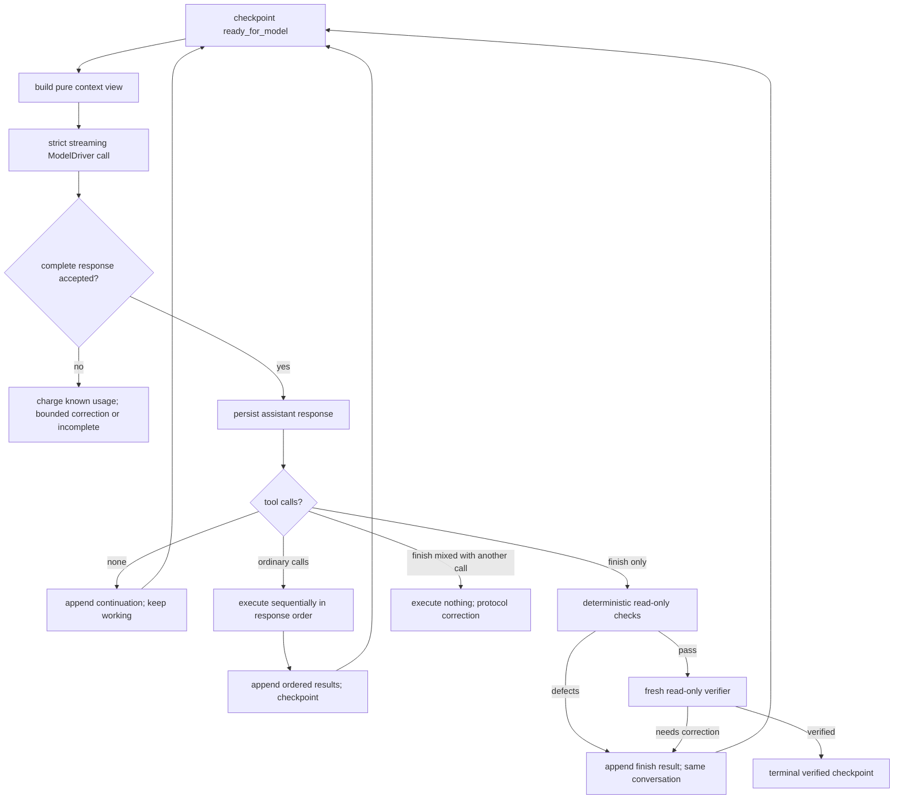
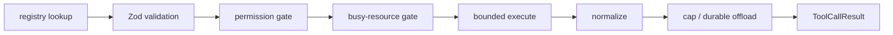

# Workflows

Current end-to-end behavior of the v3-only runtime.

## 1. Fresh task run

```mermaid
sequenceDiagram
    participant U as TUI / REPL / eval
    participant R as runTask
    participant C as v3 coordinator
    participant I as initializer
    participant W as worker
    participant D as deterministic checks
    participant V as fresh verifier
    U->>R: task + live browser + explicit policy
    R->>R: durable configuration, run dir, manifest
    R->>C: runV3Coordinator(...)
    C->>C: acquire run lock; write initializing checkpoint
    C->>I: task, contract-only tools
    I-->>C: one immutable OutputContract
    C->>W: task + contract guidance
    loop until a trusted terminal result
        W-->>C: ordered work, or exclusive finish
        C->>D: inspect claim + manifest + bytes
        alt defects
            D-->>W: finish tool result with repairs
        else checks pass
            C->>V: fresh context + facts + published run
            alt correction
                V-->>W: finish tool result with repairs
            else verified
                V-->>C: verified
            end
        end
    end
    C->>C: terminal checkpoint, projections, cleanup
    C-->>R: durable outcome
    R-->>U: runDir + verified/incomplete result
```

`runTask` creates the run directory and manifest before any tool can write. The coordinator owns the run lock, browser task pages, all three role budgets, checkpoint boundaries, and terminalization. The caller owns the browser session; only run-owned pages are closed.

The initializer gets one initial attempt and one repair. It cannot browse or write. The accepted contract becomes immutable before the worker starts.

## 2. Worker turn and completion cycle



No-tool prose is not completion. `finish` must be the only call in its response and carries `{ summary, limitations }`; deterministic checks derive requested outputs and evidence from the manifest. Deterministic failures never reach the verifier; verifier corrections resume the same worker conversation. Only verifier acceptance yields public success.

Whole-run ceilings cover worker turns, request context, tool calls, all-role model tokens, model-visible tool-result bytes, wall time, deterministic failures, and verifier corrections. Accounting is monotone and checkpointed.

## 3. Tool execution

The generic pipeline in `src/tools/pipeline.ts` performs:



Failures become structured model-readable results. A timeout abandons waiting, not necessarily the underlying effect: its access set stays busy until the executor settles. Later conflicting work waits only for a finite gate, and terminalization drains the registry to a fixed point before releasing ownership.

The worker's eight tools are static and ordered: `browser_execute`, `publish_artifact`, `read_file`, `write_file`, `edit_file`, `bash`, `ask_user`, `finish`.

- `browser_execute` runs one finite program against one exact run-owned page. Its run-scoped JavaScript policy is durable and explicit.
- `publish_artifact` is the sole worker publication surface for text, workspace bytes, screenshots, and downloads.
- File editing and `bash` operate in private `scratch/workspace/`; `bash` is foreground-only, bounded, and reconciles surviving files before returning.
- `ask_user` passes through the interactive permission seam. Headless or unavailable environments fail closed instead of hanging.
- `finish` is intercepted control flow and never reaches a generic executor.

## 4. Durable writes and recovery

Normal artifact writes use `writeArtifact`: validate the confined path and partition, persist a write-ahead journal entry, atomically replace bytes, update the manifest hash, and clear the journal. Crash recovery completes or rejects an interrupted transaction before trusted inspection.

The checkpoint store reads regular files without following symlinks, enforces a 64 MiB ceiling and strict schema, writes monotonically through same-directory atomic replacement, and retains exclusive ownership through terminal cleanup. `harness/` permissions are private and its paths are never accepted from the model.

`bash` is the deliberate write-chokepoint exception. It writes directly inside `scratch/workspace/`; `syncScratchWorkspace` then scans without following symlinks, hashes every surviving regular file, removes deleted tracked entries, and fails on unsafe or oversized nodes.

## 5. Resume

```mermaid
sequenceDiagram
    participant U as caller
    participant R as resumeTask
    participant P as read-only checkpoint probe
    participant C as coordinator
    participant S as locked checkpoint store
    U->>R: runDir + fresh browser + explicit authenticated
    R->>P: bounded/no-follow observation
    P-->>R: frozen phase + durable configuration
    R->>R: compare caller assertions
    R->>C: compose from durable values
    C->>S: acquire lock; re-read and validate full checkpoint
    S-->>C: authoritative phase state
    C->>C: recover conservatively and continue/repair projections
```

The pre-lock observation performs no write, cleanup, or lock acquisition. It is only enough to select composition. The coordinator revalidates under lock. An `uncertain` tool effect is not replayed blindly; verifier work is safe to restart because its view is bounded and read-only. A terminal resume invokes no model or browser work and creates no external trace root; it only validates integrity and repairs local projections when needed.

## 6. Browser ownership modes

- **Installed TUI, local:** attach to the user's existing Chrome over an approved loopback DevTools endpoint. Sherlock closes only its own run pages and client connection.
- **REPL, local:** managed headed Chrome with the persistent project profile.
- **Normal local eval:** managed headless Chrome with a unique temporary profile per trial; bounded parallel pool.
- **Headed local eval:** managed persistent profile in a separate serial lane. It never borrows the TUI's attached browser.
- **Browserbase:** isolated context-free sessions for normal work; configured Context for authenticated/headed work. Live View supports human takeover.

Provider selection is explicit. Remote downloads return through Browserbase's API and are hash-verified; uploads travel as bytes. Session-control URLs and API keys never enter transcripts, artifacts, model results, logs, or child environments.

## 7. Evaluation

```mermaid
sequenceDiagram
    participant CLI as eval CLI
    participant RUN as eval runner
    participant A as runTask bridge
    participant O as fresh oracle
    participant G as grader
    CLI->>CLI: load task packages; login preflight
    CLI->>RUN: tasks, k, concurrency, cancellation
    par normal managed lane
        RUN->>A: isolated trial(s)
    and headed managed lane
        RUN->>A: serial trial
    end
    RUN->>O: fetch after run
    O-->>RUN: ground truth
    RUN->>G: runDir + oracle only
    G-->>RUN: assertions
    RUN-->>CLI: ordered EvalReport
    CLI->>CLI: print and persist JSON
```

Browser/model work may overlap, but oracle fetch and grading are serialized independently. `headed` selects the serial lane; `requiresLogin` drives the pre-batch probe. A trial error is recorded and the rest of the batch continues; caller cancellation stops the batch. Never fix evals with task-name or task-text branches.

## 8. Interactive progress and cancellation

`src/tui/bridge/runSession.ts` forwards attempt-scoped streaming progress in order, derives publication events from manifest diffs, translates `ask_user` into a local dialog, and forwards abort signals through model calls and cancellable tools. Cancelling a model stream or in-flight effect first durably terminalizes the run; no effect is allowed to outlive lock release.

## 9. Developer loops

| Purpose | Command |
| --- | --- |
| Hermetic test suite (local Chrome required for browser suites) | `npm test` |
| Typecheck all TypeScript | `npm run typecheck` |
| Installed TUI | `npm run sherlock` |
| Minimal agent REPL | `npm run agent` |
| Eval batch | `npm run evals -- --tasks <names> [--k <n>] [--concurrency <n>]` |
| Login/preflight | `npm run login` / `npm run login -- --check` |
| Live Browserbase smoke (billable/networked) | `npm run smoke:browserbase` |

Do not run a new baseline without explicit user direction. Dated measurements remain in `docs/reports/`; current design rationale lives under `docs/browser-agent-v3/`.
