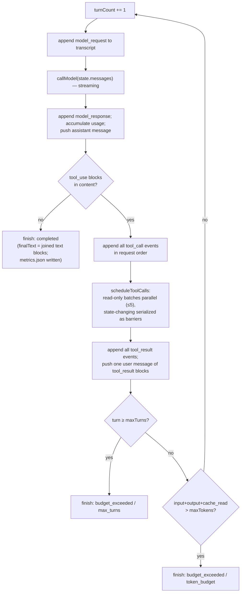
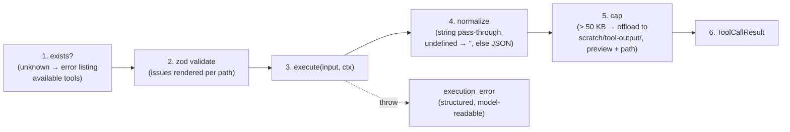
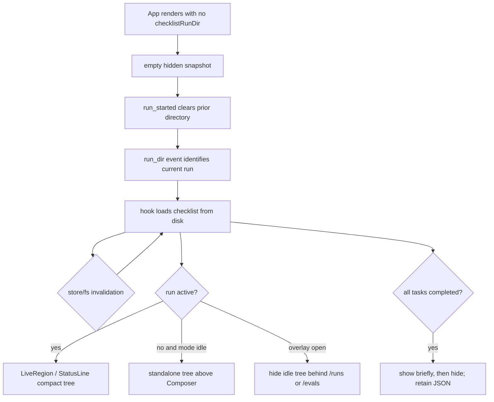

# Workflows

The key processes end-to-end.

## 1. A task run (`runTask`)

```mermaid
sequenceDiagram
    participant Caller as REPL / eval CLI
    participant RT as runTask
    participant TR as RunTracing
    participant B as BrowserController
    participant L as runAgentLoop
    Caller->>RT: runTask(taskText, { browser, ... })
    RT->>RT: createRunDir + initManifest
    RT->>TR: createRunTracing(); wrapCallModel + wrapRegistry
    RT->>TR: traceRun(taskText, ...)
    TR->>B: newTab()
    opt startUrl provided
        B->>B: goto(startUrl)
    end
    TR->>L: runAgentLoop(taskText, deps, config)
    L-->>TR: LoopResult (metrics.json written)
    Note over RT: finally, nested:<br/>closeTab → finalizeManifest → tracing.close
    RT-->>Caller: { runDir } & LoopResult
```

The browser **session** is never closed by `runTask` — only the tab. The caller (REPL or eval CLI) launches one persistent Chrome and owns its lifetime, which is how logins stay warm across tasks.

## 2. One turn of the agent loop (`src/loop/agentLoop.ts`)



Notes: completion is checked **before** the budget guards, so a final no-tool response completes even if the budget is exhausted; the token guard is strictly-greater-than, so the budget is spendable in full; `stop_reason` is never consulted.

## 3. Tool execution pipeline (`src/tools/pipeline.ts`)

Every call, six stages, never throws:



Offloaded output is written through `writeArtifact`, so it is hashed into the manifest like any deliverable.

## 4. Checklist tool and scheduler flow

Checklist calls use the same ordinary tool pipeline and do not add a second
agent loop or a stop hook:

```mermaid
sequenceDiagram
    participant M as Model
    participant L as Agent loop
    participant S as Tool scheduler
    participant T as Task tools
    participant D as Run checklist on disk
    M->>L: TaskCreate / TaskList / TaskGet / TaskUpdate
    L->>S: validated tool calls in model order
    S->>S: parallelize only read-only calls;
    state-changing calls are barriers
    S->>T: execute with ToolCtx.runDir
    T->>D: read/write checklist JSON through provenance chokepoint
    D-->>T: durable task state + invalidation signal
    T-->>L: normal tool result/nudge
    L-->>M: next model turn only while tool_use exists
```

The stable production order appends `TaskCreate`, `TaskList`, `TaskGet`, and
`TaskUpdate` after the ten existing atomic tools (and before the optional
`browser_batch` treatment tool). `TaskList` and `TaskGet` are read-only;
`TaskCreate` and `TaskUpdate` are state-changing. The loop's completion rule
remains unchanged: it stops on an assistant response with no `tool_use`
blocks, never by inspecting checklist state or `stop_reason`. Tool-result
nudges guide the model to keep the list current but cannot schedule work or
inject a next task automatically.

## 5. Checklist persistence and provenance

At run bootstrap, `initManifest` creates this self-contained layout:

```text
runs/<run-id>/
  checklist/
    .highwatermark
    <positive-id>.json
  scratch/
  artifacts/
  manifest.json
```

Checklist files are structured run state, not deliverables. The checklist
store builds every task path internally from its positive-decimal ID and writes
through `writeArtifact(..., { managedState: 'checklist' })`; the resulting
manifest entries have hashes but no `roles` or `sourceUrl`. Freeform model
writes still accept only `artifacts/` and `scratch/`. Deletion uses the
confined `deleteTrackedRunFile` helper, which loads the manifest first and
removes exactly one checklist file plus its matching provenance entry. Graders
and `/runs` summaries select published files by `requested_output` roles, so
checklist and scratch state cannot be mislabeled as deliverables.

## 6. TUI checklist subscription and lifecycle

`App` owns exactly one `useRunChecklist(state.checklistRunDir)` subscription;
the reducer stores the run directory separately from the ephemeral `live`
state. A `run_started` event clears the previous directory, and the tracing
seam emits `run_dir` before the first tool execution. The directory is
preserved after completion, cancellation, failure, or budget termination so
an incomplete checklist can remain visible while idle. A later run replaces it
and never inherits the previous run's task array.



The subscription rereads disk after same-process `onChecklistUpdated` events
and debounced filesystem notifications, with low-frequency polling protecting
against missed events while unresolved tasks remain. It cleans up watchers,
timers, and listeners when the run directory changes or `App` unmounts. Task
objects never enter transcript events or reducer state; the snapshot is a
dynamic UI view over durable files.

## 7. Browser observation and action

The working cycle the system prompt teaches the model:

1. `navigate` (or start from `startUrl`) → returns the **landed** URL + title.
2. `inspect_page` → `URL / Title` header + the ARIA outline with refs (built from the whole DOM, so no scrolling needed just to read a loaded page).
3. `click <ref>` / `type <ref>` — the tool re-reads the outline first to attach a human description to the transcript and catch stale refs before acting; stale refs return "run inspect_page again and use a current ref."
4. For lazy-loading pages (infinite scroll): `scroll` → `inspect_page` again (fresh refs, newly loaded content), or `scroll` → `screenshot` to frame a viewport capture.
5. `screenshot { filename, fullPage? }` and `download { ref, filename? }` write evidence with `sourceUrl` provenance; `download` fetches through the browser session (cookies apply) and rejects non-2xx. JS-triggered downloads (no href) are a known gap — the error message says so.

## 8. Run persistence

Ordering guarantees: `initManifest` happens before the loop starts (so `writeArtifact` can never write untracked files); `metrics.json` is written by the loop's single `finish()` funnel on every exit path; `finalizeManifest` stamps `finishedAt` in `runTask`'s `finally` even when the loop throws. The transcript is synchronous append-only JSONL — serialize-before-write so a bad event can't corrupt the file.

## 9. Running evals

```mermaid
sequenceDiagram
    participant CLI as evals/runners/cli.ts
    participant R as runEvals
    participant A as runTask (real agent)
    participant O as Oracle (live API)
    participant G as Grader
    CLI->>CLI: parse --tasks/--k; loadEvalTask each
    CLI->>CLI: BrowserSessionProvider.createSession (once for the session)
    CLI->>R: runEvals(tasks, k, { runTask })
    loop each task × k trials (sequential)
        R->>A: runTask(taskText, { startUrl })
        A-->>R: { runDir } (+ latency timed)
        R->>O: fetchOracle() — at grading time
        O-->>R: oracleData
        R->>G: grade(runDir, oracleData)
        G-->>R: AssertionResult[] (≥1 or the harness throws)
    end
    R-->>CLI: EvalReport
    CLI->>CLI: print formatReport; writeResults → evals/experiments/<id>.json
    CLI->>CLI: browser.close()
```

Modes by parameters: `--tasks hacker_news --k 1` (debugging inner loop), `--k 3` (consistency bar), `--tasks hacker_news,edgar,openclaw_pr --k 3` (the checkpoint-1 baseline command). The development done-bar is every task passing all 3 trials.

**Fixing a failing eval:** the binding rule is general mechanisms only — improve the outline, tool results, or prompt; never task-specific branches. Log failures and candidate mechanisms in `.agents/planning/.../implementation/baseline-failure-log.md` (see `docs/reports/2026-08-11-baseline.md` for the worked example).

## 10. Tracing

Per run (when `LANGFUSE_PUBLIC_KEY`/`LANGFUSE_SECRET_KEY` are set): a root `run-evidence-agent` agent span (input = task text; metadata = turnCount, toolsUsed, latencyMs) with children `call-model` generation spans (token `usageDetails`, including `cache_read_input_tokens` — the explicit prompt-caching verification signal) and `execute-<tool>` tool spans (`resultBytes`). Without credentials everything is an identity no-op; tracing failures can never change a run's outcome. The JSONL transcript + `metrics.json` remain the durable local record regardless.

## 11. Developer loops

| Loop | Command |
| --- | --- |
| Unit/integration tests (no network beyond loopback; needs local Chrome) | `npm test` |
| Typecheck (covers `src`, `demos`, `evals`, `tests`) | `npm run typecheck` |
| Interactive agent session | `npx tsx --env-file=.env src/cli/repl.ts` (or `npm run agent` with ambient env) |
| One eval task, once | `npx tsx --env-file=.env evals/runners/cli.ts --tasks hacker_news --k 1` |
| Subsystem walkthrough | `npx tsx demos/<nn>-<name>.ts` (09/14 need the API key; 10–14 need Chrome) |
| Inspect a run | read `runs/<id>/transcript.jsonl`, `manifest.json`, `metrics.json`; or the Langfuse trace |
