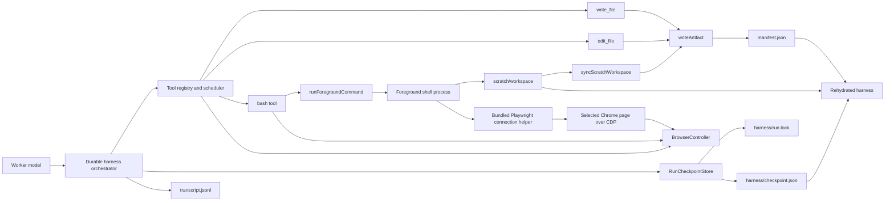

# Browser Agent Local Code Execution — Detailed Specification

**Status:** Proposed

**Date:** 2026-08-13

**Scope:** Worker-only local Bash execution, exact file editing, durable worker
state, and Playwright code-as-action integration

**Implementation target:** `feat/judge-harness`, currently at `cb2e22d`. This
specification is authored on `feat/browser-agent-code-execution` and will be
ported to that branch for implementation. It relies on the judge branch's
existing `runAgentLoop()` and initializer → worker → judge loop; later Browser
V2 components such as `WorkerSession`, `RunBudgetTracker`, output contracts,
and stable observations are not prerequisites.

## 1. Overview

The browser agent should be able to write, edit, and execute programs while it
works. This is a deliberate expansion from page-scoped JavaScript to local
code-as-action:

- keep the existing `write_file` tool unchanged;
- add an `edit_file` tool beside it, using Claude Code's familiar
  `file_path` / `old_string` / `new_string` / `replace_all` contract;
- add a worker-only `bash` tool that runs finite local commands;
- make the run's private scratch area the command working directory and the
  durable home for generated scripts;
- let generated scripts attach to the browser agent's selected Chrome page and
  use Playwright locators, waits, loops, and extraction;
- keep orchestration, model history, usage/limit state, judge state, manifests,
  and checkpoints in the harness rather than in a command process;
- recover a run from its run directory if the harness or command process dies.

This design does **not** use any remote sandbox. Bash runs locally as the same
operating-system user as the application. The scratch workspace is a lifecycle
and persistence boundary, not a security boundary.

## 2. Goals

1. Let the worker replace many model-mediated browser micro-steps with a
   short, reviewable Playwright program.
2. Let the worker make small, exact edits without repeatedly rewriting whole
   files through `write_file`.
3. Preserve the current run directory as the product, provenance, and recovery
   boundary.
4. Preserve exact file bytes outside the explicitly replaced substring.
5. Keep generated programs private by default and durable across restarts.
6. Make command timeouts, exits, output, and workspace changes explicit in the
   transcript.
7. Resume from a durable checkpoint without replaying an uncertain
   state-changing operation.
8. Keep Bash and edit capabilities out of the initializer and judge.

## 3. Non-goals

- Providing host isolation, container isolation, filesystem confinement, or a
  security sandbox.
- Making arbitrary Bash commands transactional.
- Resuming or attaching to a command process that was running when the harness
  died.
- Supervising a child process that outlives an ungracefully killed local
  harness; automatic resume requires the previous process tree to be gone.
- Supporting Windows process and signal semantics in the first version.
- Provisioning per-run virtual environments or package installations; scripts
  use host executables and the application's bundled Playwright dependency.
- Supporting background commands in the first version.
- Treating the transcript as the recovery database.
- Allowing generated scripts to publish deliverables without the normal
  manifest and judge-harness checks.
- Replacing `write_file`, `read_file`, `grep`, or browser tools. If
  page-scoped `execute_javascript` is ported later, it remains available for
  simple DOM work.
- Giving Bash, file writes, or browser mutation to the initializer or judge.

## 4. Binding decisions

| Concern                                | Decision                                                                                         |
| -------------------------------------- | ------------------------------------------------------------------------------------------------ |
| Execution location                     | Local child process started by the harness                                                       |
| Platform and shell                     | POSIX (macOS/Linux), fixed `/bin/bash`, invoked non-interactively with `-c`                      |
| Bash working directory                 | `<runDir>/scratch/workspace`                                                                     |
| Generated scripts and intermediates    | Agent-organized files directly under `<runDir>/scratch/workspace/`                               |
| Run product and provenance             | Existing `artifacts/` and `scratch/` tree plus `manifest.json`                                   |
| Durable harness state                  | Harness-owned `<runDir>/harness/`, outside the agent workspace                                   |
| Browser after harness restart          | Recreated; prior page state and element refs are treated as invalid                              |
| In-flight command after restart        | Reported as interrupted; never silently replayed                                                 |
| Possible orphan after hard parent kill | Resume stops until the caller establishes that the previous process tree ended                   |
| File edit matching                     | Exact code-unit match only; no quote, whitespace, newline, indentation, or Unicode normalization |
| File edit persistence                  | Entire resulting byte sequence is written through `writeArtifact()`                              |
| Workspace file sync limit              | 256 MiB per regular file; larger files fail before being read into memory                        |
| Bash scheduling                        | State-changing barrier; one command at a time                                                    |
| Background processes                   | Not supported initially                                                                          |
| Tool exposure                          | Main worker only; initializer and judge remain incapable of mutation                             |

## 5. Architecture



The harness owns sequencing and durable state. Bash is a replaceable execution
mechanism. A generated program can manipulate the browser, but it does not own
the browser session, the run lifecycle, output verification, or publication.

### 5.1 Logical components

#### `runForegroundCommand()`

One process helper starts and terminates the shell, captures bounded output,
and returns its exit result. It knows nothing about model messages, manifests,
browser state, or checkpoints.

#### `syncScratchWorkspace()`

One reconciliation function compares surviving files under
`scratch/workspace/` with their current manifest entries and updates the
manifest through the artifact module.

#### `RunCheckpointStore`

Acquires the run lock when opened, atomically saves and validates
`harness/checkpoint.json`, and releases the lock when closed. It is the recovery
source of truth for model and harness state; the transcript remains an
append-only audit log.

The `bash` tool executor directly coordinates the process helper, workspace
sync, and the two `BrowserController` lifecycle methods. There is no additional
runtime or manager class. Checkpointing remains in the harness and scheduler;
individual tools do not read or write checkpoints.

### 5.2 Suggested implementation files

| Responsibility                               | File                                                                                  |
| -------------------------------------------- | ------------------------------------------------------------------------------------- |
| `edit_file` definition and exact replacement | `src/tools/editFile/editFile.ts`                                                      |
| `bash` definition and lifecycle coordination | `src/tools/bash/bash.ts`                                                              |
| Foreground process execution                 | `src/tools/bash/runForegroundCommand.ts`                                              |
| Scratch manifest synchronization             | `src/run/syncScratchWorkspace.ts`                                                     |
| Checkpoint, atomic save, and run lock        | `src/run/runCheckpointStore.ts`                                                       |
| Generated-script Playwright helper           | `src/browser/browserScriptHelper.mjs`                                                 |
| Browser preparation and refresh              | Existing `src/browser/controller.ts` and `src/browser/playwrightBrowserController.ts` |

Do not add a generic code-execution runtime, workspace-manager class, browser
connection manager, receipt store, or Bash-specific output store unless a later
requirement gives it behavior that these files cannot own directly.

### 5.3 Claude Code patterns adopted

The local Claude Code source is a useful implementation reference, but not a
template to copy wholesale. Paths in this subsection are relative to the local
reference checkout at `~/Desktop/Code/claude-code`. This design adopts the
following mechanisms:

- flat session-specific scratch storage whose internal organization is chosen
  by the model, adapted here as the Bash working directory
  (`src/utils/permissions/filesystem.ts`);
- strict public tool schemas, with runtime-only fields kept out of the model
  contract (`src/tools/BashTool/BashTool.tsx`);
- a finite file-size guard and one uninterrupted read/validate/replace/write
  critical section for edits (`src/tools/FileEditTool/FileEditTool.ts`);
- a child abort controller for each command, a pre-spawn abort check, one
  terminal settlement path, and explicit listener/timer cleanup
  (`src/utils/abortController.ts`, `src/utils/Shell.ts`, and
  `src/utils/ShellCommand.ts`);
- byte-counted command output limits, followed by the repository's existing
  `capResult` offload path rather than a second Bash-specific storage system
  (`src/utils/toolResultStorage.ts` and `src/utils/task/diskOutput.ts`);
- exclusive lock creation, ownership checks, and idempotent cleanup
  (`src/utils/computerUse/computerUseLock.ts`);
- registered graceful-shutdown cleanup and an explicit durability flush before
  process exit (`src/utils/cleanupRegistry.ts` and
  `src/utils/sessionStorage.ts`);
- a dedicated subprocess-environment constructor that omits credentials the
  child does not need (`src/utils/subprocessEnv.ts`).

This design deliberately does not adopt Claude Code's fuzzy quote matching,
newline normalization, edit-based file creation, mutable shell working
directory, background task subsystem, sandbox/permission framework, or JSONL
transcript as the recovery database. Those behaviors conflict with exact-byte
editing, a fixed run workspace, the foreground-only first version, or the
checkpoint architecture defined here. Claude Code's multi-gigabyte
direct-to-file background output path is also unnecessary while this version
enforces a 10 MiB foreground output ceiling. Delayed progress events are also
deferred until real command durations show they are useful. Its read-before-edit
cache, file-history/LSP integration, shell AST permission classifier, and
special interpretation of command exit codes are also omitted: exact
execution-time matching, run manifests, always-state-changing Bash scheduling,
and raw exit reporting already provide the behavior this agent needs.

## 6. Run-directory layout

```text
<runDir>/
  manifest.json                    existing provenance index
  transcript.jsonl                 existing append-only audit log
  metrics.json                     existing terminal metrics
  harness/                         harness-private durable state
    run.lock                       exclusive ownership of a resumable run
    checkpoint.json                atomically replaced resumable state
  artifacts/                       published outputs and evidence
  scratch/
    workspace/                     Bash working directory
    tool-output/                   existing oversized result offloads, including Bash output
```

`scratch/workspace` is private, durable working state. It is not graded or
shown as a deliverable, but its surviving files are hashed in the manifest.
It has no required internal layout: the worker may create scripts,
intermediate data, and temporary files directly within it or introduce
subdirectories when a task benefits from them. The worker should create
scripts through `write_file`, modify them through `edit_file`, and execute
them through `bash`.

`harness/` is not part of the agent workspace and is never exposed as a valid
model-supplied file-tool path. `scratch/tool-output/` remains the single home
for oversized tool results; Bash does not introduce a parallel
`command-output/` convention.

Create new `harness/` and `scratch/workspace/` directories with mode `0700` and
harness-state files with mode `0600` on POSIX systems. Existing directories are
validated but are not silently re-permissioned. Permission bits are
defense-in-depth for local multi-user hosts, not a sandbox boundary.

The harness may recreate empty directories during recovery. It must never
silently replace or clear existing workspace files.

## 7. Tool surface

### 7.1 `write_file`

The existing contract and implementation remain unchanged. In particular:

- it accepts run-directory-relative `artifacts/...` or `scratch/...` paths;
- it supports overwrite and `append: true`;
- published roles keep their current behavior;
- every final byte sequence goes through `writeArtifact()`;
- existing tool results and tests remain valid.

Generated scripts use paths such as:

```json
{
  "file_path": "scratch/workspace/collect.mjs",
  "content": "// ..."
}
```

### 7.2 `edit_file`

#### Model-facing input

```ts
interface EditFileInput {
  file_path: string; // run-directory-relative
  old_string: string; // exact text to find
  new_string: string; // exact replacement
  replace_all?: boolean; // default false
}

interface EditFileResult {
  file_path: string;
  replacement_count: number;
}
```

The Zod schema is a strict object. Unknown keys fail validation. Unlike the
local Claude Code contract it is based on, `file_path` is run-directory
relative rather than absolute because every model-supplied path remains behind
`resolveRunPath()`.

#### Required behavior

1. Classify the requested path using the same workspace partition logic as
   `write_file`. Only existing regular files under `artifacts/` or `scratch/`
   are editable.
2. Resolve the path through `resolveRunPath()`.
3. Fail if the file is absent, is a directory, or is a symbolic link.
4. Read the file size before its contents and fail before allocation when it
   exceeds the fixed 64 MiB edit limit.
5. Read the file as bytes.
6. Decode only byte-stable UTF-8. Re-encoding the decoded string must reproduce
   the original bytes exactly before any edit is attempted. This preserves a
   UTF-8 BOM and rejects invalid UTF-8 or unsupported encodings instead of
   corrupting them.
7. Reject an empty `old_string`. File creation and insertion without an exact
   anchor belong to `write_file`.
8. Reject `old_string === new_string` as a no-op.
9. Count exact, non-overlapping occurrences of `old_string` without any
   normalization.
10. Fail if there are zero occurrences.
11. When `replace_all` is false or omitted, require exactly one occurrence.
    Multiple occurrences fail with the count and instruct the worker to add
    context or set `replace_all: true`.
12. When `replace_all` is true, replace every exact occurrence and report the
    count. Apply replacements with a callback or equivalent literal operation so
    JavaScript replacement tokens such as `$&` and `$1` inside `new_string` are
    inserted verbatim.
13. Encode the complete resulting string as UTF-8 and write those complete
    bytes through `writeArtifact()`.
14. For a scratch file, pass no roles. For a published file, require its
    existing manifest entry and preserve its roles. A content edit clears
    `sourceUrl`; edited bytes are no longer an exact capture. If
    `completionStatus` is ported to the judge branch before implementation, clear
    it as well so edited bytes must pass completion again.
15. Return `EditFileResult` using the normalized run-relative path. The updated
    hash already lives in the manifest and is not duplicated in the tool result.

There is intentionally no fuzzy matching. The implementation must not:

- convert `\n` and `\r\n`;
- trim trailing whitespace;
- reindent or reformat the file;
- normalize Unicode;
- translate straight and curly quotes;
- replace a merely similar string;
- create a missing file.

The operation is synchronous from the execution-time read through
`writeArtifact()` and is a state-changing scheduler barrier. Do not perform an
asynchronous operation between the final read, match validation, replacement,
and write. Validation that touches the filesystem is repeated inside
`execute`; a successful earlier schema/permission check is never treated as a
current file snapshot. The exact `old_string` also acts as an optimistic
concurrency guard: if the file no longer contains what the model read, the
edit fails instead of guessing.

#### Example errors

```text
File does not exist: scratch/workspace/collect.mjs
```

```text
Exact old_string was not found in scratch/workspace/collect.mjs.
No whitespace, newline, quote, or Unicode normalization is performed.
```

```text
Found 4 exact matches in scratch/workspace/collect.mjs, but
replace_all is false. Add surrounding context to identify one match or set
replace_all to true.
```

### 7.3 `bash`

#### Model-facing input

```ts
interface BashInput {
  command: string;
  timeout_ms?: number; // default 30_000, maximum 120_000
  uses_browser?: boolean; // default false; required for Playwright/CDP access
}
```

The first version does not expose `run_in_background`. Every invocation must
reach a terminal result or be killed before the tool returns.
Set `uses_browser: true` only when the command or invoked script will connect
to the selected browser page. Plain shell commands leave it false and do not
prepare, refresh, or invalidate browser state.

The Zod schema is strict: unknown keys fail, `command` must contain at least one
non-whitespace character, `timeout_ms` must be an integer from 1 through
120,000, and `uses_browser` must be boolean when present. Invalid input fails
before a checkpoint transition, browser
preparation, or process spawn; timeout values above the maximum are rejected
rather than silently clamped.

#### Model-facing result

```ts
interface BashResult {
  status: "exited" | "timed_out" | "output_limit_exceeded" | "cancelled";
  exit_code: number | null;
  termination_signal: string | null;
  duration_ms: number;
  stdout: string;
  stderr: string;
  changed_files: Array<{
    path: string;
    change: "created" | "modified" | "deleted";
  }>;
}
```

A nonzero command exit is a completed command result, not a tool transport
failure. The explicit status and exit code let the model diagnose it while
preserving stdout and stderr. Spawn failures, workspace-sync failures, and
browser-refresh failures are pipeline execution errors.

`stdout` and `stderr` contain the captured streams.
`runForegroundCommand()` enforces the 10 MiB combined process-output ceiling
before constructing this result.
Afterward, the standard tool pipeline applies its existing 50 KB result cap:
large `BashResult` JSON is saved under `scratch/tool-output/` through
`writeArtifact()` and replaced with the same preview and path shape used by
every other tool. Bash does not implement a second offload format or filename
scheme.

#### Process behavior

1. At run startup, require `/bin/bash` to be present and executable. Failure
   occurs before the model is called. Making the shell configurable is deferred
   until a concrete environment requires it.
2. Create `scratch/workspace/` with owner-only permissions if absent. Do not
   pre-create or require an internal directory taxonomy.
3. Create a command-specific abort controller linked to
   `ToolCtx.abortSignal`. If it is already aborted, do not spawn; return a
   terminal `cancelled` result. `RunTaskConfig` gains the corresponding optional
   signal, and the TUI passes its existing run-cancellation signal through.
4. When `uses_browser` is true, require both browser-script lifecycle methods,
   call `browserController.prepareForBrowserScript()`, and add the bundled
   helper URL plus the returned CDP values to the command environment. Then
   invoke the shell as
   `shell -c <command>` with
   `cwd=<runDir>/scratch/workspace`. Do not invoke a login shell or source
   shell profiles implicitly. Close stdin immediately so a command cannot wait
   indefinitely for input the tool cannot provide.
5. Start the child in a fresh process group. Timeout, cancellation, or output
   overflow sends `SIGTERM`, waits a fixed two-second grace period, then sends
   `SIGKILL` to the entire process group.
6. Stream stdout and stderr separately into byte-counted bounded buffers. The
   fixed 10 MiB combined limit terminates a command that produces unbounded
   output.
7. Treat the shell process's `exit` event as the trigger to terminate any
   remaining members of its process group, then drain stdout/stderr within a
   one-second deadline. Do not wait indefinitely for `close`: a descendant
   may have inherited a pipe. Background descendants are not allowed to outlive
   a foreground-only Bash invocation.
8. Run `syncScratchWorkspace()` after the process settles. If browser setup
   succeeded, also call `browserController.refreshAfterBrowserScript()`. Both
   cleanup actions are attempted even after spawn failure, cancellation,
   timeout, or output overflow.
9. Return one `BashResult`; the existing tool pipeline serializes and caps it.
   The harness records that result in the transcript and checkpoint outside the
   tool implementation.

All exit, error, abort, and timeout paths converge on one settlement routine.
That routine clears timers, removes abort and stream listeners, closes handles,
and attempts each required cleanup exactly once. Graceful harness shutdown
first cancels the active command, waits for this cleanup within a finite
deadline, and calls `RunCheckpointStore.close()` last so its pending save is
flushed before the lock is released.
A hard crash is handled by the recovery rules rather than pretending cleanup
completed.

#### Environment

The child receives a fresh copy of `process.env`, not the mutable object itself.
The harness removes its model-provider, tracing, and other configured secret
variables, as well as shell startup hooks such as `BASH_ENV` and `ENV`, then
adds:

```text
SHERLOCK_PLAYWRIGHT_HELPER_URL=<file URL of bundled helper, when available>
SHERLOCK_CDP_URL=<ephemeral loopback CDP URL, when available>
SHERLOCK_SELECTED_PAGE_TARGET_ID=<selected page target, when available>
```

These three variables are present only when `uses_browser` is true and browser
preparation succeeds.

No workspace-path variable is needed because the child starts in the workspace
and can use `process.cwd()` or its language equivalent.

Set `GIT_EDITOR=true`, `GIT_PAGER=cat`, `PAGER=cat`, and
`GIT_TERMINAL_PROMPT=0`. The command may override these values within its own
shell process. `runTask` owns one shared secret-variable denylist so newly
introduced harness credentials have one obvious place to be added.

This environment shaping improves reproducibility but does not create a
security boundary: local Bash can still inspect resources available to the
application's operating-system user.

## 8. Command-created files and provenance

The preferred path is for the model to create and edit scripts with the file
tools. Bash nevertheless creates files naturally: Playwright scripts save
JSON, screenshots, traces, and downloads.

After each command, `syncScratchWorkspace()` walks `scratch/workspace/` once
without following symbolic links and compares the resulting files with the
current manifest entries for that directory:

- new and modified regular files are read as exact bytes and committed through
  `writeArtifact()` under their existing scratch paths;
- deleted tracked scratch files are removed from the current manifest by a
  new `removeScratchArtifactEntry()` operation and recorded in the
  tool result and transcript;
- symbolic links, sockets, devices, and other special files are not followed
  or manifested and cause reconciliation to fail loudly;
- filesystem changes are returned in `changed_files`.

The manifest already contains every file's previous hash, so a separate
pre-command snapshot would duplicate existing state. For each candidate file,
open with no-follow semantics where the platform supports them, verify the
opened handle is still a regular file, and hash the exact bytes read from that
handle. Compare those hashes with the manifest rather than trusting timestamps
or sizes, so same-size rewrites are still detected.

Before reading a file into memory, fail synchronization if its opened-handle
size exceeds the fixed 256 MiB per-file limit, and enforce the same ceiling
while reading in case the file grows. The file remains in the workspace for
inspection or deletion, but the Bash call returns an execution error rather
than risking unbounded memory use or claiming incomplete provenance.

The tool contract tells the model to keep direct command output inside
`scratch/workspace` and publish final files through `write_file`, screenshot,
or download. Because this version is not sandboxed,
the harness cannot truthfully guarantee that Bash did not write somewhere else
on the host. It guarantees provenance only for surviving files inside the run
workspace that it synchronizes.

## 9. Playwright code-as-action

When page-scoped `execute_javascript` is available, it remains the cheapest
tool for DOM-only extraction. It is not present on the judge-branch baseline
and is not required here. Bash is valuable when the task needs Playwright
locators, auto-waiting, loops, branching, popups, downloads, or a reusable
script.

### 9.1 Preparing the browser for a generated script

The existing `BrowserController` contract gains two direct lifecycle methods.
There is no separate manager, capability object, lease, or ownership token:

```ts
interface BrowserScriptSetup {
  cdpUrl: string;
  selectedPageTargetId: string;
}

interface BrowserController {
  // Existing browser methods are omitted here.
  prepareForBrowserScript?(): Promise<BrowserScriptSetup>;
  refreshAfterBrowserScript?(): Promise<void>;
}
```

`prepareForBrowserScript()` returns the two values needed to connect to the
currently selected page. The Bash tool maps them to `SHERLOCK_CDP_URL` and
`SHERLOCK_SELECTED_PAGE_TARGET_ID`. The existing state-changing scheduler
prevents another browser tool from running alongside Bash, so no ownership
mechanism or retained setup state is necessary.

Browser-script support exists only when both optional methods are present; a
controller implementing exactly one is a startup configuration error. Only
call `refreshAfterBrowserScript()` after successful preparation. Both methods
are idempotent reads/refreshes rather than a stateful lease protocol.

The local Playwright provider launches Chrome with an ephemeral loopback CDP
endpoint and is the only provider implementing these methods in the first
version. Other providers omit both methods. Ordinary Bash still runs;
`uses_browser: true` fails before spawn with a capability-unavailable error.

The provider starts Chrome with `--remote-debugging-port=0`, reads the resulting
`DevToolsActivePort` from its user-data directory, validates that the endpoint
is loopback, and passes it into the controller. To obtain the selected page's
target ID, the controller uses a CDP session and `Target.getTargetInfo`; it does
not read private Playwright fields.

### 9.2 Bundled runtime helper

The application bundles a small JavaScript module beside the installed
Playwright dependency. Generated scripts dynamically import the absolute file
URL from `SHERLOCK_PLAYWRIGHT_HELPER_URL`; dependency resolution therefore
happens from the application package rather than the scratch directory. No
per-run `npm install` is required.

Example generated script:

```js
import { writeFile } from "node:fs/promises";

const { connectSelectedPage } = await import(
  process.env.SHERLOCK_PLAYWRIGHT_HELPER_URL
);

const { page } = await connectSelectedPage();

await page.getByRole("button", { name: "Load more" }).click();
const rows = await page
  .locator("table tbody tr")
  .evaluateAll((elements) =>
    elements.map((row) => [...row.cells].map((cell) => cell.innerText.trim())),
  );

await writeFile("rows.json", JSON.stringify(rows, null, 2));
```

Run it with:

```json
{
  "command": "node collect.mjs",
  "uses_browser": true
}
```

The script writes into its current scratch workspace. The helper selects the
page by CDP target ID, returns real Playwright objects, and never closes the
owning browser. Process exit disconnects the secondary CDP client.

`connectSelectedPage()` validates every required environment value, connects
only to a loopback CDP URL, and requires exactly one live page matching
`SHERLOCK_SELECTED_PAGE_TARGET_ID`. It never falls back to the first page or
silently changes controller selection. Errors distinguish missing browser
support, CDP connection failure, and selected-page disappearance so the worker
can decide whether to retry, inspect the page, or continue with ordinary Bash.

### 9.3 Refreshing browser state after the script

`refreshAfterBrowserScript()` always runs after the command settles when
preparation succeeded. On the judge-branch controller it inventories live
`BrowserContext.pages()` and reconciles the selected `activePage`. That
controller has no separate document/observation store, so this feature does
not add one solely for refresh. If stable browser identity is ported later,
refresh must also invalidate old element refs and observation baselines.

If the selected page was closed, the controller selects a remaining live page
or creates a fresh task page. If the script closed the entire browser
session, refresh fails loudly and later browser tools remain unavailable;
recreating a session mid-run is outside the first version. Repeated refresh is
a no-op once controller state matches the live browser.

The Bash result does not pretend to describe current browser state. The system
prompt instructs the model to call `inspect_page` after browser automation,
often in the same response after the Bash call, so the scheduler executes it
after Bash's state-changing barrier.

## 10. Durable harness state

The judge branch's `runAgentLoop()` state and `runHarnessCycles()` progress are
memory-only. The new design makes the state required for continuation explicit
and serializable without introducing a `WorkerSession` class or changing the
judge harness's current fresh-conversation-per-cycle behavior.

### 10.1 Run ownership

Opening `RunCheckpointStore` exclusively creates `harness/run.lock` with mode
`0600` before any mutable run state is loaded:

```ts
interface RunLockFile {
  harnessInstanceId: string;
  processId: number;
  acquiredAt: string;
}
```

Creation uses `wx`/`O_EXCL`. A valid lock owned by a live process blocks a
second harness from opening the same run. A lock whose process is no longer
alive is stale: the new harness records that recovery in the transcript,
removes the stale lock, and retries exclusive creation once. A corrupt lock
fails loudly and is left untouched for inspection. Release is idempotent and
removes the lock only when `harnessInstanceId` still matches.
The centralized graceful-shutdown sequence releases the lock only after active
command cleanup and durable-state flushing; lock release is not an unordered
parallel cleanup callback. A hard crash leaves a stale lock for recovery. PID
reuse can conservatively block recovery; it must never cause the new harness to
steal a run from a live process.
`RunCheckpointStore` verifies the current lock still contains its
`harnessInstanceId` before each save. A missing or changed lock cancels further
mutation and fails loudly.

### 10.2 Checkpoint schema

```ts
interface RunCheckpointV1 {
  schemaVersion: 1;
  checkpointRevision: number;
  runStatus:
    | "initializing"
    | "ready_for_model"
    | "executing_tools"
    | "judging"
    | "terminal";
  updatedAt: string;

  runConfiguration: {
    model: string;
    toolProfile: ToolProfile;
    maxOutputTokens: number;
    maxTurns: number | "unbounded";
    maxContextTokens: number;
    startUrl?: string;
    harness?: {
      maxWorkerCycles: number;
    };
  };

  initializer?: {
    acceptedOutput?: InitializerResult;
    filesWritten: boolean;
  };

  agentLoop?: {
    messages: Message[];
    turnCount: number;
    inputTokens: number;
    outputTokens: number;
    cacheReadInputTokens: number;
    cacheCreationInputTokens: number;
    peakContextTokens: number;
    elapsedWallTimeMs: number;
  };

  runProgress: {
    mode: "single_worker" | "judge_harness";
    currentCycle: number;
    openingMessage: string;
    cycleRecords: HarnessCycleRecord[];
    completedCycleMetrics: RunMetrics[];
    completedWorkerResult?: LoopResult;
  };

  pendingTurn?: {
    turnNumber: number;
    assistantMessage: AssistantMessage;
    toolCalls: Array<{
      request: ToolCall;
      executionStatus: "pending" | "running" | "finished";
      result?: ToolCallResult;
    }>;
  };

  finalResult?: LoopResult;
}
```

The checkpoint stores current control state, not copies of artifact bytes. The
initializer output is included only until its deterministic `INTENT.md` and
`CONTRACT.md` writes are confirmed. `completedCycleMetrics` is the small
in-memory input needed for the existing final metrics rollup; the archived
cycle files remain the audit copies.

`agentLoop` may be absent only while `runStatus` is `initializing`, before the
first worker cycle begins. It is required for `ready_for_model`,
`executing_tools`, `judging`, and `terminal` checkpoints.

The judge branch has no `RunBudgetTracker`. Its actual limits and accounting
live in `LoopConfig`, the agent-loop token totals, turn count, peak context,
elapsed time, and `maxWorkerCycles`. The checkpoint persists those exact values
so restart does not reset a turn, context, usage, wall-time, or cycle limit.
`'unbounded'` represents the existing `Infinity` max-turns value because JSON
cannot encode `Infinity` faithfully.

### 10.3 Atomic persistence

The store has one small public surface:

```ts
interface RunCheckpointStore {
  load(): RunCheckpointV1 | undefined;
  save(checkpoint: RunCheckpointV1): Promise<void>;
  close(): Promise<void>;
}

function openRunCheckpointStore(runDir: string): Promise<RunCheckpointStore>;
```

`close()` is idempotent. After it begins, later saves fail.

To save checkpoint revision `N`:

1. validate the complete checkpoint against its versioned schema;
2. serialize it before touching the existing checkpoint;
3. write `harness/checkpoint.json.tmp`;
4. flush the temporary file;
5. atomically rename it over `harness/checkpoint.json`;
6. flush the `harness/` directory where the platform supports it.

A partially written temporary file is ignored on recovery. A missing or
invalid main checkpoint is a loud recovery failure, not a reason to start a
fresh conversation against the same run directory.

`RunCheckpointStore` exclusively owns `run.lock`, `checkpoint.json`, and its
temporary file. Checkpoint saves are serialized, and each save resolves only
after reaching its flush boundary. A save must have a `checkpointRevision`
greater than the last durable revision; stale or duplicate revisions fail
instead of overwriting newer state. `close()` waits for the current save and
then releases the run lock. Because Bash is not sandboxed, this is an
architectural ownership rule rather than filesystem enforcement; recovery
validation detects tampering or accidental writes.

### 10.4 Checkpoint boundaries

Save after every durable state transition:

1. initial run configuration, before the optional initializer call;
2. acceptance of initializer output, before writing `INTENT.md` and
   `CONTRACT.md`, and again after those files exist;
3. creation or restoration of the current agent-loop state;
4. acceptance of a complete worker model response, before any requested tool
   runs;
5. before each state-changing tool starts (`executionStatus: running`);
6. after each tool result is saved (`executionStatus: finished`);
7. after a worker cycle and its metrics are complete, before the judge runs;
8. after the judge verdict or failure updates the cycle record, next opening
   message, or final result;
9. when the run reaches a terminal outcome.

The transcript is written alongside these transitions for auditability, but
recovery does not reconstruct model messages by heuristically replaying JSONL.
Checkpointing wraps the scheduler: it awaits the `running` save before invoking
a state-changing tool and awaits the `finished` save after receiving each tool
result. Tool implementations, including `bash`, never receive the checkpoint
store.

There is no separate per-tool receipt store. If a process dies after a tool's
side effect but before its finished checkpoint, recovery treats the call as
interrupted and asks the worker to inspect surviving state. That deliberately
trades recovery of one already-computed result for a much smaller persistence
protocol while still preventing automatic replay.

### 10.5 Recovery rules

Recovery is exposed as a separate entry point such as:

```ts
resumeTask(runDir: string, config: ResumeTaskConfig): Promise<RunTaskResult>
```

`ResumeTaskConfig.confirmPreviousCommandStopped` defaults to `false` and is
consulted only when the checkpoint contains a `running` Bash call. A supervising
orchestrator or human sets it to `true` only after the prior process tree is
known to be gone. The rest of `ResumeTaskConfig` mirrors `RunTaskConfig`: the
caller supplies non-serializable dependencies again, including a newly created
`BrowserController`, model-call functions, tracing, credentials, and user
interaction callbacks. Stored scalar configuration must match.

It performs the following sequence:

1. Resolve the run directory and open `RunCheckpointStore`, which acquires
   `harness/run.lock` before any mutable state is loaded.
2. Validate the checkpoint, manifest structure, checkpoint schema version, and
   stored scalar configuration against the resume request.
3. If Bash was `running`, require
   `config.confirmPreviousCommandStopped === true`, then run
   `syncScratchWorkspace()` so surviving command-created files are reflected in
   the manifest.
4. Verify every current manifest entry still matches its file and hash.
5. If initialization was interrupted after its output was accepted, finish the
   deterministic `INTENT.md` and `CONTRACT.md` writes without another
   initializer call. If no initializer output was accepted, the read-only model
   call may be retried.
6. Restore agent-loop messages, usage counters, elapsed time, current judge
   cycle, completed cycle records, and archived-metrics inputs.
7. Open a fresh task tab in the newly supplied browser.
   `runForegroundCommand()` is stateless and needs no rehydration.
8. If every call in a pending turn is still `pending`, continue that turn.
9. If any call is `running`, do not replay it. Append an interrupted error for
   that call and not-executed errors for later pending calls, then let the
   worker inspect durable workspace/browser state before deciding what to do.
10. Require every `finished` call to contain its exact pipeline result;
    otherwise the checkpoint is invalid.
11. Reopen the configured start URL when appropriate. Never attempt to reuse
    old browser refs or IDs.
12. Append one recovery notice to the worker conversation explaining that
    scratch/artifacts survived but browser state was recreated.
13. If recovery starts in `judging`, run the judge against the stored completed
    worker result without repeating that worker cycle. Otherwise continue the
    current fresh judge-cycle conversation from `ready_for_model`.
14. If the checkpoint is terminal, complete any idempotent manifest/metrics
    finalization and return its stored `LoopResult` without a model or tool call.

An example interruption result is:

```text
The local worker restarted while this Bash command was running. The command
was not replayed. Files already committed under scratch/ or artifacts/ remain;
inspect them before retrying. The browser session was recreated, so prior page
and element identifiers are invalid.
```

This provides at-most-once automatic execution. Exactly-once semantics are not
claimed for arbitrary shell effects.

## 11. Scheduling and concurrency

- `edit_file` is always state-changing.
- `bash` is always state-changing, even when the command appears read-only.
- Both remain barriers under the existing scheduler.
- The first version runs only one Bash process per run.
- The existing state-changing barrier excludes browser actions and
  `inspect_page` until Bash and its final browser refresh finish. If page
  JavaScript or page switching is ported later, the same barrier covers them.
- `read_file` and `grep` may run in parallel only when no earlier
  state-changing barrier is outstanding, preserving the current scheduler
  contract.
- No static command parser attempts to infer whether a command is read-only.

## 12. Tool registration and prompt stability

`edit_file` belongs in the existing file-tools source group immediately after
`write_file`:

```ts
export const fileTools = [readFileTool, writeFileTool, editFileTool, grepTool];
```

`bashTool` is appended directly after `fileTools` in the worker's production
registry. Initializer and judge model calls remain tool-less.

The resulting production tool order is frozen and deterministic. Enabling the
feature requires one intentional prompt-prefix version change; it must not
vary based on task text, current workspace contents, dependencies, or whether
browser-script support is presently available. Browser-script availability
belongs in tool results and dynamic context, not in the static system prompt or
tool schema.

The system prompt gains concise instructions:

- store generated scripts and intermediates under `scratch/workspace/`, using
  subdirectories only when useful to the task;
- use `write_file` to create and `edit_file` for exact changes;
- Bash starts in `scratch/workspace`;
- set `uses_browser: true` for commands that run Playwright automation;
- when page JavaScript is available, prefer it for simple DOM extraction and
  Playwright scripts for multi-step or reusable automation;
- publish deliverables through normal artifact tools;
- call `inspect_page` after Playwright automation;
- never modify `manifest.json`, `transcript.jsonl`, `metrics.json`, or
  anything under `harness/`.

The repository's existing no-shell rule and V2 proposal/plan language conflict
with this feature. Its write-chokepoint rule also needs one explicit exception:
Bash may create files directly under `scratch/workspace/`, but
`syncScratchWorkspace()` must pass every surviving regular file through the
artifact module before the tool returns. Implementation must update those
documents in the same change that enables `bash`; leaving contradictory binding
rules is not acceptable.

## 13. Error handling

### Configuration failures

- `/bin/bash` is absent or not executable;
- timeout input is non-finite, negative, fractional, or outside its bounds;
- checkpoint configuration cannot be serialized or restored;
- a provider advertises browser-script support but cannot produce a valid
  loopback CDP URL or selected-page target.

These fail before the first worker model call when knowable at setup time.

### `edit_file` failures

All precondition failures occur before any write. Errors name the path and the
specific failed condition. Failed matching never falls back to fuzzy behavior.

### Bash failures

- spawn or workspace-sync failure: pipeline execution error;
- nonzero exit: `status: exited` with its exit code and output;
- timeout: process group terminated and `status: timed_out`;
- output ceiling: process group terminated and
  `status: output_limit_exceeded`;
- run cancellation: process group terminated and `status: cancelled`;
- browser-script support absent: ordinary Bash still runs, while
  `uses_browser: true` fails before spawn with a capability-unavailable error;
- browser refresh failure: pipeline execution error; closing the whole browser
  session leaves later browser tools unavailable rather than triggering hidden
  session replacement.

### Recovery failures

An invalid checkpoint, manifest mismatch, unsupported schema version, or a tool
call with `executionStatus: finished` but no stored result fails recovery
loudly and preserves the run directory for inspection. A tool call with
`executionStatus: running` follows the interruption rule instead. Recovery
must never overwrite the directory with a new run.

## 14. Testing strategy

### `edit_file` unit and integration tests

- missing file and directory paths fail without writes;
- path traversal and absolute paths fail through `resolveRunPath()`;
- symbolic links fail;
- zero and ambiguous matches fail loudly;
- `replace_all` replaces the exact number reported;
- empty `old_string` and identical old/new strings fail;
- replacement-token text such as `$&` and `$1` is written literally;
- LF, CRLF, mixed line endings, trailing spaces, tabs, and final-newline state
  are preserved outside the replacement;
- UTF-8 BOM and multibyte characters round-trip exactly;
- invalid UTF-8 fails without modifying bytes;
- a file over the fixed edit-size limit fails before its contents are
  allocated;
- straight quotes do not match curly quotes and vice versa;
- scratch edits retain no roles;
- artifact edits preserve roles, clear stale capture metadata, and update the
  manifest hash; if completion status exists on the target by then, it is
  cleared too;
- the result reports the normalized path and exact replacement count;
- the real tool pipeline returns structured errors and caps results.

### Bash tests

- command starts in the exact scratch workspace;
- stdout, stderr, nonzero exit, termination signal, and duration are reported;
- an already-aborted call never spawns a process;
- stdin is closed and commands that attempt to read it receive EOF;
- shell profiles are not sourced;
- ordinary environment values such as `PATH` and `HOME` survive while the
  shared secret denylist and shell startup hooks are removed;
- timeout terminates a child and its descendants;
- a shell that exits after starting a background descendant does not orphan
  that descendant;
- output ceiling prevents unbounded memory growth;
- output limits count bytes rather than JavaScript string length;
- large output uses the existing `capResult` path and preview shape;
- new, modified, and deleted workspace files reconcile into the manifest;
- symlinks and special files fail reconciliation without being followed;
- a workspace file over 256 MiB fails synchronization before allocation;
- a generated script survives harness recreation and executes again;
- `uses_browser: false` does not call either browser lifecycle method;
- Bash remains a scheduler barrier;
- abort listeners, timers, streams, and process handles are released once;
- graceful shutdown cancels the command and flushes durable harness state;
- initializer and judge model calls never receive Bash or edit tool
  definitions.

### Browser-script lifecycle tests

- a generated `.mjs` script attaches to the selected fixture page;
- `uses_browser: true` injects the exact loopback CDP URL and selected target;
- Playwright locators click, fill, wait, loop, and extract in one Bash call;
- another browser tool cannot run between preparation and refresh;
- navigation or DOM mutation is reflected by the next fresh `inspect_page`;
- selected-page closure and popups reconcile to a live active page;
- `inspect_page` after Bash sees the external changes;
- process exit disconnects the secondary CDP client without closing Chrome;
- a provider without browser-script support rejects `uses_browser: true`
  before spawn while ordinary Bash still works;
- repeated preparation and refresh are idempotent;
- browser refresh runs after cancellation, timeout, and spawn failure.

### Recovery tests

Use deterministic fault injection at each checkpoint boundary:

- after model response acceptance but before the first tool;
- after `edit_file` changes the file but before its result checkpoint;
- while Bash is running;
- after Bash exits but before its result checkpoint;
- after initializer output but before its files are written;
- after a worker cycle but before the judge;
- before and after judge execution;
- after terminal checkpoint but before returning to the caller.

Every case must prove conversation continuity, monotonic usage and limits, no
automatic replay of an uncertain operation, no replay of a completed worker
cycle, valid manifest hashes, preserved scripts, and honest terminal status.

For a `running` Bash checkpoint, recovery must refuse without
`confirmPreviousCommandStopped` and continue without replay when it is true.

Also verify that checkpoint saves serialize, stale `checkpointRevision` values
are rejected, stale temporary files are ignored, and graceful shutdown waits
for `RunCheckpointStore.close()`.
Run-ownership tests cover live-owner rejection, stale-owner recovery, corrupt
lock preservation, concurrent exclusive-create races, mismatched-owner release,
and idempotent cleanup.

### Repository gates

- focused tests for file tools, `runForegroundCommand`,
  `syncScratchWorkspace`, scheduler, browser controller, agent loop,
  judge-harness cycle state, `RunCheckpointStore`, and `runTask` recovery;
- `npm run typecheck`;
- `npm test`;
- `git diff --check`;
- prompt/tool-definition determinism tests;
- no live eval re-baseline without separate user direction.

## 15. Rollout and compatibility

1. Land `edit_file` first because it is small, deterministic, and immediately
   improves script iteration.
2. Land local Bash with the durable scratch workspace, finite foreground
   execution, bounded output, and manifest synchronization.
3. Add the local Chrome browser-script lifecycle and the bundled
   Playwright helper.
4. Add versioned checkpoint save/restore and fault-injection tests before
   advertising crash recovery.
5. Enable the tools only for the primary worker initially. Keep current
   initializer and judge calls tool-less.
6. Measure code-as-action against the atomic-tool path and, if it is later
   ported, page JavaScript. Treat adoption, turn reduction, long-horizon
   success, script reuse, command interruption, and browser-refresh errors as
   primary metrics.

Existing runs without `harness/checkpoint.json` remain readable but are not
resumable.
Existing run-directory graders remain compatible because they continue to
select deliverables only from manifest entries carrying
`roles: ["requested_output"]`; scratch scripts and checkpoints never become
deliverables.

## 16. Acceptance criteria

The feature is ready when all of the following are true:

1. A worker can create a Playwright script under `scratch/workspace/`, edit
   one exact substring, execute it, and inspect the resulting page state.
2. The same script and its generated intermediate files survive recreation of
   the harness process.
3. A harness restart restores the exact current-cycle conversation, usage
   counters, limits, cycle number, completed cycle records, and pending judge
   state from `harness/checkpoint.json`.
4. Once its prior process tree has ended, a command interrupted by restart is
   reported honestly and is not replayed.
5. Every surviving file created inside the scratch workspace is represented by
   a current manifest hash before Bash returns.
6. `edit_file` never changes bytes outside the requested exact replacement.
7. Process lifetime and output are bounded. Exit status, workspace changes,
   and browser-refresh failures are visible in the transcript; browser effects
   are visible in the required follow-up `inspect_page`.
8. Initializer and judge model calls cannot invoke Bash or mutate files.
9. Existing requested-output selection and judge-harness behavior continue to
   operate from the same run-directory outputs.
10. A second live harness cannot mutate the same run, while a fresh harness can
    recover ownership after the prior process dies.
