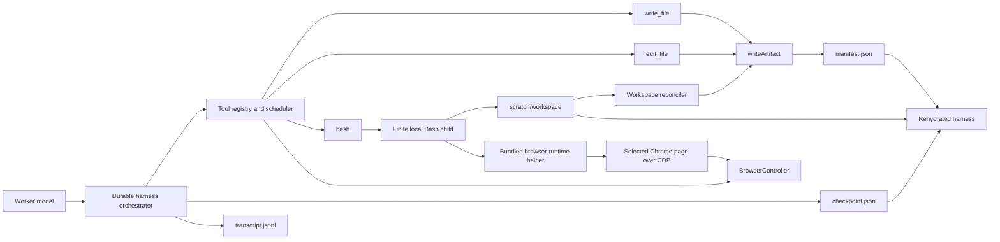

# Browser Agent Local Code Execution — Detailed Specification

**Status:** Proposed

**Date:** 2026-08-13

**Scope:** Worker-only local Bash execution, exact file editing, durable worker
state, and Playwright code-as-action integration

## 1. Overview

The browser agent should be able to write, edit, and execute programs while it
works. This is a deliberate expansion from page-scoped JavaScript to local
code-as-action:

- keep the existing `write_file` tool unchanged;
- add an `edit_file` tool beside it, using Claude Code's familiar
  `file_path` / `old_string` / `new_string` / `replace_all` contract;
- add a worker-only `bash` tool that runs finite local commands;
- make the run's private scratch area the command working directory and the
  durable home for generated scripts;
- let generated scripts attach to the browser agent's selected Chrome page and
  use Playwright locators, waits, loops, and extraction;
- keep orchestration, model history, budgets, verification state, manifests,
  and checkpoints in the harness rather than in a command process;
- recover a run from its run directory if the harness or command process dies.

This design does **not** use Blaxel or any other remote sandbox. Bash runs
locally as the same operating-system user as the application. The worker
workspace is a lifecycle and persistence boundary, not a security boundary.

## 2. Goals

1. Let the worker replace many model-mediated browser micro-steps with a
   short, reviewable Playwright program.
2. Let the worker make small, exact edits without repeatedly rewriting whole
   files through `write_file`.
3. Preserve the current run directory as the product, provenance, and recovery
   boundary.
4. Preserve exact file bytes outside the explicitly replaced substring.
5. Keep generated programs private by default and durable across restarts.
6. Make command timeouts, exits, output, and workspace changes explicit in the
   transcript.
7. Resume from a durable checkpoint without replaying an uncertain
   state-changing operation.
8. Keep Bash and edit capabilities out of the initializer and verifier.

## 3. Non-goals

- Providing host isolation, container isolation, filesystem confinement, or a
  security sandbox.
- Making arbitrary Bash commands transactional.
- Resuming or attaching to a command process that was running when the harness
  died.
- Supporting background commands in the first version.
- Treating the transcript as the recovery database.
- Allowing generated scripts to publish deliverables without the normal
  manifest and output-contract checks.
- Replacing `write_file`, `read_file`, `grep`, browser tools, or page-scoped
  `execute_javascript`.
- Giving Bash, file writes, or browser mutation to the verifier.

## 4. Binding decisions

| Concern | Decision |
| --- | --- |
| Execution location | Local child process started by the harness |
| Shell | Configurable absolute path, default `/bin/bash`; invoked non-interactively with `-c` |
| Bash working directory | `<runDir>/scratch/workspace` |
| Generated scripts | `<runDir>/scratch/workspace/scripts/` |
| Generated data and command intermediates | `<runDir>/scratch/workspace/output/` and `tmp/` |
| Durable files | Existing `artifacts/` and `scratch/` tree plus `manifest.json` |
| Durable harness state | Harness-owned `<runDir>/checkpoint.json`, atomically replaced |
| Browser after harness restart | Recreated; old refs, page IDs, document IDs, and observations are invalid |
| In-flight command after restart | Reported as interrupted; never silently replayed |
| File edit matching | Exact code-unit match only; no quote, whitespace, newline, indentation, or Unicode normalization |
| File edit persistence | Entire resulting byte sequence is written through `writeArtifact()` |
| Bash scheduling | State-changing barrier; one command at a time |
| Background processes | Not supported initially |
| Tool exposure | Main worker only; initializer and verifier remain incapable of mutation |

## 5. Architecture



The harness owns sequencing and durable state. Bash is a replaceable execution
mechanism. A generated program can manipulate the browser, but it does not own
the browser session, the run lifecycle, output verification, or publication.

### 5.1 Logical components

#### `LocalCommandRunner`

Starts and terminates local command processes, captures bounded output, and
returns a typed command result. It knows nothing about model messages or
completion.

#### `WorkerWorkspace`

Creates the scratch workspace layout, supplies the command working directory,
and reconciles surviving command-created files into the manifest.

#### `BrowserAutomationBridge`

Leases the selected browser page to one state-changing command, exposes the
connection through command environment variables, and reconciles controller
state after the command exits.

#### `RunCheckpointStore`

Atomically saves and validates the state required to continue a run. It is the
recovery source of truth for model and harness state; the transcript remains an
append-only audit log.

#### `WorkerRuntime`

Composes the command runner, workspace, optional browser bridge, and checkpoint
hooks. The tool executor calls this interface rather than spawning processes
directly.

## 6. Run-directory layout

```text
<runDir>/
  manifest.json                    existing provenance index
  transcript.jsonl                 existing append-only audit log
  metrics.json                     existing terminal metrics
  checkpoint.json                  harness-owned resumable state
  artifacts/                       published outputs and evidence
  scratch/
    workspace/                     Bash working directory
      scripts/                     model-generated .mjs/.js/.ts/.py/.sh files
      output/                      generated intermediate data
      tmp/                         disposable command-local files
    command-output/                full stdout/stderr when not returned inline
    tool-receipts/                 durable receipts for state-changing calls
    tool-output/                   existing oversized tool-result offloads
```

`scratch/workspace` is private, durable working state. It is not graded or
shown as a deliverable, but its surviving files are hashed in the manifest.
The worker should create scripts through `write_file`, modify them through
`edit_file`, and execute them through `bash`.

The harness may recreate empty directories during recovery. It must never
silently replace or clear existing workspace files.

## 7. Tool surface

### 7.1 `write_file`

The existing contract and implementation remain unchanged. In particular:

- it accepts run-directory-relative `artifacts/...` or `scratch/...` paths;
- it supports overwrite and `append: true`;
- published roles keep their current behavior;
- every final byte sequence goes through `writeArtifact()`;
- existing tool results and tests remain valid.

Generated scripts use paths such as:

```json
{
  "file_path": "scratch/workspace/scripts/collect.mjs",
  "content": "// ..."
}
```

### 7.2 `edit_file`

#### Model-facing input

```ts
interface EditFileInput {
  file_path: string;      // run-directory-relative
  old_string: string;     // exact text to find
  new_string: string;     // exact replacement
  replace_all?: boolean;  // default false
}
```

The Zod schema is a strict object. Unknown keys fail validation. Unlike the
local Claude Code contract it is based on, `file_path` is run-directory
relative rather than absolute because every model-supplied path remains behind
`resolveRunPath()`.

#### Required behavior

1. Classify the requested path using the same workspace partition logic as
   `write_file`. Only existing regular files under `artifacts/` or `scratch/`
   are editable.
2. Resolve the path through `resolveRunPath()`.
3. Fail if the file is absent, is a directory, or is a symbolic link.
4. Read the file as bytes.
5. Decode only byte-stable UTF-8. Re-encoding the decoded string must reproduce
   the original bytes exactly before any edit is attempted. This preserves a
   UTF-8 BOM and rejects invalid UTF-8 or unsupported encodings instead of
   corrupting them.
6. Reject an empty `old_string`. File creation and whole-file replacement
   belong to `write_file`.
7. Reject `old_string === new_string` as a no-op.
8. Count exact, non-overlapping occurrences of `old_string` without any
   normalization.
9. Fail if there are zero occurrences.
10. When `replace_all` is false or omitted, require exactly one occurrence.
    Multiple occurrences fail with the count and instruct the worker to add
    context or set `replace_all: true`.
11. When `replace_all` is true, replace every exact occurrence and report the
    count.
12. Encode the complete resulting string as UTF-8 and write those complete
    bytes through `writeArtifact()`.
13. For a scratch file, pass no roles. For a published file, require its
    existing manifest entry and preserve its roles. A content edit clears
    `sourceUrl` and `completionStatus`; edited bytes are no longer an exact
    capture and must pass completion again.
14. Return the normalized relative path, number of replacements, final byte
    length, and new SHA-256.

There is intentionally no fuzzy matching. The implementation must not:

- convert `\n` and `\r\n`;
- trim trailing whitespace;
- reindent or reformat the file;
- normalize Unicode;
- translate straight and curly quotes;
- replace a merely similar string;
- create a missing file.

The operation is synchronous from read through `writeArtifact()` and is a
state-changing scheduler barrier. The exact `old_string` also acts as an
optimistic concurrency guard: if the file no longer contains what the model
read, the edit fails instead of guessing.

#### Example errors

```text
File does not exist: scratch/workspace/scripts/collect.mjs
```

```text
Exact old_string was not found in scratch/workspace/scripts/collect.mjs.
No whitespace, newline, quote, or Unicode normalization is performed.
```

```text
Found 4 exact matches in scratch/workspace/scripts/collect.mjs, but
replace_all is false. Add surrounding context to identify one match or set
replace_all to true.
```

### 7.3 `bash`

#### Model-facing input

```ts
interface BashInput {
  command: string;
  timeout_ms?: number;  // default 30_000, maximum 120_000
  description?: string;
}
```

The first version does not expose `run_in_background`. Every invocation must
reach a terminal result or be killed before the tool returns.

#### Model-facing result

```ts
interface BashResult {
  status: 'exited' | 'timed_out' | 'output_limit_exceeded';
  exit_code: number | null;
  signal: string | null;
  duration_ms: number;
  cwd: 'scratch/workspace';
  stdout: string;
  stderr: string;
  stdout_path?: string;
  stderr_path?: string;
  changed_files: Array<{
    path: string;
    change: 'created' | 'modified' | 'deleted';
    sha256?: string;
    bytes?: number;
  }>;
  browser_changed?: boolean;
}
```

A nonzero command exit is a completed command result, not a tool transport
failure. The explicit status and exit code let the model diagnose it while
preserving stdout and stderr. Spawn failures and internal reconciliation
failures are pipeline execution errors.

#### Process behavior

1. Create `scratch/workspace/{scripts,output,tmp}` if absent.
2. Save a `running` tool receipt and checkpoint before spawning.
3. Invoke the configured shell as `shell -c <command>` with
   `cwd=<runDir>/scratch/workspace`. Do not invoke a login shell or source
   shell profiles implicitly.
4. Use a fresh process group. At timeout, send `SIGTERM`, wait a short fixed
   grace period, then send `SIGKILL` to the process group.
5. Stream stdout and stderr separately. Keep bounded previews in memory and
   spool complete streams to private scratch files. A finite configured
   maximum, initially 10 MiB combined, terminates a command that produces
   unbounded output.
6. Pass the final inline result through the existing per-result and
   per-message capping path.
7. Reconcile filesystem changes and browser state before returning.
8. Write a terminal tool receipt through `writeArtifact()`, then append the
   transcript result and checkpoint the updated worker state.

#### Environment

The child receives a deliberate environment rather than a mutable reference
to `process.env`. It includes the host values required to run installed tools
(`PATH`, locale, temporary-directory and certificate/proxy settings), plus:

```text
SHERLOCK_WORKSPACE=<absolute scratch/workspace path>
SHERLOCK_RUN_DIR=<absolute run path>
SHERLOCK_BROWSER_RUNTIME=<file URL of bundled browser helper, when available>
SHERLOCK_CDP_ENDPOINT=<ephemeral local CDP endpoint, when available>
SHERLOCK_CDP_TARGET_ID=<selected page target, when available>
```

Provider credentials used by the harness are not needed by ordinary browser
automation and should not be copied into the child environment by default.
Additional environment variables may be supplied explicitly in local runtime
configuration.

This environment shaping improves reproducibility but does not create a
security boundary: local Bash can still inspect resources available to the
application's operating-system user.

## 8. Command-created files and provenance

The preferred path is for the model to create and edit scripts with the file
tools. Bash nevertheless creates files naturally: Playwright scripts save
JSON, screenshots, traces, and downloads.

Before each command, `WorkerWorkspace` snapshots the current files under
`scratch/workspace`. After the process exits it walks that tree again without
following symbolic links:

- new and modified regular files are read as exact bytes and committed through
  `writeArtifact()` under their existing scratch paths;
- deleted tracked scratch files are removed from the current manifest by a
  new scratch-only `removeArtifactEntry()` operation and recorded in the
  command receipt and transcript;
- symbolic links, sockets, devices, and other special files are not followed
  or manifested and cause reconciliation to fail loudly;
- filesystem changes are returned in `changed_files`.

The tool contract tells the model to keep direct command output inside
`scratch/workspace` and publish final files through `write_file`, table/document
renderers, screenshot, or download. Because this version is not sandboxed,
the runtime cannot truthfully guarantee that Bash did not write somewhere else
on the host. It guarantees provenance only for surviving files inside the run
workspace that it reconciles.

## 9. Playwright code-as-action

Page-scoped `execute_javascript` remains the cheapest tool for DOM-only
extraction. Bash becomes valuable when the task needs Playwright locators,
auto-waiting, loops, branching, popups, downloads, or a reusable script.

### 9.1 Browser automation lease

The controller gains an optional capability:

```ts
interface BrowserAutomationLease {
  cdpEndpoint: string;
  targetId: string;
  pageId: string;
  documentId: string;
  observationId: number;
}

interface CodeExecutionBrowserController {
  acquireAutomationLease(): Promise<BrowserAutomationLease>;
  releaseAutomationLease(
    lease: BrowserAutomationLease,
  ): Promise<ExternalAutomationResult>;
}
```

Acquiring the lease locks the selected page for the duration of the command.
The state-changing scheduler already prevents another worker tool from running
alongside Bash; the controller lock also protects against non-scheduler callers.

Local Chrome is launched with an ephemeral loopback CDP endpoint. Remote
providers may expose their own endpoint through the same capability. A browser
provider that cannot provide a code-execution lease still supports ordinary
Bash, but omits the browser environment variables and fails browser-helper
connection attempts clearly.

### 9.2 Bundled runtime helper

The application bundles a small JavaScript module beside the installed
Playwright dependency. Generated scripts dynamically import the absolute file
URL from `SHERLOCK_BROWSER_RUNTIME`; dependency resolution therefore happens
from the application package rather than the scratch directory. No per-run
`npm install` is required.

Example generated script:

```js
import { writeFile } from 'node:fs/promises';

const { connectSelectedPage } = await import(
  process.env.SHERLOCK_BROWSER_RUNTIME
);

const { page } = await connectSelectedPage();

await page.getByRole('button', { name: 'Load more' }).click();
const rows = await page.locator('table tbody tr').evaluateAll((elements) =>
  elements.map((row) => [...row.cells].map((cell) => cell.innerText.trim())),
);

await writeFile('output/rows.json', JSON.stringify(rows, null, 2));
```

The script writes into its current scratch workspace. The helper selects the
page by CDP target ID, returns real Playwright objects, and never closes the
owning browser. Process exit disconnects the secondary CDP client.

### 9.3 Reconciliation after browser code

On lease release, the owning controller:

- inventories live pages and popups;
- notices navigation and document replacement;
- invalidates old element refs and observation baselines;
- advances page/frame/document identity as required;
- reports whether the browser changed;
- keeps downloads and dialogs visible through normal controller events.

The Bash result does not pretend to be a browser observation. The system prompt
instructs the model to call `observe` after browser automation, often in the
same response after the Bash call, so the scheduler executes it after Bash's
state-changing barrier.

## 10. Durable harness state

The current `WorkerSession.state` is memory-only. The new design makes the
state required for continuation explicit and serializable.

### 10.1 Checkpoint schema

```ts
interface RunCheckpointV1 {
  schemaVersion: 1;
  generation: number;
  runStatus:
    | 'ready_for_model'
    | 'executing_tools'
    | 'checking_completion'
    | 'verifying'
    | 'terminal';
  updatedAt: string;

  worker: {
    messages: Message[];
    turnCount: number;
    peakContextTokens: number;
    protocolCorrections: number;
  };

  budget: RunBudgetSnapshot;

  harness: {
    completionCheckFailures: number;
    verificationAttempts: number;
    currentContractRevision?: number;
  };

  pendingTurn?: {
    turn: number;
    assistantMessage: AssistantMessage;
    calls: Array<{
      call: ToolCall;
      status: 'pending' | 'running' | 'finished';
      result?: ToolCallResult;
      receiptPath?: string;
    }>;
  };

  terminalOutcome?: RunTaskResult;
}
```

The checkpoint stores current control state, not copies of artifact bytes,
table rows, evidence, or contracts that already have durable stores. It may
store stable identifiers or current revision numbers for those components.

`RunBudgetTracker` gains `snapshot()` and restoration from a validated
snapshot. All counters and per-role usage remain monotonic after recovery.
Wall-time accounting records original elapsed time and does not reset merely
because a process restarted.

### 10.2 Atomic persistence

To save generation `N`:

1. validate the complete checkpoint against its versioned schema;
2. serialize it before touching the existing checkpoint;
3. write `checkpoint.json.tmp` in the run directory;
4. flush the temporary file;
5. atomically rename it over `checkpoint.json`;
6. flush the run directory where the platform supports it.

A partially written temporary file is ignored on recovery. A missing or
invalid main checkpoint is a loud recovery failure, not a reason to start a
fresh conversation against the same run directory.

### 10.3 Checkpoint boundaries

Save after every durable state transition:

1. initial task, budget, and worker session creation;
2. acceptance of a complete model response, before any requested tool runs;
3. before each state-changing tool starts (`status: running`);
4. after each tool result is committed;
5. after completion-check or verifier feedback is appended;
6. before and after verification;
7. when the run reaches a terminal outcome.

The transcript is written alongside these transitions for auditability, but
recovery does not reconstruct model messages by heuristically replaying JSONL.

### 10.4 Tool receipts

State-changing tools write a small immutable receipt under
`scratch/tool-receipts/`, keyed by turn and tool-use ID. A receipt contains:

- tool name and input hash;
- start and finish timestamps;
- terminal result or interruption;
- affected run paths and their resulting hashes;
- browser lease identity and whether browser state changed;
- paths to offloaded stdout/stderr.

The receipt is committed before the checkpoint marks a call `finished`. If the
harness dies after the receipt but before the checkpoint, recovery can attach
the recorded result without re-executing the tool.

### 10.5 Recovery rules

Recovery is exposed as a separate entry point such as:

```ts
resumeTask(runDir: string, config: ResumeTaskConfig): Promise<RunTaskResult>
```

It performs the following sequence:

1. Resolve and validate the existing run directory, manifest, checkpoint, and
   checkpoint schema version.
2. Verify every current manifest entry still matches its file and hash.
3. Restore worker messages, counters, harness phase, contract/evidence/table
   stores, and budget state.
4. Recreate the command runner and browser session.
5. If a `running` tool has a complete matching receipt, attach that result.
6. If a `running` tool has no terminal receipt, do not replay it. Append an
   error result saying the operation was interrupted and instruct the worker
   to inspect durable workspace/browser state before deciding whether to retry.
7. Reopen the configured start URL when appropriate. Never attempt to reuse
   old browser refs or IDs.
8. Append one recovery notice to the worker conversation explaining that
   scratch/artifacts survived but browser state was recreated.
9. Continue from `ready_for_model`, completion checking, or verification as
   named by the checkpoint.

An example interruption result is:

```text
The local worker restarted while this Bash command was running. The command
was not replayed. Files already committed under scratch/ or artifacts/ remain;
inspect them before retrying. The browser session was recreated, so prior page
and element identifiers are invalid.
```

This provides at-most-once automatic execution. Exactly-once semantics are not
claimed for arbitrary shell effects.

## 11. Scheduling and concurrency

- `edit_file` is always state-changing.
- `bash` is always state-changing, even when the command appears read-only.
- Both remain barriers under the existing scheduler.
- The first version runs only one Bash process per worker runtime.
- A Bash call holding a browser automation lease excludes browser actions,
  observation, page JavaScript, and page switching until release.
- `read_file` and `grep` may run in parallel only when no earlier
  state-changing barrier is outstanding, preserving the current scheduler
  contract.
- No static command parser attempts to infer whether a command is read-only.

## 12. Tool registration and prompt stability

`edit_file` belongs in the existing file-tools source group immediately after
`write_file`:

```ts
export const fileTools = [
  readFileTool,
  writeFileTool,
  editFileTool,
  grepTool,
];
```

`bash` belongs in a new worker-only `codeTools` group. It is appended after the
ordinary worker tool surface and is never included in initializer or verifier
registries.

The resulting production tool order is frozen and deterministic. Enabling the
feature requires one intentional prompt-prefix version change; it must not
vary based on task text, current workspace contents, dependencies, or whether
a browser lease is presently available. Runtime availability belongs in tool
results and dynamic context, not in the static system prompt or tool schema.

The system prompt gains concise instructions:

- store generated scripts under `scratch/workspace/scripts/`;
- use `write_file` to create and `edit_file` for exact changes;
- Bash starts in `scratch/workspace`;
- prefer page JavaScript for simple DOM extraction and Playwright scripts for
  multi-step or reusable automation;
- publish deliverables through normal artifact tools;
- call `observe` after Playwright automation;
- never modify `manifest.json`, `transcript.jsonl`, `metrics.json`, or
  `checkpoint.json`.

The repository's existing no-shell rule and V2 proposal/plan language conflict
with this feature. Implementation must update those documents explicitly in
the same change that enables `bash`; leaving contradictory binding rules is
not acceptable.

## 13. Error handling

### Configuration failures

- shell path is absent or not executable;
- timeout or output limits are non-finite, negative, fractional where an
  integer is required, or outside their configured bounds;
- checkpoint configuration cannot be serialized or restored;
- browser code execution is required but the provider cannot expose a lease.

These fail before the first worker model call when knowable at setup time.

### `edit_file` failures

All precondition failures occur before any write. Errors name the path and the
specific failed condition. Failed matching never falls back to fuzzy behavior.

### Bash failures

- spawn or reconciliation failure: pipeline execution error;
- nonzero exit: `status: exited` with its exit code and output;
- timeout: process group terminated and `status: timed_out`;
- output ceiling: process group terminated and
  `status: output_limit_exceeded`;
- browser lease recovery failure: command result preserved, browser capability
  marked unavailable, and the run continues only if the controller can create
  a replacement page/session.

### Recovery failures

An invalid checkpoint, manifest mismatch, unsupported schema version, or a
`finished` call whose required terminal receipt is missing fails recovery
loudly and preserves the run directory for inspection. A `running` call with
no terminal receipt follows the interruption rule instead. Recovery must never
overwrite the directory with a new run.

## 14. Testing strategy

### `edit_file` unit and integration tests

- missing file and directory paths fail without writes;
- path traversal and absolute paths fail through `resolveRunPath()`;
- symbolic links fail;
- zero and ambiguous matches fail loudly;
- `replace_all` replaces the exact number reported;
- empty `old_string` and identical old/new strings fail;
- LF, CRLF, mixed line endings, trailing spaces, tabs, and final-newline state
  are preserved outside the replacement;
- UTF-8 BOM and multibyte characters round-trip exactly;
- invalid UTF-8 fails without modifying bytes;
- straight quotes do not match curly quotes and vice versa;
- scratch edits retain no roles;
- artifact edits preserve roles, clear stale capture/completion metadata, and
  update the manifest hash;
- the real tool pipeline returns structured errors and caps results.

### Bash tests

- command starts in the exact scratch workspace;
- stdout, stderr, nonzero exit, signal, and duration are reported;
- shell profiles are not sourced;
- timeout terminates a child and its descendants;
- output ceiling prevents unbounded memory growth;
- large output is persisted under scratch and returned with a bounded preview;
- new, modified, and deleted workspace files reconcile into the manifest;
- symlinks and special files fail reconciliation without being followed;
- a generated script survives runtime recreation and executes again;
- Bash remains a scheduler barrier;
- initializer and verifier registries never contain Bash or edit tools.

### Browser bridge tests

- a generated `.mjs` script attaches to the selected fixture page;
- Playwright locators click, fill, wait, loop, and extract in one Bash call;
- another browser tool cannot run while the lease is held;
- navigation invalidates old refs and document identity;
- popups and downloads remain visible to the owning controller;
- `observe` after Bash sees the external changes;
- process exit disconnects the secondary CDP client without closing Chrome;
- a provider without a bridge fails helper use clearly while ordinary Bash
  still works.

### Recovery tests

Use deterministic fault injection at each checkpoint boundary:

- after model response acceptance but before the first tool;
- after `edit_file` receipt but before checkpoint update;
- while Bash is running;
- after Bash receipt but before checkpoint update;
- after completion-check failure feedback;
- before and after verifier execution;
- after terminal checkpoint but before returning to the caller.

Every case must prove conversation continuity, monotonic budgets, no automatic
replay of an uncertain operation, valid manifest hashes, preserved scripts,
and honest terminal status.

### Repository gates

- focused tests for file tools, command runtime, scheduler, browser controller,
  worker session, run budget, checkpoint store, and runTask recovery;
- `npm run typecheck`;
- `npm test`;
- `git diff --check`;
- prompt/tool-definition determinism tests;
- no live eval re-baseline without separate user direction.

## 15. Rollout and compatibility

1. Land `edit_file` first because it is small, deterministic, and immediately
   improves script iteration.
2. Land local Bash with the durable scratch workspace, finite foreground
   execution, bounded output, receipts, and reconciliation.
3. Add the local Chrome CDP lease and bundled Playwright runtime helper.
4. Add versioned checkpoint save/restore and fault-injection tests before
   advertising crash recovery.
5. Enable the tools only for the primary worker initially. Keep current
   verifier and initializer tool surfaces unchanged.
6. Measure code-as-action against the existing page-JavaScript and atomic-tool
   paths. Treat adoption, turn reduction, long-horizon success, script reuse,
   command interruption, and browser-reconciliation errors as primary metrics.

Existing runs without `checkpoint.json` remain readable but are not resumable.
Existing run-directory graders remain compatible because they continue to
select deliverables only from manifest entries carrying
`roles: ["requested_output"]`; scratch scripts and checkpoints never become
deliverables.

## 16. Acceptance criteria

The feature is ready when all of the following are true:

1. A worker can create a Playwright script under
   `scratch/workspace/scripts/`, edit one exact substring, execute it, and
   observe the resulting page state.
2. The same script and its generated intermediate files survive recreation of
   the command runtime.
3. A harness restart restores the exact worker conversation, counters, output
   contract state, and budgets from `checkpoint.json`.
4. A command interrupted by restart is reported honestly and is not replayed.
5. Every surviving file created inside the scratch workspace is represented by
   a current manifest hash before Bash returns.
6. `edit_file` never changes bytes outside the requested exact replacement.
7. Bash output, exit, timeout, workspace changes, and browser changes are
   bounded and visible in the transcript.
8. Initializer and verifier model calls cannot invoke Bash or mutate files.
9. Existing requested-output selection and completion verification continue to
   operate solely from published manifest entries.
