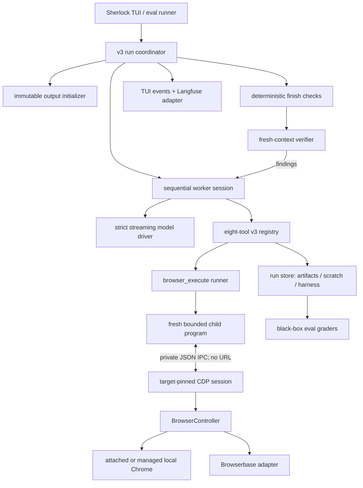
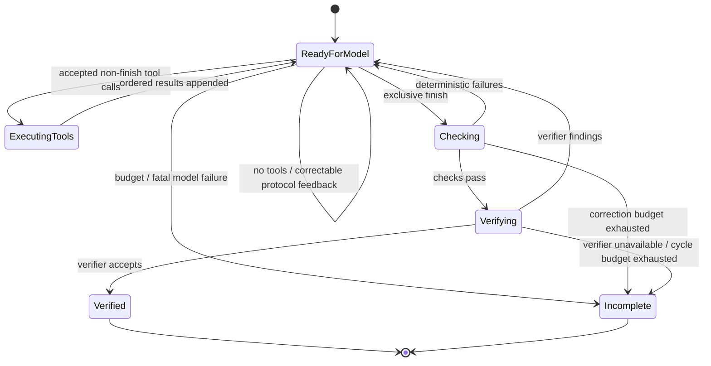

# Sherlock v3: programmable evidence-collection agent

**Status:** binding design for implementation

**Date:** 2026-08-15

**Implementation board:** [implementation-plan.md](./implementation-plan.md)

**Upstream reference:**
[`browser-use/browser-harness@6a80dbb`](https://github.com/browser-use/browser-harness/tree/6a80dbbce51e8c1776af061282546627f007be4e)

## 1. Product promise

Sherlock accepts a research or evidence-collection task, drives a real browser
through a small programmable tool surface, streams understandable progress,
and returns the requested files plus a concise summary and auditable evidence.

The primary measure of success is task accuracy on known and hidden evals.
The design also values generality, repeatability, speed, and a code path one
developer can understand. Scaling to thousands of simultaneous sessions is not
a v3 requirement.

Sherlock is not browser-harness with a new name. Browser-harness is a thin CDP
execution substrate called by an external coding agent. Sherlock remains a
complete product: TUI, streaming model loop, browser providers, durable run
store, output checks, verifier, tracing, and black-box evals. V3 borrows the
programmable browser and editable-helper ideas while retaining the boundaries
that make evidence trustworthy.

## 2. Core user journey

1. The user types `sherlock` and the existing terminal UI opens.
2. The user enters a task such as:

       Create a CSV of the top five Hacker News stories with exactly these
       columns: title, URL, points.

3. Sherlock opens one owned task tab in the selected browser runtime. For
   interactive local work it attaches to the user's explicitly enabled Chrome
   debugging endpoint, so existing authenticated state is available. Isolated
   eval trials still launch their own managed profiles. Browserbase remains an
   explicit alternative provider.
4. The TUI streams assistant progress text and visible tool activity. It does
   not claim to reveal hidden chain-of-thought.
5. The worker inspects and drives the page with `browser_execute`. It may write
   and repair reusable JavaScript helpers under the run's private workspace and
   exercise them immediately.
6. The worker publishes requested outputs and supporting evidence through the
   artifact boundary. Browser-backed work normally includes at least one
   evidence screenshot of the final/source state.
7. The worker calls `finish`. Deterministic checks validate files, hashes,
   roles, exact schemas, and contract requirements before a fresh-context
   verifier reviews the result. Any findings return to the same worker
   conversation for correction.
8. The TUI presents the final summary and published artifacts. In every exit
   path Sherlock closes the task tab and every popup or tab the run created,
   while preserving browser pages that predated the run.
9. A helper that proved useful may be published as a proposed patch. Sherlock
   never mutates shared helpers automatically. A human reviews and applies the
   patch; normal Git history supplies attribution and rollback.

## 3. Goals and non-goals

### 3.1 Goals

- Complete unfamiliar browsing and evidence tasks without task-specific core
  logic.
- Replace the wide collection of browser action tools with one broad,
  programmable, target-pinned browser execution tool.
- Keep the model-facing tool set small and stable.
- Preserve exact requested-output schemas, artifact provenance, deterministic
  checks, and independent verification.
- Let a run build local helper code without letting model-authored code modify
  the protected core.
- Use the same browser program contract for local managed Chrome, local
  attached Chrome, and Browserbase.
- Preserve cancellation, human questions, tracing, TUI visibility, eval
  isolation, and durable recovery.
- Make failure honest: uncertain side effects, unavailable verification, and
  exhausted budgets are never reported as success.

### 3.2 Non-goals

- A security sandbox for model-authored code. `bash` and browser programs run
  with the application OS user's authority.
- Automatic package installation, background jobs, or an agent-controlled
  daemon outside Sherlock's browser provider lifecycle.
- Automatic promotion of learned helpers.
- Site- or eval-specific recipes in the system prompt or runtime.
- Exposing a Browserbase CDP URL to the model, a child process, logs, tracing,
  errors, artifacts, or the transcript.
- Streaming hidden model reasoning.
- A live eval re-baseline as an implicit implementation step.
- Keeping legacy modules merely because they already exist. V3 was built
  beside the old path, cut over after parity gates, and then removed the
  retired production wiring.

## 4. Requirements

### 4.1 Functional requirements

Sherlock must:

- accept arbitrary user task text;
- browse public and authenticated sites;
- inspect accessibility, DOM, visual, and network state;
- navigate, click, type, scroll, wait, manage owned tabs, upload, and download;
- execute raw CDP commands as an escape hatch;
- create CSV, JSON, Markdown/text, binary downloads, and screenshots, alone or
  in combination;
- ask the user when login, MFA, consent, account selection, ambiguity, or an
  irreversible decision requires human authority;
- save private intermediate state separately from published output;
- state an explicit final summary, including any concrete unresolved constraint;
- validate and independently verify every production run;
- resume a durable incomplete run without blindly repeating an uncertain
  state-changing call;
- close every run-owned page on success, failure, cancellation, and crash
  recovery.

### 4.2 Quality requirements

- **Accuracy:** exact columns, counts, filenames, values, and evidence
  requirements are checked before success.
- **Generality:** no branch may inspect an eval task name or contain a
  site-specific answer path.
- **Consistency:** the system prompt and tool definitions are deterministic;
  output selection follows manifest roles, never transcript prose.
- **Responsiveness:** browser scripts and shell commands are bounded and
  cancellable; normal tools do not overlap unpredictably.
- **Auditability:** published and private run files are hashed, source URLs are
  recorded when known, and the final state is self-contained.
- **Maintainability:** the complete production path is explainable by the
  architecture and state machine below; one concept has one owner.

## 5. What v3 borrows from browser-harness

The reference was inspected at commit `6a80dbb` on 2026-08-15.

| Upstream mechanism | Sherlock v3 decision |
| --- | --- |
| One long-lived CDP connection below short-lived scripts | Adopt behind `BrowserController`; Sherlock owns the connection and target identity. |
| Raw CDP and small helpers | Adopt through `browser_execute`. |
| Python from stdin executed with pre-imported helpers | Adapt to a fresh bounded Node child with private IPC; do not execute model code in Sherlock's main process. |
| Agent-editable `agent_helpers.py` | Adopt as run-local JavaScript modules under `scratch/workspace/`; promotion is a reviewed patch. |
| AX-tree-first interaction | Adopt as prompt guidance and core helpers. |
| Coordinate input and raw DOM fallback | Adopt. Coordinate input reaches iframe/shadow/composited controls that selector-only actions miss. |
| Explicit local/remote selection | Adopt; a credential alone never selects a billable provider. |
| Persistent named daemon and global mutable helper state | Reject. Sherlock's provider already owns session persistence; files are the durable helper state. |
| Arbitrary screenshot/output paths | Reject; all surviving run files are reconciled into the manifest and publication is explicit. |
| Full CDP URL logging | Reject as a capability leak. |
| Reattach to the first page and replay after a stale session | Reject. Recovery stays pinned to the original target or fails loudly. |
| Page-title mutation to mark the active tab | Reject because it corrupts observed data. The TUI owns selection display. |
| Default telemetry containing raw scripts/output | Reject. Langfuse remains an explicit Sherlock adapter with redaction rules. |
| Shared domain recipes implicitly selected by site | Defer. Reviewed helpers must remain general and opt-in. |

The upstream project contains no model SDK, production agent loop, artifact
manifest, output contract, verifier, or eval harness. Those Sherlock systems
are not candidates for replacement by upstream code.

The comparison is grounded in the pinned upstream
[`run.py`](https://github.com/browser-use/browser-harness/blob/6a80dbbce51e8c1776af061282546627f007be4e/src/browser_harness/run.py),
[`daemon.py`](https://github.com/browser-use/browser-harness/blob/6a80dbbce51e8c1776af061282546627f007be4e/src/browser_harness/daemon.py),
[`helpers.py`](https://github.com/browser-use/browser-harness/blob/6a80dbbce51e8c1776af061282546627f007be4e/src/browser_harness/helpers.py),
[`agent_helpers.py`](https://github.com/browser-use/browser-harness/blob/6a80dbbce51e8c1776af061282546627f007be4e/agent-workspace/agent_helpers.py),
[`_ipc.py`](https://github.com/browser-use/browser-harness/blob/6a80dbbce51e8c1776af061282546627f007be4e/src/browser_harness/_ipc.py), and
[`telemetry.py`](https://github.com/browser-use/browser-harness/blob/6a80dbbce51e8c1776af061282546627f007be4e/src/browser_harness/telemetry.py).

## 6. Target architecture



The dependency direction is deliberate:

- The UI and evals depend on the public run seam, never worker internals.
- The loop depends on a model driver and tool registry, not a provider.
- Tools depend on `BrowserController` and the run store.
- Providers implement the browser seam and never know about model messages,
  artifacts, contracts, or graders.
- Graders read only the finished run directory.

### 6.1 Modules

The completed runtime lives under a cohesive `src/v3/` tree:

    src/v3/
      browser/
        runner.ts
        child.mjs
        coreHelpers.mjs
      tools/
        index.ts
        browserExecute.ts
        publishArtifact.ts
        fileTools.ts
        bash.ts
        askUser.ts
        finish.ts
        secretEnvironment.ts
      loop/
        workerSession.ts
        contextView.ts
      harness/
        initializer.ts
        verifier.ts
        verifierTools.ts
      completion/
        finishChecks.ts
        artifactInspection.ts
        tableInspection.ts
        types.ts
      run/
        coordinator.ts
        checkpoint.ts
        outputContractFile.ts
        runDeadline.ts
      model/
        budgetedCall.ts
        budgetError.ts
      systemPrompt.ts

This is a responsibility map, not a requirement for one tiny file per type.
Deep cohesive modules are preferred to either god objects or policy fragments.
Stable shared seams remain in their existing directories and are imported:

- the strict streaming model driver and message types;
- browser providers and controller primitives;
- run-directory/path/artifact/transcript primitives;
- output-contract parsing plus the generic tool pipeline and access ledger;
- TUI tracing and eval/grader boundaries.

## 7. Browser runtime

### 7.1 Provider selection

`SHERLOCK_BROWSER_PROVIDER` remains the sole local-versus-Browserbase switch.
Having a Browserbase key does not select or start a remote browser.

The local provider supports two modes behind the same provider seam:

- **attached** — the interactive TUI default. Sherlock attaches to a Chrome
  endpoint the user explicitly enabled through
  `chrome://inspect/#remote-debugging` or an explicit loopback CDP setting.
  Existing authenticated browser state remains available.
- **managed** — used by hermetic tests and normal eval trials. Sherlock launches
  its current persistent headed profile or an isolated headless profile as the
  caller selects.

Tests and evals must choose managed mode explicitly so a developer's ambient
environment cannot make a hermetic run attach to or mutate their personal
browser. Browserbase remains a third deployment shape, not a third public
provider name.

First-use attached flow:

1. Probe an explicit loopback endpoint, then supported local discovery.
2. If Chrome is absent, launch/open the supported browser setup path.
3. If debugging permission is disabled, open
   `chrome://inspect/#remote-debugging` and tell the user exactly which control
   to enable.
4. Wait for the user action under a bounded, visible setup state. Do not poll
   forever and do not click a browser permission prompt through automation.
5. Connect, create a fresh owned task tab, and leave pre-existing pages alone.

### 7.2 Target-pinned CDP capability

`BrowserController` gains a provider-neutral, optional-at-construction but
required-for-v3 capability that opens a command session for one resolved page:

```ts
interface BrowserCommandSession {
  readonly pageId: string;
  readonly targetId: string;
  send(method: string, params?: Record<string, unknown>): Promise<unknown>;
  upload(backendDOMNodeId: number, absolutePath: string): Promise<void>;
  close(): Promise<void>;
}

interface BrowserController {
  screenshot(options?: BrowserScreenshotOptions): Promise<Uint8Array>;
  download(target: BrowserDownloadTarget): Promise<BrowserDownloadResult>;
  currentUrl(pageId?: string): string;
  pages(): Promise<BrowserPage[]>;
  openCommandSession(pageId?: string): Promise<BrowserCommandSession>;
  refreshAfterExternalCommands(): Promise<void>;
  listPendingDialogs(): readonly BrowserDialog[];
  initializeRunPageOwnership?(
    ownershipId: string,
    options?: BrowserOperationOptions,
  ): Promise<void>;
  prepareTaskPage?(request: {
    ownershipId: string;
    startUrl?: string;
    signal?: AbortSignal;
  }): Promise<void>;
  closeTaskPages(): Promise<void>;
}
```

The real interface may use equivalent names, but it must preserve these
semantics:

- `pageId` resolves once before program execution.
- The returned CDP session is attached to exactly that target.
- A stale or missing target fails; it never falls back to the first page.
- The raw provider/CDP URL never leaves the controller.
- Upload resolves a model-supplied workspace path in the parent, then uses the
  provider's local-path or remote-byte encoder against the exact backend node;
  the upload RPC never receives provider credentials and the parent accepts a
  file only from the current run workspace. The child itself is not a sandbox
  and retains the application OS user's authority as stated below.
- `close()` is idempotent and always attempted in `finally`.
- Browser-level target commands are an owned-target API, not ambient browser
  authority: inventory is filtered to positively run-owned targets; info,
  activation, and close reject any other target; creation goes through the
  durable controller path; every other `Target.*` command fails closed.
- Model-authored `Browser.*` commands fail closed because they act on the
  entire managed or attached browser rather than the pinned task page.
- After the child exits, the controller rescans pages, rotates document state,
  invalidates stale observations, and reports an unusable browser loudly.

Connection setup is bounded by the run deadline. The private protocol applies
per-message byte ceilings, total and concurrently pending request counts, and
one whole-program deadline; every CDP command consumes that remaining program
time. Commands are never replayed automatically. If timeout or cancellation
leaves a raw command in flight, the command session reports the abandoned
request and the controller retires that exact owned page before another
program can use it.

### 7.3 Run-owned pages

At task start the controller creates one owned task page. Page ownership then
propagates only through evidence that the run caused creation:

- a popup whose opener is owned;
- a target returned by this run's `Target.createTarget` request;
- a page created by a controller method on behalf of the run.

A concurrently opened user page with no owned opener is not owned. Internal
download/PDF pages remain invisible and clean themselves up separately.

Ownership survives a coordinator crash. The controller derives a versioned,
opaque marker from the durable run identity and installs it before site code
on every owned document. Attached recovery scans pre-existing targets, closes
only exact same-run markers, and preserves unrelated user tabs. A separate
browser-scoped target-control sentinel covers the narrow crash window after
`Target.createTarget` commits but before the page marker can be installed.
`prepareTaskPage` performs reclaim, creation, durable claim, and optional
navigation as one bounded lifecycle operation so late effects remain visible
to the shared exclusive busy ledger.

`closeTaskPages()` closes the owned page graph in reverse creation order,
best-effort but exhaustively, then clears active selection. It is invoked in a
coordinator `finally` block for verified, incomplete, cancelled, and failed
runs. Cleanup errors are recorded and surfaced; they do not suppress manifest,
metrics, transcript, or tracing finalization.

## 8. `browser_execute`

### 8.1 Model-facing input

```json
{
  "code": "const info = await browser.pageInfo(); return info;",
  "page_id": "optional Sherlock page id",
  "timeout_ms": 30000
}
```

- `code` is the body of an async JavaScript function receiving `browser`.
- `page_id` pins the initial target; omitted means the task page.
- `timeout_ms` is optional, defaults to 30 seconds, and has a hard 120-second
  ceiling. Values above the ceiling are rejected, never silently clamped.
- The schema is one strict top-level object. It must not use a JSON-schema
  union that omits top-level `type: object`.

The tool is exclusive in the v3 sequential loop by construction. Its result:

```json
{
  "status": "exited | failed | protocol_error | timed_out | cancelled | output_limit_exceeded",
  "duration_ms": 123,
  "value": {},
  "stdout": "",
  "stderr": "",
  "error": { "name": "Error", "message": "bounded message" },
  "changed_files": [],
  "pages": [],
  "pending_dialogs": []
}
```

`value` must be JSON-serializable. Tool stdout, stderr, return data, individual
IPC replies, and aggregate tool output each have byte ceilings. Oversize
model-visible results use the existing run-local offload pattern. `failed`
means the child ran and the program threw; `protocol_error` means its private
IPC contract failed. Both are ordinary structured tool results so the same
worker conversation can inspect and correct them. `error` is present only
when a bounded structured error exists. `pending_dialogs` is controller-owned
state collected after reconciliation, so a timed-out call that opened a
native dialog gives the next call an explicit page, type, message, and id.

### 8.2 Execution boundary

Each call starts a fresh Node child process in `scratch/workspace/`:

1. Parent resolves the target and opens `BrowserCommandSession`.
2. Parent starts the static v3 child module with a sanitized environment and
   one private IPC channel. No provider key, model key, Langfuse secret, shell
   startup hook, CDP URL, or session-control capability is passed.
3. Parent sends the source code over IPC, not a command-line argument or env
   variable.
4. Child evaluates it inside its own process and exposes `browser` as an RPC
   client. Run-local helper entry modules are loaded explicitly with
   `browser.importModule(workspacePath)`, which confines and bounds the entry
   under `scratch/workspace/`. Ordinary relative `import()` resolves beside
   Sherlock's protected child module and is not the workspace-loading API.
5. Each `browser.cdp` call carries a request id. Parent validates payload size,
   sends it through the pinned controller session, and replies with a bounded
   result or error.
6. Timeout, cancellation, output overflow, IPC failure, or normal return ends
   the child and its process group. Background descendants are not allowed to
   survive.
7. Parent closes the command session, reconciles the scratch workspace into
   the manifest, refreshes browser state, and returns current page metadata.

This is process isolation for application liveness, not a security sandbox.
Like `bash`, model code can exercise the OS user's authority. The child boundary
prevents an accidental `process.exit()` or global mutation from killing or
corrupting Sherlock's main process; it does not make hostile code safe.
The parent treats even direct writes to Node's inherited IPC channel as
untrusted and fails closed on malformed or application-oversized messages.
That byte check occurs after Node delivers/deserializes a message; it is a
protocol bound, not a hostile-process memory boundary.

The initial v3 local-execution support contract is POSIX (macOS and Linux),
matching the existing `/bin/bash` worker tool. `browser_execute` fails before
spawning on Windows because killing only the direct child would falsely claim
the descendant-cleanup invariant. Windows support requires an owned Job Object
or equivalently tested process-tree mechanism; it is not emulated with a
best-effort direct-child kill.

### 8.3 Core browser API

The child preloads a small helper object. Every helper is implemented in terms
of raw CDP, so helpers remain inspectable and replaceable rather than becoming
a second browser framework.

```ts
interface BrowserProgramApi {
  cdp(method: string, params?: object): Promise<unknown>;
  js(expression: string): Promise<unknown>;
  pageInfo(): Promise<{
    pageId: string;
    targetId: string;
    url: string;
    title: string;
    viewport: { width: number; height: number; scrollX: number; scrollY: number };
    page: { width: number; height: number };
  }>;
  accessibility(query?: AccessibilityQuery): Promise<unknown>;
  goto(url: string): Promise<unknown>;
  click(x: number, y: number, options?: ClickOptions): Promise<void>;
  type(text: string): Promise<void>;
  press(key: string, options?: KeyOptions): Promise<void>;
  scroll(x: number, y: number, deltaY: number, deltaX?: number): Promise<void>;
  waitForLoad(options?: WaitOptions): Promise<boolean>;
  waitFor(expression: string, options?: WaitOptions): Promise<boolean>;
  handleDialog(action: "accept" | "dismiss", promptText?: string): Promise<unknown>;
  pages(): Promise<BrowserPageInfo[]>;
  open(url?: string): Promise<BrowserPageInfo>;
  activate(targetId: string): Promise<void>;
  close(targetId?: string): Promise<void>;
  importModule(workspacePath: string): Promise<Record<string, unknown>>;
  upload(backendDOMNodeId: number, workspacePath: string): Promise<void>;
}
```

`importModule` validates a no-follow, regular entry file under the run
workspace and enforces its entry-size bound before import. Nested imports use
normal Node resolution and are not recursively confined; this is a documented
same-user, non-sandbox limitation. `upload` sends only a bounded backend node
id and workspace-relative path over host IPC. The parent revalidates and
confines the path, applies the provider-specific encoder, and fences any
late-running upload before command-session detach or run finalization.

Interaction guidance in the static prompt:

1. Inspect a filtered accessibility tree for interactive elements.
2. Resolve an AX node's backend DOM node and box model.
3. Click the compositor-space center and verify a targeted postcondition.
4. Use `js` for extraction or controls absent from AX, not for every action.
5. Use screenshots when layout, imagery, or evidence matters.
6. Wait for the specific load/DOM/network condition an action creates.
7. Keep large raw captures in workspace files; return only bounded summaries.

Native dialogs freeze page JavaScript. The result surfaces every pending
dialog as explicit controller state, and `handleDialog` issues one bounded
`Page.handleJavaScriptDialog` decision against the pinned page. `promptText`
is accepted only with `accept`. Sherlock never answers silently on the user's
behalf.

If a timed-out CDP evaluation is the command that opened the dialog, detaching
that secondary session can itself hang or make Chrome dismiss the dialog.
Closing the caller-facing command session therefore transfers its bounded
detacher to the controller while that page has a pending dialog. The next
explicit `handleDialog` decision is routed through the controller's cached
Playwright `Dialog`; after the decision unblocks the original command, every
transferred session is detached. Page/run cleanup drains the same detachers.
This is controller-owned transport state, never a model-visible capability.

## 9. Editable helper lifecycle

V3 has three helper tiers:

1. **Protected core helpers** ship with Sherlock and implement the API above.
   Model-authored code cannot edit them.
2. **Run-local helpers** live under `scratch/workspace/`, are hashed, survive
   resume, and may be imported by later `browser_execute` calls. They may be
   task-specific because they are private to one run.
3. **Shared helper proposals** are evidence artifacts under
   `artifacts/helper-proposals/`. A proposal contains a unified patch plus a
   small JSON record naming the general capability, source run, sites/mechanics
   exercised, verification performed, and limitations.

A worker may propose promotion only after it actually used the helper
successfully. The proposal is still a candidate until the whole run verifies.
The TUI shows verified-run proposals separately from requested outputs.

Promotion is deliberately outside the worker's authority:

- the user reviews the patch;
- relevant unit and fixture tests run;
- the user or developer applies it to the shared tracked helper library;
- a normal scoped Git commit records promotion and supplies rollback.

No runtime command automatically applies or commits a proposal in v3. Domain
matching and automatic helper injection remain deferred because they can become
hidden task-specific policy.

## 10. Worker-visible tool surface

The exact deterministic order is:

1. `browser_execute`
2. `publish_artifact`
3. `read_file`
4. `write_file`
5. `edit_file`
6. `bash`
7. `ask_user`
8. `finish`

Names use snake_case consistently. Existing file-tool parameter conventions
(`file_path`, `offset`, `limit`, old/new text) are retained where the model has
strong learned priors.

### 10.1 `publish_artifact`

One strict top-level object uses a `kind` discriminator and optional fields
validated as an exactly-one mode. This avoids API-incompatible top-level JSON
schema unions.

Common fields:

- `kind`: `file | text | screenshot | download`
- `artifact_path`: required path under `artifacts/`
- `roles`: non-empty unique list containing `requested_output`, `evidence`, or
  both
- `source_url`: optional, except where the browser can derive it directly

Mode fields:

- `file`: `source_path` is the exact canonical run-relative path beginning
  with `scratch/workspace/`; exact bytes are copied through `writeArtifact`.
- `text`: `content` is encoded UTF-8 and written through `writeArtifact`.
  Small final CSV, JSON, Markdown, and text outputs should use this direct
  path instead of creating and then copying an unnecessary private file.
- `screenshot`: optional `page_id` and `full_page`; bytes and current URL come
  from `BrowserController`.
- `download`: exactly one of `url` or an accessibility
  `backend_node_id`, plus optional `page_id`; the provider-specific download
  strategy returns bytes and source metadata.

The result returns the manifest entry. Overwriting an artifact is allowed only
when the path already has the same semantic role set; otherwise the call fails
for an explicit correction.

### 10.2 File tools

- `write_file` and `edit_file` write only private files under `scratch/`, with
  `scratch/workspace/` the normal location. Publication always goes through
  `publish_artifact`, making intent visible and role assignment unavoidable.
- `write_file` returns structured `{ path, bytes }` data. `path` is the exact
  canonical run-relative path accepted by `publish_artifact` file mode.
- `read_file` may read published or scratch files but never harness-private
  state, manifest internals, transcript internals, metrics, or paths outside
  the run.
- Direct writes use `writeArtifact`; files created by `bash` or
  `browser_execute` under `scratch/workspace/` are reconciled immediately by
  `syncScratchWorkspace`. Symlinks and special files fail reconciliation.

`grep` is removed from the model surface because bounded `bash` already
provides search within the workspace. The prompt gives the familiar `rg`
example.

### 10.3 `bash`

`bash` keeps the current finite foreground process contract:

- working directory fixed to `scratch/workspace/`;
- no login/profile startup hooks;
- default 30-second and maximum 120-second wall clock;
- combined output bound;
- cancellation reaches the whole process group;
- descendants are terminated when the command ends;
- secret env denylist and non-interactive Git/pager settings;
- reconciliation before return on success and every failure path;
- no package installation or background work.

V3 removes `uses_browser` and all CDP environment variables from `bash`.
Browser work belongs to `browser_execute`, which works for Browserbase without
leaking the remote connection capability.

### 10.4 `ask_user`

`ask_user` pauses through the existing TUI permission/question channel. It
contains a concise question, optional context, and two to four answer choices
when choices are known. Headless/eval runs fail closed with model-readable
feedback. Cancellation while paused resolves as denied and ends normally at
the next guard.

### 10.5 `finish`

```json
{
  "summary": "What was done, what each output contains, and any unresolved constraint."
}
```

- `summary` is required and user-facing.
- Concrete unresolved source, access, or freshness constraints belong in the
  summary as claims for the verifier to evaluate.
- Requested outputs and evidence are derived from the authoritative manifest,
  rather than repeated as worker-authored finish input.
- `finish` must be the only tool call in its assistant response.
- It is a control call intercepted by the loop, not an ordinary tool that can
  declare success itself.

## 11. Output contract and verification

Accuracy remains more important than eliminating every model role. V3 keeps a
small initializer and verifier but removes the worker-facing contract mutation,
typed-row database, and output-specific authoring tools.

### 11.1 Immutable expected outputs

Before the worker starts, the initializer receives the task and is forced to
return one typed output contract. It gets one bounded repair attempt. The
accepted contract is stored in harness-private state and rendered into the
worker's first per-run message. It captures only user-observable requirements:

- artifact kind and filename;
- exact table format/columns and count/completeness rules;
- requested document format;
- requested screenshots or downloads;
- explicit required values and source constraints.

The worker cannot restate or revise the contract. New claims about source
availability may be reported in the final summary; user clarifications are
recorded in the conversation and verifier context. The verifier always
compares the actual user task as well as the initializer output, so a bad
initializer cannot rewrite the task.

Initializer unavailability does not produce a false-success fallback. The run
ends incomplete with its run directory preserved.

### 11.2 Deterministic finish checks

On `finish`, code derives published outputs from the manifest and validates
before spending a verifier attempt:

- every published requested output is confined, exists, has a matching hash,
  carries `requested_output`, and is not marked partial;
- every contract-required output exists with the right kind and filename;
- CSV/JSON/Markdown tables have exactly the declared columns and valid row
  shapes—extra columns fail;
- exact/min/max/available count rules and required values hold;
- documents and captures are non-empty and satisfy their declared structural
  and media requirements; prose quality is judged by the verifier rather than
  lexical placeholder matching;
- requested screenshots/downloads carry appropriate roles and source data;
- browser-backed runs include at least one evidence screenshot unless the task
  itself explicitly forbids screenshots;
- helper proposals are evidence-only unless the user requested them.

Checks operate on generic artifact bytes and manifest metadata, not a hidden
typed-row store. A failure answers the same `finish` call with objective,
model-readable corrections. It does not spend a verifier cycle.

### 11.3 Fresh-context verifier

After checks pass, the verifier receives:

- original task and recorded user clarifications;
- immutable output contract;
- manifest and artifact listing;
- deterministic facts already settled by code;
- read-only verifier tools for bounded artifact inspection.

Only `verified` is success. Findings answer the worker's `finish` call and the
same persistent conversation continues. An unavailable verifier, exhausted
correction budget, or exhausted run budget ends `incomplete`; artifacts remain.

Eval graders remain independent of the production verifier and continue to
read only the run directory plus fresh oracle data.

## 12. Sequential worker loop

The v3 session owns one mutable conversation, one budget, and one turn count.
It uses the existing strict streaming driver, so a response is fully assembled
and validated before any content enters history or any tool runs.



Rules:

- Content blocks, not `stop_reason`, decide which calls exist after the strict
  driver has accepted the response.
- A no-tool response is not completion. The loop appends a short correction
  asking the worker to continue or call `finish`.
- Multiple ordinary tool calls execute strictly in response order. Every call
  gets one result in the same order, even after an earlier error.
- `finish` combined with another call is rejected as a protocol error; nothing
  in that response executes.
- Tool input is validated before execution. Errors become bounded tool results,
  not loop crashes.
- The loop preserves result offloading, context guards, run budgets, model
  rejection correction, transcript events, metrics, cancellation, and stale
  heavyweight browser-result collapse.
- Only the two most recent full `browser_execute` results remain inline. Older
  results collapse to deterministic stubs; durable facts belong in workspace
  files.

The static `SYSTEM_PROMPT` and exact ordered API tool definitions are built
once per process and byte-stable across runs. Task text, contract facts,
clarifications, resume notices, and browser provider details appear only in the
per-run opening message or later conversation.

## 13. Durable run state

### 13.1 Directory contract

The existing run ID and top-level boundary remain:

    runs/<date>_<time>_<task-slug>_<suffix>/
      artifacts/                 published outputs and evidence
        helper-proposals/        optional evidence-only patches
      scratch/                   private model-visible state
        workspace/               bash/browser program working directory
        tool-output/             offloaded model-visible results
      harness/                   runtime-private durable state
        checkpoint.json
        run.lock
        output-contract.json
      manifest.json
      transcript.jsonl
      metrics.json

Only runtime code writes `harness/`, the manifest, transcript, or metrics.
Model-supplied paths never resolve there. Published artifacts require roles;
scratch entries forbid roles. Every surviving regular workspace file is
hashed; symlinks and special files fail closed.

The manifest write path must use atomic temporary-write, file sync, rename,
and parent-directory sync semantics comparable to checkpoint persistence. A
process death must leave either the previous valid manifest or the next valid
manifest, not truncated JSON.

### 13.2 Checkpoint schema and phases

The v3 checkpoint is a compact versioned snapshot owned by the v3 coordinator:

```ts
interface V3Checkpoint {
  version: 3;
  phase:
    | 'initializing'
    | 'ready_for_model'
    | 'executing_tool'
    | 'checking'
    | 'verifying'
    | 'terminal';
  configuration: DurableRunConfiguration;
  contract?: OutputContract;
  worker: {
    messages: Message[];
    turnCount: number;
    protocolCorrections: number;
    verifierCycles: number;
    completionCheckFailures: number;
  };
  budget: DurableBudgetSnapshot;
  pendingTurn?: {
    assistant: AssistantMessage;
    calls: ToolUseBlock[];
    completedResults: ToolResultBlock[];
    nextCallIndex: number;
    effect: 'not_started' | 'uncertain';
  };
  pendingFinish?: FinishInput;
  outcome?: RunOutcome;
}
```

Checkpoints are atomic, revisioned internally, and protected by an exclusive
run lock. Saves occur:

- after manifest initialization;
- after contract initialization;
- before every model request;
- before each tool call (`not_started`), immediately after dispatch changes it
  to `uncertain`, and after its result is durably appended;
- after deterministic finish checks pass and before verifier execution;
- before terminal return.

### 13.3 Resume semantics

- `ready_for_model`: restore the conversation and continue.
- `executing_tool` with `not_started`: execute the named next call once.
- `executing_tool` with `uncertain`: never replay it automatically. Append a
  synthetic error result naming the uncertain call and instruct the worker to
  inspect browser/files/manifest before deciding what to do. Remaining calls
  from that response receive not-executed results.
- `checking`: rerun deterministic read-only checks.
- `verifying`: rerun the read-only verifier; never rerun the submitted worker
  turn.
- `terminal`: return the recorded outcome without reopening the browser.

Manifest hashes are verified before restoring model-visible files or state.
Provider and scalar configuration are cross-checked. Resume never puts a CDP
URL in the checkpoint.

## 14. TUI, tracing, and eval compatibility

### 14.1 TUI event contract

The existing `UiEvent`/reducer boundary remains authoritative. V3 must emit:

- `run_started` before model work;
- ordered turn start, text delta, tool pending, tool execution/result, and turn
  end events;
- permission question/answer pauses;
- `run_dir` as soon as the directory exists;
- one manifest-derived `artifact_published` event per new or changed published
  entry, before the corresponding tool execution-end event;
- exactly one terminal finished, incomplete, cancelled, or failed event.

Langfuse remains a tracing delegate. The manifest is authoritative for
artifacts; TUI events are derived. Tracing must never receive provider secrets,
raw CDP URLs, or child environment blocks.

### 14.2 Eval boundary

V3 preserves:

- `task.json` metadata and explicit `headed`/`requiresLogin` policy;
- bounded parallel isolated headless trials;
- a separate serial headed/authenticated lane;
- explicit provider construction per trial;
- serialized fresh-oracle grading;
- graders invoked as `(runDir, oracleData)` only;
- requested-output selection and hash verification from the manifest;
- partial report recovery, regrading, metrics, and report schemas.

No grader sees the worker transcript, initializer output outside harness state,
or verifier conversation. A new v3 run may change internals without changing
the grader contract.

## 15. Safety and privacy model

### 15.1 Trust boundaries

- Web content is untrusted and may contain prompt injection.
- Model-authored `bash` and browser code are powerful and execute as the same
  OS user. V3 does not pretend otherwise.
- The run directory and child-process boundary provide provenance, bounds, and
  application liveness—not containment from a malicious OS-level program.
- Browserbase connection URLs and API keys are session-control capabilities.

### 15.2 Required controls

- Strip model, tracing, provider, and browser credentials from child envs.
- Never put a CDP URL in model input, tool output, transcript, manifest,
  metrics, tracing, error messages, child args/env, or artifacts.
- Confine all model-supplied run paths and reject harness/private reserved
  files.
- Bound source size, IPC requests/replies, stdout/stderr, result data, command
  duration, and total tool duration.
- Kill process groups on timeout, cancellation, overflow, and normal exit so
  descendants cannot become background work.
- Require explicit user interaction for password, MFA, consent, ambiguous
  account choice, purchases, messages, publication, deletion, and comparable
  irreversible actions.
- Preserve the existing browser upload byte-encoding and remote download hash
  verification strategies.
- Record provider kind but not session-control details in the manifest.
- Run a secret sweep against representative finished runs before cutover.

## 16. Failure semantics

| Failure | Required behavior |
| --- | --- |
| Invalid tool input | Bounded error result; conversation continues. |
| Browser program throws | Return error/stdout/stderr, reconcile state, continue. |
| CDP target disappeared | Fail that call with exact target identity; no first-page fallback. |
| Browser disconnected | Classify browser death; current run fails/incompletes honestly; TUI runtime may relaunch for the next task. |
| Tool timeout | Kill owned child/process group when possible; effect may be uncertain; require inspection. |
| Cancellation | Abort model and child/tool work, finalize run files, close owned pages, emit cancelled once. |
| Deterministic finish failure | Answer `finish` with exact defects; same cycle continues. |
| Verifier correction | Answer `finish` with findings; same conversation continues. |
| Verifier unavailable | End incomplete; preserve artifacts. |
| Budget exhausted | End incomplete with named guard. |
| Crash during state-changing tool | Checkpoint as uncertain; resume never blindly replays. |
| Cleanup failure | Attempt all remaining finalizers, record combined failure, never hide primary outcome. |
| Manifest/checkpoint corruption | Refuse resume and name the corrupt file; never regenerate provenance from guesses. |

## 17. Migration and cutover

V3 was developed as a parallel runtime with a temporary internal protocol
selector. Public callers stayed on `runTask`; the selector and retired runtime
were removed after the acceptance cutover.

1. Pin the current baseline and characterize existing failures.
2. Build/test the browser execution substrate without changing production
   registry order.
3. Build/test generic artifacts and the v3 loop in isolation.
4. Build/test coordinator, verification, and checkpoint recovery.
5. Run both paths through the same TUI and eval fakes; compare public events and
   run-directory contracts.
6. Switch `sherlock`, agent REPL, demos that represent production, and eval
   composition to v3.
7. Remove the selector and unreachable legacy production wiring after the full
   gate passes.
8. Delete mechanisms and tests that only preserve the retired path, keeping
   reusable parsing/checking code and historical reports.
9. Update README, AGENTS, active architecture docs, and prompt/tool snapshots in
   the same cutover series.

Behavior changes must not hide inside file moves or cleanup commits. Each
coherent slice is verified and committed separately per repository workflow.

## 18. Acceptance journeys and gates

V3 is not complete until all of these are direct current evidence:

1. **Public table:** use only v3 worker tools to browse a fixture and publish a
   CSV with exact columns and count; deterministic checks and a fake verifier
   accept it.
2. **Evidence capture:** publish a source screenshot and a downloaded binary;
   hashes, roles, source URLs, TUI events, and grader selection agree.
3. **Multi-page synthesis:** open an owned second tab/popup, extract from two
   pages into workspace helpers, publish one document, and close every owned
   page while preserving a pre-existing page.
4. **Human handoff:** pause for a login/consent decision, resume on allow, and
   fail closed in a headless run.
5. **Cancellation:** cancel during a browser child and during Bash; no process,
   page, lock, or partial unmanifested workspace file survives unnoticed; a
   second task in the same TUI session works.
6. **Crash/resume:** a real second process kills a run at model, pre-tool,
   uncertain-tool, post-tool, and verifying boundaries; recovery follows the
   declared semantics and never duplicates an uncertain effect.
7. **Provider contract:** attached local, managed local, and Browserbase fakes
   satisfy the same command-session, download/upload, diagnostics redaction,
   cleanup, and idempotent-close behavior.
8. **TUI-to-grader vertical:** one scripted task produces ordered UI events,
   a manifest-selected requested output, and a grader-readable file without
   any component reaching into the transcript.
9. **Prompt stability:** exact v3 tool order/schema and static system prompt are
   byte-identical across differing tasks/providers/runs.
10. **Full verification:** typecheck and the complete hermetic Chrome-backed
    suite pass; a secret sweep passes; the completion matrix in the durable
    plan has no missing or indirect evidence.

Live Browserbase smoke and paid eval re-baselines are separate, explicit
decisions. If not run, their behavior remains named as unverified rather than
being inferred from local tests.

## 19. Rejected alternatives

### Keep all eighteen tools and only add `browser_execute`

Rejected because it enlarges the prompt and preserves two competing ways to
perform every browser/output action. V3 uses a cutover, not permanent dual
surface.

### Run model-authored JavaScript in Sherlock's main process

Rejected because an accidental exit, infinite loop, or global mutation can
kill/corrupt the whole application. A bounded child protects liveness even
though it is not a security sandbox.

### Pass the CDP URL to Bash like the local v2 helper

Rejected because it cannot work safely with Browserbase; the remote URL is a
secret session-control capability. Parent-owned IPC gives every provider the
same contract.

### Replace the verifier with `finish` text

Rejected because task quality is the primary goal and model self-assertion is
not evidence. `finish` requests verification; it does not confer success.

### Keep the typed-row/evidence database as the only artifact authoring path

Rejected because it forces generic browsing work through output-specific
stores and tools. V3 validates the final generic artifact bytes directly.

### Automatically write successful helpers into a shared library

Rejected because one noisy or task-specific run would silently change future
behavior. Proposed patches plus human review preserve learning without hidden
self-modification.

### Treat child processes as a security sandbox

Rejected as false assurance. Meaningful isolation would require a separately
designed remote/container sandbox and changes to the browser/upload/download
threat model.

## 20. Deferred ideas

- Automatic, opt-in discovery of reviewed shared helpers by general browser
  mechanic or domain.
- Video/trajectory recording beyond requested/evidence screenshots.
- A remote code sandbox for browser programs or Bash.
- Multiple simultaneous worker agents per run.
- Autonomous helper-patch application and rollback UI.
- Scaling and scheduling for thousands of concurrent trials.

Each deferred idea needs its own product decision and cannot be smuggled into
v3 implementation as an incidental dependency.
