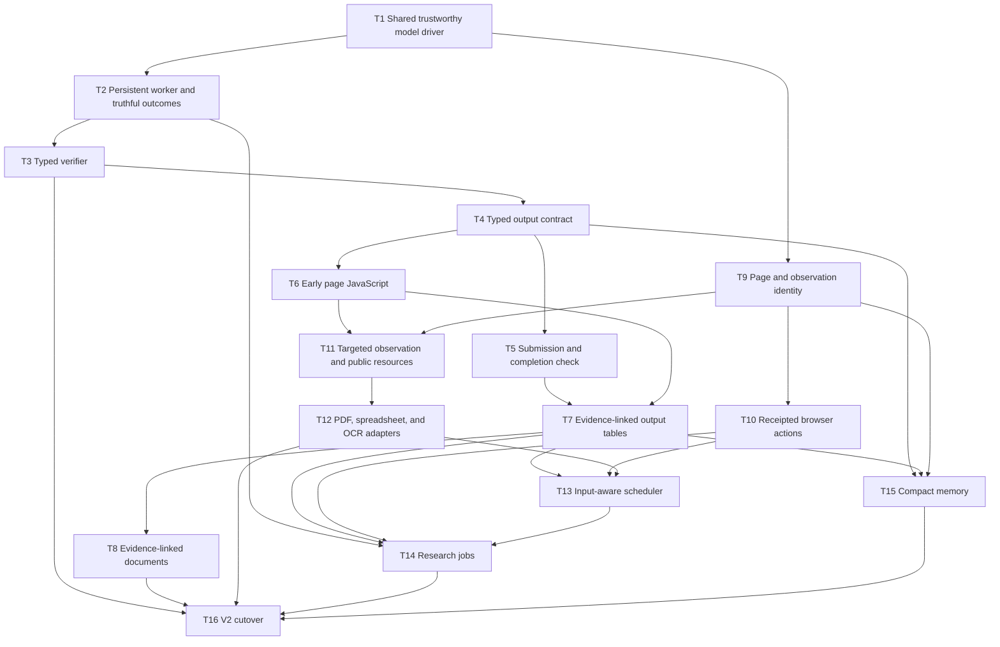

# Browser Agent V2 — Step-by-Step Implementation Plan

**Status:** Proposed

**Date:** 2026-08-13

**Design source:** [Browser Agent V2 — Revised Architecture Proposal](./revised-browser-agent-proposal.md)

**Machine-readable checklist:** [Browser Agent V2 tasks](./browser-agent-v2/tasks.json)

**Progress log:** [Browser Agent V2 progress](./browser-agent-v2/progress.md)

**Implementation baseline:** the current head of `feat/judge-harness`;
`19d458f` is the minimum reviewed harness baseline. Also bring in the V2 design
documents from `docs/browser-agent-v2-proposal`.

## 120-minute execution protocol

Treat 2 hours as a hard limit for the assigned implementation session. This
roadmap is larger than one guaranteed session, so “complete” always means the
explicitly assigned T-task(s), not unverified coverage of all T1–T16. If the
assigned scope is not narrower, work in dependency order and maximize fully
tested, reviewable tasks rather than touching many tasks partially.

The shell commands below are for the coding agent's terminal. They are not the
browser agent's own shell access, and they do not widen it.

> **Superseded on 2026-08-13.** This document originally said these commands
> "do not authorize adding a `bash` tool to the browser agent itself." A
> worker-only local `bash` tool, plus `edit_file`, has since been specified and
> implemented — see
> [the local code-execution specification](./browser-agent-local-code-execution-spec.md).
> The agent's shell is confined to `scratch/workspace/`, bounded in time and
> output, exposed to the **worker only**, and reconciled into the manifest
> before the tool returns. The initializer and the verifier remain incapable of
> shell execution or file mutation.

### Start the clock before inspecting or editing

Run this once at the very beginning:

```bash
date -u '+BROWSER_V2_START_EPOCH=%s BROWSER_V2_START_UTC=%Y-%m-%dT%H:%M:%SZ'
```

Read the complete output string. Preserve its numeric `BROWSER_V2_START_EPOCH`
in the active-work entry in `docs/browser-agent-v2/progress.md`; do not estimate
or reconstruct it later.

### Check time after every implementation step

After every numbered implementation item inside a T-task—and again after the
task's focused tests—run the following with `<START_EPOCH>` replaced by the
exact number printed by the start command:

```bash
BROWSER_V2_START_EPOCH=<START_EPOCH>
BROWSER_V2_NOW_EPOCH="$(date +%s)"
BROWSER_V2_TOTAL_SECONDS=7200
BROWSER_V2_ELAPSED_SECONDS=$((BROWSER_V2_NOW_EPOCH - BROWSER_V2_START_EPOCH))
BROWSER_V2_REMAINING_SECONDS=$((BROWSER_V2_TOTAL_SECONDS - BROWSER_V2_ELAPSED_SECONDS))
if [ "$BROWSER_V2_REMAINING_SECONDS" -lt 0 ]; then
  BROWSER_V2_REMAINING_SECONDS=0
fi
printf 'TIME_CHECK start=%s now=%s elapsed=%02dh:%02dm:%02ds remaining=%02dh:%02dm:%02ds\n' \
  "$BROWSER_V2_START_EPOCH" \
  "$BROWSER_V2_NOW_EPOCH" \
  $((BROWSER_V2_ELAPSED_SECONDS / 3600)) \
  $(((BROWSER_V2_ELAPSED_SECONDS % 3600) / 60)) \
  $((BROWSER_V2_ELAPSED_SECONDS % 60)) \
  $((BROWSER_V2_REMAINING_SECONDS / 3600)) \
  $(((BROWSER_V2_REMAINING_SECONDS % 3600) / 60)) \
  $((BROWSER_V2_REMAINING_SECONDS % 60))
```

Read the printed `TIME_CHECK` string and explicitly compare `elapsed` with the
120-minute limit before choosing the next action. Print the line in the agent's
progress update; do not run the command silently. At each completed T-task,
also copy its final time check into the task's entry in `progress.md`.

### Estimate at machine speed

Estimate editing and analysis in seconds or minutes, not human developer days.
A targeted TypeScript edit, search, or fixture addition often takes seconds;
an edit/test/debug loop should normally be budgeted in minutes. Use measured
command duration for typecheck, Chrome tests, package installation, and external
services rather than pretending those processes are instantaneous.

- Prefer direct edits and focused tests over long speculative planning.
- Reuse existing helpers and fixtures before creating frameworks.
- Run independent read-only inspections together when possible.
- Do not use the deadline to skip required validation or mark partial work
  complete. Reduce scope instead.
- Do not wait idly. If one safe check is running, prepare the next independent
  review or progress update.

### Delegate bounded work to fast subagents

When the environment supports delegation, use cheap, fast subagents to reduce
wall-clock time. Delegate only concrete work that can proceed independently;
the primary agent remains responsible for architecture, integration, the clock,
status tracking, and final correctness.

Good delegation targets include:

- locating affected code and reporting exact symbols and tests;
- adding or extending one isolated fixture/test file;
- implementing a leaf adapter whose interface is already decided;
- reviewing a scoped diff for missed edge cases;
- running an independent focused test group and returning the exact output.

Do not delegate an architectural decision, the shared completion loop, final
integration, or vague instructions such as “implement T4.” Before delegating:

1. Confirm the dependency graph says the work is unlocked.
2. Give the subagent one bounded deliverable, exact allowed paths, required
   tests, completion criteria, and a short time limit measured in minutes.
3. Prefer a fast, lower-cost model for mechanical searches, fixtures, leaf
   implementations, and review. Keep subtle control-flow and cross-component
   reasoning with the primary agent.
4. Assign one owner per file. Subagents must not edit the same file or shared
   integration points such as `src/cli/runTask.ts`, `src/tools/index.ts`, or
   `src/tools/registry.ts` concurrently.
5. Tell the subagent not to change unrelated files, task statuses, or
   `progress.md`; the primary agent owns tracking and integration.

Use at most three subagents at once, and fewer when the work is coupled. All
subagents share the original 120-minute deadline; delegation does not start a
new clock. The primary agent should continue useful independent work instead of
waiting idly, then inspect every returned diff and rerun the relevant tests.
A subagent's “done” message is evidence to review, not proof of completion.

When 15 minutes remain, create no new delegation. Collect or stop outstanding
work, integrate only coherent verified changes, and record unfinished subagent
work in the handoff without marking its feature complete.

### Reserve the last 15 minutes

When `remaining` is 15 minutes or less, start no new T-task and no new feature.
Immediately consolidate:

1. Finish only the smallest safe unit already in progress; do not widen scope.
2. Run the focused tests most relevant to the changed behavior and typecheck if
   it fits. Run the full suite only if it can finish inside the window.
3. Run `git diff --check` and review the scoped diff and worktree status.
4. Update `tasks.json` and `progress.md` truthfully. Do not mark a task complete
   when a required check did not run or failed.
5. Commit a coherent verified slice when possible. Preserve unfinished work and
   name its exact state, tests, blocker, and next command otherwise.
6. Print one final `TIME_CHECK` and provide a concise handoff before the
   120-minute limit.

## Table of contents

- [120-minute execution protocol](#120-minute-execution-protocol)
- [What this plan optimizes for](#what-this-plan-optimizes-for)
- [Starting point and working rules](#starting-point-and-working-rules)
- [Task index](#task-index)
- [Dependency graph](#dependency-graph)
- [Detailed implementation steps](#detailed-implementation-steps)
  - [T1 — Make model responses trustworthy](#t1--make-model-responses-trustworthy)
  - [T2 — Preserve one worker session and report truthful outcomes](#t2--preserve-one-worker-session-and-report-truthful-outcomes)
  - [T3 — Replace prose judge verdicts with a typed verifier result](#t3--replace-prose-judge-verdicts-with-a-typed-verifier-result)
  - [T4 — Introduce one typed output contract](#t4--introduce-one-typed-output-contract)
  - [T5 — Add explicit submission and code-based completion checks](#t5--add-explicit-submission-and-code-based-completion-checks)
  - [T6 — Add bounded page-scoped JavaScript](#t6--add-bounded-page-scoped-javascript)
  - [T7 — Store evidence-linked rows and render tables with code](#t7--store-evidence-linked-rows-and-render-tables-with-code)
  - [T8 — Render evidence-linked documents](#t8--render-evidence-linked-documents)
  - [T9 — Give the browser stable page and observation identity](#t9--give-the-browser-stable-page-and-observation-identity)
  - [T10 — Replace blind browser batches with receipted actions](#t10--replace-blind-browser-batches-with-receipted-actions)
  - [T11 — Add targeted observation and anonymous public-resource reads](#t11--add-targeted-observation-and-anonymous-public-resource-reads)
  - [T12 — Add PDF, spreadsheet, and OCR content adapters](#t12--add-pdf-spreadsheet-and-ocr-content-adapters)
  - [T13 — Make tool scheduling input-aware](#t13--make-tool-scheduling-input-aware)
  - [T14 — Add bounded research jobs](#t14--add-bounded-research-jobs)
  - [T15 — Add cache-safe compact memory](#t15--add-cache-safe-compact-memory)
  - [T16 — Cut over to V2 and retire superseded paths](#t16--cut-over-to-v2-and-retire-superseded-paths)
- [Test and commit cadence](#test-and-commit-cadence)
- [Deliberately deferred work](#deliberately-deferred-work)

## What this plan optimizes for

Each task below ends in a working, testable improvement. We do not first build
all schemas, then all storage, then all tools, and wait until the end to connect
them. For example, T5 finishes a complete contract → worker → code check →
verifier path before T7 adds the richer table store.

The order favors the failures already observed in the current loop and
`feat/judge-harness`:

1. A truncated or refused model response must never look complete.
2. Judge failure or correction-limit exhaustion must never look successful.
3. The worker, initializer, code checks, and verifier must share one contract.
4. Objective failures should be caught before spending a verifier call.
5. Page JavaScript should deliver an early speed win before the larger browser
   state rewrite.
6. Parallel research should wait for typed row and evidence boundaries.

T1–T7 are the high-leverage implementation group. They should be completed and
measured before treating T9–T16 as a fixed commitment.

## Starting point and working rules

### Code baseline

Start implementation from the current head of `feat/judge-harness`. Commit
`19d458f` is the minimum reviewed baseline containing the initializer,
worker-cycle, screenshot-aware judge, and correction experiment; later branch
work must be preserved. T2–T4 refine those components rather than reimplementing
the experiment on the proposal branch.

Bring this proposal and plan onto the implementation branch as documentation
only. Do not merge unrelated worktree changes. In particular,
`docs/adversarial-review-revised-browser-agent-proposal.md` is an untracked
review input and is not part of this plan's commit.

### Rules that apply to every task

- Preserve the run directory as the product boundary. Graders continue to read
  only requested outputs selected from `manifest.json`.
- Keep `SYSTEM_PROMPT` and API tool definitions deterministic. Runtime state
  belongs in messages or tool inputs, never in a per-run system prompt.
- `execute_javascript` runs only inside a selected browser document. The
  former absolute no-shell boundary is superseded (see the note near the top):
  the worker also has a finite, local, worker-only `bash` tool whose working
  directory is `scratch/workspace/`. It is a lifecycle and provenance boundary,
  **not** a security boundary — the initializer and verifier still get neither
  shell nor file mutation.
- Route every write through `writeArtifact()` and every model-supplied path
  through `resolveRunPath()`. The single exception is `scratch/workspace/`,
  where a `bash` command creates files directly: `syncScratchWorkspace()` must
  pass every surviving regular file through the artifact module before the tool
  returns, so the manifest is truthful even though the bytes did not arrive
  through the chokepoint.
- Add no task-name checks, site selectors for an eval task, or hidden-eval
  special cases.
- Validate finite numeric limits. Reject `NaN`, `Infinity`, negative values,
  and non-integers where the limit is an integer.
- During development, append new tool definitions without reordering existing
  definitions. Freeze the final V2 order in T16.
- Keep the existing path alive until its replacement has fixture-test parity.
  Removal happens in T16, not while the replacement is half-built.
- Do not run a live re-baseline or choose the default contract-author mode
  without the user's direction. Hermetic unit and browser-fixture tests are
  required at every task.

## Task index

| ID | Deliverable | Depends on | First useful result |
| --- | --- | --- | --- |
| T1 | Strict, shared, cancellable model driver | — | Truncation, refusal, and token limits cannot complete or execute tools |
| T2 | Persistent worker session, whole-run budget, truthful outcomes | T1 | Judge crash and cycle exhaustion end as incomplete; corrections keep context |
| T3 | Typed verifier handoff | T2 | No `DONE`/`CONTINUE` parsing; invalid verdicts fail closed |
| T4 | Typed output contract with worker/initializer policies | T3 | Both experiment modes use the same validated requirements |
| T5 | `submit_for_verification` and `CompletionCheck` | T4 | One trustworthy contract → output → code check → verifier loop |
| T6 | Early bounded `execute_javascript` | T1, T4 | Bulk extraction works without waiting for the browser rewrite |
| T7 | Evidence store, `OutputTable`, deterministic CSV/JSON/Markdown rendering | T5, T6 | Model stops hand-writing tabular deliverables |
| T8 | Evidence-linked document rendering | T7 | Clean or footnoted prose outputs are checked against marked sources |
| T9 | Stable pages, frames, documents, observations, and `observe` | T1 | Browser state is explicit while legacy interaction tools still work |
| T10 | `browser_action`, page switching, dialogs, full JavaScript targeting | T9 | Actions return per-step receipts and page changes |
| T11 | Targeted DOM views and anonymous `read_resource` | T6, T9 | Large public JSON/CSV/HTML sources can be read and reconciled quickly |
| T12 | PDF, spreadsheet, visual, and OCR adapters | T11 | Non-ordinary webpages become first-class observable content |
| T13 | Input-aware access scheduling | T7, T10, T12 | Independent resources overlap without racing shared state |
| T14 | Isolated, bounded research jobs with typed merge | T2, T7, T10, T13 | Repeated entity research can run 2–3 public sessions concurrently |
| T15 | Cache-safe compact state and repeated-failure memory | T4, T7, T9 | Deep runs shrink without erasing useful failed-strategy history |
| T16 | V2 registry cutover and legacy removal | T3–T15 | One production path, frozen tools, no compatibility scaffolding |

## Dependency graph



### What can actually run in parallel

- T1 is the common root and should land first.
- T2 → T3 → T4 → T5 is sequential because each changes the same completion
  protocol and harness control flow.
- T9 can start after T1 in a separate worktree while T2–T5 proceed. Keep its
  new tools out of `src/tools/index.ts` until integration to reduce conflicts.
- T6 can start as soon as T4 defines run policy and the contract-era `ToolCtx`.
  It can overlap with the final T5 work if one owner resolves shared changes to
  `src/cli/runTask.ts`, `src/tools/registry.ts`, and `src/tools/index.ts`.
- T8 and T11/T12 can overlap after T7 and T11 respectively. They affect
  different output/content adapters.
- T10 can overlap with T7 and T8. T10 mainly owns browser control; T7/T8 mainly
  own run data and rendering.
- T15 can overlap with T10–T14 after T4, T7, and T9 land. It should consume
  their public summaries, not reach into their internal maps.
- T13 waits for the real page, table, evidence, and resource access patterns.
  Designing its keys earlier would guess at resources that do not yet exist.
- T14 waits for T13 and `OutputTable`. Parallel workers before those boundaries
  would share mutable browser and file state unsafely.
- T16 is intentionally sequential and last.

These are semantic dependencies. Parallel branches will still commonly touch
`src/cli/runTask.ts`, `src/tools/index.ts`, and `src/tools/registry.ts`. Assign
one integration owner for those files instead of letting the last merge choose
the architecture accidentally.

## Detailed implementation steps

### T1 — Make model responses trustworthy

**Goal:** Put every model role behind one strict, cancellable driver. No model
content reaches history or tool execution until the whole stream is accepted.

**Files and exact symbols**

- Add `src/model/modelDriver.ts`:
  - `ModelDriver`
  - `ModelGenerateOptions`
  - `ModelAttemptEvent`
  - `AcceptedModelResponse`
  - `ModelResponseRejectedError`
  - `createAnthropicModelDriver()`
  - `validateModelResponseForExecution()`
- Update `src/model/streamAssembly.ts`:
  - `assembleModelResponse()`
  - `TruncatedStreamDiagnostics`
- Update `src/model/callModel.ts`:
  - `buildRequestParams()`
  - keep `makeCallModel()` temporarily as an adapter over `ModelDriver`
- Update `src/model/callWithRetry.ts`:
  - `callWithRetry()`
- Update `src/loop/agentLoop.ts`:
  - `LoopDeps`
  - `runAgentLoop()`
  - `capResultBatch()`
- Update `src/tui/bridge/runSession.ts`:
  - `startRun()`
- Add `src/model/modelDriver.test.ts`; extend
  `src/model/streamAssembly.test.ts`, `src/loop/agentLoop.test.ts`, and
  `tests/tui/run-session.test.ts`.

**Implementation**

1. Make `assembleModelResponse()` require one terminal `message_delta`, a
   non-null stop reason, and `message_stop`, in addition to closed content
   blocks. EOF after closed blocks is still a truncated stream.
2. Let `validateModelResponseForExecution()` accept normal end/tool stop labels
   but reject `max_tokens`, refusal, context-window exhaustion, absent stop
   reason, malformed tool-call structure, unsupported content, and a response
   over the configured `maxToolCallsPerTurn`. Reject the whole attempt before
   history or execution and give the worker a short protocol correction.
3. In `createAnthropicModelDriver()`, buffer the response for execution. Retry
   transport/truncated-stream failures through the existing retry policy. Retry
   one structurally complete `max_tokens` response as the same request with a
   configured, larger `max_tokens`; never add the first attempt to history.
4. Carry one `AbortSignal` and typed `ModelAttemptEvent`s through the shared
   driver. The TUI may render streaming deltas by attempt ID, but must discard
   a rejected attempt rather than showing it as committed output.
5. Delete the duplicated Anthropic request/stream assembly inside
   `startRun()`. TUI and non-TUI callers must differ only in callbacks and
   cancellation, not request semantics.
6. Make `capResultBatch()` enforce the combined byte limit even for many small
   results. Once previews cannot shrink the message enough, offload remaining
   content with only a compact path/note result; never deliberately return an
   over-limit message.
7. Validate all model-output, tool-call, and retry limits at construction. Do not let
   `NaN` or `Infinity` bypass comparisons.

**Completion criteria**

- Missing `message_delta` or `message_stop`, refusal, context exhaustion, and
  `max_tokens` cannot produce a completed loop result.
- No tool from a rejected attempt executes, and the next provider request does
  not contain that attempt.
- A response over `maxToolCallsPerTurn` causes zero tool side effects.
- A `max_tokens` response is retried at most once with the same messages and a
  larger output allowance.
- Many individually small results still fit the combined tool-result cap.
- TUI cancellation interrupts streaming and retry backoff through the same
  driver used by `runTask()`.
- `buildRequestParams()` retains its byte-stable prefix tests.

**Focused test command**

```bash
npx vitest run src/model/streamAssembly.test.ts src/model/modelDriver.test.ts src/model/callModel.test.ts src/model/callWithRetry.test.ts src/loop/agentLoop.test.ts tests/tui/run-session.test.ts
```

### T2 — Preserve one worker session and report truthful outcomes

**Goal:** Keep one worker conversation across verifier corrections and make the
top-level outcome and budget describe the entire run, not only its final cycle.

**Files and exact symbols**

- Add `src/loop/workerSession.ts`:
  - `WorkerSession`
  - `WorkerSessionState`
  - `createWorkerSession()`
  - `runWorkerTurn()`
  - `appendWorkerFeedback()`
- Add `src/run/runOutcome.ts`:
  - `RunOutcome`
  - `IncompleteRunReason`
- Add `src/run/runBudget.ts`:
  - `RunBudgetConfig`
  - `RunBudgetTracker`
  - `createRunBudgetTracker()`
  - `recordModelUsage()`
  - `recordToolCalls()`
- Refactor `src/loop/agentLoop.ts`:
  - make `runAgentLoop()` a compatibility wrapper around `WorkerSession`
  - extend `RunMetrics` with role-level usage
- Refactor `src/harness/harness.ts`:
  - replace cycle-only accounting with `HarnessDiagnostics`
  - add `RunRoleMetrics`
- Refactor `src/cli/runTask.ts`:
  - replace private `runHarnessCycles()` with `runVerificationHarness()`
  - update `RunTaskResult`
- Add `src/loop/workerSession.test.ts` and `src/run/runBudget.test.ts`; update
  `src/harness/harness.test.ts` and `src/cli/runTask.test.ts`.

**Implementation**

1. Move mutable messages and turn count into `WorkerSessionState`. A correction
   appends feedback to that same state; it does not call `runAgentLoop()` with a
   fresh opening message.
2. Keep `runAgentLoop()` working for the non-harness path while callers migrate.
   It creates one session, advances it, and maps the terminal state to the new
   outcome type.
3. Use one `RunBudgetTracker` for initializer, worker, verifier, and later
   repair calls. Track finite limits for turns, attempted tool calls, model
   tokens, tool-result bytes, wall time, and correction counters.
4. Account for initializer and verifier latency/tokens in `metrics.json` under
   role totals. Keep aggregate fields needed by current eval/report readers.
5. Map judge crash to `incomplete: verifier_unavailable`, `CONTINUE` at the
   limit to `incomplete: verification_attempts`, and budget exhaustion to
   `incomplete: budget_exceeded`. Preserve artifacts in every incomplete case.
6. Make `verified` the only success state. Update TUI and eval adapters to
   display incomplete separately from runtime failure.

**Completion criteria**

- A correction request reaches the same `WorkerSession`; the next request
  includes prior worker messages and the correction result exactly once.
- Starting a correction does not reset any whole-run budget.
- Judge crash and exhausted correction attempts cannot produce success.
- `metrics.json` includes every model role and its wall time while existing
  aggregate metric readers still parse it.
- Invalid finite-limit configuration fails before the browser or model starts.

**Focused test command**

```bash
npx vitest run src/loop/workerSession.test.ts src/run/runBudget.test.ts src/harness/harness.test.ts src/cli/runTask.test.ts tests/tui/eval-session.test.ts tests/tui/run-session.test.ts
```

### T3 — Replace prose judge verdicts with a typed verifier result

**Goal:** Make verification fail closed through one schema-validated tool call.

**Files and exact symbols**

- Add `src/harness/verifier.ts`:
  - `verificationFindingSchema`
  - `verificationResultSchema`
  - `VerificationFinding`
  - `VerificationResult`
  - `VerifierOutcome`
  - `REPORT_VERIFICATION_TOOL`
  - `runVerifier()`
  - `makeVerifierModelDriver()`
- Add `src/harness/verifierTools.ts`:
  - `createVerifierRegistry()`
  - `buildVerificationInput()`
- Update `src/harness/harness.ts`:
  - `runVerificationHarness()` consumes `VerifierOutcome`
- Remove `parseVerdict()` and `parseVerdictLine()` from
  `src/harness/judge.ts`; remove the file after all image/evidence helpers have
  moved to `verifier.ts` or `verifierTools.ts`.
- Replace `src/harness/judge.test.ts` with `src/harness/verifier.test.ts`.

**Implementation**

1. Define the exact union from the proposal: `verified` requires an empty
   findings array; `needs_correction` requires at least one finding with area,
   code, and message.
2. Force `report_verification` as the verifier's result tool. Permit read-only
   inspection calls before it, but reject a mixed final response or more than
   one report call.
3. Give the verifier only the original task, the current compatibility
   `INTENT.md`/`CONTRACT.md` text, requested-output summaries, manifest evidence,
   screenshot/image inspection, and scoped read/grep tools. It never receives
   arbitrary scratch files, the worker transcript, browser mutation, or writes.
   T4 replaces the two compatibility files with `OutputContract`; T5 adds the
   code-check result.
4. Keep the existing image-byte and image-dimension safeguards. Feed images as
   image blocks rather than asking the verifier to infer their contents from a
   filename.
5. Return one schema error for a single bounded repair turn. A second invalid
   report, refusal, token limit, truncated stream, or thrown model call becomes
   `verifier_unavailable`.
6. Record a verifier attempt and its token usage even when its report is
   invalid.

**Completion criteria**

- Ordinary text containing `DONE` or `CONTINUE` has no control-flow meaning.
- A malformed or missing report can never verify a run.
- The verifier explicitly checks task ↔ contract, contract ↔ outputs, task ↔
  outputs, completeness, and fact ↔ evidence relationships.
- Existing screenshot-aware verification behavior remains covered.

**Focused test command**

```bash
npx vitest run src/harness/verifier.test.ts src/harness/harness.test.ts src/cli/runTask.test.ts
```

### T4 — Introduce one typed output contract

**Goal:** Replace `INTENT.md`/`CONTRACT.md` parsing with one runtime-owned,
versioned contract used by either authoring policy.

**Files and exact symbols**

- Add `src/contracts/outputContract.ts`:
  - `outputColumnSchema`
  - `tableRuleSchema`
  - `outputSpecSchema`
  - `outputContractSchema`
  - `setOutputContractInputSchema`
  - `OutputContract`
  - `OutputContractRevision`
  - `validateContractRevision()`
- Add `src/contracts/outputContractStore.ts`:
  - `OutputContractStore`
  - `createOutputContractStore()`
  - `setOutputContract()`
  - `currentRevision()`
  - `contractHistory()`
- Add `src/tools/setOutputContract/setOutputContract.ts`:
  - `setOutputContractTool`
- Refactor `src/harness/initializer.ts`:
  - `ContractAuthor`
  - `runContractInitializer()`
  - `makeContractInitializerModelDriver()`
- Update `src/tools/registry.ts`:
  - add `outputContracts` to `ToolCtx`
- Update `src/cli/runTask.ts`:
  - add `contractAuthor: 'worker' | 'initializer'` to `HarnessConfig`
- Add matching tests under `src/contracts/` and
  `src/tools/setOutputContract/`; refactor `src/harness/initializer.test.ts`.

**Implementation**

1. Implement the proposal's `OutputSpec` union, column types, table rules,
   document evidence defaults, screenshot/download constraints, assumptions,
   and content expectations with Zod.
2. Add cross-field checks for duplicate output IDs/paths, unsafe filenames,
   duplicate columns, non-positive counts, conflicting rules, and unconstrained
   downloads.
3. Persist each accepted revision as
   `scratch/output-contract/revision-<n>.json` through `writeArtifact()`. Later
   revisions require a valid evidence, assumption-correction, or user basis;
   never overwrite history.
4. Require `set_output_contract` to be the first call of the first worker
   response. If it is missing or invalid, execute no calls from that response
   and return one result for every call: `output_contract_required`, the schema
   error, or `blocked_by_invalid_contract`.
5. In initializer mode, offer only `set_output_contract`, force its tool choice,
   and allow one bounded schema repair. Stop writing executable `INTENT.md` and
   `CONTRACT.md` files.
6. Keep `contractAuthor` configurable. Preserve initializer mode as the
   migration default until a user-authorized comparison decides otherwise;
   the architecture must not depend on which author is chosen.
7. Pass the original task, latest contract, and full revision history to
   `buildVerificationInput()`.

**Completion criteria**

- Both authoring modes produce byte-for-byte-equivalent stored JSON for the
  same tool input and feed the same worker/verifier code.
- An invalid or missing first contract cannot allow a browser action to run.
- Every attempted tool use still receives exactly one tool result.
- A revision that weakens an original explicit requirement is visible to the
  verifier; evidence-driven strengthening is accepted.
- Tool order and the static prompt prefix remain deterministic.

**Focused test command**

```bash
npx vitest run src/contracts/outputContract.test.ts src/contracts/outputContractStore.test.ts src/tools/setOutputContract/setOutputContract.test.ts src/harness/initializer.test.ts src/harness/verifier.test.ts src/tools/index.test.ts src/model/callModel.test.ts
```

### T5 — Add explicit submission and code-based completion checks

**Goal:** Replace implicit no-tool completion with an exclusive submission
protocol and put objective validation before the verifier.

**Files and exact symbols**

- Add `src/completion/completionCheck.ts`:
  - `CompletionFailure`
  - `CompletionCheckResult`
  - `runCompletionCheck()`
  - `validateExpectedOutputs()`
  - `validateManifestIntegrity()`
- Add `src/completion/workerResponseProtocol.ts`:
  - `WorkerResponseDisposition`
  - `validateWorkerResponse()`
- Add `src/completion/finalizeIncompleteRun.ts`:
  - `finalizeIncompleteRun()`
- Add `src/tools/submitForVerification/submitForVerification.ts`:
  - `submitForVerificationTool`
  - `SubmitForVerificationInput`
- Update `src/tools/registry.ts`:
  - add `ControlToolDef`
  - change `ToolRegistry` to contain `ToolDef | ControlToolDef`
- Update `src/loop/workerSession.ts`:
  - `runWorkerTurn()` returns a submission disposition to the harness
- Update `src/harness/harness.ts`:
  - `runVerificationHarness()` runs code checks, then `runVerifier()`
- Update `src/run/artifacts.ts`:
  - add optional `completionStatus: 'complete' | 'partial'` to
    `ManifestEntry` and `ArtifactMeta`
  - add `setArtifactCompletionStatus()`
- Add `src/completion/completionCheck.test.ts`,
  `src/completion/workerResponseProtocol.test.ts`, and a vertical
  `src/cli/runTask.verification.test.ts`.

**Implementation**

1. Register `submit_for_verification` as a control tool intercepted before the
   ordinary scheduler. It must be the response's only tool call. It never runs
   through `executeToolCall()` and cannot be mixed with writes.
2. Treat a clean no-tool response as an invalid working response, not success.
   Return concise protocol feedback to the same worker without committing an
   invalid assistant/tool structure.
3. Implement the first `CompletionCheck`: requested outputs exist and are
   non-empty; manifest roles and hashes match; JSON/CSV parse; exact CSV columns
   and order match; declared row-count/unique/required-value rules pass;
   screenshots/downloads match their contract; document markers and evidence
   requirements pass; obvious placeholders are absent.
4. Return code-check failures as the submission tool result to the same worker.
   Invoke `runVerifier()` only when code checks are ready.
5. Use separate defaults:
   `maxCompletionCheckFailures = 5` and `maxVerificationAttempts = 3`. Both are
   also bounded by `RunBudgetTracker`.
6. On verifier correction, return structured findings as the same submission
   call's result. On verification, finalize the manifest and return
   `{ status: 'verified' }`.
7. On incomplete exit, `finalizeIncompleteRun()` preserves the run. It derives
   which contract outputs remain unsatisfied and marks only those usable
   artifacts `partial` through `setArtifactCompletionStatus()`; an already
   satisfied screenshot or download can remain `complete`. T7 extends this path
   to render current in-memory tables.

**Completion criteria**

- Only a successful `submit_for_verification` → code check → verifier sequence
  can return `verified`.
- Submission mixed with any other tool call executes nothing from that model
  response.
- A malformed file never spends a verifier attempt; a semantic correction does.
- Repeated code-check failures and verifier unavailability end with distinct
  incomplete reasons and preserved artifacts.
- A fake-model integration test completes contract → file write → submit → code
  check → verified without a real API call.

**Focused test command**

```bash
npx vitest run src/completion/completionCheck.test.ts src/completion/workerResponseProtocol.test.ts src/cli/runTask.verification.test.ts src/harness/verifier.test.ts src/harness/harness.test.ts src/run/artifacts.test.ts
```

### T6 — Add bounded page-scoped JavaScript

**Goal:** Deliver the fastest likely browser improvement without waiting for
the complete page/frame identity model.

**Files and exact symbols**

- Update `src/browser/controller.ts`:
  - `BrowserJavaScriptPolicy`
  - `EarlyJavaScriptRequest`
  - `BrowserJavaScriptResult`
  - `executeJavaScript()` on `BrowserController`
- Update `src/browser/playwrightBrowserController.ts`:
  - `PlaywrightBrowserController.executeJavaScript()`
  - `replaceUnresponsivePage()`
- Add `src/evidence/evidenceStore.ts`:
  - `Evidence`
  - `EvidenceStore`
  - `createEvidenceStore()`
  - `recordEvidence()`
- Add `src/tools/executeJavascript/executeJavascript.ts`:
  - `earlyExecuteJavaScriptInputSchema`
  - `executeJavascriptTool`
- Update `src/tools/registry.ts`:
  - add `evidenceStore` and `javascriptPolicy` to `ToolCtx`
- Update `src/cli/runTask.ts` and browser session configuration:
  - add explicit `javascriptPolicy: 'allow' | 'deny'` for authenticated runs
- Add `src/tools/executeJavascript/executeJavascript.test.ts` and extend
  `src/browser/playwrightBrowserController.test.ts`.

**Implementation**

1. Implement only the early schema:
   `target: 'selected_top_document'`, `code`, optional bounded `timeoutMs`, and
   optional `captureEvidence`. Do not make future page/frame IDs optional.
2. Lock the selected page for the call, execute in its document, return only
   JSON-compatible values, and cap output using the existing per-result and
   combined-message offload path.
3. Record code, URL, an internal document token, result, logs, timing, and
   error in the transcript. When evidence capture is requested, save the full
   extraction record through `writeArtifact()` and return an Evidence ID.
4. Cap caller timeouts. A timeout must be able to terminate execution. If the
   provider cannot restore the page, close it, invalidate its references, and
   create a replacement page rather than hanging the run.
5. Treat every JavaScript call as a page write. It can inspect or mutate the
   DOM and must not claim to be read-only.
6. Require explicit allow/deny policy for authenticated lanes. Log an allow
   decision as accepted capability exposure; do not describe page JavaScript
   as a secure sandbox.

**Completion criteria**

- A fixture page can bulk-extract a repeated list in one call and produce a
  persisted `javascript_extraction` evidence record.
- Non-JSON return values fail with a bounded, useful tool error.
- Infinite or long-running execution terminates or replaces the page within the
  configured hard limit; the whole run remains usable.
- An authenticated session without an explicit policy fails at configuration
  time, and `deny` prevents execution.
- Large results are offloaded with stable preview bytes.

**Focused test command**

```bash
npx vitest run src/tools/executeJavascript/executeJavascript.test.ts src/browser/playwrightBrowserController.test.ts src/tools/capResult.test.ts src/run/artifacts.test.ts src/cli/runTask.test.ts
```

### T7 — Store evidence-linked rows and render tables with code

**Goal:** Make tabular output a typed application concern and establish the
merge boundary required by future research jobs.

**Files and exact symbols**

- Add `src/outputs/outputTable.ts`:
  - `OutputRow`
  - `TableCompletenessEvidence`
  - `OutputTable`
  - `OutputTableStore`
  - `createOutputTableStore()`
  - `upsertOutputRows()`
  - `deleteOutputRows()`
  - `setTableCompleteness()`
- Add `src/outputs/renderTable.ts`:
  - `renderOutputTable()`
  - `renderCsv()`
  - `renderJson()`
  - `renderMarkdownTable()`
- Add `src/outputs/outputSummary.ts`:
  - `OutputSummary`
  - `summarizeOutputs()`
- Add tools:
  - `src/tools/upsertOutputRows/upsertOutputRows.ts` — `upsertOutputRowsTool`
  - `src/tools/deleteOutputRows/deleteOutputRows.ts` — `deleteOutputRowsTool`
  - `src/tools/setTableCompleteness/setTableCompleteness.ts` —
    `setTableCompletenessTool`
- Extend `src/evidence/evidenceStore.ts` for screenshot, download,
  network-response, and web-text evidence; adapt existing screenshot/download
  tools to return IDs.
- Update `src/completion/completionCheck.ts`:
  - `validateTableRules()`
  - `validateTableCompleteness()`
  - `validateEvidenceReferences()`
  - `renderTableOutputs()`
- Update `src/completion/finalizeIncompleteRun.ts` to best-effort render partial
  tables.
- Add `csv-stringify`, `date-fns`, and `@date-fns/tz` as pinned dependencies.

**Implementation**

1. Create a table lazily from a table `OutputSpec`; the contract remains the
   sole source for filename, format, columns, types, and rules.
2. Validate an entire upsert atomically: exact keys, required values, URL and
   numeric types, enum membership, date/time format and IANA timezone,
   uniqueness, existing Evidence IDs, and formula-leading spreadsheet values.
3. Use stable `rowId`, monotonically increasing `version`, and optional
   `expectedVersion`. A conflict returns current version and changes nothing.
4. Require at least one evidence ID for every factual row. Require
   `TableCompletenessEvidence` for exact/minimum count tables and mechanically
   reject a missing proof at submission.
5. Render exact contract columns and only those columns with application code.
   Pin formatter versions. Reject formula-leading strings during row validation
   rather than silently adding characters that change the requested value; CSV
   quoting by itself is not a formula safeguard. Never ask the model to emit
   CSV syntax.
6. Render only during submission and incomplete finalization. Successful files
   use `completionStatus: 'complete'`; incomplete best-effort files retain the
   requested-output role and use `partial`.
7. Include current row count, rule failures, evidence failures, completeness,
   and path state in `summarizeOutputs()` so the worker sees problems before
   consuming a submission attempt.

**Completion criteria**

- Contract columns are rendered exactly and in order; no extra column can
  reach the artifact.
- Invalid multi-row upserts and version conflicts make no partial change.
- Formula-leading string values are rejected without silently changing the
  requested output data.
- Count-ruled tables without valid completeness evidence fail the code check.
- A budget-exhausted run with valid partial rows writes a parseable partial
  table and manifest entry.
- Screenshot, download, JavaScript, and web-text evidence IDs all resolve to
  reviewable run-directory data.

**Focused test command**

```bash
npx vitest run src/outputs/outputTable.test.ts src/outputs/renderTable.test.ts src/outputs/outputSummary.test.ts src/tools/upsertOutputRows/upsertOutputRows.test.ts src/tools/deleteOutputRows/deleteOutputRows.test.ts src/tools/setTableCompleteness/setTableCompleteness.test.ts src/completion/completionCheck.test.ts src/run/artifacts.test.ts evals/grading/manifestVerification.test.ts
```

### T8 — Render evidence-linked documents

**Goal:** Produce prose through a contract-bound renderer while retaining a
reviewable evidence-marked source.

**Files and exact symbols**

- Add `src/outputs/documentSource.ts`:
  - `EvidenceMarker`
  - `parseEvidenceMarkers()`
  - `validateDocumentEvidence()`
- Add `src/outputs/renderDocument.ts`:
  - `renderDocument()`
  - `renderHiddenEvidence()`
  - `renderEvidenceFootnotes()`
  - `renderPdf()`
- Add `src/tools/writeDocument/writeDocument.ts`:
  - `writeDocumentTool`
- Update `src/completion/completionCheck.ts`:
  - `validateDocumentOutputs()`
- Add tests beside each new file and tool.

**Implementation**

1. Accept only `{ outputId, content }`. Resolve filename, format, required
   sections, evidence coverage, and presentation from the latest contract.
2. Parse `[evidence:E17]` markers and verify that each ID exists. Enforce the
   document's default `at_least_one`, explicit `none`, or
   `per_required_section` policy.
3. Save the marked source under `scratch/documents/<outputId>/source.md`
   through `writeArtifact()`.
4. Deterministically produce the requested Markdown/text/PDF. Hidden mode
   removes internal markers; footnote mode renders readable source footnotes.
   Render PDF from a local, fixed HTML template in a dedicated Playwright page
   with network access disabled; never reuse the worker's selected page.
   Publish only the clean/footnoted output with `requested_output`.
5. Give the verifier both the marked source and published rendering; do not
   expose unrelated scratch files.
6. Keep `write_file` for scratch/supporting files, but make it unable to
   satisfy a contract-bound document output.

**Completion criteria**

- Missing, unknown, or under-covered evidence markers fail before verification.
- The marked source and requested output are both hashed in the manifest with
  the correct scratch/published roles.
- Hidden outputs contain no raw evidence IDs; footnoted outputs contain stable,
  readable source references.
- The PDF and text/Markdown renderings are derived from the same accepted
  source content.

**Focused test command**

```bash
npx vitest run src/outputs/documentSource.test.ts src/outputs/renderDocument.test.ts src/tools/writeDocument/writeDocument.test.ts src/completion/completionCheck.test.ts src/harness/verifier.test.ts src/run/artifacts.test.ts
```

### T9 — Give the browser stable page and observation identity

**Goal:** Make tabs, frames, documents, observations, and element references
explicit without yet replacing the working atomic interaction tools.

**Files and exact symbols**

- Add `src/browser/browserState.ts`:
  - `BrowserPage`
  - `BrowserFrame`
  - `ElementRef`
  - `BrowserObservation`
  - `PageChanges`
  - `BrowserStateStore`
  - `createBrowserStateStore()`
- Update `src/browser/controller.ts`:
  - `pages()`
  - `observe()`
  - `switchPage()`
- Update `src/browser/playwrightBrowserController.ts`:
  - `PlaywrightBrowserController.pages()`
  - `PlaywrightBrowserController.observe()`
  - `PlaywrightBrowserController.switchPage()`
  - `resolveElementRef()`
- Add `src/tools/observe/observe.ts`:
  - `observeRequestSchema`
  - `observeTool`
- Keep `src/tools/inspectPage/inspectPage.ts` as an adapter during migration.
- Extend `src/browser/playwrightBrowserController.test.ts` and add
  `src/tools/observe/observe.test.ts`.

**Implementation**

1. Assign stable runtime `pageId` and `frameId` values. Change `documentId` on
   navigation, reload, or frame replacement. Increment `observationId` only
   when returning a new snapshot.
2. Make `basedOnObservationId` a requested diff baseline, not a page-wide
   optimistic lock. Evicted baselines produce a bounded full snapshot, not a
   stale error.
3. Bind every `ElementRef` to page, frame, and document. Store backend node ID
   and stable locator when available plus role/name as a fallback description.
4. Resolve a target by exact node, then same-document stable locator, then a
   unique role/name match. Never use an ordinal to retarget a mutating action.
5. Track popups and frame changes from Playwright events. Return them through
   browser state even while legacy tools remain single-selected-page adapters.
6. Initially support compact `interactive` and exact `text` observation needs;
   T11 adds table, visual, and document adapters.

**Completion criteria**

- Navigation invalidates prior-document refs; unrelated DOM mutation does not
  invalidate a still-unique target.
- Reordered duplicate rows cannot cause an ordinal ref to mutate the wrong row.
- Popup and frame identity survive more than one observation.
- Diff-cache eviction returns `basis: 'full_snapshot'`, never false `stale`.
- Existing atomic browser tools continue to pass unchanged behavior tests.

**Focused test command**

```bash
npx vitest run src/browser/playwrightBrowserController.test.ts src/tools/observe/observe.test.ts src/tools/inspectPage/inspectPage.test.ts src/tools/click/click.test.ts src/tools/type/type.test.ts
```

### T10 — Replace blind browser batches with receipted actions

**Goal:** Execute short same-document action sequences with precise partial
commit, settle, and recovery information.

**Files and exact symbols**

- Add `src/browser/browserActions.ts`:
  - `BrowserAction`
  - `SuccessCheck`
  - `SettlePolicy`
  - `BrowserActionReceipt`
  - `BrowserActionOutput`
  - `performBrowserActions()`
- Update `src/browser/controller.ts`:
  - `browserAction()`
  - `handleDialog()`
- Update `src/browser/playwrightBrowserController.ts`:
  - `PlaywrightBrowserController.browserAction()`
  - `PlaywrightBrowserController.handleDialog()`
  - `waitForSuccessChecks()`
  - `waitForDomQuiescence()`
- Add tools:
  - `src/tools/browserAction/browserAction.ts` — `browserActionTool`
  - `src/tools/switchPage/switchPage.ts` — `switchPageTool`
  - `src/tools/handleDialog/handleDialog.ts` — `handleDialogTool`
- Upgrade `src/tools/executeJavascript/executeJavascript.ts` from the early
  schema to the full page/frame/document/observation schema.
- Add tool and controller tests; keep `browser_batch` registered for parity
  comparison until T16.

**Implementation**

1. Support one to eight navigate/click/fill/press/select/check/hover/drag/
   upload/scroll actions against one page/document. Resolve upload paths only
   through `resolveRunPath()`.
2. Revalidate each target immediately before its action and emit one receipt
   with `effectsCommitted`. Stop on navigation, document replacement, popup,
   dialog, stale target, or failure; name the first unexecuted index.
3. Treat a final action that triggers navigation as completed. If later actions
   remain, return `partial` with the new document and unexecuted index.
4. Separate success-check timeout, DOM quiet window, and settle timeout. Use
   bounded defaults from the proposal and never rely on global `networkidle`.
5. Return `failed_check` after committed side effects when a success check
   fails. Never imply rollback.
6. Classify recognizable login, CAPTCHA, rate-limit, bot-challenge, and
   permission states as `blocked`, including bounded `retryAfterMs` where known.
7. Return size-capped page changes, pages, dialogs, and downloads. Offload large
   changes through the existing scratch path.
8. Upgrade JavaScript targeting to explicit page/frame/document/observation and
   return the same settle/change structures as browser actions.

**Completion criteria**

- Fixture tests distinguish untouched, partially committed, fully committed,
  failed-check, stale, unsettled, and blocked outcomes.
- Mid-sequence navigation never runs actions against the replacement document.
- A final submit-button navigation reports completed, not ambiguous failure.
- Upload cannot escape the run directory.
- `browser_action` reaches feature and diagnostic parity with `browser_batch`;
  removal still waits for T16.

**Focused test command**

```bash
npx vitest run src/browser/playwrightBrowserController.test.ts src/tools/browserAction/browserAction.test.ts src/tools/switchPage/switchPage.test.ts src/tools/handleDialog/handleDialog.test.ts src/tools/executeJavascript/executeJavascript.test.ts src/tools/browserBatch/browserBatch.test.ts
```

### T11 — Add targeted observation and anonymous public-resource reads

**Goal:** Read the smallest useful page representation and retrieve discovered
public JSON/CSV/HTML resources without profile credentials.

**Files and exact symbols**

- Add `src/browser/publicResourceReader.ts`:
  - `PublicResourceReader`
  - `ReadResourceRequest`
  - `ReadResourceOutput`
  - `assertPublicHttpUrl()`
  - `PlaywrightPublicResourceReader`
- Add `src/browser/discoveredUrlIndex.ts`:
  - `DiscoveredUrlIndex`
  - `recordObservedUrl()`
  - `isAllowedResourceUrl()`
- Extend `src/browser/browserState.ts` and `observe()` with `table` and `visual`
  needs and targeted-region observation.
- Add tools:
  - `src/tools/readResource/readResource.ts` — `readResourceTool`
  - `src/tools/captureText/captureText.ts` — `captureTextTool`
- Update `src/evidence/evidenceStore.ts` for `network_response` and `web_text`.
- Add unit and browser-fixture tests beside these files.

**Implementation**

1. Record URLs from deliberate navigation, observed links, and browser network
   metadata. Allow `read_resource` only when the site was visited or the exact
   URL was observed.
2. Use a separate anonymous context with no profile cookies, authorization
   headers, or stored credentials. Save bounded original bytes as evidence.
3. Resolve and validate every initial target and redirect. Reject credentials
   in URLs plus loopback, private, link-local, multicast, and reserved IPv4/IPv6
   addresses. Re-resolve on redirects to reduce DNS rebinding exposure.
4. Parse auto/JSON/CSV/HTML and provide a bounded preview plus offload path.
5. Make the worker spot-check endpoint values and ordering against the visible
   UI before using them as final values. When they disagree, the task-named or
   deliberately opened source remains authoritative.
6. Add targeted interactive/text/table/visual observation. Visual mode sends
   the actual cropped image to the model; saving it as durable evidence remains
   a separate choice.
7. `capture_text` saves exact text, URL, and locator as evidence rather than
   relying on a transient outline.

**Completion criteria**

- A fixture page can expose a large JSON/CSV URL, read it anonymously, save the
  original response, and return a bounded parsed preview.
- Unobserved URLs and every tested private/loopback address and redirect are
  rejected before content is returned.
- Tests prove no configured profile cookie or authorization header reaches the
  resource server.
- Table and visual observations are smaller than a full-page outline and retain
  source/element identity.

**Focused test command**

```bash
npx vitest run src/browser/publicResourceReader.test.ts src/browser/discoveredUrlIndex.test.ts src/tools/readResource/readResource.test.ts src/tools/captureText/captureText.test.ts src/tools/observe/observe.test.ts src/evidence/evidenceStore.test.ts
```

### T12 — Add PDF, spreadsheet, and OCR content adapters

**Goal:** Make common non-HTML evidence sources observable through the same
bounded representation and evidence system.

**Files and exact symbols**

- Add `src/content/contentReader.ts`:
  - `ContentReader`
  - `ContentReadRequest`
  - `ContentObservation`
  - `ContentReaderRegistry`
  - `createContentReaderRegistry()`
- Add adapters:
  - `src/content/pdfContentReader.ts` — `PdfContentReader`
  - `src/content/spreadsheetContentReader.ts` — `SpreadsheetContentReader`
  - `src/content/ocrContentReader.ts` — `OcrContentReader`
- Add `src/tools/inspectDocument/inspectDocument.ts`:
  - `inspectDocumentTool`
- Extend `readResourceTool` and `observeTool` to route PDF, spreadsheet, and
  image-only content through the registry.
- Add pinned `pdfjs-dist`, `exceljs`, and `tesseract.js` dependencies.
- Add small deterministic fixtures under `tests/fixtures/content/` and tests
  beside every adapter.

**Implementation**

1. Detect format from trusted bytes plus media type; do not trust a filename
   extension alone.
2. PDF adapter returns page-range text with page/line or bounding-box locators
   and can render requested pages as images for visual review.
3. Spreadsheet adapter lists sheets and reads bounded row/column ranges with
   exact cell addresses, displayed values, and underlying values.
4. OCR adapter accepts a page/image range, records OCR engine/version and
   confidence, and preserves the source image as evidence. OCR text is never
   presented as exact without its confidence/source.
5. All adapters support chunking and existing offload caps. The model asks for
   another bounded range rather than receiving an entire large document.
6. Run CPU-heavy parsing/OCR outside page-action locks and make it cancellable.

**Completion criteria**

- Deterministic fixtures prove page, sheet/cell, and image provenance survives
  extraction.
- A large document returns a bounded chunk and an explicit continuation range.
- Cancelling OCR or PDF parsing releases work and does not block manifest
  finalization.
- The verifier can view source pages/images as images when visual meaning is
  material.

**Focused test command**

```bash
npx vitest run src/content/contentReader.test.ts src/content/pdfContentReader.test.ts src/content/spreadsheetContentReader.test.ts src/content/ocrContentReader.test.ts src/tools/inspectDocument/inspectDocument.test.ts src/tools/readResource/readResource.test.ts
```

### T13 — Make tool scheduling input-aware

**Goal:** Parallelize only calls whose validated inputs prove they cannot race,
and bound call count and combined result size before execution.

**Files and exact symbols**

- Update `src/tools/registry.ts`:
  - `ToolAccess`
  - `ToolDef.getAccess()`
  - retain `readOnly` only as a temporary compatibility field
- Refactor `src/loop/scheduler.ts`:
  - `ValidatedToolCall`
  - `validateToolCallsForScheduling()`
  - `scheduleToolCalls()`
  - `accessesConflict()`
  - `commitToolResultsInCallOrder()`
- Update `src/tools/pipeline.ts`:
  - accept already validated inputs without reparsing them differently
- Update every production tool definition with `getAccess()`.
- Extend `src/loop/scheduler.test.ts`, `src/tools/registry.test.ts`, and
  `src/loop/agentLoop.test.ts`.

**Implementation**

1. Parse and validate all calls before computing access. Preserve T1's rule
   that a response over `maxToolCallsPerTurn` executes nothing, and T2's rule
   that every attempted call counts toward the whole-run limit.
2. Have `getAccess()` return concrete keys such as `page:<id>`,
   `observation:<pageId>`, `table:<outputId>`, `file:<path>`, `origin:<host>`,
   and `manifest`. Missing/invalid access declarations run alone.
3. Allow overlap only when neither call writes a resource the other reads or
   writes. `observe` writes observation state; JavaScript writes its page;
   table mutations write their output ID.
4. Execute safe groups concurrently, buffer their model-visible results and
   derived run-state records, and commit those in the model's original call
   order. Browser/network effects occur during execution only on resources
   already proven disjoint. Keep manifest writes serialized.
5. Apply both per-result and combined-result caps to the final tool-result
   message. Offload additional small results when their combined bytes would
   exceed the cap.
6. Keep a bounded concurrency pool; access safety does not imply unlimited
   network or browser concurrency.

**Completion criteria**

- Same-page observations/actions and same-table updates serialize; independent
  pages/resources can overlap.
- Invalid input and over-call-cap responses cause zero side effects.
- Out-of-order completion still yields deterministic model-visible result and
  state-commit order.
- Many individually small results cannot bypass the combined-message cap.
- Tools without `getAccess()` fail closed to serial execution during migration.

**Focused test command**

```bash
npx vitest run src/loop/scheduler.test.ts src/loop/agentLoop.test.ts src/tools/pipeline.test.ts src/tools/registry.test.ts src/tools/index.test.ts
```

### T14 — Add bounded research jobs

**Goal:** Speed up repeated independent entity research without creating a
general agent swarm or allowing children to edit shared deliverables.

**Files and exact symbols**

- Add `src/research/researchJob.ts`:
  - `ResearchJob`
  - `ResearchJobBudget`
  - `ResearchJobResult`
  - `ResearchJobRunner`
  - `createResearchJobRunner()`
- Add `src/research/researchRegistry.ts`:
  - `createResearchRegistry()`
- Add `src/research/mergeResearchResults.ts`:
  - `ResearchMergeResult`
  - `mergeResearchResults()`
- Add `src/tools/runResearchJobs/runResearchJobs.ts`:
  - `runResearchJobsTool`
- Update `src/cli/runTask.ts` to create a run-scoped job runner and linked
  cancellation tree.
- Add tests beside every new module and tool.

**Implementation**

1. Accept one to a small bounded number of entity assignments. Each gets its
   own public headless browser session, transcript, cancellation signal, finite
   turns/tokens/time/tool calls, and directory under
   `scratch/research-jobs/<jobId>/`.
2. Build one cache-stable research-worker template from original task, current
   contract, extraction rules, and fixed tool definitions. Append only the
   entity-specific instruction.
3. Give jobs only observe/action/JavaScript/resource/evidence extraction tools.
   They cannot modify shared tables, requested outputs, the contract, the
   coordinator browser, or spawn more jobs.
4. Require a typed `ResearchJobResult` containing candidate `OutputRow`s,
   evidence paths, limitations, and usage. Never replay the child conversation
   into the coordinator.
5. Stage evidence/job files independently. `mergeResearchResults()` imports
   them in deterministic job order, namespaces row IDs, validates evidence and
   cross-job uniqueness, and returns conflicts to the coordinator. It never
   silently chooses the last writer.
6. Start with a global public-session concurrency of two or three. Keep headed
   and authenticated work serial under the coordinator.
7. Link cancellation: cancelling the run stops children, closes their browsers,
   and still lets incomplete-run finalization preserve finished job evidence.

**Completion criteria**

- Fixture jobs demonstrate real overlap while sharing no browser context or
  mutable output table.
- A failed/cancelled child does not discard successful results from independent
  children.
- Duplicate/conflicting row candidates are reported, not overwritten.
- Child usage is charged to the parent's whole-run budget and metrics.
- Prompt-prefix tests prove entity assignments do not change the shared cached
  prefix.

**Focused test command**

```bash
npx vitest run src/research/researchJob.test.ts src/research/researchRegistry.test.ts src/research/mergeResearchResults.test.ts src/tools/runResearchJobs/runResearchJobs.test.ts src/run/runBudget.test.ts src/model/callModel.test.ts
```

### T15 — Add cache-safe compact memory

**Goal:** Keep the full audit trail while bounding deep-run model context
without rebuilding the prompt and losing cache value every turn.

**Files and exact symbols**

- Add `src/loop/agentContext.ts`:
  - `AgentContext`
  - `RunEvent`
  - `RepeatedFailure`
  - `buildAgentContext()`
  - `serializeAgentContext()`
- Refactor `src/loop/contextView.ts`:
  - `buildContextView()`
  - `compactAtBoundary()`
  - `freezeToolResultPreview()`
- Update `src/loop/workerSession.ts`:
  - append context snapshots only when their source hash changes
- Update `src/model/callModel.ts`:
  - `buildRequestParams()` preserves stable prefix and moving-breakpoint rules
- Add/extend `src/loop/agentContext.test.ts`,
  `src/loop/contextView.test.ts`, and `src/model/callModel.test.ts`.

**Implementation**

1. Derive `AgentContext` from latest contract revision, `OutputSummary`, browser
   pages, recent events, and normalized repeated failures. Do not add a
   model-maintained notes tool or a second task-progress database.
2. Keep system/tools/original task stable. Keep recent messages append-only.
   Add a serialized state snapshot only when its input hash changes.
3. Compact older observations only at an explicit boundary that becomes a new
   stable cached prefix. Never remove the current contract, current output
   state, evidence index, or unresolved repeated failure.
4. Freeze the exact inline/offload decision and preview string the first time a
   tool result is shown. Replaying history must not regenerate different bytes.
5. Normalize failures by action/resource/reason so a strategy that aged out of
   raw history remains visible as a repeated failure.
6. Instrument uncached input, cache read/write tokens, time to first token,
   total cost, context peak, and repeated-action rate. Compact memory graduates
   only if it preserves pass rate and improves wall time or cost.

**Completion criteria**

- Unchanged state produces byte-identical subsequent request history and cache
  markers.
- A failure outside the raw recent window still appears in
  `repeatedFailures`.
- Current contract/output/evidence facts cannot be compacted away.
- Offloaded result previews remain byte-identical across replay.
- Tests compare compact and non-compact modes without a real model call.

**Focused test command**

```bash
npx vitest run src/loop/agentContext.test.ts src/loop/contextView.test.ts src/loop/workerSession.test.ts src/model/callModel.test.ts
```

### T16 — Cut over to V2 and retire superseded paths

**Goal:** End with one production architecture rather than permanent dual paths.

**Files and exact symbols**

- Update `src/tools/index.ts`:
  - `createProductionRegistry()`
  - `createAtomicRegistry()` only if a demo/test compatibility profile remains
- Update `src/cli/runTask.ts`:
  - remove harness compatibility branches from `runTask()`
  - make `runVerificationHarness()` the normal production path
- Update `src/loop/agentLoop.ts`:
  - remove legacy implicit-completion behavior and compatibility wrapper if no
    caller remains
- Delete retired `src/tools/browserBatch/` and prose judge/initializer paths
  after their parity gates pass.
- Update eval/TUI adapters, `.agents/summary/`, handoff state, and relevant demos.

**Implementation**

1. Freeze one deterministic V2 production tool order and update the static
   prompt once. Keep a snapshot test of names, schemas, and order.
2. Remove `browser_batch` only after T10 parity tests and a user-authorized
   measured comparison. Remove raw model-authored requested-output CSV paths
   after T7. Remove `INTENT.md`/`CONTRACT.md` parsing after T4.
3. Make truthful `RunOutcome` propagate through CLI, TUI, eval result files,
   and reports. Graders still select only manifest `requested_output` entries.
4. Run the full hermetic test suite and validate historical run-directory
   readers against both pre-V2 and V2 manifests.
5. Prepare, but do not automatically run, the controlled contract-author
   matrix from the proposal: worker/no verifier; worker/verifier;
   initializer/verifier; initializer/no verifier.
6. With user approval, compare pass rate, first-review acceptance, corrections,
   wall time, total model cost, cache use, browser turns, and incomplete causes.
   Choose the production contract-author default from that evidence.
7. Only after that decision, update current-state documentation and remove the
   unused comparison mode if it has no ongoing experimental value.

**Completion criteria**

- Production has one model driver, one contract schema, one verifier protocol,
  one completion path, and one V2 registry order.
- There is no code path where no-tool response, judge crash, correction-limit
  exhaustion, or budget exhaustion returns success.
- Legacy run directories remain readable; V2 partial outputs remain visibly
  partial.
- Full typecheck and hermetic tests pass. Any live re-baseline occurs only after
  explicit user direction and is documented separately.

**Final verification commands**

```bash
npm run typecheck
npm test
```

## Test and commit cadence

For every T-task:

1. Write the failing unit/fixture test for that task's boundary.
2. Implement the smallest end-to-end slice that makes the focused tests pass.
3. Run the focused command shown in the task.
4. Run `npm run typecheck`.
5. Run `npm test` before committing. Browser suites require local Chrome; a
   loopback `EPERM` from a constrained sandbox is an environment failure and
   must be reported rather than treated as a pass.
6. Inspect `git diff --check` and `git status --short`.
7. Commit only that task's files and any directly required planning update.

Do not make live-model or live-site evals a per-commit gate. They are slower,
variable, and spend tokens. Use them at explicit decision points with the
user's approval:

- after T5, to measure whether the verifier protocol is truthful and useful;
- after T7, to measure exact structured-output gains;
- after T10, before removing `browser_batch`;
- after T14, to measure whether 2–3 research jobs improve the repeated-entity
  case without harming consistency;
- at T16, for the contract-author and production-cutover decisions.

## Deliberately deferred work

The following should not be hidden inside these tasks:

- **Site recipes.** Do not build a generic recipe framework until telemetry
  shows the same site-specific interaction failing repeatedly across tasks.
  At that point, write a separate small design for data-only, versioned,
  expiring recipes with fixture coverage. Building an empty framework now would
  add an abstraction before its stable inputs are known.
- **A general task dependency graph.** `ToolAccess` and bounded research jobs
  cover the known concurrency needs without a second planning system.
- **A model-maintained checklist or `TaskProgress`.** `OutputSummary` derives
  what remains from contract, outputs, tables, and evidence.
- **A general host code runner.** Page-scoped JavaScript is intentionally
  capable; shell, Node.js, and Python execution remain outside the agent.
- **A large autonomous swarm.** T14 is limited repeated-item research with
  typed results and no recursive workers.
- **Heavy security-policy infrastructure.** Preserve the inexpensive hard
  boundaries in this plan, but prioritize capability and measured reliability.
